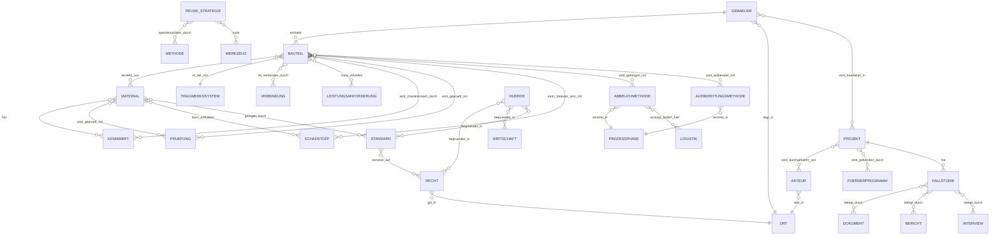

# Entity Schema

## Verknüpfungen

- [Namenskonvention.md](Namenskonvention.md) – das Schema funktioniert nur, wenn Ordner- und Dateinamen die dort festgelegten Regeln einhalten; Entitätsname ≙ Ordnername.
- [Recherche_Workflow.md](Recherche_Workflow.md) – jede neue Datei wird gemäß diesem Schema einsortiert; das Schema ist die Vorlage, die der Workflow füllt.
- [Dataview_Abfragen.md](Dataview_Abfragen.md) – die hier definierten Beziehungen sind die Grundlage der dortigen Queries und der späteren SQL-Views.
- [../schema.sql](../schema.sql) – Ziel-Repräsentation des Schemas in SQLite; diese Datei ist die menschenlesbare Vorform.
- [../AGENTS.md](../AGENTS.md) – beschreibt die Ordnerlogik (Entität → ID → `index.md` + Dateien), auf der dieses Schema aufsetzt.
- [../prompts.md](../prompts.md) – enthält erste Diagrammskizzen und Themenlisten, aus denen die Entitätenmenge abgeleitet ist.

---

## Zweck

Dieses Dokument definiert die Entitäten und Beziehungen, die das Forschungsrepo strukturieren. Es bildet damit den Übersetzungsschritt zwischen der dateibasierten Wissensorganisation (Markdown im Vault) und der späteren relationalen Repräsentation in SQLite. Ziele:

- klare Antwort auf „Was darf ein eigener Ordner werden?" und „Was bleibt Abschnitt in einer bestehenden Datei?";
- explizites, einheitliches Beziehungsmodell (welche Entität referenziert welche, in welcher Richtung);
- verbindliche Quelle für Dataview-Queries und SQL-Schema, damit beide nicht auseinanderlaufen.

---

## Struktur / Regeln / Anwendung

### Granularität

- **Entität** = eigenständiger Begriff mit Eigenschaften, der wiederverwendet wird und mehr als einen sinnvollen Eintrag haben kann. Bekommt einen eigenen Ordner und eine eigene `*/index.md`.
- **Instanz** = einzelne Datei in einem Entitätsordner (z. B. `bauteil/Stuetze.md`).
- **Abschnitt** = Unterthema einer Entität, das unter einer Instanz oder im Index als `##`/`###` lebt, aber kein eigenes Schemaobjekt ist.

### Entitäten (jede entspricht einem Top-Level-Ordner unter `reuse/research/`)

| Ordner | Entität | Beschreibung | Beispieldateien |
|---|---|---|---|
| `bauteil/` | Bauteil | Eingebautes, prüfbares, bemaßtes Produkt. | `Stuetze`, `Traeger`, `Fenster`, `Leuchte` |
| `material/` | Material | Roh-/Werkstoff mit Kennwerten und Schadbildern. | `Beton`, `Stahl`, `Holz` |
| `verbindung/` | Verbindung | Fügeart zwischen Bauteilen; bestimmt Demontierbarkeit. | (Verschraubung, Vergussfuge, …) |
| `tragwerkssystem/` | Tragwerkssystem | Statisches Gesamtsystem, in das Bauteile eingebettet sind. | (Skelettbau, Massivbau, …) |
| `pruefung/` | Prüfung | Verfahren zur Zustands-, Material- oder Schadstoffprüfung. | (Bohrkern, Ferroscan, …) |
| `kennwert/` | Kennwert | Quantifizierbarer Parameter (Druckfestigkeit, Restnutzungsdauer, …). | – |
| `schadstoff/` | Schadstoff | Stoff mit gesundheits-/umweltrechtlicher Relevanz. | (Asbest, PCB, PAK, …) |
| `leistungsanforderung/` | Leistungsanforderung | Anforderung an ein Bauteil aus Norm, Brand-, Schall-, Wärmeschutz. | – |
| `abbruchmethode/` | Abbruchmethode | Physische Methode des Rückbaus / Ausbaus. | `Selektiver_Rueckbau`, `Demontage`, `Betonfraesen` |
| `aufbereitungsmethode/` | Aufbereitungsmethode | Reinigung, Reparatur, Rekonditionierung nach Ausbau. | `Drahtglasschneiden` u. a. |
| `methode/` | Methode | Übergreifende methodische Verfahren (Audit, Bilanzierung). | – |
| `prozessphase/` | Prozessphase | Phase im Lebens-/Reuse-Zyklus (Planung, Rückbau, Wiedereinbau). | – |
| `werkzeug/` | Werkzeug | Software, Plattform oder physisches Werkzeug. | – |
| `standard/` | Standard | Norm, Richtlinie, technische Spezifikation. | (DIN_EN_206, VDI_6210, …) |
| `recht/` | Recht | Gesetz, Verordnung, behördliche Anforderung. | (KrWG, MBO, EU-CPR) |
| `foerderprogramm/` | Förderprogramm | Öffentliches Förderinstrument. | – |
| `wirtschaft/` | Wirtschaft | Geschäftsmodelle, Marktstrukturen, Kosten/Erlöse. | – |
| `logistik/` | Logistik | Transport, Zwischenlager, Hebetechnik, Verpackung. | – |
| `huerde/` | Hürde | Strukturelles Hindernis (rechtlich, technisch, ökonomisch). | – |
| `reuse_strategie/` | Reuse-Strategie | Strategischer Ansatz (DfD, Urban Mining, in-situ-Reuse). | – |
| `akteur/` | Akteur | Person, Büro, Institution, Behörde. | – |
| `gebaeude/` | Gebäude | Konkretes physisches Objekt im Bestand oder Neubau. | `Lysbuechel_Parkhaus`, `Kindl_Areal` |
| `ort/` | Ort | Geografische Verortung (Stadt, Region, Land). | – |
| `projekt/` | Projekt | Bau-, Forschungs- oder Pilotprojekt. | – |
| `fallstudie/` | Fallstudie | Dokumentierter Anwendungsfall, oft mit Quellen-Korpus. | – |
| `bericht/` | Bericht | Forschungs-, Abschluss-, Tätigkeitsbericht. | – |
| `dokument/` | Dokument | Sonstige Primärquelle (Leitfaden, Whitepaper, Folien). | – |
| `interview/` | Interview | Gespräch mit Akteur, transkribiert oder zusammengefasst. | – |
| `datenmodell/` | Datenmodell | Technische Beschreibung von Datenstrukturen, Feldern, Schemata. | – |
| `meta/` | Meta | Diese Sammlung: Konventionen, Workflows, Schema. Keine Fachentität. | – |

`meta/` ist explizit **keine** Inhaltsentität und wird nicht ins SQL-Schema übernommen.

### Beziehungen

Beziehungen werden als gerichtete Markdown-Links im Block `## Verknüpfungen` der jeweiligen Datei gepflegt. Kanonische Richtung: von der spezifischeren zur allgemeineren Entität (z. B. `bauteil/*` → `material/*`).



### Pflichtfelder pro Inhaltsdatei

Frontmatter (YAML) – verbindlich für alle neuen oder überarbeiteten Inhaltsdateien:

```yaml
---
kategorie: bauteil          # = Ordnername, ohne Plural
titel: "Stütze"             # Lesetitel mit Umlauten
slug: Stuetze               # = Dateiname ohne .md
status: stub | entwurf | belegt | geprueft
quellen_geprueft: false
materialien:    [Beton, Stahl]
tragwerkssystem: Skelettbau
verbindungen:   []
pruefungen:     []
schadstoffe:    []
standards:      []
akteure:        []
quellen_anzahl: 0
zuletzt_geprueft: 2026-04-28
---
```

Pflichtabschnitte im Markdown-Body (siehe auch [Recherche_Workflow.md](Recherche_Workflow.md)):

1. `## Verknüpfungen`
2. `## Kurzdefinition` (für Inhaltsdateien) bzw. `## Kurzüberblick zur Kategorie` (für `index.md`)
3. `## Relevanz für Wiederverwendung im Bauwesen` *(nur Inhaltsdateien)*
4. `## Fachinhalt` *(nur Inhaltsdateien)*
5. `## Praxisbezug / Beispiele` *(nur Inhaltsdateien)*
6. `## Herausforderungen / offene Fragen` *(nur Inhaltsdateien)*
7. `## Quellen`

`index.md` führt zusätzlich die Abschnitte `Zentrale Unterthemen`, `Wichtige Dateien dieser Kategorie`, `Querverbindungen zu anderen Kategorien`, `Offene Lücken / Ausbaufelder`.

### Abbildung auf SQL

Jede Entität → eigene Tabelle mit Primärschlüssel `slug` (TEXT, dem Dateinamen ohne `.md` entsprechend). Beziehungen mit Kardinalität `}o--o{` → Verknüpfungstabelle `entitaetA_entitaetB` mit `(slugA, slugB)` als zusammengesetztem PK; Beziehungen mit `}o--||` → Fremdschlüsselspalte in der spezifischeren Tabelle. Diese Datei ist die Vorlage; die endgültigen `CREATE TABLE`-Anweisungen leben in [../schema.sql](../schema.sql).

---

## Empfehlungen für das Repo

- **Eine Entität, ein Ordner.** Keine Mehrfachzuordnungen: ein Begriff lebt in genau einem Entitätsordner. Wenn er strittig ist (Beispiel: „Verbindung" als Material vs. Bauteil-Beziehung), gehört das in `verbindung/` und wird aus den anderen Ordnern verlinkt.
- **Frontmatter sofort einführen.** Auch wenn aktuelle Dateien sie nicht haben: jede neue Datei und jede überarbeitete Datei bekommt das oben definierte Schema. So wird die Migration nach SQL und in Dataview kontinuierlich, nicht als Big-Bang.
- **Linkrichtung disziplinieren.** Bauteil → Material, Bauteil → Standard, Fallstudie → Akteur. Backlinks erzeugt Obsidian automatisch; doppelte Pflege beider Seiten ist verboten.
- **Keine neuen Top-Level-Ordner ohne Schema-Update.** Wer eine neue Entität anlegen möchte, ergänzt zuerst diese Datei (Tabelle + Beziehungen) und erst dann den Ordner.
- **`datenmodell/` und `meta/` strikt trennen.** `datenmodell/` beschreibt fachliche Datenstrukturen des Bauwesens (Materialpässe, BIM-Schemata). `meta/` beschreibt das Repo selbst.
- **`schema.sql` nachziehen.** Jede Änderung an Entitäten oder Beziehungen führt zu einem entsprechenden Diff in [../schema.sql](../schema.sql) im selben Arbeitsschritt.

---

## Quellen bzw. Bezugslogik

- Bezugslogik intern: Die Entitätenmenge ist nicht ausgedacht, sondern aus den real existierenden Top-Level-Ordnern unter `reuse/research/` abgeleitet (Stand: Aufnahmedatum dieser Datei). Beziehungen sind aus den `## Verknüpfungen`- und `## Querverbindungen`-Blöcken der vorhandenen `index.md`-Dateien rekonstruiert (insbesondere [../bauteil/index.md](../bauteil/index.md) und [../abbruchmethode/index.md](../abbruchmethode/index.md)).
- Strukturvorgabe der Dateibasis: [../AGENTS.md](../AGENTS.md) („ENTITÄT → ID → `index.md`").
- Vorform des ER-Modells: [../prompts.md](../prompts.md) (mermaid-Skizze, Themenlisten zu Organisation, Projects, Methods, Workflow, Challenges, Metadata, Actor Roles).
- Fachliche Plausibilisierung der Beziehungen anhand der Inhaltsdateien, exemplarisch [../material/Beton.md](../material/Beton.md) (Beziehungen Beton → Bauteil → Prüfung → Standard → Schadstoff).
- Externe Modellierungsreferenzen für Bauwerks-Datenmodelle: ISO 19650 (BIM-Informationsmanagement), buildingSMART IFC-Schema, Madaster-/Concular-Materialpässe – nicht 1:1 übernommen, aber als Vergleichsmaßstab herangezogen.
