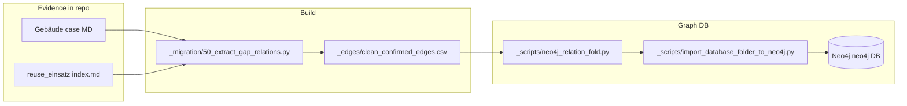
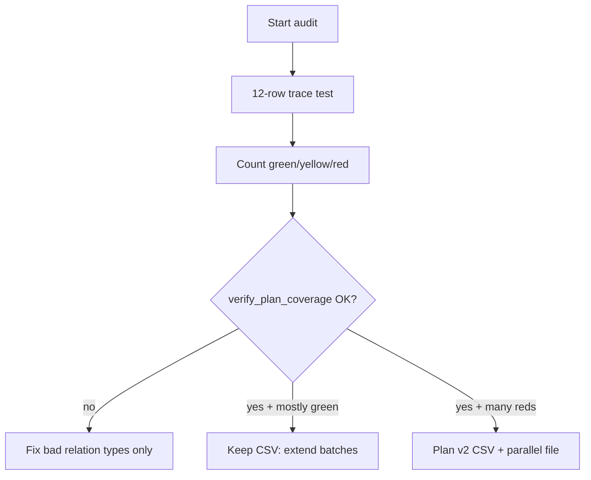

# Edge quality audit — test, visualize, judge

**Purpose:** Decide whether to **keep** the current [`clean_confirmed_edges.csv`](../_edges/clean_confirmed_edges.csv) and improve it incrementally, or **rebuild** edges from scratch. You do **not** need to have written the extractors; you only need **traceability + sampling**.

**Canonical files**

| Role | Path |
|------|------|
| All typed edges | [`_database/_edges/clean_confirmed_edges.csv`](../_edges/clean_confirmed_edges.csv) |
| Gap batches (add rows) | [`_migration/50_extract_gap_relations.py`](../../_migration/50_extract_gap_relations.py) |
| Neo4j fold (CSV relation → 5 rel types) | [`_scripts/neo4j_relation_fold.py`](../../_scripts/neo4j_relation_fold.py) |
| Gate (must pass after CSV edits) | [`_scripts/verify_plan_coverage.py`](../../_scripts/verify_plan_coverage.py) |
| Per-batch diff / skipped (evidence) | [`_migration/50_gap_relation_diff_*.csv`](../../_migration/), [`50_gap_relation_skipped_*.csv`](../../_migration/) |

---

## 1. Snapshot numbers (regenerate anytime)

Run from repo root:

```powershell
python -c "import csv; from collections import Counter; c=Counter();
import pathlib; p=pathlib.Path('_database/_edges/clean_confirmed_edges.csv');
rows=list(csv.DictReader(p.open(encoding='utf-8')));
print('rows', len(rows), 'distinct_relations', len(c:=Counter(r['relation'] for r in rows)));
print('top10', c.most_common(10))"
```

**Snapshot used for this document** (replace when you re-run the script above):

| Metric | Value |
|--------|------:|
| Total CSV rows | 13 885 |
| Distinct `relation` values | 52 |
| Top relation (count) | `belongs_to_fallstudie` (1 618) |
| `has_ressourcenquelle` (batch 50s) | 42 |
| `has_methode` (batch 50u) | 4 |
| `has_schadstoff` (batch 50n, strict) | 1 |
| `has_kontextmerkmal` (batch 50v) | 31 |
| `has_zertifizierung_bewertungssystem` (batch 50w) | 13 |
| `involves_foerderprogramm` / `has_programm_kontext` (batch 50y) | 2 / 22 |
| **Still zero in CSV** | `has_dokumenttyp`, `documented_in_quelle` |

**Gate:**

```powershell
python _scripts/verify_plan_coverage.py
```

**Automated trace (stratified sample, file + raw-label + fold checks):**

```powershell
python _scripts/run_edge_quality_trace.py
```

Report: [`_migration/edge_quality_trace_report.md`](../_migration/edge_quality_trace_report.md) (regenerated each run).

Expect: `verify_plan_coverage: OK`.

---

## 2. How data flows (so you know what to judge)



**What you judge**

- **CSV quality:** Does each row match **source prose** (`field`, `raw_label`, `resolution_rule`)?
- **Fold quality:** After import, does the **Neo4j rel type + properties** still express the same meaning?

---

## 3. Twenty-minute trace test (no Neo4j required)

**Goal:** Score **precision** and **traceability** on a stratified sample.

### Step A — Pick 12 rows (copy into a scratch table)

Pick **2 rows** from each band below (search the CSV in an editor):

| Band | `relation` (examples) | Why |
|------|-------------------------|-----|
| Structural | `belongs_to_fallstudie`, `installed_in_bauobjekt` | High volume; should be boring and correct |
| Heavy NLP / rules | `has_huerde`, `has_rechtliche_bedingung`, `has_logistik` | Highest risk of token false-positives |
| Metrics | `measured_on_bauobjekt`, `measures_kennwertdefinition` | Check join to the right kennwert / object |
| New | `has_ressourcenquelle`, `has_methode` | Your latest migration output |

### Step B — For each row, fill this mini-checklist

| Check | Pass? |
|-------|-------|
| Open **source** path under `_database/` (from `source` column) | Y/N |
| Find text that supports **`raw_label`** (or the bullet named in `field`) | Y/N |
| **Target** `typed_path` exists under `_database/` | Y/N |
| Edge meaning still makes sense if you imagine the Neo4j fold | Y/N |

**Scoring (per row)**

- **Green:** all four Yes  
- **Yellow:** meaning OK but wording stretch  
- **Red:** any No  

**Aggregate rule of thumb**

- If **≥9/12 green**, the corpus is **good enough to keep** and improve incrementally.  
- If **≥3 red**, treat that **relation type** (not necessarily the whole CSV) as suspect and audit more rows of that type.  
- If reds are **spread across many types**, consider a **controlled rebuild** (new file + diff), not silent delete-and-regenerate.

---

## 4. Visualize in Neo4j Browser (clear pictures)

**Critical:** Connect to database **`neo4j`** (not `mit-bestand`, which may be empty on your machine).

### 4.1 Prove the graph is loaded

```cypher
MATCH (n) RETURN count(n) AS nodes;
MATCH ()-[r]->() RETURN count(r) AS rels;
```

Expect roughly **2130** nodes and **8700+** rels after a full import from this repo.

### 4.2 See only the new resource-pool edges (50s)

```cypher
MATCH p = (a)-[r:HAT]->(b:Ressourcenquelle)
WHERE r.csv_relation = 'has_ressourcenquelle'
RETURN p
LIMIT 25;
```

Use the **Graph** result view. Each `p` is one hop: component → pool.

### 4.3 See only the new method edges (50u)

```cypher
MATCH p = (a)-[r:BENUTZT]->(b:Methode)
WHERE r.csv_relation = 'has_methode'
RETURN p;
```

(There are only **4** today — all should appear.)

### 4.4 See one full “star” for judgment

Replace `typed_path` with any row from your trace test:

```cypher
MATCH (e {typed_path: 'reuse_einsatz/Boulder_Fire_Station_3__001__Wide_flange_beams_structural_steel_members'})
MATCH p = (e)-[r]->(n)
RETURN e, r, n;
```

**Why this helps:** You see **all** outgoing rel types at once (folded `HAT`, `BENUTZT`, `IST`, etc.) and can judge overload vs. clarity.

### 4.5 Explore app note

In **Explore**, pick database **`neo4j`**, enable categories for labels you care about (`Bauteilgruppe`, `Ressourcenquelle`, `Methode`, …), then **search** for part of a `typed_path`. Explore shows a **sample**, not the full 13k edges — use Browser queries above for exhaustive slices.

---

## 5. Use batch diff / skip files as “quality receipts”

For each gap batch you care about, open:

- `_migration/50_gap_relation_diff_<batch>.csv` — what was **added**  
- `_migration/50_gap_relation_skipped_<batch>.csv` — what was **rejected** and **why**

**Good signs**

- Skips cluster on `no_token_match`, `not_reusable_enough`, `no_aufbereitung_token_match` — conservative behaviour.  
- Added rows have **`rule_high`** and a **`resolution_rule`** you can grep in code.

**Bad signs**

- Many skips where the **raw text obviously** should have matched (rule gap).  
- Added rows where **target** does not match human reading of **raw_label** (rule bug).

---

## 6. Keep vs rebuild — decision chart



---

## 7. Concrete examples (50u — all four edges)

These are the **entire** `has_methode` set at snapshot time; trace each in `_database/reuse_einsatz/.../index.md` (Eingriff/Aufbereitung bullet).

| `source` | `target` | `raw_label` (abbrev.) |
|----------|----------|-------------------------|
| `reuse_einsatz/Boulder_Fire_Station_3__001__Wide_flange_beams_structural_steel_members` | `methode/Bauteilkatalogisierung` | selektiver Rückbau, **Katalogisierung**, … |
| `reuse_einsatz/Boulder_Fire_Station_3__002__Stahlstockpile_gesamt` | `methode/Bauteilkatalogisierung` | **Katalogisierung**/Stockpile |
| `reuse_einsatz/Juch_Areal_Recyclingzentrum_Zuerich__005__Bauteilkatalog_Elemente` | `methode/Bauteilkatalogisierung` | **Erfassung/Katalogisierung** |
| `reuse_einsatz/K118_Kopfbau_Halle_118_Winterthur__001__Stahltr_ger_St_tzen` | `methode/Bauteilkatalogisierung` | Demontage, **Katalogisierung**, Wiedereinbau |

**Judgment prompt:** “Would a second reader agree **Katalogisierung** is the dominant *method programme* here, not just a verb like Demontage?” If yes → precision OK for this batch.

---

## 8. After you decide

| Decision | Next action |
|----------|-------------|
| **Keep** | Note pass rate + weak `relation` types in this file; open issues per type; extend [`50_extract_gap_relations.py`](../../_migration/50_extract_gap_relations.py). |
| **Partial fix** | Regenerate or hand-edit **one relation** slice; re-run `verify_plan_coverage.py`. |
| **Full rebuild** | Create **`clean_confirmed_edges.v2.csv`**, keep v1, diff in git, re-run gate — avoid deleting history without comparison. |

---

*Document generated for manual QA. Update §1 numbers whenever you change the CSV.*
