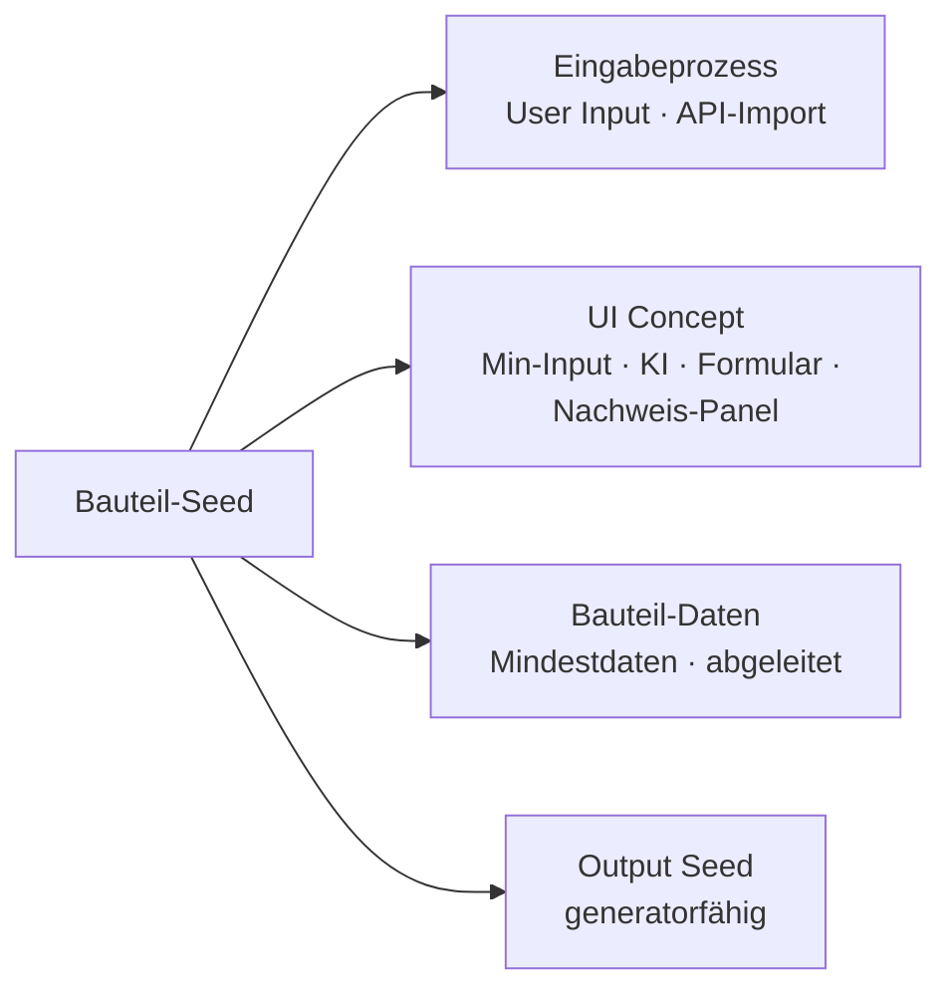
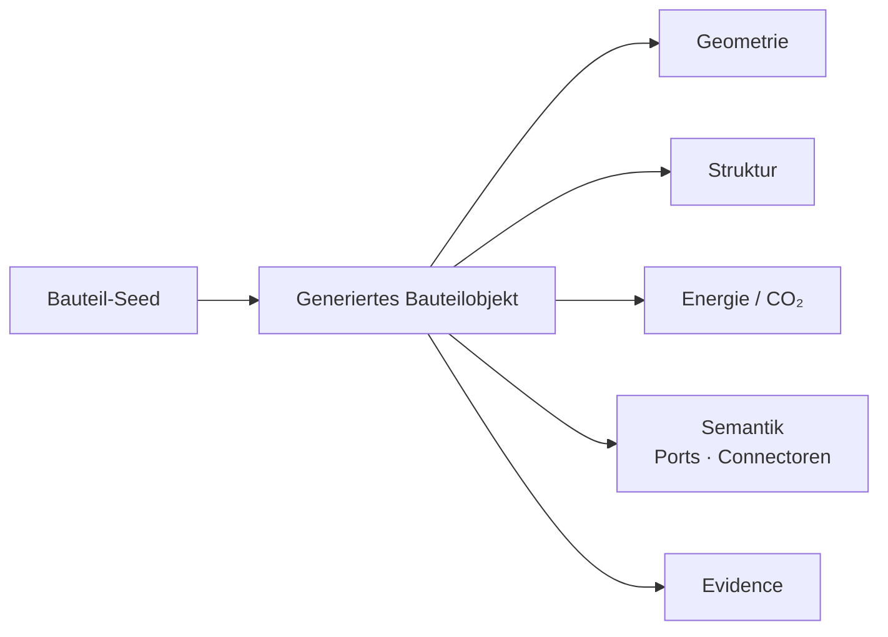
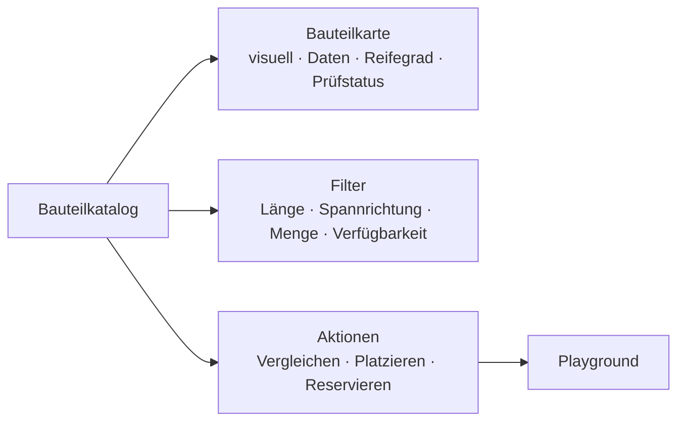
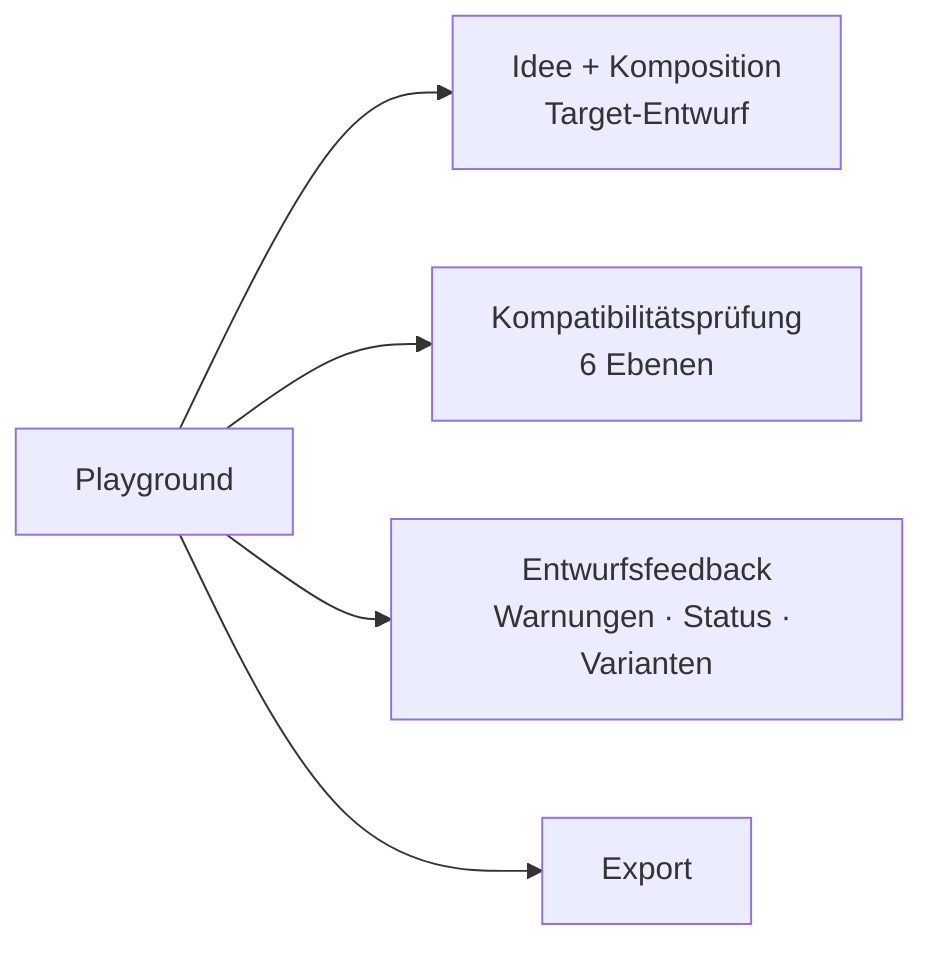

<!-- _paginate: false -->

# ReUse-Plattform für Stahlbeton

### Vom Spendergebäude zur bewerteten Bürovariante

**Allgemein:** Die Plattform übersetzt unsicheren Stahlbetonbestand in planbare, belegte Entwurfsvarianten — in vier Schritten: Einspeisen → Generieren → Katalogisieren → Entwerfen.

**In dieser Präsentation:** Wir verfolgen einen einzigen Bestand durch die ganze Kette — Rückbau eines Skelettbaus (Quelle Basel) → Neubau Büro, Raster 7,20 m.

- Leitprinzip: Unsicherheit nicht verstecken, sondern bearbeitbar machen
- Alle Mengen stammen aus dem Entwurf; abgeleitete Zahlen (Masse, CO₂) sind Vorplanungsschätzungen

---

## Der durchlaufende Fall — 81 Pieces, 5 Typen

**Allgemein:** ReUse beginnt nie bei „dem Material", sondern bei konkreten, vorhandenen Bauteilen mit Menge, Maß und Herkunft. Deshalb arbeiten wir mit einem realen Bestand statt mit Beispielen.

**In unserem Fall** stehen aus dem Rückbau zur Verfügung:

- **35× HCS-720** — Hohlkörperdecke, 7,20 × 1,20 m, Fertigteil
- **16× C-30** — Stütze, 30 × 30 cm, 3,20 m, Fertigteil
- **8× T-540** — Träger, 5,40 m Spannweite, Fertigteil
- **18× WP-320** — Wandplatte, 3,20 × 1,20 × 0,18 m, Rückbauinventar Basel, Q2 2027
- **4× CBS-1** — Stütze+Unterzug+Deckenfeld-Fragment, Ortbeton-Zuschnitt

Leitfrage: **Trägt dieser Bestand ein 7,20-m-Büroraster — und was muss dafür noch geprüft werden?**

---

## Systemarchitektur — der Gesamtablauf

**Allgemein:** Das System hat zwei Schnittstellen und vier Bausteine. Jeder Schritt reichert die Daten an, ohne den Bezug zum realen Bauteil zu verlieren.

**Die vier Bausteine:**

- **Interface 1 — Einspeiseplattform**
  - *1.1 Bauteil-Seed:* aus Foto + wenigen Feldern wird ein generatorfähiger Datensatz
  - *1.2 Generator:* aus dem Seed werden fünf Planungsebenen pro Bauteil
- **Interface 2 — Design Tool**
  - *2.1 Bauteilkatalog:* die Objekte werden lesbar, filterbar, vergleichbar
  - *2.2 Playground:* aus der Auswahl wird eine bewertete Variante

**In unserem Fall:** 81 Pieces durchlaufen genau diese Kette — durchgehend gehalten vom **Evidence Link**, der jedes Objekt auf sein reales Piece rückführbar macht.

---

<!-- _class: lead -->

# Interface 1 — Einspeiseplattform

**Allgemein:** Auf dieser Seite kommen reale Bauteile an — als Fotos, Maße, Angebote, unvollständiges Wissen. Die Plattform übersetzt diese Unordnung in eine erste strukturierte Sprache.

**In unserem Fall:** ein Foto vom Plattenstapel und drei Sätze Beschreibung werden zum ersten Datensatz.



---

## Bauteil-Seed — die kleinste sinnvolle Starteinheit

**Allgemein:** Der Seed ist kein Bauteilpass, sondern der minimale Datensatz, mit dem der Generator starten darf. Er markiert die Schwelle vom physischen Bestand zum digitalen Entwurf — Vollständigkeit kommt später.

**Die Regel:** ein Seed ist generatorfähig, sobald 6 Felder gesetzt sind — Typologie · Menge · Geometriehinweis · Materialfamilie · Quelle · ≥ 1 Zielrolle.

**In unserem Fall (Wandplatte):**

- **Genug für den Seed:** „Wandplatte, ~18 Stück, 3,2×1,2×0,18, Stahlbeton, Rückbau Basel, tragend/raumbildend prüfen"
- **Nicht verlangt:** Bewehrungsplan, Druckfestigkeit, Brandschutznachweis
- Alles Fehlende blockiert nichts — es läuft als `missing_evidence` mit

---

## Eingabeprozess

**Allgemein:** Der Einstieg kombiniert Bild, kurzen Prompt und wenige Pflichtfelder. Daten können manuell oder direkt aus einer Bauteilbörse kommen.

**In unserem Fall** laufen beide Wege parallel:

- **User Input (WP-320):** Foto + Prompt
  - KI liest: rechteckige Platten, keine Öffnungen, Abplatzungen an 2/18, ~18 Stück
- **API-Import (HCS-720):** Bauteilbörsen-Listing
  - liefert Quelle, 35 Stück, 7,20×1,20 m, Status „im Rückbau", Q2 2027 — null Tipparbeit

> **Smartness:** Bei Stahlbeton liefert das Foto mehr als das Aussehen — Schnittflächen verraten die Plattendicke, Bewehrungsspuren die Spannrichtung, Abplatzungen den Zustand.

---

## Bedienkonzept (UI Concept)

**Allgemein:** Die Eingabe ist ein geführter Fünf-Schritt-Prozess mit niedriger Einstiegshürde. Jeder Wert trägt einen Status, damit die Datenqualität nachvollziehbar bleibt.

**In unserem Fall (Wandplatte):**

| Feld | Wert | Status |
|---|---|---|
| Typologie | WallPanel | ✓ bestätigt |
| Menge | 18 | ✓ bestätigt |
| Maße | 3,20 × 1,20 × 0,18 m | ~ geschätzt |
| Bewehrung | — | ✗ unbekannt |
| Verfügbarkeit | Q2 2027 | ✓ bestätigt |

- **Regel:** ein einzelnes `✗ unbekannt` stoppt den Seed nie — es senkt nur das Datenvertrauen und erscheint später als gelbe Warnung → **Geschwindigkeit vor Vollständigkeit**
- Das Nachweis-Panel sammelt Belege (Bohrkern, Bewehrungsscan, Schadstoff) und hebt das Vertrauen

---

## Bauteil-Daten — Wissen vs. Schätzung

**Allgemein:** Der Seed trennt klar, was eingegeben wurde, von dem, was das Tool berechnet. So bleibt jederzeit unterscheidbar, worauf man sich verlassen kann.

**In unserem Fall (Wandplatte):**

- **A. Manuell:** 18 Stück · 3,20 × 1,20 × 0,18 m · Stahlbeton · Basel · Q2 2027
- **B. Abgeleitet (geschätzt):**
  - Volumen 0,69 m³/Platte → 12,4 m³ Serie
  - Masse ~1,66 t/Platte (×2400 kg/m³) → ~30 t Serie
  - Fläche 3,84 m²/Platte → 69 m² Wandfläche
  - + Transportdistanz · CO₂-Wirkung · mögliche Ports · fehlende Nachweise · Reifegrad

Jeder abgeleitete Wert bleibt als *geschätzt* markiert — **keine Schein-Genauigkeit.**

---

## Output: Bauteil-Seed

**Allgemein:** Das Ergebnis von Schritt 1 ist ein kompakter Datensatz, der Wissen, Schätzung und offene Nachweise zusammen mitführt.

**In unserem Fall** sieht der fertige Seed so aus:

```json
{
  "seed_id": "SEED-RC-WP-001",
  "typology": "WallPanel",
  "quantity": 18,
  "geometry_hint": { "height_m": 3.2, "width_m": 1.2, "thickness_m": 0.18 },
  "derived": { "mass_t_each": 1.66, "area_m2_each": 3.84 },
  "source": { "type": "demolition_inventory", "location": "Basel" },
  "availability": { "status": "available_from", "date": "2027-Q2" },
  "target_role": ["spatial_partition", "structural_check_possible"],
  "data_trust": { "geometry": "medium", "material": "high", "structure": "low" },
  "missing_evidence": ["reinforcement_layout", "concrete_strength", "fire_resistance"],
  "ready_for_generator": true
}
```

---

<!-- _class: lead -->

# Generator — Vom Seed zum planbaren Objekt

**Allgemein:** Der Generator ist die Übersetzungsschicht zwischen unordentlichem Bestand und Entwurfslogik. Aus einem Seed erzeugt er fünf parallele Planungsebenen.

**In unserem Fall:** derselbe Mechanismus verarbeitet drei sehr unterschiedliche Bauteiltypen.



---

## Rolle des Generators

**Allgemein:** Der Generator ersetzt keine Fachplanung — er macht das Bauteil für die Vorplanung sofort nutzbar. Jede Typologie ruft eine eigene Grammatik auf: gleiche Eingabe, andere Fragen.

**In unserem Fall** greifen drei verschiedene Generatoren:

- **RCWallPanelGenerator** (WP-320): Öffnungen? aussteifend? Boden-/Decken-/Seitenanschluss?
- **HollowCoreSlabGenerator** (HCS-720): Spannrichtung? Auflagerkante L/R? Deckenraster?
- **RCSlabSegmentGenerator** (CBS-Fragment): Schnittkanten? unbekannte Bewehrung? Hebepunkte?

> **Warum kein generischer Generator:** eine Hohlkörperdecke braucht *Spannrichtung*, eine Stütze braucht *Schlankheit (l/d)* — dieselbe Frage wäre fürs andere Bauteil sinnlos.

---

## Klassifikationslogik — vier Ebenen

**Allgemein:** Vier Ebenen verbinden Entwurfssprache und physische Realität — von der breiten Familie bis zum einzelnen Bauteil. Sie bestimmen, wie ein Bauteil erzeugt, gefiltert und verbunden wird.

**In unserem Fall (Decken):**

- **Typologie:** Slab
- **Generatorgrammatik:** HollowCoreSlabGenerator (nicht SolidRCSlab, nicht CutSegment)
- **Typ:** „HCS-720 aus Spendergebäude" → 35 Pieces, **1 Rasterentscheidung statt 35**
- **Piece:** HCS-720 #014 → demontiert, Druckfestigkeit offen, Abplatzung rechts → Einzelflag

**Kernunterscheidung:** nicht *Fertigteil vs. Zuschnitt*. Die 4 Ortbeton-Fragmente durchlaufen ab hier **exakt dieselbe Logik** wie die 35 Fertigteil-Decken — entscheidend ist nur Herkunft vs. digitale Repräsentation.

---

## Bauteil-Seed → generiertes Bauteilobjekt

**Allgemein:** Aus dem Seed entstehen fünf Ebenen, die gemeinsam gespeichert werden. So wird aus einem reinen 3D-Objekt ein planbares ReUse-Objekt.

**In unserem Fall (HCS-720 #014):**

| Ebene | Inhalt für #014 |
|---|---|
| **Geometrie** | Platte 7,20 × 1,20 m, Hohlräume vereinfacht |
| **Struktur** | Spannrichtung längs, Auflager L/R, ~7,2 m Feld, Decke prüfbar |
| **Energie/CO₂** | hohe Masse, hohe thermische Masse (innen), hoher ReUse-Effekt |
| **Semantik** | Auflager-Ports L/R, Längskanten-Ports, kompatibel mit Träger-Oberkante |
| **Evidence** | Quelle + Piece-ID #014, Foto+Scan, Druckfestigkeit `offen`, Trust mittel |

- #014 bleibt jederzeit rückführbar auf seinen realen Stapelplatz im Rückbau

---

<!-- _class: lead -->

# Interface 2 — Design Tool

**Allgemein:** Sobald Objekte generiert sind, verschiebt sich der Fokus vom „Wie kommt ein Bauteil ins System?" zum „Wie wird es Teil eines Entwurfs?".

**In unserem Fall** lautet die Frage konkret: *Welche der 81 Pieces bilden ein 7,20-m-Büroraster?*



---

## Bauteilkatalog — Bauteile werden auswählbar

**Allgemein:** Der Katalog nimmt die generierten Objekte auf und macht sie lesbar und vergleichbar — als kuratierte Sammlung mit Herkunft, nicht als anonyme BIM-Bibliothek.

**In unserem Fall (81 Pieces, 5 Serien):**

- Die 35 HCS-720 erscheinen als **eine Serienkarte „35 Stück"**, nicht als 35 Einzelobjekte
- Jede Karte trägt Foto, generierte Geometrie, Menge, Verfügbarkeit (Q2 2027) und offene Nachweise
- Fürs 7,20-m-Deckenraster relevant: **35 Decken**; Kandidat für Trennwände: **18 Platten**; Sonderbereich: **4 Fragmente**
- Die 2 Einzelplatten mit Abplatzung tauchen separat als „prüfen/Akzent" auf
- Jedes Objekt bleibt über den Evidence Link auf sein reales Piece rückführbar

---

## Bauteilkarte — eine Karte gelesen

**Allgemein:** Die Karte zeigt ein Bauteil als ReUse-Objekt in lesbaren Schichten — Herkunft, Daten, Reifegrad und offene Nachweise auf einen Blick.

**In unserem Fall (HCS-720):**

| Ebene | Inhalt |
|---|---|
| **Visuell** | Foto · generierte Platte · Pfeil = Spannrichtung |
| **Daten** | 35 Stück · 7,20 × 1,20 m · Quelle Spendergebäude · Q2 2027 · Trust mittel |
| **Reifegrad** | ●●●○○ entwurfsfähig, prüfbedürftig (Stufe 2 von 5) |
| **Prüfstatus** | Geometrie ✓ · Spannrichtung ✓ · Menge ✓ · Druckfestigkeit ✗ · Bewehrung ✗ · Brandschutz ✗ |

- Die Reifegrad-Ampel verhindert die BIM-Falle: ●●●○○ heißt **schön platzierbar, aber 3 offene Nachweise**
- Leiter: Idee → entwurfsfähig → prüfbedürftig → ausschreibungsnah → einbaufähig

---

## Filterstruktur — die Suche nach dem Deckenfeld

**Allgemein:** Gefiltert wird nicht nach Produktnamen, sondern nach konkreten, entwurfsrelevanten Werten. So wird aus einem Lager eine entwurfsfähige Auswahl.

**In unserem Fall** setzen wir für ein 7,20-m-Deckenfeld genau diese Filter:

- **Länge 6,00–8,00 m** → trifft HCS-720 (7,20 m), schließt den 5,40-m-Träger aus
- **Spannrichtung bekannt** → HCS-720 ✓, das Ortbeton-Fragment ✗
- **Rolle „Decke, tragend prüfbar"** statt „war mal eine Decke"
- **Menge ≥ 30 aus einer Quelle** → nur die geschlossene 35er-Serie
- **verfügbar bis Q2 2027** und **Datenvertrauen ≥ mittel**
- **Auflager-Port passt auf „Träger-Oberkante T-540"**
- **→ Treffer: 35× HCS-720**

Derselbe Mechanismus mit „Höhe ≈ 3,2 m, Rolle raumbildend" liefert die 18 Wandplatten. Ein Filter wie „Datenvertrauen niedrig" **sortiert nicht aus, sondern markiert** — die 4 Fragmente bleiben sichtbar, eben als prüfbedürftig.

---

## Katalog-Aktionen — vergleichen, platzieren, reservieren

**Allgemein:** Der Katalog ist nicht nur zum Anschauen da — er bereitet den Wechsel in den Playground vor und sichert die reale Verfügbarkeit.

**In unserem Fall** vergleichen wir drei Optionen:

- **Option A:** 35 Hohlkörperdecken — Serienlogik hoch, Spannrichtung klar → Deckenraster
- **Option B:** 18 Wandplatten — gut für Raumstruktur, Tragrolle offen → Trennwände
- **Option C:** 4 CBS-Fragmente — starke Struktur, komplexe Prüfung → Sonderbereich

Beim **Platzieren** wandern Ports, Strukturmodell, Energiemodell und Evidence mit. Die **Reservierung** ist Entwurfssicherung: sobald Variante A ernst wird, werden die 35 Decken „temporär reserviert" — sonst sind sie bis Q2 2027 evtl. weg.

---

<!-- _class: lead -->

# Playground — der ReUse-Entwurfsraum

**Allgemein:** Hier wird aus Einzelbauteilen ein System und aus dem Katalogobjekt eine Variante. Geprüft wird, was passiert, wenn Bauteile zusammengefügt werden.

**In unserem Fall** ist das Ziel: Bürogebäude, Raster 7,20 m, Skelettbau, maximaler Tragwerks-ReUse.



---

## Idee + Komposition · Target-Entwurf

**Allgemein:** Der Target-Entwurf legt die Spielregeln fest (Nutzung, Tragwerk, Raster, Ziel). Bewertet wird nicht das einzelne Bauteil, sondern die Passung zwischen Zielen und Bestand.

**In unserem Fall:**

- **Parameter:** Nutzung Büro · Tragwerk Skelettbau · Raster 7,20 m · Geschosshöhe 3,40 m · Ziel max. Tragwerks-ReUse
- Raster 7,20 m **passt exakt** zur HCS-720-Länge; Stützen 3,20 m + Auflager → Geschosshöhe ✓

**Passung Bestand ↔ Ziel:**

- Decken: 35 verfügbar / 42 nötig (6×7 Felder) → **83 %** ⚠ Lücke
- Stützen: 16 / 16 → **100 %** ✓
- Träger: 8 verfügbar, deckt nur Teilfelder → **Engpass** ✗

→ Sofort sichtbar: **der Träger ist der Flaschenhals, nicht die Decke.**

---

## Kompatibilitätsprüfung — sechs Ebenen

**Allgemein:** Kompatibilität ist mehr als geometrische Passung. Eine Verbindung gilt erst dann als plausibel, wenn sie auf sechs Ebenen gleichzeitig trägt.

**In unserem Fall** prüfen wir *HCS-720 #014 auf Träger T-540 #03:*

- **1 semantisch:** Auflager-Port ↔ Träger-Oberkante-Port → ✓ erlaubt
- **2 geometrisch:** Auflagertiefe vorhanden, Toleranz ok → ✓ knapp ok
- **3 tragwerklich:** Feld 7,2 m ≤ zul. Spannweite (Vorprüfung) → ✓ plausibel
- **4 energetisch:** Innendecke → thermische Masse +, Hülle n/a → ✓ unkritisch
- **5 realwelt:** 35 reserviert, Q2 2027 ≥ Bauphase → ✓ ok
- **6 nachweis:** Druckfestigkeit Träger offen → ⚠ kritisch bei tragend

**Gesamt: gelb** — sauber, aber die Träger-Druckfestigkeit muss geprüft werden. Semantik verhindert: Decke „berührt" Wand ≠ Decke „liegt auf" Träger.

---

## Entwurfsfeedback — live, während des Platzierens

**Allgemein:** Das Feedback ist ein Frühwarn-Instrument, kein Endbericht. ReUse wird während der Entscheidung begleitet — nicht erst am Schluss geprüft.

**In unserem Fall:**

- **Live-Warnung (Menge):** Raster braucht 42 Felder, 35 verfügbar → 7 ungedeckt → Vorschlag: Teilraster ReUse + 7 Neudecken (Hybrid)
- **Visuelle Statuslogik (Variante A):** Geometrie 🟢 · Semantik 🟢 · Menge 🟡 · Tragwerk 🟡 · Nachweise ⬜ → **Gesamt 🟡 entwurfsfähig, prüfbedürftig**
- **Variantenbewertung A (illustrativ):** ~80 % der Tragwerksmasse aus ReUse, da 51 schwere Bauteile (35 Decken + 16 Stützen) wiederverwendet werden
- Offene Punkte, die die Bewertung senken: Träger-Druckfestigkeit, Brandschutz der Decke, Träger-Engpass

→ Unvollständige Mengen werden zum **Entwurfsparameter**, nicht zum Fehler.

---

## Export — die Übergabe

**Allgemein:** Der Export ist kein Ausführungsplan, sondern eine belegte, bewertete Variante für die nächste Planungsstufe — mit allen Annahmen und Prüfbedarfen.

**In unserem Fall enthält der Export:**

- **Bauteilliste:** 35× HCS-720, 16× C-30, 8× T-540 (+ 7 Neudecken, Hybrid), Piece-IDs verlinkt
- **Connectoren:** Auflager-Connectoren mit Prüfstatus (meist ✓, einige prüfbedürftig)
- **Offene Nachweise:** Druckfestigkeit (Bohrkern-Stichprobe), Brandschutz, CBS-Schnittkanten
- **Prüfpfade:** → Statiker: Spannweiten-Nachweis HCS; → Brandgutachter: Decke
- **Auswertung:** ReUse-Anteil (Masse) hoch · CO₂-Vorteil hoch · Reservierungen bis Q2 2027

Zeigt dem nächsten Team: *was* entworfen wurde, *worauf* es real beruht, *was* noch fehlt.

---

<!-- _class: lead -->

## Kernbotschaft

**Allgemein:** Der Wert der Plattform liegt nicht im Verstecken der Unsicherheit, sondern darin, sie rechenbar und entscheidbar zu machen.

**In unserem Fall:** Aus 81 unsicheren Pieces eines Rückbaus wird eine belegte Bürovariante mit hohem ReUse-Anteil — inklusive der ehrlichen Liste der noch fehlenden Nachweise.

- Kette: **Bestand → Seed → generiertes Objekt → Katalog → Variante A**
- Durchgehend mit Evidence Link zur realen Quelle
