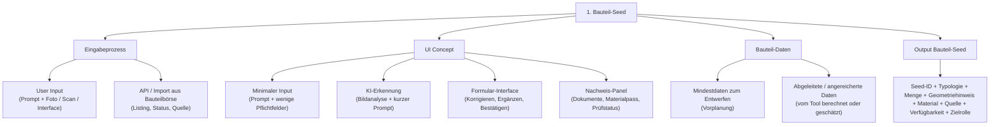

# 1.1.4 Output Bauteil-Seed

## Struktur

- 1.1.4 Output Bauteil-Seed
  - 1.1.4.1 Seed-ID + Typologie + Menge + Geometriehinweis + Material + Quelle + Verfügbarkeit + Zielrolle

## 1.1.4 Output Bauteil-Seed

Das Ergebnis von Schritt 1 ist ein kompakter, generatorfähiger Datensatz.

```json
{
  "seed_id": "SEED-RC-WP-001",
  "typology": "WallPanel",
  "material_family": "ReinforcedConcrete",
  "quantity": 18,
  "geometry_hint": {
    "mode": "photo_with_manual_dimensions",
    "height_m": 3.2,
    "width_m": 1.2,
    "thickness_m": 0.18
  },
  "source": {
    "type": "demolition_inventory",
    "location": "Basel",
    "reference": "source_building_or_listing_id"
  },
  "availability": {
    "status": "available_from",
    "date": "2027-Q2"
  },
  "target_role": [
    "spatial_partition",
    "structural_check_possible"
  ],
  "condition": {
    "visual": "usable_with_check",
    "confidence": "medium"
  },
  "missing_evidence": [
    "reinforcement_layout",
    "concrete_strength",
    "connection_detail",
    "fire_resistance",
    "pollutant_check"
  ],
  "ready_for_generator": true
}
```

---

## Review-Hinweis: nicht direkt zugeordnete Originalabschnitte

Die folgenden Abschnitte stammen aus der wiederhergestellten Originaldatei, sind aber keine eigenen Knoten in der aktuellen Nummerierungsstruktur. Sie bleiben hier für die inhaltliche Prüfung erhalten.

### Original: Rolle des Bauteil-Seeds

Der Bauteil-Seed bildet die Schnittstelle zwischen physischem Bestand und digitalem Entwurfsprozess.

Er beschreibt ein reales Stahlbetonbauteil mit genau den Informationen, die benötigt werden, um daraus ein planbares digitales Bauteilobjekt zu erzeugen.

Der Seed ist kein vollständiger Nachweis und kein Bauteilpass. Er stellt eine minimale, strukturierte Datengrundlage für die Vorplanung dar.

---

### Original: Einspeiseplattform: Vom realen Stahlbetonbauteil zum generatorfähigen Input



### Original: Beispiel A — Ortbeton-Zuschnitt

Bei Ortbeton entsteht das wiederverwendbare Bauteil häufig erst durch eine gezielte Schnittstrategie.

Beispiel:

```text
Typologie:
ColumnBeamSlabAssembly

Material:
Stahlbeton, Ortbeton-Zuschnitt

Geometrie:
Stütze mit angeschlossenem Unterzug und Deckenfeld

Quelle:
Spendergebäude

Zielrolle:
Primärtragwerk oder Tragstrukturmodul

Besonderheit:
Zusammenhängendes Stahlbetonfragment
anstelle einzelner Bauteile
```

Der Seed beschreibt hier nicht nur einzelne Elemente, sondern größere strukturelle Einheiten, die als Ganzes wiederverwendet werden können.

---

### Original: Beispiel B — Fertigteil

Bei Fertigteilen liegen die Bauteile bereits als klar definierte Elemente vor.

Beispiel:

```text
Typologie:
HollowCoreSlab
Beam
Column
FacadeSandwichPanel

Material:
Stahlbetonfertigteil

Geometrie:
Abmessungen, Spannrichtung, Raster

Menge:
Stückzahl je Typ

Quelle:
Spendergebäude oder Bauteilbörse

Zielrolle:
Decke
Träger
Stütze
Fassade

Besonderheit:
Demontierbares und rückverfolgbares Einzelbauteil
```

Hier stehen Typisierung, Serienlogik und Identität der einzelnen Bauteile im Vordergrund.

---

### Original: Kernaussage

Der Bauteil-Seed ist die kleinste sinnvolle Dateneinheit für den Einstieg eines realen Stahlbetonbauteils in den digitalen Entwurfsprozess.

Er beantwortet die grundlegenden Fragen:

```text
Was ist das Bauteil?
Wie viele Elemente sind vorhanden?
Wie groß sind sie?
Woraus bestehen sie?
Woher stammen sie?
Wann sind sie verfügbar?
Welche Rolle können sie übernehmen?
Welche Evidenz liegt vor?
```

Damit bildet der Bauteil-Seed die Grundlage für die weitere Verarbeitung im Generator und die spätere Integration in den Bauteilkatalog.
