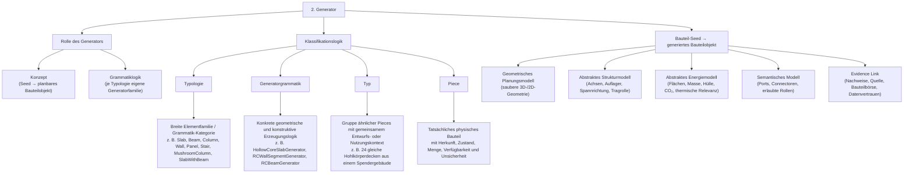
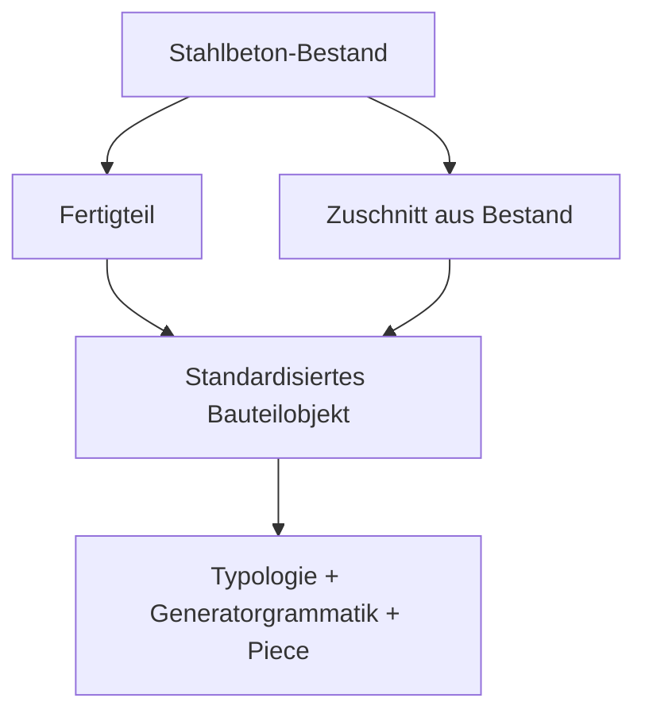

# 1.2.2 Klassifikationslogik

## Struktur

- 1.2.2 Klassifikationslogik
  - 1.2.2.1 Typologie
  - 1.2.2.2 Generatorgrammatik
  - 1.2.2.3 Typ
  - 1.2.2.4 Piece

## 1.2.2 Klassifikationslogik

Die Klassifikation bestimmt, wie ein Bauteil erzeugt, gefiltert, bewertet und später mit anderen Bauteilen verbunden wird.

## 1.2.2.1 Typologie

Die Typologie beschreibt die übergeordnete Bauteilfamilie beziehungsweise Grammatik-Kategorie.

Beispiele:

```text
Slab
Beam
Column
Wall
Panel
Stair
MushroomColumn
SlabWithBeam
WallWithOpening
FacadeSandwichPanel
```

Die Typologie beantwortet die grundlegende Frage:

„Um welche Art von Bauteil handelt es sich?“

---

## 1.2.2.2 Generatorgrammatik

Die Generatorgrammatik beschreibt die konkrete Erzeugungslogik innerhalb einer Typologie.

Beispiel:

```text
Typologie:
Slab

mögliche Generatorgrammatiken:
- HollowCoreSlabGenerator
- SolidRCSlabGenerator
- CutSlabSegmentGenerator
- SlabWithBeamGenerator
```

Die Generatorgrammatik definiert, wie ein Bauteil geometrisch, strukturell und semantisch erzeugt wird.

---

## 1.2.2.3 Typ

Der Typ beschreibt eine Gruppe ähnlicher Pieces mit gemeinsamem Entwurfs- oder Nutzungskontext.

Beispiel:

```text
Typ:
Hohlkörperdecke 7.20 m × 1.20 m aus Spendergebäude A

Pieces:
Deckenplatte 001
Deckenplatte 002
Deckenplatte 003
...
```

Der Typ bildet die Grundlage für Wiederholung, Rasterbildung, Serienlogik und Bauteilpakete.

---

## 1.2.2.4 Piece

Das Piece bezeichnet das tatsächliche physische Bauteil.

Beispiel:

```text
Piece:
Hohlkörperdecke Nr. 014
aus Spendergebäude A
demontiert / verfügbar / geprüft oder ungeprüft
```

Das Piece trägt die reale Information eines Bauteils: Herkunft, Zustand, Verfügbarkeit, Unsicherheit und Nachweise.

---

## Review-Hinweis: nicht direkt zugeordnete Originalabschnitte

Die folgenden Abschnitte stammen aus der wiederhergestellten Originaldatei, sind aber keine eigenen Knoten in der aktuellen Nummerierungsstruktur. Sie bleiben hier für die inhaltliche Prüfung erhalten.

### Original: Vom Bauteil-Seed zum planbaren Stahlbeton-Bauteilobjekt



### Original: Standardisierung und Typisierung von Stahlbeton-Bauteilen

Für den Generator ist nicht entscheidend, ob ein Bauteil ursprünglich als Fertigteil vorlag oder durch Zuschnitt aus einem Bestand entstanden ist.

Entscheidend ist, dass das Bauteil nach der Erfassung als standardisiertes und typisiertes Bauteilobjekt behandelt werden kann.



### Fertigteile

Fertigteile liegen bereits als einzelne Bauteile vor.

Beispiele:

```text
Hohlkörperdecke
Stütze
Träger
Sandwich-Fassadenelement
Treppenlauf
Wandplatte
```

Der Generator übernimmt Geometrie, Eigenschaften und Identität in das System.

---

### Zuschnitt-Elemente

Zuschnitt-Elemente entstehen durch eine vorgängige Schnitt- oder Rückbaulogik.

Beispiele:

```text
Plattensegment
Wandsegment
Brüstungssegment
Treppensegment
Fassadensegment
```

Sobald ein Segment definiert ist, wird es wie jedes andere Bauteil behandelt.

Der Generator erzeugt daraus ebenfalls ein standardisiertes Bauteilobjekt mit Geometrie, Strukturmodell, Ports, Connectoren und Evidence-Link.

Der Unterschied liegt somit in der Gewinnung des Bauteils und nicht in seiner späteren digitalen Verarbeitung.

---
