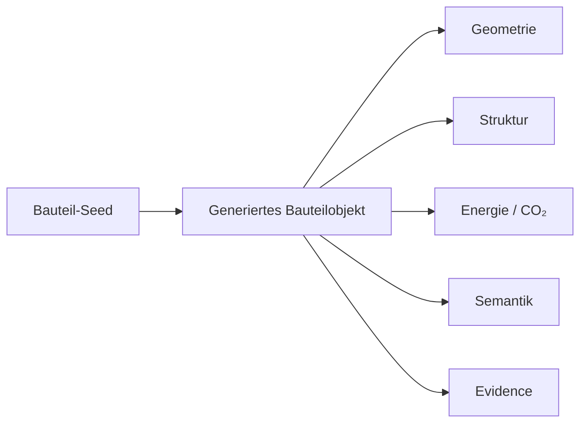
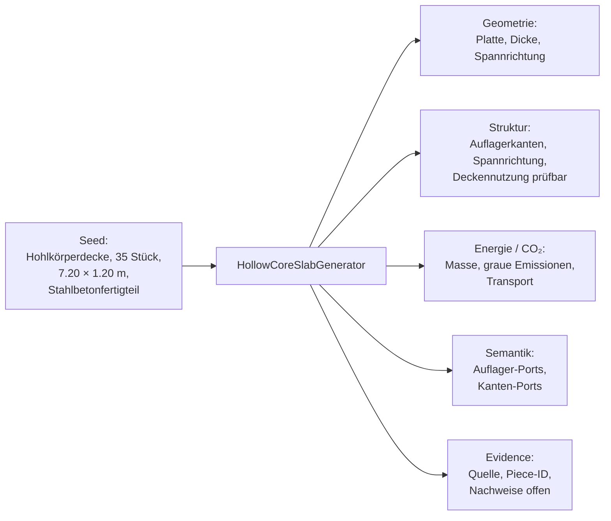
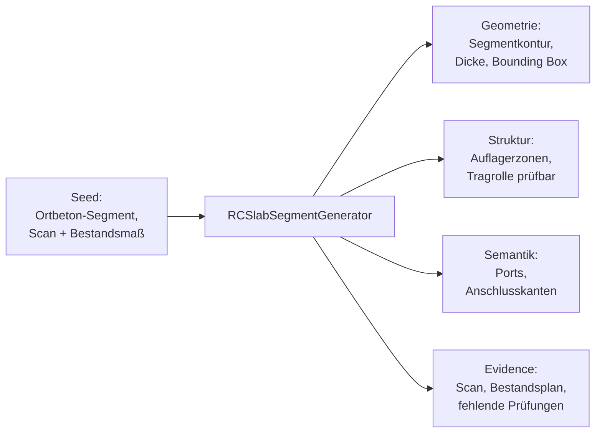
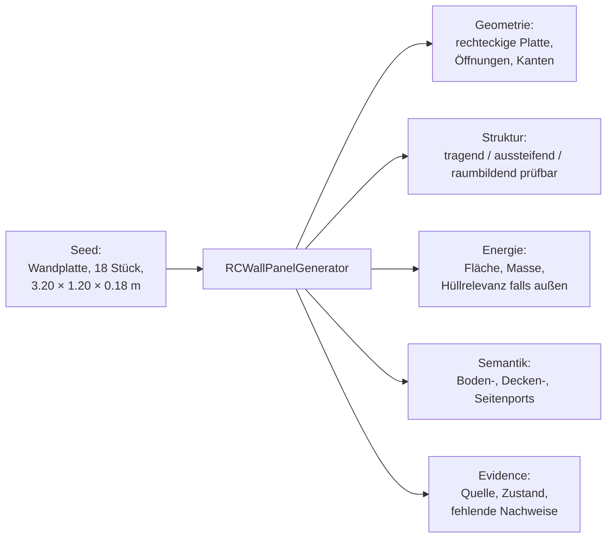

# 1.2.3 Bauteil-Seed → generiertes Bauteilobjekt

## Struktur

- 1.2.3 Bauteil-Seed → generiertes Bauteilobjekt
  - 1.2.3.1 Geometrisches Planungsmodell
  - 1.2.3.2 Abstraktes Strukturmodell
  - 1.2.3.3 Abstraktes Energiemodell
  - 1.2.3.4 Semantisches Modell
  - 1.2.3.5 Evidence Link

## 1.2.3 Bauteil-Seed → generiertes Bauteilobjekt

Aus dem Seed erzeugt der Generator fünf zentrale Output-Schichten.



Diese fünf Ebenen werden gemeinsam gespeichert. Das Bauteil wird dadurch nicht nur zu einem 3D-Objekt, sondern zu einem planbaren ReUse-Objekt.

---

## 1.2.3.1 Geometrisches Planungsmodell

Das geometrische Modell bildet die planungsrelevante Geometrie des Bauteils ab.

Es ist nicht als vollständiges Ausführungsmodell gedacht, sondern als robuste Grundlage für Vorplanung, Platzierung und Katalogisierung.

Beispiele:

```text
Hohlkörperdecke:
Länge, Breite, Dicke, Spannrichtung, Hohlräume vereinfacht

Wandplatte:
Höhe, Breite, Dicke, Öffnungen, Anschlusskanten

Stütze:
Höhe, Querschnitt, Achse, Kopf- und Fußzone

Träger:
Länge, Querschnitt, Achse, Auflagerbereiche

Ortbeton-Zuschnitt:
Schnittkontur, Dicke, Restkanten, mögliche Hebepunkte
```

Ziel ist nicht maximale Detailtiefe, sondern eine belastbare Geometrie für den Entwurfsprozess.

---

## 1.2.3.2 Abstraktes Strukturmodell

Das Strukturmodell beschreibt die strukturelle Interpretation eines Bauteils in der Vorplanung.

Es enthält keine endgültige statische Bemessung, sondern eine abstrahierte Tragwerkslogik.

Beispiele:

```text
Stahlbetonträger:
Achse, Spannrichtung, Auflager links/rechts, mögliche Tragrolle

Hohlkörperdecke:
Spannrichtung, Auflagerkanten, Plattenrichtung, mögliche Deckennutzung

Stahlbetonstütze:
Druckachse, Kopf-Port, Fuß-Port, Schlankheitsrisiko

Wandplatte:
tragend möglich / raumbildend / aussteifend prüfen

Ortbeton-Segment:
Schnittkanten, unbekannte Bewehrung, strukturelle Unsicherheit
```

Das Strukturmodell ermöglicht die spätere Prüfung, ob mehrere Bauteile als plausibles System zusammenwirken können.

---

## 1.2.3.3 Abstraktes Energiemodell

Das Energiemodell beschreibt bei Stahlbeton insbesondere Masse, graue Emissionen und thermische Relevanz.

Es dient nicht der detaillierten Simulation einzelner Bauteile, sondern der Einordnung ihrer energetischen Rolle im Entwurf.

Beispiele:

```text
Stahlbetonplatte im Innenraum:
Masse, graue Emissionen, Speicherfähigkeit als Hinweis

Stahlbeton-Wand als Außenbauteil:
Fläche, Dicke, Hüllrelevanz, zusätzlicher Dämmbedarf wahrscheinlich

Fassaden-Sandwichelement:
Außen-/Innenseite, Schichtlogik, thermische Relevanz

Träger / Stütze:
keine direkte Hüllfunktion, aber relevant für Masse und CO₂
```

Auf dieser Grundlage können CO₂-Werte, Masse und energetische Risiken abgeschätzt werden.

---

## 1.2.3.4 Semantisches Modell

Das semantische Modell beschreibt die zulässigen Rollen und Verbindungen eines Bauteils innerhalb eines Entwurfs.

Es speichert Wissen direkt am Bauteilobjekt.

```text
Ein Bauteil kennt:
seine Typologie,
seine möglichen Rollen,
seine Anschlussmöglichkeiten,
zulässige Verbindungen,
erforderliche Nachweise.
```

---

## 1.2.3.5 Evidence Link

Jedes generierte Bauteil bleibt mit seiner realen Herkunft verknüpft.

Dadurch bleibt nachvollziehbar, dass es sich nicht um ein generisches BIM-Objekt handelt, sondern um ein konkretes wiederverwendbares Bauteil.

Der Evidence Link speichert:

```text
Quelle
Bauteilbörse / Inventar / Rückbauprojekt
Piece-ID
Fotos
Scans
Dokumente
Nachweise
Datenvertrauen
Verfügbarkeitsstatus
Reservierungsstatus
```

Das Bauteil im Katalog bleibt dadurch jederzeit auf sein reales Gegenstück rückführbar.

---

## Review-Hinweis: nicht direkt zugeordnete Originalabschnitte

Die folgenden Abschnitte stammen aus der wiederhergestellten Originaldatei, sind aber keine eigenen Knoten in der aktuellen Nummerierungsstruktur. Sie bleiben hier für die inhaltliche Prüfung erhalten.

### Original: Ports

Ports sind semantische Andockstellen eines Bauteils.

Beispiele für Stahlbeton:

```text
Stütze:
- Kopf-Port
- Fuß-Port
- seitlicher Anschluss-Port

Träger:
- linker Auflager-Port
- rechter Auflager-Port
- oberer Lastaufnahme-Port

Hohlkörperdecke:
- Auflagerkante links
- Auflagerkante rechts
- Längskante
- Stirnseite

Wandplatte:
- Bodenanschluss
- Deckenanschluss
- Seitenanschluss
- Öffnungsport

Fassaden-Sandwichelement:
- Außenfläche
- Innenfläche
- vertikale Fuge
- horizontale Fuge
```

Ein Port ist mehr als ein geometrischer Punkt. Er beschreibt eine zulässige Anschlussmöglichkeit.

---

### Original: Connectoren

Connectoren entstehen durch die Verbindung kompatibler Ports.

Beispiele:

```text
Stützenkopf + Trägerauflager
→ Auflager-Connector

Trägeroberseite + Deckenauflagerkante
→ Deckenauflager-Connector

Wandöffnung + Fassaden-/Fensterelement
→ Öffnungs-Connector

Wandplatte + Bodenplatte
→ Bodenanschluss-Connector
```

Ein Connector speichert nicht nur die Verbindung selbst, sondern auch deren Prüfstatus.

```text
Connector:
geometrisch passend
semantisch erlaubt
strukturell prüfbedürftig
Nachweise fehlen
Adapter möglich
```

---

### Original: Datenvertrauen und fehlende Nachweise

Der Generator kennzeichnet jedes erzeugte Objekt mit einem Grad an Unsicherheit.

Beispiel:

```text
Geometrie: mittel
Material: hoch
Struktur: niedrig
Energie: mittel
Verfügbarkeit: hoch
Nachweise: unvollständig
```

Für Stahlbeton sind typische fehlende Nachweise:

```text
Bewehrungslage
Betondruckfestigkeit
Karbonatisierung
Korrosion
Anschlussdetails
Brandschutz
Schadstoffe
frühere Belastung
Demontagezustand
```

Diese Informationen müssen nicht bereits im Seed vorhanden sein, werden jedoch als Prüfbedarf sichtbar gemacht.

---

### Original: Beispiel 1 — Hohlkörperdecke als Fertigteil



Eine Hohlkörperdecke ist ein Beispiel für ein bereits standardisiertes Bauteil. Sie besitzt eine eindeutige Spannrichtung, eine klare Auflagerlogik und kann als Serie in den Bauteilkatalog überführt werden.

---

### Original: Beispiel 2 — Ortbeton-Deckenfeld als standardisiertes Segment



Ein Segment kann ursprünglich aus einem Ortbetonbestand stammen. Nach Definition und Inventarisierung wird es jedoch wie jedes andere Bauteil behandelt und über dieselben Generatorlogiken in den Katalog überführt.

---

### Original: Beispiel 3 — Stahlbeton-Wandplatte



Eine Wandplatte kann gleichzeitig Raumabschluss, Tragstruktur und Oberfläche sein. Der Generator hält deshalb mehrere potenzielle Zielrollen offen, bis die konkrete Verwendung im Entwurfsprozess festgelegt wird.

---

### Original: Kernbotschaft

Der Generator transformiert ein unvollständig dokumentiertes Stahlbetonbauteil in ein planbares ReUse-Objekt.

Er erzeugt nicht nur eine geometrische Repräsentation, sondern gleichzeitig Strukturabstraktion, Energieabstraktion, semantische Ports, mögliche Connectoren und einen Evidence Link zur realen Quelle.

Die zentrale Unterscheidung liegt nicht zwischen Fertigteil und Zuschnitt, sondern zwischen der Herkunft eines Bauteils und seiner digitalen Repräsentation.

```text
Fertigteil:
wird direkt als Bauteil erfasst.

Zuschnitt-Element:
wird zunächst definiert und standardisiert.

Beide:
werden anschließend als typisierte Bauteilobjekte mit derselben Generatorlogik behandelt.
```

Der Generator bildet damit die Brücke zwischen Bestand, Bauteilbörse, Bauteilkatalog und Design Playground.
