# 2.1.1 Bauteilkarte

## Struktur

- 2.1.1 Bauteilkarte
  - 2.1.1.1 Visuelle Ebene
  - 2.1.1.2 Datenlayer
  - 2.1.1.3 Reifegrad
  - 2.1.1.4 Prüfstatus

## Review-Hinweis: nicht direkt zugeordnete Originalabschnitte

Die folgenden Abschnitte stammen aus der wiederhergestellten Originaldatei, sind aber keine eigenen Knoten in der aktuellen Nummerierungsstruktur. Sie bleiben hier für die inhaltliche Prüfung erhalten.

### Original: Vom generierten Stahlbeton-Bauteilobjekt zum auswählbaren Entwurfsbaustein

```mermaid
flowchart TB

BK["3. Bauteilkatalog"]

BK --> BKARTE["Bauteilkarte"]
BKARTE --> VE["Visuelle Ebene<br/>(Foto + generierte Geometrie)"]
BKARTE --> DL["Datenlayer<br/>(Maße, Material, Menge, Quelle, Verfügbarkeit)"]
BKARTE --> RF["Reifegrad<br/>(Idee → entwurfsfähig → prüfbedürftig → ausschreibungsnah)"]
BKARTE --> PS["Prüfstatus<br/>(verknüpft mit Nachweis-Panel)"]

BK --> FS["Filterstruktur"]
FS --> FTYP["Typologie / Typ"]
FS --> GEO["Geometrie<br/>(Maße, Raster, Spannweite, Öffnungsmaß)"]
FS --> FUNK["Funktion<br/>(tragend, Decke, Wand, Fassade, Raumabschluss)"]
FS --> SEM["Semantik / Kompatibilität<br/>(Ports, mögliche Connectoren)"]
FS --> TRAG["Tragwerk<br/>(Rolle, Vorprüfung, fehlende Statikdaten)"]
FS --> EN["Energie<br/>(Hülle, thermische Masse, energetische Relevanz)"]
FS --> VM["Verfügbarkeit / Menge<br/>(Zeitraum, Status, Stückzahl, Paketlogik)"]
FS --> RIS["Risiko / Nachweise<br/>(Bewehrung, Betondruckfestigkeit, Brand, Schadstoff, Datenvertrauen)"]
FS --> CO2["CO₂ / Transport<br/>(Masse, ReUse-Effekt, Distanz)"]

BK --> KA["Katalog-Aktionen"]
KA --> SEL["Auswählen / Vergleichen"]
KA --> PL["Platzieren im Playground"]
KA --> RES["Reservieren / Anfrage an Bauteilbörse"]
```



### Original: Rolle des Bauteilkatalogs

Der Bauteilkatalog ist die erste Ebene des Design Tools.

Er übernimmt die vom Generator erzeugten Stahlbeton-Bauteilobjekte und macht sie für den Entwurf lesbar, filterbar und vergleichbar.

Der Katalog ist keine einfache Bauteilbörse und auch keine neutrale BIM-Bibliothek. Er ist eine kuratierte Sammlung real verfügbarer oder potenziell verfügbarer ReUse-Bauteile, die bereits durch den Generator in planbare Objekte übersetzt wurden.

```text
Bauteilbörse:
Wo existiert ein reales Bauteil?

Generator:
Wie wird daraus ein planbares digitales Bauteilobjekt?

Bauteilkatalog:
Welche dieser Bauteile sind für meinen Entwurf relevant?
```

---

### Original: Übergang vom Generator in den Katalog

Aus Schritt 2 kommt ein generiertes Bauteilobjekt mit mehreren Ebenen:

```text
- geometrisches Planungsmodell
- abstraktes Strukturmodell
- abstraktes Energiemodell
- semantisches Modell mit Ports und Connectoren
- Evidence Link zu Quelle, Nachweisen und Bauteilbörse
```

Der Bauteilkatalog zeigt diese Ebenen nicht alle gleichzeitig, sondern organisiert sie als lesbare Bauteilkarte.

Das Ziel ist, dass Planer:innen sehr schnell verstehen:

```text
Was ist das Bauteil?
Wie viele gibt es?
Welche Geometrie hat es?
Welche Rolle kann es übernehmen?
Wie sicher sind die Daten?
Welche Nachweise fehlen?
Kann ich es im Entwurf verwenden?
```

---

## 2.1.1 Bauteilkarte

Die Bauteilkarte ist die zentrale Darstellung im Katalog.

Sie zeigt ein Stahlbeton-Bauteil nicht als isoliertes Produkt, sondern als ReUse-Objekt mit Herkunft, Menge, Geometrie, Reifegrad und Prüfstatus.

Beispiel:

```text
Hohlkörperdecke Typ HCS-720

Visuell:
Foto aus Spendergebäude
generierte 3D-Geometrie
vereinfachte Spannrichtung

Daten:
35 Stück
7.20 m × 1.20 m
Stahlbetonfertigteil
Quelle: Spendergebäude / Bauteilbörse
Verfügbarkeit: bekannt oder angefragt

Reifegrad:
entwurfsfähig, prüfbedürftig

Prüfstatus:
Geometrie plausibel
Tragrolle prüfbar
Beton- und Bewehrungsnachweis offen
Brandschutz offen
```

---

## 2.1.1.1 Visuelle Ebene

Die visuelle Ebene dient dem schnellen Verständnis.

Sie sollte drei Dinge nebeneinander zeigen:

```text
1. Foto des realen Bauteils
2. generierte saubere Geometrie
3. einfache schematische Abstraktion
```

Bei Stahlbeton ist diese Dreiteilung wichtig.

Das Foto zeigt Zustand, Oberfläche, Kanten, Schäden und reale Spuren.
Die generierte Geometrie macht das Bauteil planbar.
Die schematische Abstraktion zeigt Spannrichtung, Auflager, Ports oder Anschlusskanten.

---

## 2.1.1.2 Datenlayer

Der Datenlayer zeigt die Informationen, die für Vorplanung und Auswahl relevant sind.

Für Stahlbeton-Bauteile sollte er nicht zu tief technisch beginnen, sondern zuerst die entwurfsrelevanten Daten zeigen:

```text
- Typologie
- Typ
- Piece-ID oder Serien-ID
- Menge
- Hauptmaße
- Materialfamilie
- Quelle
- Standort
- Verfügbarkeit
- Zielrolle
- Datenvertrauen
```

Beispiel:

```text
Typologie:
ColumnBeamSlabAssembly

Typ:
Stahlbetonfragment mit Stütze, Unterzug und Deckenfeld

Menge:
4 Fragmente

Geometrie:
ca. 3.20 m Höhe, 5.40 m Spannweite, Deckenfeld 2.40 m tief

Zielrolle:
Primärtragwerk prüfen / räumliches Strukturmodul

Datenvertrauen:
Geometrie mittel, Struktur niedrig, Quelle hoch
```

---

## 2.1.1.3 Reifegrad

Der Reifegrad zeigt, wie weit ein Bauteil im ReUse-Prozess verwendbar ist.

Er verhindert, dass ein unsicheres Bauteil wie ein fertig geprüftes Produkt wirkt.

```text
1. Idee
Bauteil oder Potenzial ist erkannt, aber Datenlage ist schwach.

2. Entwurfsfähig
Das Bauteil kann im Entwurf getestet und platziert werden.

3. Prüfbedürftig
Das Bauteil ist interessant, aber zentrale Nachweise fehlen.

4. Ausschreibungsnah
Geometrie, Quelle, Verfügbarkeit und wichtige Nachweise sind weitgehend geklärt.

5. Einbaufähig
Das Bauteil ist geprüft, reserviert und für Umsetzung vorbereitet.
```

Für die Vorplanung reicht oft der Zustand:

```text
entwurfsfähig, prüfbedürftig
```

Das ist kein Problem. Es zeigt nur transparent, dass der Entwurf mit Annahmen arbeitet.

---

## 2.1.1.4 Prüfstatus

Der Prüfstatus ist mit dem Nachweis-Panel aus Schritt 1 verbunden.

Bei Stahlbeton sind besonders relevant:

```text
- Bewehrungslage
- Betondruckfestigkeit
- Zustand der Kanten
- Anschlussdetails
- Karbonatisierung / Korrosion
- Brandschutz
- Schadstoffe
- frühere Nutzung
- Demontagezustand
```

Der Katalog muss diese Themen nicht final lösen.
Er muss aber sichtbar machen, welche Nachweise fehlen, bevor das Bauteil in eine verbindlichere Planungsphase übergeht.

Beispiel:

```text
Prüfstatus Hohlkörperdecke:

Geometrie:
bestätigt

Menge:
bestätigt

Spannrichtung:
bestätigt

Betondruckfestigkeit:
offen

Bewehrungsinformation:
offen

Auflagerzustand:
zu prüfen

Brandschutz:
offen
```

---
