# 2.2.1 Idee + Komposition

## Struktur

- 2.2.1 Idee + Komposition
  - 2.2.1.1 Target-Entwurf
  - 2.2.1.2 Kombination mehrerer Bauteile

## Review-Hinweis: nicht direkt zugeordnete Originalabschnitte

Die folgenden Abschnitte stammen aus der wiederhergestellten Originaldatei, sind aber keine eigenen Knoten in der aktuellen Nummerierungsstruktur. Sie bleiben hier für die inhaltliche Prüfung erhalten.

### Original: Vom Bauteilkatalog zur komponierbaren Stahlbeton-ReUse-Entwurfsvariante

```mermaid
flowchart TB

PG["4. Playground"]

PG --> IK["Idee + Komposition"]
IK --> TARGET["Target-Entwurf<br/>(Entwurfsparameter und Projektziele)"]
IK --> KOMBI["Kombination mehrerer Bauteile<br/>(vom Einzelbauteil zum Gesamtsystem)"]

PG --> KP["Kompatibilitätsprüfung"]
KP --> RQ["Regelquellen"]

RQ --> RB["Regelbasiert<br/>(Normen, Zielwerte, Projektanforderungen)"]
RQ --> ENG["Energetisch<br/>(Hülle, thermische Masse, Dämmbedarf)"]
RQ --> TRS["Tragwerklich<br/>(Lastabtrag, Auflager, Spannweiten)"]
RQ --> RWB["Realwelt-basiert<br/>(Verfügbarkeit, Menge, Logistik, Reservierung)"]
RQ --> SEM2["Semantisch<br/>(Ports, Connectoren, erlaubte Verbindungen)"]

PG --> EF["Entwurfsfeedback"]

EF --> LW["Live-Warnungen"]
LW --> FN["Fehlende Nachweise"]
LW --> ZK["Zeitkonflikte"]
LW --> RV["Riskante Verbindungen"]
LW --> UM["Unvollständige Mengen"]
LW --> RIS2["Risiko / Datenvertrauen"]

EF --> VSL["Visuelle Statuslogik<br/>(grün, gelb, orange, rot, grau)"]

EF --> VB["Variantenbewertung"]
VB --> RA["ReUse-Anteil"]
VB --> CV["CO₂-Vergleich"]
VB --> SYS["System-Kompatibilität"]
VB --> RAV["Regelbasierte Alternativvorschläge"]
VB --> UM2["Umgang mit unvollständigen Mengen"]

PG --> EX["Export"]
EX --> EXP_D["Entwurfsvariante + Bauteilliste + offene Nachweise + Prüfpfade + ReUse-/CO₂-Auswertung"]
```



### Original: Rolle des Playgrounds

Der Playground ist der eigentliche Entwurfsraum des Systems.

Während der Bauteilkatalog einzelne Bauteile sichtbar, filterbar und vergleichbar macht, prüft der Playground, was passiert, wenn diese Bauteile zusammengefügt werden.

Der Fokus verschiebt sich hier:

```text
vom einzelnen Bauteil
zum System aus mehreren Bauteilen

vom Katalogobjekt
zur Entwurfsvariante

von isolierten Daten
zu Beziehungen, Anschlüssen, Regeln und Kompatibilität
```

Der Playground ist damit kein neutrales 3D-Modellierwerkzeug.
Er ist ein regelbasierter ReUse-Entwurfsraum für Stahlbetonbauteile.

---

## 2.2.1 Idee + Komposition

Im Playground beginnt der Entwurf mit einer Zielvorstellung.

Diese Zielvorstellung kann unterschiedlich sein:

```text
- möglichst hoher ReUse-Anteil
- tragendes System aus wiederverwendeten Stahlbetonbauteilen
- Fassaden- oder Wandstrategie aus vorhandenen Platten
- Deckenraster aus Hohlkörperdecken
- Strukturmodul aus Stütze, Unterzug und Deckenfragment
- hybride Lösung aus ReUse-Bauteilen und neuen Ergänzungen
```

Die Designer wählt Bauteile aus dem Katalog und beginnt, sie im Raum zu platzieren.

Beispiel:

```text
Aus dem Katalog werden ausgewählt:

35 Hohlkörperdecken
16 Stahlbetonstützen
8 Stahlbetonträger
18 Wandplatten
4 ColumnBeamSlabAssemblies
```

Der Playground prüft nun nicht nur, ob diese Bauteile geometrisch sichtbar sind, sondern ob sie zusammen eine plausible Entwurfslogik bilden.

---

## 2.2.1.1 Target-Entwurf

Der Begriff Target-Entwurf beschreibt nicht die Zielrolle einzelner Bauteile.

Er beschreibt die Sammlung von Entwurfsparametern, die den Kontext für die gesamte Variante definieren.

Diese Parameter bilden die Grundlage für alle Bewertungen im Playground.

Beispiele für solche Parameter sind:

```text
Nutzung
- Wohnen
- Büro
- Bildung
- Industrie

Gebäudetyp
- Neubau
- Erweiterung
- Umbau
- temporäre Struktur

ReUse-Ziel
- maximaler Materialerhalt
- maximaler ReUse-Anteil
- Fokus auf Tragwerk
- Fokus auf Gebäudehülle

Tragwerksstrategie
- Skelettbau
- Wandbau
- Hybridstruktur
- Modulstruktur

Raster und Geometrie
- Achsabstände
- Geschosshöhen
- Spannweiten
- Gebäudetiefe

Energetische Strategie
- Innenbauteile
- thermische Masse
- Außenhülle
- Fassadensystem

Projektanforderungen
- Brandschutz
- Schallschutz
- Barrierefreiheit
- Rückbaubarkeit

Verfügbarkeit
- verfügbare Mengen
- Lieferzeitfenster
- Herkunft der Bauteile
```

Der Target-Entwurf definiert somit den Rahmen, innerhalb dessen Bauteile kombiniert und bewertet werden.

Beispiel:

```text
Target-Entwurf:

Nutzung:
Büro

Tragwerksstrategie:
Skelettbau

Raster:
7.2 m

ReUse-Ziel:
maximaler Tragwerks-ReUse

CO₂-Ziel:
hohe Einsparung

Verfügbare Bauteile:
35 Hohlkörperdecken
16 Stützen
8 Träger
```

Der Playground bewertet anschließend, wie gut die ausgewählten Bauteile zu diesen Zielparametern passen.

Nicht das einzelne Bauteil steht im Mittelpunkt, sondern die Übereinstimmung zwischen Entwurfszielen und verfügbaren Bauteilen.

---

## 2.2.1.2 Kombination mehrerer Bauteile

Im Katalog wird ein Bauteil einzeln bewertet.
Im Playground wird es Teil eines Systems.

Beispiel:

```text
Hohlkörperdecke allein:
Spannrichtung bekannt, Auflagerkanten vorhanden, prüfbedürftig.

Hohlkörperdecke im Playground:
Liegt sie auf passenden Trägern?
Passt die Spannweite?
Reicht die Auflagerfläche?
Ist die Menge ausreichend?
Entsteht ein sinnvolles Deckenraster?
```

Der Playground verbindet damit Einzelbauteilwissen mit Systemwissen.

Das ist besonders wichtig bei Stahlbeton, weil Tragfähigkeit, Energie, CO₂ und Menge erst im System wirklich relevant werden.

---
