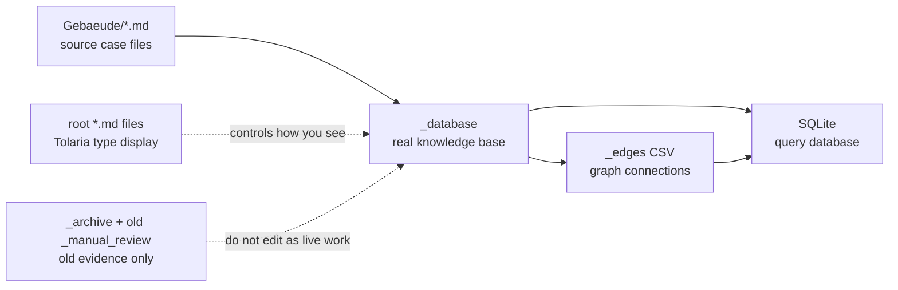
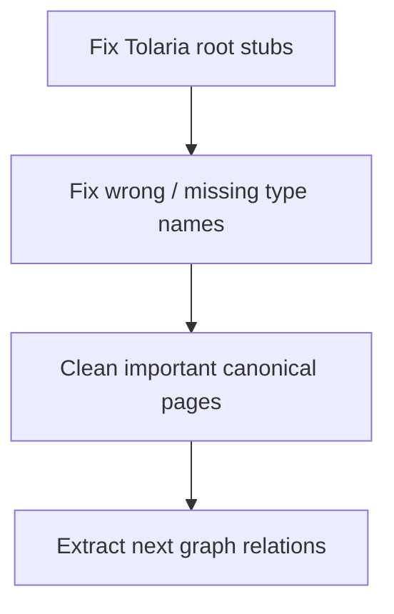
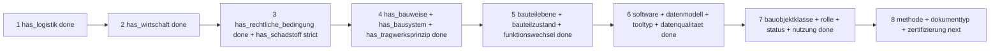

# Tolaria Decision Map

Simple version: Tolaria should help you think and write. The graph/SQLite should help you query. Do not make Tolaria show every technical thing with the same importance.

## 1. The Main Picture



Consequence:

| Place | What it means | What to do |
|---|---|---|
| `_database` | real knowledge | edit here |
| `Gebaeude` | source text for extraction | read from here |
| root `*.md` | Tolaria type settings | clean these next |
| `_archive`, old `_manual_review` | old evidence | do not treat as current |

## 2. Current Structure, Simple But Detailed

Snapshot now:

| Thing | Count | Meaning |
|---|---:|---|
| live entity folders | 55 | the ontology / possible Tolaria types |
| SQLite nodes | 3151 | real entries in the knowledge base |
| SQLite edges | 13746 | graph connections already built |
| edge review rows | 0 | no current edge queue |
| root Tolaria type files | 55 | display files Tolaria sees at root |
| missing root type files | 0 | all live entity folders now have a root type file |
| extra root type files | 0 | no extra root type files remain |

Read this as: Tolaria's type surface now matches the live ontology.

### A. Main Knowledge Entries

These are the pages you actually read, write, and think with.

| Entity | Count | Plain meaning | Example consequence |
|---|---:|---|---|
| `fallstudie` | 98 | case studies / research examples | "Show me all cases" |
| `projekt` | 89 | construction or design projects | links cases to real projects |
| `bauobjekt` | 88 | buildings, donor objects, receiver objects | separates project from physical object |
| `reuse_einsatz` | 637 | one reused component/material use | main query center |
| `reuse_kette` | 42 | complete donor-to-receiver chain | useful for circular flow |
| `reuse_kettenstation` | 84 | donor, storage, receiver station | shows where material moves |
| `akteur` | 66 | people, offices, firms, institutions | who did what |
| `akteur_beteiligung` | 238 | actor role in a case/project | connects actor + role + object |
| `bauobjekt_beteiligung` | 0 | building role in reuse chain | empty future slot |
| `quelle` | 663 | source/document/archive item | evidence and provenance |
| `datenpunkt` | 617 | one reported value | numbers with context |
| `software_digitaltool` | 74 | tools and platforms | 19 use edges now; first pass connected |

Important consequence: `reuse_einsatz` is the most important graph node. Most future edges should start there.

### B. Component And Material Types

These should stay clean and broad. Do not make every small variant its own type.

| Entity | Count | Plain meaning | Example consequence |
|---|---:|---|---|
| `bauteiltyp` | 15 | broad component families | `Stuetze`, not `Brettschichtholzstuetze` |
| `material` | 15 | broad material families | `Holz`, with BSH/CLT as variants |
| `bauteilebene` | 6 | layer/level of component | 275 edges now, first pass done |
| `bauteilzustand` | 9 | condition of component | 33 conservative edges now |
| `funktionswechsel` | 6 | old function vs new function | 640 edges now, first pass done |

Important consequence: if `bauteiltyp` and `material` are messy, every graph query becomes messy.

### C. Reuse Meaning

These prevent false counting, especially "Direct Reuse" vs Bestandserhalt/Recycling/planned ideas.

| Entity | Count | Plain meaning | Example consequence |
|---|---:|---|---|
| `reuse_strategie` | 11 | type of reuse strategy | direct reuse, refurbishment, DfD |
| `reuse_einsatzstatus` | 7 | realized/planned/temporary/etc. | avoids counting planned cases as built |
| `bewertungslogik_abgrenzung` | 7 | what counts and what does not | separates Bestandserhalt from reuse |
| `ressourcenquelle` | 9 | where resource comes from | ready for donor/stock/source mapping |
| `beschaffungsweg` | 8 | how it was procured | marketplace, platform, direct sourcing |

Important consequence: this group protects your research from overcounting.

### D. Building Context

These describe the project/building situation.

| Entity | Count | Plain meaning | Example consequence |
|---|---:|---|---|
| `bauobjektklasse` | 8 | class of building/object | 84 edges now, first pass done |
| `bauobjektrolle` | 6 | donor, receiver, storage, etc. | 108 edges now, first pass done |
| `bauobjektstatus` | 8 | existing, demolished, planned, etc. | 95 edges now, first pass done |
| `nutzung` | 9 | office, housing, school, etc. | 132 edges now, first pass done |
| `bauaufgabe_intervention` | 10 | retrofit, extension, conversion | 87 edges now, first pass done |
| `ort` | 61 | places | already connected to many cases |

Important consequence: building role/use is now queryable once. Spot-check donor/receiver and mixed-use cases before using them for precise statistics.

### E. Construction And Structure

These describe how something is built, carried, or connected.

| Entity | Count | Plain meaning | Example consequence |
|---|---:|---|---|
| `bauweise` | 6 | construction approach | 154 edges now, first pass done |
| `bausystem` | 5 | named building system | 66 edges now, first pass done |
| `tragwerksprinzip` | 4 | structural principle | 48 edges now, first pass done |
| `tragwerkstyp` | 10 | material/system structural type | timber structure, steel structure |
| `fuegung_verbindung` | 7 | connection type | screw, weld, mortar, glue |

Important consequence: construction logic is now queryable, but keep it conservative. The extractor avoids broad case-level guesses like "same case has timber, therefore every reuse item is timber".

### F. Process And Logistics

This was the best next graph expansion area. A first `has_logistik` pass is now done.

| Entity | Count | Plain meaning | Example consequence |
|---|---:|---|---|
| `prozessphase` | 10 | identification, dismantling, storage, reuse | partly connected already |
| `rueckbauverfahren` | 5 | dismantling method | partly connected already |
| `aufbereitungsverfahren` | 11 | repair, testing, refurbishment | only 27 edges now |
| `logistik` | 10 | transport, storage, matching | 492 edges now, first pass done |
| `methode` | 13 | methods / workflows | 0 edges now |

Important consequence: logistics can now be queried, but the edges should get one spot-check before building more dependent analysis on them.

### G. Requirements, Risk, Law

These explain why reuse works or fails.

| Entity | Count | Plain meaning | Example consequence |
|---|---:|---|---|
| `pruefung_nachweis` | 11 | testing and proof | CE marking, fire proof, structural proof |
| `leistungsanforderung` | 13 | performance requirement | fire, load, moisture, acoustics |
| `norm` | 7 | standards | EN 1090, DIN, etc. |
| `rechtliche_bedingung` | 6 | legal conditions | 724 edges now, first pass done |
| `schadstoff` | 5 | hazardous substances | 1 confirmed edge now; intentionally strict |
| `huerde` | 28 | barriers and problems | already strongly connected |

Important consequence: this group turns the graph from "what was reused" into "what made reuse difficult".

### H. Data, Documents, Tools

These support evidence, measurement, and digital workflows.

| Entity | Count | Plain meaning | Example consequence |
|---|---:|---|---|
| `kennwertdefinition` | 31 | what a number means | many pages are too thin |
| `datenqualitaet` | 7 | confidence/data quality | 841 edges now, first pass done |
| `datenmodell` | 7 | material pass, taxonomy, IFC, etc. | 59 edges now, first pass done |
| `dokumenttyp` | 16 | audit, pass, report type | root type stub now exists |
| `tooltyp` | 3 | marketplace, material database, etc. | 60 edges now, first pass done |
| `zertifizierung_bewertungssystem` | 5 | DGNB, BREEAM, etc. | ready for certification mapping |

Important consequence: this group should be low-visibility in Tolaria, but important for serious evidence work.

### I. Money, Context, Programs

These are useful later for research questions about scaling.

| Entity | Count | Plain meaning | Example consequence |
|---|---:|---|---|
| `wirtschaft` | 6 | cost, price, business model | 572 edges now, first pass done |
| `foerderprogramm` | 5 | funding programs | 0 edges now |
| `programm_kontext` | 6 | program context | ready for program-context mapping |
| `kontextmerkmal` | 2 | broader context feature | too thin now |

Important consequence: the graph can now answer basic cost/business-model questions, but the low-confidence rows should still be spot-checked before detailed claims.

### J. Current Graph Connections

The graph already connects basic structure well:

| Relation | Edges | Meaning |
|---|---:|---|
| `belongs_to_fallstudie` | 1618 | many things know their case |
| `belongs_to_projekt` | 1492 | many things know their project |
| `has_datenqualitaet` | 841 | evidence/data-quality links |
| `has_huerde` | 726 | barrier edges |
| `has_rechtliche_bedingung` | 724 | approval, warranty, building-code, procurement issues |
| `has_funktionswechsel` | 640 | whether old and new function stayed same or changed |
| `has_bauteiltyp` | 637 | component type edges |
| `installed_in_bauobjekt` | 637 | reuse item installed in object |
| `measured_on_bauobjekt` | 617 | data point belongs to object |
| `measures_kennwertdefinition` | 609 | data point knows what it measures |
| `has_wirtschaft` | 572 | cost, price, financing, business model |
| `uses_material` | 553 | material edges |
| `has_logistik` | 492 | transport, storage, matching, local reuse |
| `has_bauteilebene` | 275 | whether it is a group, system, surface layer, etc. |
| `has_bauweise` | 154 | construction approach of concrete reuse elements |
| `has_nutzung` | 132 | object use/program, e.g. housing, office, culture |
| `has_bauobjektrolle` | 108 | receiver, donor, existing object, same-site role |
| `has_bauobjektstatus` | 95 | built, planned, prototype, temporary, in construction |
| `has_bauaufgabe_intervention` | 87 | new build, retrofit, extension, fit-out, dismantling |
| `has_bauobjektklasse` | 84 | building, quarter/area, pavilion, infrastructure, fit-out |
| `has_bausystem` | 66 | named system, e.g. precast concrete or steel frame |
| `has_tooltyp` | 60 | classifies digital tools |
| `has_datenmodell` | 59 | links to IFC, material database, material-pass schema, etc. |
| `has_tragwerksprinzip` | 48 | skeleton, wall/core, truss, wall-bearing |
| `has_bauteilzustand` | 33 | checked/damaged/contaminated/etc.; intentionally conservative |
| `uses_software_digitaltool` | 19 | concrete reuse items using named platforms/tools |
| `has_schadstoff` | 1 | confirmed contaminant link only |

Construction first pass:

| Target | Edges | Plain meaning |
|---|---:|---|
| `bauweise/Massivbauweise` | 58 | concrete, masonry, brick, stone-like construction |
| `bauweise/Stahlbauweise` | 40 | steel construction, not `Stahlbeton` |
| `bauweise/Fertigteilbauweise` | 38 | prefab / precast component construction |
| `bauweise/Holzbauweise` | 16 | timber construction |
| `bauweise/Hybridbauweise` | 1 | clearly mixed structural approach |
| `bausystem/Betonfertigteil_System` | 36 | precast concrete component/system |
| `bausystem/Stahl_Skelettbau` | 18 | steel frame/skeleton system |
| `bausystem/Plattenbau` | 8 | panel building / WBS70-like systems |
| `tragwerksprinzip/Skeletttragwerk` | 24 | frame/skeleton load-bearing logic |
| `tragwerksprinzip/Wandtragwerk` | 16 | wall-bearing / panel-wall logic |
| `tragwerksprinzip/Wand_Kern_Tragwerk` | 6 | wall/core structure |
| `tragwerksprinzip/Fachwerk` | 2 | truss logic |

Logistics first pass:

| Target | Edges | Plain meaning |
|---|---:|---|
| `logistik/Transport` | 124 | movement between donor, storage, workshop, site |
| `logistik/Lokale_Wiederverwendung` | 97 | local or same-site reuse |
| `logistik/Lagerung` | 94 | storage in general |
| `logistik/Materialmatching` | 37 | finding suitable components |
| `logistik/Zwischenlagerung` | 32 | temporary storage / stockholder |
| `logistik/Bauteiltracking` | 31 | tracking, QR, material/product pass |
| `logistik/Materialverfuegbarkeit` | 30 | availability as planning condition |
| `logistik/Transportdistanz` | 24 | reported route/distance |
| `logistik/Lagerflaeche` | 19 | space needed for storage |
| `logistik/Just_in_Time` | 4 | direct timing without much storage |

Economy first pass:

| Target | Edges | Plain meaning |
|---|---:|---|
| `wirtschaft/Kostenvergleich` | 290 | cost comparison, savings, extra effort |
| `wirtschaft/Geschaeftsmodell` | 214 | stockholder, platform, direct sourcing, material pools |
| `wirtschaft/Preisbildung` | 37 | price, market liquidity, price risk |
| `wirtschaft/Finanzierung` | 29 | funding, credit, project finance |
| `wirtschaft/Lebenszykluskosten` | 2 | lifecycle / whole-life cost |

Legal first pass:

| Target | Edges | Plain meaning |
|---|---:|---|
| `rechtliche_bedingung/Zulassung_im_Einzelfall` | 308 | approval, CE/UKCA, project-specific admissibility |
| `rechtliche_bedingung/Gewaehrleistung` | 180 | warranty, guarantees, liability allocation |
| `rechtliche_bedingung/Bauordnungsrecht` | 175 | building code, permit, authority, heritage context |
| `rechtliche_bedingung/Vergaberecht` | 61 | public procurement, tender, specification logic |

Contaminant first pass:

| Target | Edges | Plain meaning |
|---|---:|---|
| `schadstoff/Asbest` | 1 | confirmed asbestos problem in a reused component |

Important consequence: legal links are now queryable. Schadstoff links are intentionally sparse because many source rows say only "possible", "unknown", or "not proven". Those should not become hard contaminant edges.

Component profile first pass:

| Target | Edges | Plain meaning |
|---|---:|---|
| `funktionswechsel/Konstruktive_Funktion` | 252 | component has load-bearing, envelope, spatial, or building-physics role |
| `funktionswechsel/Gleiche_Funktion` | 175 | old and new function are basically the same |
| `funktionswechsel/Neue_Funktion` | 143 | old and new function differ |
| `bauteilebene/Bauteilgruppe` | 142 | several components or a component family |
| `bauteilebene/Oberflaechenschicht` | 63 | finish, cladding, tiles, facade skin, surface layer |
| `funktionswechsel/Technische_Funktion` | 39 | TGA, electrical, lighting, sanitary object, lift, heating, ventilation |
| `bauteilebene/System` | 34 | structural/system-level reuse |
| `funktionswechsel/Unbekannt` | 27 | old/new function unclear |
| `bauteilzustand/Geprueft` | 27 | actual testing/proof mentioned |
| `bauteilebene/Gebaeudeteil` | 19 | larger building part like roof, facade, pavilion, core |
| `bauteilebene/Materialcharge` | 11 | stockpile, rest material, batch, surplus |
| `bauteilebene/Einzelbauteil` | 6 | one explicit component |
| `funktionswechsel/Dekorative_Funktion` | 4 | decorative or expressive reuse |
| `bauteilzustand/Beschaedigt` | 2 | actual damaged material/component, not just risk |
| `bauteilzustand/Korrodiert` | 2 | rust/corrosion evidence |
| `bauteilzustand/Intakt` | 1 | intact condition explicitly stated |
| `bauteilzustand/Kontaminiert` | 1 | confirmed contamination |

Important consequence: component-scale questions are now possible. `bauteilzustand` is intentionally strict; "Bruch as risk" stayed a `huerde`, not a hard condition edge.

Digital/evidence first pass:

| Target | Edges | Plain meaning |
|---|---:|---|
| `datenqualitaet/Belegt` | 615 | source gives enough evidence to treat the value as documented |
| `datenqualitaet/Unbekannt` | 126 | method or quality is missing/unknown |
| `datenqualitaet/Geschaetzt` | 63 | value is approximate, rounded, or marked as estimate |
| `datenqualitaet/Widerspruechlich` | 20 | source values conflict or are marked inconsistent |
| `datenqualitaet/Sekundaerquelle` | 17 | value comes from secondary source logic |
| `datenmodell/Materialdatenbank` | 39 | material database / inventory model |
| `datenmodell/Materialpass_Schema` | 8 | material-pass or passport structure |
| `datenmodell/IFC` | 5 | IFC/BIM data exchange model |
| `datenmodell/Bauteil_ID` | 4 | component ID / tracking identifier |
| `datenmodell/Klassifikation` | 3 | classification/taxonomy model |
| `tooltyp/Bauteilboerse` | 41 | marketplace / component exchange |
| `tooltyp/Materialdatenbank` | 13 | tool works as a material database |
| `tooltyp/Materialkataster` | 6 | tool works as a material cadastre |
| `software_digitaltool/RotorDC` | 7 | Rotor Deconstruction / RotorDC platform |
| `software_digitaltool/Opalis` | 6 | Opalis platform |
| `software_digitaltool/Concular_Plattform` | 4 | Concular platform |
| `software_digitaltool/Madaster` | 1 | Madaster platform |
| `software_digitaltool/QR_RFID_Materialtracking` | 1 | QR/RFID tracking |

Important consequence: evidence and digital tools are now searchable. Still, these are conservative first-pass edges, not proof that every case has a mature digital workflow.

Building context first pass:

| Target | Edges | Plain meaning |
|---|---:|---|
| `bauaufgabe_intervention/Neubau` | 26 | new-build or replacement-new-build project |
| `bauaufgabe_intervention/Umbau` | 20 | conversion, retrofit, transformation, adaptive reuse |
| `bauaufgabe_intervention/Sanierung` | 10 | renovation/refurbishment/technical upgrade |
| `bauaufgabe_intervention/Umnutzung` | 9 | use change |
| `bauaufgabe_intervention/Erweiterung` | 8 | extension/addition |
| `bauaufgabe_intervention/Fit_out` | 4 | interior fit-out |
| `bauaufgabe_intervention/Aufstockung` | 4 | vertical extension |
| `bauaufgabe_intervention/Rueckbau` | 4 | donor/deconstruction project |
| `bauaufgabe_intervention/Wiederaufbau` | 2 | reassembly/rebuild |
| `bauobjektklasse/Gebaeude` | 41 | normal building object |
| `bauobjektklasse/Quartier_Areal` | 16 | quarter, area, estate, campus |
| `bauobjektklasse/Gebaeudeteil` | 8 | building part, facade, floor, head building, etc. |
| `bauobjektklasse/Pavillon` | 8 | pavilion |
| `bauobjektklasse/Innenausbau` | 4 | interior fit-out object |
| `bauobjektklasse/Infrastruktur` | 3 | infrastructure object |
| `bauobjektklasse/Depot_Lager` | 3 | storage/depot object |
| `bauobjektklasse/Reuse_Centre` | 1 | ReUse centre / material hub |
| `bauobjektrolle/Empfaengerobjekt` | 78 | object receiving reused components |
| `bauobjektrolle/Bestandsobjekt` | 25 | existing/adaptive-reuse object |
| `bauobjektrolle/Same_Site_Donor_Receiver` | 3 | same-site donor and receiver |
| `bauobjektrolle/Donorobjekt` | 2 | donor object |
| `bauobjektstatus/Gebaut` | 66 | built/completed |
| `bauobjektstatus/Geplant` | 5 | planned/not confirmed built |
| `bauobjektstatus/Prototyp` | 11 | prototype or demonstrator |
| `bauobjektstatus/Wettbewerb` | 5 | competition entry |
| `bauobjektstatus/Temporaer` | 4 | temporary object |
| `bauobjektstatus/In_Bau` | 3 | in construction |
| `bauobjektstatus/Rueckgebaut` | 1 | demolished/deconstructed object |
| `nutzung/Gewerbe` | 28 | commercial/workshop/restaurant/lab context |
| `nutzung/Buero` | 27 | office/workplace context |
| `nutzung/Wohnen` | 21 | housing |
| `nutzung/Kultur` | 18 | culture/exhibition/event context |
| `nutzung/Schule_Bildung` | 13 | education/research/daycare |
| `nutzung/Lager_Depot` | 9 | storage/depot/material-bank use |
| `nutzung/Sozialbau` | 8 | social/community context |
| `nutzung/Mischnutzung` | 5 | explicit mixed use |
| `nutzung/Infrastruktur` | 3 | infrastructure use |

Important consequence: you can now ask "which reuse cases are housing?", "which are donor/receiver objects?", or "which are planned vs built?". The extractor stayed conservative with donor roles; many donor buildings still need explicit separate object nodes later.

Still weak or missing:

| Relation area | Current state | Why it matters |
|---|---|---|
| `has_schadstoff` | 1 confirmed edge | good for truth, still weak for hazard-risk analysis |
| `has_dokumenttyp`, `has_zertifizierung_bewertungssystem` | 0 edges | weak document/certification queries |
| `has_methode` | 0 edges | weak method/workflow queries |

Simple reading: the graph is now good for "which case/material/component?", "which logistics/economic/legal pattern?", first structural design questions, first component-scale/function-change questions, first evidence/digital questions, and first building-context questions. It is still weak for hazards, document/certification mapping, and methods.

### K. Tolaria Type Files

These root type files were missing and have now been created:

```text
bauobjekt_beteiligung
bauobjektrolle
bauobjektstatus
bauteilebene
bauteilzustand
datenqualitaet
dokumenttyp
funktionswechsel
nutzung
programm_kontext
zertifizierung_bewertungssystem
```

The extra `dokument.md` root type file has been removed. `dokumenttyp.md` is the live Tolaria type.

Consequence: Tolaria now covers the ontology without extra root-type noise.

## 3. Better Mapping From Gebaeude

Your idea is right: the graph should not stop at generic words like "material" or "huerde". It should connect to the concrete knot.

Important detail:

```text
good:
reuse_einsatz/X -> uses_material -> material/Stahl
reuse_einsatz/X -> has_huerde -> huerde/Datenluecke
reuse_einsatz/X -> has_logistik -> logistik/Zwischenlagerung

bad:
reuse_einsatz/X -> has_material -> "material"
reuse_einsatz/X -> has_huerde -> "huerde"
```

The relation name still says what kind of link it is. The target node says the concrete thing.

### A. What One Gebaeude File Should Become

One `Gebaeude/*.md` file should fill many parts of the database:

| Source section | Creates or fills | Example |
|---|---|---|
| `ENTITAETEN-MAPPING` | `fallstudie`, `projekt`, `bauobjekt`, `akteur`, `ort`, `quelle` | case name, location, architect, report |
| `BAUTEIL-INVENTAR` | `reuse_einsatz` plus concrete edges | steel beam -> `material/Stahl`, `bauteiltyp/Traeger` |
| `PROZESS UND LOGISTIK` | `prozessphase`, `logistik`, `rueckbauverfahren`, `aufbereitungsverfahren`, `methode` | storage, transport, selective dismantling |
| `TECHNIK, LEISTUNG, NORMEN` | `pruefung_nachweis`, `leistungsanforderung`, `norm`, `rechtliche_bedingung`, `schadstoff` | EN 1090, fire proof, warranty |
| `KENNWERTE` | `datenpunkt`, `kennwertdefinition`, `datenqualitaet` | 20 t steel, 50 t CO2 saved |
| `HUERDEN-MATRIX` | concrete `huerde` nodes and maybe method/solution notes | missing data, timing, storage |
| `WIRTSCHAFT UND BESCHAFFUNG` | `wirtschaft`, `beschaffungsweg`, `ressourcenquelle` | direct sourcing, extra cost, stockholder |
| `GESTALTUNG UND KULTURELLER WERT` | mostly prose, maybe `kontextmerkmal` | heritage, public procurement, social housing |

### B. The Central Rule

`reuse_einsatz` stays the center.

That means:

```text
Fallstudie = the story/container
Projekt = the construction project
Bauobjekt = the physical building/object
Reuse_Einsatz = the actual reused thing
```

Concrete example:

```text
55 Great Suffolk Street
  fallstudie/55_Great_Suffolk_Street_London
  projekt/55_Great_Suffolk_Street_London
  bauobjekt/55_Great_Suffolk_Street_London
  reuse_einsatz/...Stahlprofile...
```

Then the `reuse_einsatz` gets the concrete meaning:

```text
reuse_einsatz/...Stahlprofile...
  uses_material -> material/Stahl
  has_bauteiltyp -> bauteiltyp/Traeger or bauteiltyp/Stuetze
  has_huerde -> huerde/Datenluecke
  has_logistik -> logistik/Lagerung
  has_pruefung_nachweis -> pruefung_nachweis/Materialpruefung
  references_norm -> norm/EN_1090
```

Consequence: later you can ask real research questions:

```text
Show steel reuse cases with storage problems.
Show reused facade components with unknown material quality.
Show direct-reuse cases where certification was needed.
Show projects where old function and new function changed.
```

### C. How To Fill Empty Entity Types

Do not create every possible value from the example list at once. Create concrete knots when they are useful and recurring.

Good rule:

| If source says... | Create/link to... | Why |
|---|---|---|
| "fehlende Dokumentation" | `huerde/Datenluecke` or new `huerde/Fehlende_Dokumentation` | concrete problem |
| "Zwischenlagerung bei Cleveland" | `logistik/Zwischenlagerung` and maybe `reuse_kettenstation/...Storage` | concrete chain step |
| "Donor building" | `bauobjektrolle/Donorobjekt` | makes reuse chain readable |
| "Wohnungsbau" | `nutzung/Wohnen` | enables use-type queries |
| "temporarily installed" | `reuse_einsatzstatus/Temporaer` | avoids false "realized" count |
| "same element, same function" | `funktionswechsel/Gleiche_Funktion` | shows direct functional reuse |
| "old beam used as furniture" | `bewertungslogik_abgrenzung/Moebel_Dekoration_Nicht_Direct_Reuse` | prevents overcounting |

### D. What Should Not Be Overmapped

Some source text should stay prose unless it repeats across cases.

| Source text type | Better handling |
|---|---|
| vague "sustainable concept" | keep in prose |
| one-off poetic description | keep in prose |
| unknown / maybe / unclear | use `datenqualitaet/Unklar` later, do not force a concrete edge |
| "material" without exact material | keep raw label, do not invent `material/Stahl` |
| "logistics difficult" without reason | maybe `huerde/Logistikproblem` only if accepted, otherwise skip |

Consequence: the graph stays useful instead of becoming noisy.

### E. Better Extraction Order

First make the target knots, then extract edges into them.

```text
1. Seed missing controlled knots that are obvious and recurring.
2. Extract one relation family from Gebaeude.
3. Write a diff CSV and skipped CSV.
4. Spot-check 3-5 cases by hand.
5. Rebuild SQLite.
6. Commit.
```

Best next target:

```text
methode + dokumenttyp + zertifizierung_bewertungssystem
```

Why: building context is now done once. The next missing value is how a case was handled and documented: method/workflow, report/pass/audit type, and certification/evaluation system.

## 4. The Tolaria Choice

You have 55 entity folders in `_database`, and now all of them have root type files.

Best decision: **keep one root type file for every live entity folder**, but make some types visually less important.

| Visibility | Meaning | Examples | Consequence |
|---|---|---|---|
| High | you use it every day | `fallstudie`, `reuse_einsatz`, `material`, `bauteiltyp`, `huerde`, `quelle` | easy to browse and create |
| Medium | useful for filtering | `prozessphase`, `logistik`, `bauweise`, `bausystem`, `wirtschaft` | visible, but not visually dominant |
| Low | technical metadata | `datenqualitaet`, `bauteilzustand`, `dokumenttyp`, `programm_kontext` | available for graph, not distracting |
| Hidden | not live work | `_archive`, `_migration`, old `_manual_review` | prevents editing old material by mistake |

## 5. Concrete Cleanup First



Do this before more extraction:

| Problem | Example | Consequence if ignored | Fix |
|---|---|---|---|
| wrong type file | `dokument.md` but entity is `dokumenttyp` | Tolaria shows a type that is not in the database | done: keep `dokumenttyp.md` |
| missing type file | was true for `bauteilzustand` etc. | Tolaria may not show it as a proper type | done: missing stubs created |
| old active tab | `_manual_review/...Auflager...` | you may edit archived review text, not live data | use `_archive` only as evidence |
| wrong canonical title | `bauteiltyp/Stuetze` titled like one special wood column | graph label becomes misleading | title should be `Stuetze`; variants go inside text |

## 6. What To Clean In The Knowledge

Important pages should describe the general concept, not only one example.

| Page type | Good page title | Bad page title | Why it matters |
|---|---|---|---|
| `bauteiltyp/Stuetze` | `Stuetze` | `Brettschichtholzstuetze` | otherwise all columns look like timber-glulam columns |
| `bauteiltyp/Decke` | `Decke` | `Brettsperrholzdecke` | CLT is a variant, not the whole type |
| `material/Ziegel` | `Ziegel` | `Dachziegel` | roof tile is one use of brick/ceramic material |
| `kennwertdefinition/Flaeche` | explains what area means | only `# Flaeche` | numbers become unclear later |

Rule:

Canonical node = broad concept.  
Specific source label = keep inside `reuse_einsatz` or a subsection.

## 7. Next Graph Work

Do not add all missing relations at once. Add one relation family, check it, then commit.



Concrete example:

From `Gebaeude/55_Great_Suffolk_Street_London.md`:

- source says: storage at Cleveland, transport from donor to stockholder to site
- add graph edge: `reuse_einsatz/...Stahlprofile... -> has_logistik -> logistik/Lagerung`
- consequence: later you can ask: "Which steel reuse cases needed storage?"

Another example:

- source says: EN 1090, CE marking, warranty issue
- add edges to `norm`, `pruefung_nachweis`, `rechtliche_bedingung`
- consequence: you can find cases where reuse only worked because certification was solved.

## 8. Recommended Next Steps

1. Keep all 55 live entity types available, but visually ranked.
2. Clean the most important canonical pages: `bauteiltyp`, `material`, `kennwertdefinition`, `huerde`.
3. Spot-check the new building-context report: `_migration/50_gap_relation_summary_50r_has_bauobjekt_context.md`.
4. Continue extraction from `Gebaeude` with `methode`, `dokumenttyp`, and `zertifizierung_bewertungssystem`.

Short version: first make Tolaria clear. Then make the graph richer.
