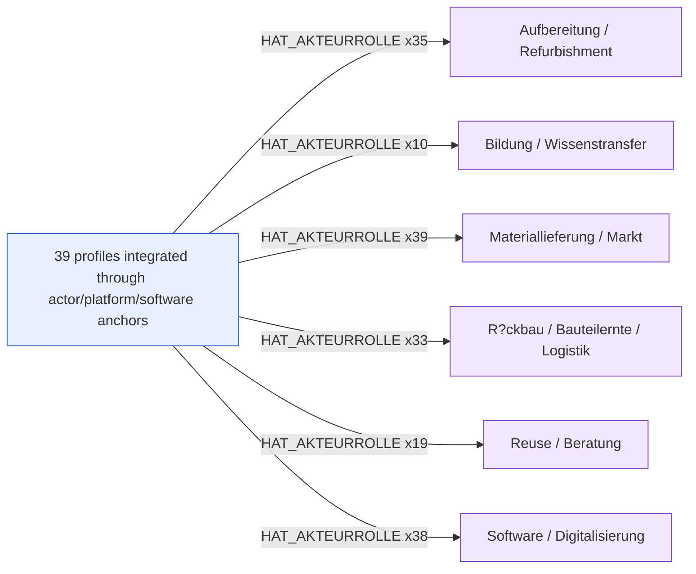

# Final Bauteilb?rsen Target Graph Preview

This is a preview only. It shows the intended graph after the integration patch, without writing to Neo4j.

## Layer 1: Countries, Platforms, Sources, Operators

```mermaid
flowchart LR
  classDef existing fill:#e5f7ea,stroke:#23884f,stroke-width:1px;
  classDef new fill:#e8f0ff,stroke:#2f63c6,stroke-width:1px;
  classDef country fill:#fff2cc,stroke:#b88a00,stroke-width:1px;
  classDef source fill:#f7f7f7,stroke:#777,stroke-dasharray:4 3;
  classDef type fill:#f1e7ff,stroke:#7a42c2;
  classDef operator fill:#ffe8dd,stroke:#bf5b2c;
  at_materialhub["Akteurtyp: Materialhub / Bauteilb?rse"]:::type
  q_all["39 q_research_*_md source containers"]:::source

  subgraph land_belgien["Land: Belgien"]
    p_batiterre["BatiTerre<br/>Akteur"]:::new
    p_cornermat_retrival["Cornermat / Retrival<br/>Akteur"]:::new
    p_materialenbank_leuven_atelier_circuler["Materialenbank Leuven / Atelier Circuler<br/>Akteur"]:::new
    p_rotordc["RotorDC<br/>Akteur"]:::existing
  end

  subgraph land_deutschland["Land: Deutschland"]
    p_bauteilboerse_bremen["Bauteilbörse Bremen<br/>Akteur"]:::existing
    p_bauteilnetz_deutschland["Bauteilnetz Deutschland<br/>Akteur/Netzwerk"]:::existing
    p_materialrest24["Materialrest24<br/>Akteur"]:::new
    p_reuse_and_trade["ReUse and Trade<br/>Akteur"]:::new
    p_software_restado["Restado<br/>Software"]:::existing
  end

  subgraph land_daenemark["Land: Dänemark"]
    p_genbyg["Genbyg<br/>Akteur"]:::new
  end

  subgraph land_frankreich["Land: Frankreich"]
    p_articonnex["Articonnex<br/>Akteur"]:::new
    p_backacia["Backacia<br/>Akteur"]:::new
    p_batrecup["BatRecup<br/>Akteur"]:::new
    p_baticycle["Bâticycle<br/>Akteur"]:::new
    p_cycle_up["Cycle Up<br/>Akteur"]:::new
    p_cycle_zero["Cycle Zéro<br/>Akteur"]:::new
    p_r_place["R-Place<br/>Akteur"]:::new
    p_raedificare["RAEDIFICARE<br/>Akteur"]:::new
    p_reempro["Réempro<br/>Akteur"]:::new
    p_skop_marketplace["Skop Marketplace<br/>Akteur"]:::new
  end

  subgraph land_niederlande["Land: Niederlande"]
    p_gebruiktebouwmaterialen["Gebruiktebouwmaterialen.com / GBM<br/>Akteur"]:::existing
    p_insert_marketplace["Insert Marketplace<br/>Akteur"]:::new
    p_new_horizon["Oogstkaart / New Horizon<br/>Akteur"]:::existing
    p_resource_marktplaats["ReSource Marktplaats<br/>Akteur"]:::new
  end

  subgraph land_norwegen["Land: Norwegen"]
    p_loopfront["Loopfront<br/>Akteur"]:::new
  end

  subgraph land_schweiz["Land: Schweiz"]
    p_bauteilladen_winterthur["Bauteilladen Winterthur<br/>Akteur"]:::existing
    p_salza["Salza<br/>Akteur"]:::new
    p_useagain_bauteilclick["useagain / Bauteilclick<br/>Akteur"]:::new
  end

  subgraph land_vereinigtes_koenigreich["Land: Vereinigtes Königreich"]
    p_building_spares_market["Building Spares Market<br/>Akteur"]:::new
    p_enviromate["Enviromate<br/>Akteur"]:::new
    p_globechain["Globechain<br/>Akteur"]:::new
    p_material_index["Material Index<br/>Akteur"]:::new
    p_material_reuse_portal["Material Reuse Portal<br/>Akteur"]:::new
    p_salvoweb["SalvoWEB<br/>Akteur/Plattform"]:::new
    p_surplus_building_and_plumbing_materials["Surplus Building & Plumbing Materials<br/>Akteur"]:::new
    p_sustainability_yard["Sustainability Yard<br/>Akteur"]:::new
    p_warp_it["Warp It<br/>Akteur"]:::new
  end

  subgraph land_oesterreich["Land: Österreich"]
    p_baukarussell["BauKarussell<br/>Akteur"]:::existing
    p_re_store_harvestmap_vienna["re:store / HarvestMAP Vienna<br/>Akteur/Plattform"]:::new
  end

  p_articonnex -->|HAT_AKTEURTYP| at_materialhub
  p_articonnex -.->|BELEGT_IN| q_all
  p_backacia -->|HAT_AKTEURTYP| at_materialhub
  p_backacia -.->|BELEGT_IN| q_all
  p_baticycle -->|HAT_AKTEURTYP| at_materialhub
  p_baticycle -.->|BELEGT_IN| q_all
  p_batiterre -->|HAT_AKTEURTYP| at_materialhub
  p_batiterre -.->|BELEGT_IN| q_all
  p_batrecup -->|HAT_AKTEURTYP| at_materialhub
  p_batrecup -.->|BELEGT_IN| q_all
  p_baukarussell -->|HAT_AKTEURTYP| at_materialhub
  p_baukarussell -.->|BELEGT_IN| q_all
  p_bauteilboerse_bremen -->|HAT_AKTEURTYP| at_materialhub
  p_bauteilboerse_bremen -.->|BELEGT_IN| q_all
  p_bauteilladen_winterthur -->|HAT_AKTEURTYP| at_materialhub
  p_bauteilladen_winterthur -.->|BELEGT_IN| q_all
  p_bauteilnetz_deutschland -->|keeps HAT_AKTEURTYP| at_ngo["Akteurtyp: NGO / Verband / Netzwerk"]:::type
  p_bauteilnetz_deutschland -.->|BELEGT_IN| q_all
  p_building_spares_market -->|HAT_AKTEURTYP| at_materialhub
  p_building_spares_market -.->|BELEGT_IN| q_all
  p_cornermat_retrival -->|HAT_AKTEURTYP| at_materialhub
  p_cornermat_retrival -.->|BELEGT_IN| q_all
  p_cycle_up -->|HAT_AKTEURTYP| at_materialhub
  p_cycle_up -.->|BELEGT_IN| q_all
  p_cycle_zero -->|HAT_AKTEURTYP| at_materialhub
  p_cycle_zero -.->|BELEGT_IN| q_all
  p_enviromate -->|HAT_AKTEURTYP| at_materialhub
  p_enviromate -.->|BELEGT_IN| q_all
  p_gebruiktebouwmaterialen -->|HAT_AKTEURTYP| at_materialhub
  p_gebruiktebouwmaterialen -.->|BELEGT_IN| q_all
  p_genbyg -->|HAT_AKTEURTYP| at_materialhub
  p_genbyg -.->|BELEGT_IN| q_all
  p_globechain -->|HAT_AKTEURTYP| at_materialhub
  p_globechain -.->|BELEGT_IN| q_all
  p_insert_marketplace -->|HAT_AKTEURTYP| at_materialhub
  p_insert_marketplace -.->|BELEGT_IN| q_all
  p_loopfront -->|HAT_AKTEURTYP| at_materialhub
  p_loopfront -.->|BELEGT_IN| q_all
  p_material_index -->|HAT_AKTEURTYP| at_materialhub
  p_material_index -.->|BELEGT_IN| q_all
  p_material_reuse_portal -->|HAT_AKTEURTYP| at_materialhub
  p_material_reuse_portal -.->|BELEGT_IN| q_all
  p_materialenbank_leuven_atelier_circuler -->|HAT_AKTEURTYP| at_materialhub
  p_materialenbank_leuven_atelier_circuler -.->|BELEGT_IN| q_all
  p_materialrest24 -->|HAT_AKTEURTYP| at_materialhub
  p_materialrest24 -.->|BELEGT_IN| q_all
  p_new_horizon -->|HAT_AKTEURTYP| at_materialhub
  p_new_horizon -.->|BELEGT_IN| q_all
  p_r_place -->|HAT_AKTEURTYP| at_materialhub
  p_r_place -.->|BELEGT_IN| q_all
  p_raedificare -->|HAT_AKTEURTYP| at_materialhub
  p_raedificare -.->|BELEGT_IN| q_all
  p_re_store_harvestmap_vienna -->|HAT_AKTEURTYP| at_materialhub
  p_re_store_harvestmap_vienna -.->|BELEGT_IN| q_all
  p_reempro -->|HAT_AKTEURTYP| at_materialhub
  p_reempro -.->|BELEGT_IN| q_all
  p_resource_marktplaats -->|HAT_AKTEURTYP| at_materialhub
  p_resource_marktplaats -.->|BELEGT_IN| q_all
  p_software_restado -->|BETRIEBEN_VON| op_concular
  op_concular -->|HAT_AKTEURTYP| at_materialhub
  p_software_restado -.->|BELEGT_IN| q_all
  p_reuse_and_trade -->|HAT_AKTEURTYP| at_materialhub
  p_reuse_and_trade -.->|BELEGT_IN| q_all
  p_rotordc -->|HAT_AKTEURTYP| at_materialhub
  p_rotordc -.->|BELEGT_IN| q_all
  p_salvoweb -->|HAT_AKTEURTYP| at_materialhub
  p_salvoweb -.->|BELEGT_IN| q_all
  p_salza -->|HAT_AKTEURTYP| at_materialhub
  p_salza -.->|BELEGT_IN| q_all
  p_skop_marketplace -->|HAT_AKTEURTYP| at_materialhub
  p_skop_marketplace -.->|BELEGT_IN| q_all
  p_surplus_building_and_plumbing_materials -->|HAT_AKTEURTYP| at_materialhub
  p_surplus_building_and_plumbing_materials -.->|BELEGT_IN| q_all
  p_sustainability_yard -->|HAT_AKTEURTYP| at_materialhub
  p_sustainability_yard -.->|BELEGT_IN| q_all
  p_useagain_bauteilclick -->|HAT_AKTEURTYP| at_materialhub
  p_useagain_bauteilclick -.->|BELEGT_IN| q_all
  p_warp_it -->|HAT_AKTEURTYP| at_materialhub
  p_warp_it -.->|BELEGT_IN| q_all
  op_concular["Operator: Concular"]:::operator
  op_salvo_ltd["Operator: Salvo Ltd"]:::operator
  p_salvoweb -->|BETRIEBEN_VON| op_salvo_ltd
  op_materialnomaden["Operator: materialnomaden"]:::operator
  p_re_store_harvestmap_vienna -->|BETRIEBEN_VON| op_materialnomaden
```

## Layer 2: Role Integration

## What This Means In Neo4j

- Blue nodes are new semantic platform/actor anchors to create.
- Green nodes are existing semantic anchors to update/link.
- Yellow grouping is concrete `Land` via `LIEGT_IN_LAND`.
- Purple nodes are controlled vocabulary nodes such as `Akteurtyp` / `Akteurrolle`.
- Grey source node represents the 39 existing `q_research_*_md` containers. In Neo4j these stay as individual source nodes, not one aggregate node.
- Orange nodes are distinct existing operators linked with `BETRIEBEN_VON`. For Restado, the `Software` node links to Concular; Concular carries the actor/type context.
- Non-graphable prose sections are not shown because the plan drops them from semantic import.

## Per-Anchor Target Integration

| Anchor | Node kind | New/existing | Countries | Action | Source container | Role links |
|---|---|---|---|---|---|---|
| Articonnex | Akteur | new | Frankreich | create_new_materialhub_actor | `q_research_articonnex_md` | Materiallieferung / Markt, Software / Digitalisierung, R?ckbau / Bauteilernte / Logistik |
| Backacia | Akteur | new | Frankreich | create_new_materialhub_actor | `q_research_backacia_md` | Materiallieferung / Markt, Software / Digitalisierung, Reuse / Beratung, R?ckbau / Bauteilernte / Logistik, Aufbereitung / Refurbishment |
| BatRecup | Akteur | new | Frankreich | create_new_materialhub_actor | `q_research_batrecup_md` | Materiallieferung / Markt, Software / Digitalisierung, R?ckbau / Bauteilernte / Logistik, Aufbereitung / Refurbishment |
| BatiTerre | Akteur | new | Belgien | create_new_materialhub_actor | `q_research_batiterre_md` | Materiallieferung / Markt, Software / Digitalisierung, Reuse / Beratung, R?ckbau / Bauteilernte / Logistik, Aufbereitung / Refurbishment |
| BauKarussell | Akteur | existing | Österreich | update_existing_materialhub_actor | `q_research_baukarussell_md` | Materiallieferung / Markt, Software / Digitalisierung, Reuse / Beratung, R?ckbau / Bauteilernte / Logistik, Aufbereitung / Refurbishment, Bildung / Wissenstransfer |
| Bauteilbörse Bremen | Akteur | existing | Deutschland | update_existing_materialhub_actor | `q_research_bauteilboerse_bremen_md` | Materiallieferung / Markt, Software / Digitalisierung, Reuse / Beratung, R?ckbau / Bauteilernte / Logistik, Aufbereitung / Refurbishment |
| Bauteilladen Winterthur | Akteur | existing | Schweiz | update_existing_materialhub_actor | `q_research_bauteilladen_winterthur_md` | Materiallieferung / Markt, Software / Digitalisierung, Reuse / Beratung, Aufbereitung / Refurbishment |
| Bauteilnetz Deutschland | Akteur/Netzwerk | existing | Deutschland | reconcile_existing_network_context | `q_research_bauteilnetz_deutschland_md` | Materiallieferung / Markt, Software / Digitalisierung, R?ckbau / Bauteilernte / Logistik, Aufbereitung / Refurbishment, Bildung / Wissenstransfer |
| Building Spares Market | Akteur | new | Vereinigtes Königreich | create_new_materialhub_actor | `q_research_building_spares_market_md` | Materiallieferung / Markt, Software / Digitalisierung, R?ckbau / Bauteilernte / Logistik, Aufbereitung / Refurbishment |
| Bâticycle | Akteur | new | Frankreich | create_new_materialhub_actor | `q_research_baticycle_md` | Materiallieferung / Markt, Software / Digitalisierung, Aufbereitung / Refurbishment |
| Cornermat / Retrival | Akteur | new | Belgien | create_new_materialhub_actor | `q_research_cornermat_retrival_md` | Materiallieferung / Markt, Software / Digitalisierung, R?ckbau / Bauteilernte / Logistik, Aufbereitung / Refurbishment |
| Cycle Up | Akteur | new | Frankreich | create_new_materialhub_actor | `q_research_cycle_up_md` | Materiallieferung / Markt, Software / Digitalisierung, Reuse / Beratung, R?ckbau / Bauteilernte / Logistik, Aufbereitung / Refurbishment |
| Cycle Zéro | Akteur | new | Frankreich | create_new_materialhub_actor | `q_research_cycle_zero_md` | Materiallieferung / Markt, Software / Digitalisierung, Reuse / Beratung, R?ckbau / Bauteilernte / Logistik, Aufbereitung / Refurbishment |
| Enviromate | Akteur | new | Vereinigtes Königreich | create_new_materialhub_actor | `q_research_enviromate_md` | Materiallieferung / Markt, Software / Digitalisierung, R?ckbau / Bauteilernte / Logistik, Aufbereitung / Refurbishment |
| Gebruiktebouwmaterialen.com / GBM | Akteur | existing | Niederlande | update_existing_materialhub_actor | `q_research_gebruiktebouwmaterialen_gbm_md` | Materiallieferung / Markt, Software / Digitalisierung, R?ckbau / Bauteilernte / Logistik, Aufbereitung / Refurbishment |
| Genbyg | Akteur | new | Dänemark | create_new_materialhub_actor | `q_research_genbyg_md` | Materiallieferung / Markt, Software / Digitalisierung, R?ckbau / Bauteilernte / Logistik, Bildung / Wissenstransfer |
| Globechain | Akteur | new | Vereinigtes Königreich | create_new_materialhub_actor | `q_research_globechain_md` | Materiallieferung / Markt, Software / Digitalisierung, Aufbereitung / Refurbishment, Bildung / Wissenstransfer |
| Insert Marketplace | Akteur | new | Niederlande | create_new_materialhub_actor | `q_research_insert_marketplace_md` | Materiallieferung / Markt, Software / Digitalisierung, Reuse / Beratung, R?ckbau / Bauteilernte / Logistik, Aufbereitung / Refurbishment |
| Loopfront | Akteur | new | Norwegen | create_new_materialhub_actor | `q_research_loopfront_md` | Materiallieferung / Markt, Software / Digitalisierung, R?ckbau / Bauteilernte / Logistik, Bildung / Wissenstransfer |
| Material Index | Akteur | new | Vereinigtes Königreich | create_new_materialhub_actor | `q_research_material_index_md` | Materiallieferung / Markt, Software / Digitalisierung, Reuse / Beratung, R?ckbau / Bauteilernte / Logistik, Aufbereitung / Refurbishment |
| Material Reuse Portal | Akteur | new | Vereinigtes Königreich | create_new_materialhub_actor | `q_research_material_reuse_portal_md` | Materiallieferung / Markt, Software / Digitalisierung, R?ckbau / Bauteilernte / Logistik, Aufbereitung / Refurbishment |
| Materialenbank Leuven / Atelier Circuler | Akteur | new | Belgien | create_new_materialhub_actor | `q_research_materialenbank_leuven_atelier_circuler_md` | Materiallieferung / Markt, Software / Digitalisierung, R?ckbau / Bauteilernte / Logistik, Aufbereitung / Refurbishment |
| Materialrest24 | Akteur | new | Deutschland | create_new_materialhub_actor | `q_research_materialrest24_md` | Materiallieferung / Markt, Software / Digitalisierung, R?ckbau / Bauteilernte / Logistik, Aufbereitung / Refurbishment, Bildung / Wissenstransfer |
| Oogstkaart / New Horizon | Akteur | existing | Niederlande | update_existing_materialhub_actor | `q_research_oogstkaart_new_horizon_md` | Materiallieferung / Markt, Software / Digitalisierung, Reuse / Beratung, R?ckbau / Bauteilernte / Logistik |
| R-Place | Akteur | new | Frankreich | create_new_materialhub_actor | `q_research_r_place_md` | Materiallieferung / Markt, Software / Digitalisierung, Reuse / Beratung, Aufbereitung / Refurbishment |
| RAEDIFICARE | Akteur | new | Frankreich | create_new_materialhub_actor | `q_research_raedificare_md` | Materiallieferung / Markt, Software / Digitalisierung, Reuse / Beratung, R?ckbau / Bauteilernte / Logistik, Aufbereitung / Refurbishment |
| ReSource Marktplaats | Akteur | new | Niederlande | create_new_materialhub_actor | `q_research_resource_marktplaats_md` | Materiallieferung / Markt, Software / Digitalisierung, Reuse / Beratung, R?ckbau / Bauteilernte / Logistik, Aufbereitung / Refurbishment |
| ReUse and Trade | Akteur | new | Deutschland | create_new_materialhub_actor | `q_research_reuse_and_trade_md` | Materiallieferung / Markt, Software / Digitalisierung, Reuse / Beratung, R?ckbau / Bauteilernte / Logistik, Aufbereitung / Refurbishment, Bildung / Wissenstransfer |
| Restado | Software | existing | Deutschland | link_existing_software_to_existing_operator | `q_research_restado_md` | Roles/type are represented through operator `concular`, not directly on the Software node. |
| RotorDC | Akteur | existing | Belgien | update_existing_materialhub_actor | `q_research_rotordc_md` | Materiallieferung / Markt, Reuse / Beratung, R?ckbau / Bauteilernte / Logistik, Aufbereitung / Refurbishment |
| Réempro | Akteur | new | Frankreich | create_new_materialhub_actor | `q_research_reempro_md` | Materiallieferung / Markt, Software / Digitalisierung, Reuse / Beratung, R?ckbau / Bauteilernte / Logistik, Aufbereitung / Refurbishment |
| SalvoWEB | Akteur/Plattform | new | Vereinigtes Königreich | create_platform_node_link_existing_operator | `q_research_salvoweb_md` | Materiallieferung / Markt, Software / Digitalisierung, Reuse / Beratung, R?ckbau / Bauteilernte / Logistik, Aufbereitung / Refurbishment, Bildung / Wissenstransfer |
| Salza | Akteur | new | Schweiz | create_new_materialhub_actor | `q_research_salza_md` | Materiallieferung / Markt, Software / Digitalisierung, Reuse / Beratung, R?ckbau / Bauteilernte / Logistik, Aufbereitung / Refurbishment |
| Skop Marketplace | Akteur | new | Frankreich | create_new_materialhub_actor | `q_research_skop_marketplace_md` | Materiallieferung / Markt, Software / Digitalisierung, Aufbereitung / Refurbishment |
| Surplus Building & Plumbing Materials | Akteur | new | Vereinigtes Königreich | create_new_materialhub_actor | `q_research_surplus_building_and_plumbing_materials_md` | Materiallieferung / Markt, Software / Digitalisierung, Aufbereitung / Refurbishment |
| Sustainability Yard | Akteur | new | Vereinigtes Königreich | create_new_materialhub_actor | `q_research_sustainability_yard_md` | Materiallieferung / Markt, Software / Digitalisierung, R?ckbau / Bauteilernte / Logistik, Aufbereitung / Refurbishment |
| Warp It | Akteur | new | Vereinigtes Königreich | create_new_materialhub_actor | `q_research_warp_it_md` | Materiallieferung / Markt, Software / Digitalisierung, R?ckbau / Bauteilernte / Logistik, Aufbereitung / Refurbishment, Bildung / Wissenstransfer |
| re:store / HarvestMAP Vienna | Akteur/Plattform | new | Österreich | create_platform_node_link_existing_operator | `q_research_re_store_harvestmap_vienna_md` | Materiallieferung / Markt, Software / Digitalisierung, R?ckbau / Bauteilernte / Logistik, Aufbereitung / Refurbishment |
| useagain / Bauteilclick | Akteur | new | Schweiz | create_new_materialhub_actor | `q_research_useagain_bauteilclick_md` | Materiallieferung / Markt, Software / Digitalisierung, Reuse / Beratung, R?ckbau / Bauteilernte / Logistik, Aufbereitung / Refurbishment |
