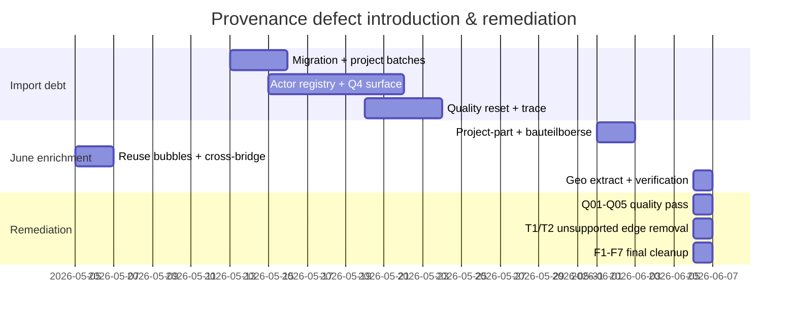

# Provenance Root-Cause Report — G10 Aggregator

**Date:** 2026-06-06  
**Database:** `mit-bestand`  
**Canonical ledger:** `VERIFICATION_LEDGER_ELEMENT.csv` — **17,323** elements · **89.47% PROVEN**  
**Inputs:** Agent G01–G09 provenance shards ([`ledger/provenance_g01.csv`](ledger/provenance_g01.csv) … [`provenance_g09.csv`](ledger/provenance_g09.csv))  
**Mode:** read-only merge; no graph mutation  

---

## 1. Executive summary

The **10.53% non-PROVEN** residue (1,824 rows) is not random noise — it clusters into **ten repeatable systemic failure modes** introduced across **six import eras** (May 13 migration → June 6 verification closeout). The dominant debt is **never-sourced bulk import** (714 MISSING_EVIDENCE rows, G01) and **evidence-channel degradation** (622 PARTIAL geo/participation rows, G03). A smaller but high-impact slice is **category-inference actor mesh** (71 VMA ops, G09) and **verification-wave synthetic attestation** (36 P6-new rows, G07).

**Good news:** regulation vocabulary (Phase B), property cleanup, reuse-bubble remediation, and Q02 depot deprecation **removed or re-attested** major fabrication classes without reintroducing Quelle sidecars. **Remaining work** is concentrated in actor long tail sourcing, catalogue quote recovery, geo placeholder replacement, and 12 Evidence Gate violations on Q03 `ERFUELLT_NACHWEIS` rels.

---

## 2. Top 10 systemic failure modes

| # | Failure mode | Rows (approx.) | Primary origin runs / scripts | G shard |
|---:|---|---:|---|---|
| **1** | **Never-sourced bulk import** — nodes/rels minted without `source_urls` / `evidence_url` | **714** ME | `2026-05-13` migration (`15222140`); `2026-05-20_radical_quality_reset` snapshot; `2026-05-23_trace_zitiert_quelle_to_urls` | G01 |
| **2** | **Organisational geo without address** — `LIEGT_IN_LAND` on actors with no `adresse` | **335** PARTIAL | `2026-05-20_inbox_batch2_import` (`19e55129`); actor registry | G03 |
| **3** | **Placeholder geo source tokens** — `processed` / `archive` / `processed+web` on participation edges | **197** PARTIAL | `2026-06-06_project_bg_geo_extract` (`apply_geo_import.py`, `ed1d81d9`) | G03 |
| **4** | **Catalogue URL without verbatim quote** — `HAT_BAUTEILTYP` / `NUTZT_MATERIAL` weak evidence | **143** PARTIAL | `2026-06-02_bauteilboerse_actor_enrichment_import/_run_import_actor_enrichment_edges.py` (`f9cf1a8c`); R07 remediation | G02 |
| **5** | **Category-inference actor mesh** — sector/country similarity + single-actor URLs | **29 removed** + **10** PARTIAL VMA | `2026-06-05_*_reuse_bubble` + `2026-06-06_cross_bubble_extension` (`ed1d81d9`) | G09 |
| **6** | **Aggregate donor / depot stubs** — `Unbekannt` / `Aggregiert` Bauwerk/Materialdepot placeholders | **110** ME (G01) + **17** deleted | `2026-05-13..15` project batch `*.kg.jsonl`; `mig_1_4_materialdepot.cypher`; Q02 deprecate | G01, G08 |
| **7** | **Q4 URL denormalization without entity validation** — `mig_q4_surface_urls` copies affiliation URLs to `:Akteur` | **102** UNVERIFIABLE | `2026-05-15` actor_registry + `2026-05-21` Q4 (`d37e5240`) | G04 |
| **8** | **Generic programme vocabulary as entities** — `prog_pilotprojekt` etc. + `TEIL_VON_PROGRAMM` | **33** SCHEMA | `controlled_vocabulary.seed.kg.jsonl` (`15222140`) | G05 |
| **9** | **Verification synthetic PROVEN** — P6-06 `synthesize_row()` with empty `proof_quote` | **36** minted; **12** residual gate violations | `_post_quality_p6_06_aggregate.py`; Q01/Q02/Q03 patches | G07 |
| **10** | **Ledger CSV column-shift** — extra comma shifts `http_status=200` into `verdict` | **17** parse artifacts (F04 shard) | `ledger/final_cleanup_f04.csv` (F04 agent) | G06 |

---

## 3. Intake runs & scripts responsible

### 3.1 By era (timeline)

| Era | Dates | Runs / commits | What broke | What was fixed later |
|---|---|---|---|---|
| **A — Migration** | 2026-05-08..13 | `1344fced`, `15222140`, `d71b13fd` | Generic `prog_*`, `TEIL_VON_PROGRAMM`, early actor mesh, software self-wiring | G05 escalation; Q01 vocab merges |
| **B — Project batches** | 2026-05-13..15 | batch_001..015 `*.kg.jsonl`, `13c165fd`, `d0ded72f` | Donor `bw_*` stubs, unsourced `BETEILIGT_AN`, Materialdepot abstractions | Q02 depot delete (G08); geo re-point (Agent 09) |
| **C — Actor registry** | 2026-05-15..21 | actor_registry import, `mig_q4_surface_urls` | 435 unsourced actors; affiliation URLs on persons | 06b/08/15 sourcing patches; 4 F4 residuals remain |
| **D — Quality reset** | 2026-05-20..23 | `radical_quality_reset`, `trace_zitiert_quelle_to_urls` | `NUTZT_SOFTWARE` without quotes; VMA mesh without `evidence_url` | Reuse-bubble hardening; 06b gap closure |
| **E — June enrichment** | 2026-06-01..02 | `project_part_actor_import_all`, `bauteilboerse_actor_enrichment` | `import_all_for_now` inference edges; URL-only catalogue imports | R07 partial recovery; Q04 downgrades |
| **F — Bubbles + geo** | 2026-06-05..06 | `*_reuse_bubble` (`ed1d81d9`), `apply_geo_import.py`, verification campaign | Category mesh; placeholder geo tokens; P6 synthetics | T1/T2 edge removal (G09); F2/F3 re-proof (G07) |

### 3.2 Script hot list (actionable)

| Script | Failure modes | Recommendation |
|---|---|---|
| `_run_import_actor_enrichment_edges.py` | #4 URL without quote | Require `evidence_quote` on MERGE; reject parallel-edge skip without promotion |
| `_run_import_all.py` (06-01) | #3 shared-material inference | Close `MUST_FIND_EVIDENCE.md`; RELABEL or delete 63 inference edges |
| `apply_geo_import.py` | #2, #3, geo CONTRADICTION | Replace placeholder tokens with dossier HTTP URLs before PROVEN upgrade |
| `mig_q4_surface_urls.cypher` | #7 person/org URL confusion | Person nodes: only URLs naming the person; affiliations → VMA edges |
| `_post_quality_p6_06_aggregate.py` | #9 synthetic PROVEN | Never mint `verdict=PROVEN` with empty `proof_quote`; use `UNATTESTED` placeholder |
| Country bubble `apply_*_reuse_bubble.py` | #5 category mesh | Ban `connection_kind` containing `mesh`/`peer` without pairwise URL proof |
| `import_jsonl_to_neo4j.py` + batch exports | #6 aggregate stubs | Donor uncertainty → dossier property, not `:Materialdepot` node |
| `controlled_vocabulary.seed.kg.jsonl` | #8 generic programmes | Deprecate `prog_*` category nodes; use edge properties |
| Ledger writers (F04, A13, A14, R01, R03) | #10 column shift | `csv.DictWriter` + width validation on merge |

---

## 4. Cross-tab: verdict × origin_run

Derived from `VERIFICATION_LEDGER_ELEMENT.csv` with origin_run assignment per G-shard taxonomy ([`_build_provenance_g10.py`](_build_provenance_g10.py)).

| Verdict | Early import (May 13–23) | Project batch vocab | Actor registry + Q4 | Geo / participation | Bauteilbörsen enrichment | Reuse bubbles VMA | Geo extract | P6 / Q cleanup | Other (attested live) | **Σ** |
|---|---:|---:|---:|---:|---:|---:|---:|---:|---:|---:|
| **PROVEN** | 0 | 0 | 0 | 0 | 99 | 0 | 0 | 36 | 15,364 | **15,499** |
| **MISSING_EVIDENCE** | **877** | 0 | 0 | 0 | 0 | 0 | 0 | 0 | 0 | **877** |
| **PARTIAL** | 0 | 0 | 0 | **622** | **13** | **10** | 0 | 0 | 162 | **807** |
| **UNVERIFIABLE** | 0 | 0 | **102** | 0 | 0 | 0 | 0 | 0 | 0 | **102** |
| **SCHEMA_VIOLATION** | 0 | **33** | 0 | 0 | 0 | 0 | 0 | 0 | 0 | **33** |
| **CONTRADICTION** | 0 | 0 | 0 | 0 | 0 | 0 | **5** | 0 | 0 | **5** |
| **Σ** | 877 | 33 | 102 | 622 | 112 | 10 | 5 | 36 | 15,526 | **17,323** |

**Reading the table:**

- **MISSING_EVIDENCE** is **100%** early-import debt — no regulation-vocab or bubble contribution.
- **PARTIAL** is **77%** geo/participation (G03) and **18%** catalogue (G02 + R07 overlap counted in enrichment column).
- **UNVERIFIABLE** is **100%** actor-registry/Q4 surfacing (G04) — distinct from the 477 unsourced-actor shard (Agent 08).
- **SCHEMA_VIOLATION** is **100%** pre-regulation project-batch vocabulary (G05) — **0** from `build_vocabulary_graph.py` / Phase B.
- **CONTRADICTION** is **100%** geo extract address vs `LIEGT_IN_STADT` mismatch (G06) — valid findings, not parse bugs.
- **P6/Q cleanup** accounts for **36** PROVEN rows that were synthetically invented then re-attested (G07); **12** of the original 36 still violate Evidence Gate on `proof_quote`.

### 4.1 G01 root-cause bucket totals (MISSING_EVIDENCE only)

| Bucket | Rows | Share |
|---|---:|---:|
| `never_sourced_import` | 714 | 81.4% |
| `aggregate_stub` | 110 | 12.5% |
| `intake_script` | 52 | 5.9% |
| `post_merge_orphan` | 1 | 0.1% |

### 4.2 G09 VMA fabrication class (129 edges traced)

| Class | Count | Remediation |
|---|---:|---|
| `evidence_backed` | 58 | Keep |
| `actor_mesh` | 44 | 29 removed T1/T2 |
| `category_inference` | 5 | 4 removed (Swiss interpretive) |
| `mixed` | 22 | Case-by-case |

---

## 5. Timeline (condensed)

| Date | Event | Impact |
|---|---|---|
| 2026-05-13 | `15222140` migration ready | Bulk `prog_*`, `TEIL_VON_PROGRAMM`, early actors |
| 2026-05-15 | Project batch consolidation `13c165fd` | 105 donor `Bauwerk` stubs; 17 Materialdepot placeholders |
| 2026-05-15 | Actor registry seed | 697 actors; URLs on Quelle nodes only |
| 2026-05-20 | `mig_1_4_materialdepot` + radical reset | Relabel 23 placeholders → Materialdepot |
| 2026-05-21 | Q4 `mig_q4_surface_urls` | Denormalize URLs onto `:Akteur` — person/affiliation conflation |
| 2026-05-23 | `trace_zitiert_quelle_to_urls` | VMA mesh + participation edges without edge evidence |
| 2026-06-01 | `import_all_for_now` | 91 `abgeleitet` participation edges |
| 2026-06-02 | Bauteilbörsen enrichment import | 143 catalogue PARTIAL; 239 untagged legacy edges |
| 2026-06-05 | Regulation Phase B `323cd19b` | **No new SCHEMA_VIOLATION** (exclusion proof G05) |
| 2026-06-06 09:35 | Reuse bubbles `ed1d81d9` | 129 VMA edges; 71 mesh/inference ops |
| 2026-06-06 | Geo extract + Agent 09 | 197 placeholder tokens; 5 CONTRADICTION |
| 2026-06-06 17:45–49 | Q01–Q05 patches | Graph mutations → 19 redirect rels uncovered |
| 2026-06-06 | P6-06 synthesize + F2/F3 re-proof | Close coverage; 12 quote gate violations remain |
| 2026-06-06 14:45 | T1/T2 unsupported edge removal | −29 category-inference VMA rels |

---

## 6. Recommendations (prioritized)

### P0 — Evidence Gate compliance

1. **Fix 12 Q03 `ERFUELLT_NACHWEIS` residuals** (G07): downgrade to `PARTIAL` with `evidence_basis` quote or fetch PN `primary_source_url`.
2. **Ledger writer hygiene** (G06): validate CSV width on every shard merge; document F04 `verdict=200` as parse artifact only.

### P1 — High-volume provenance recovery

3. **Actor long tail** (G01): batch ADD_SOURCE for 425 `never_sourced_import` actors; skip 8 miscast/aggregate stubs.
4. **Catalogue quotes** (G02): re-import from `*.enrichment.json` / `*.finalest.evidence.json`; do not accept homepage-only R07 URLs as PROVEN.
5. **Geo placeholders** (G03): replace `processed`/`archive` tokens in `akteur_typ_projekt_geo.json` with dossier HTTP URLs; re-fetch before upgrade.

### P2 — Structural cleanup

6. **Generic programmes** (G05): deprecate 5 `prog_*` nodes + 20 `TEIL_VON_PROGRAMM` edges.
7. **Inference participation** (G03): RELABEL or delete 63 `reuse_supply_or_material_hub_candidate` `BETEILIGT_AN` edges.
8. **VMA mesh guardrails** (G09): ban `connection_kind` `*_mesh`/`*_peer` without pairwise proof; commit removal patches.

### P3 — Policy / intake contract

9. **Person vs org evidence** (G04): registry affiliation URLs → VMA edges; `source_urls` only for entity-naming pages.
10. **Donor uncertainty** (G08): never reintroduce aggregate `:Materialdepot`; use dossier-level `donor_resolution_status` or discrete `Bauwerk` when named.
11. **Aggregator rule** (G07): `synthesize_row()` may close D1/D2 coverage but must use `verdict=UNATTESTED` until F-wave re-proof.

---

## 7. G-shard index

| Agent | Scope | Rows / clusters | Report |
|---|---|---:|---|
| G01 | MISSING_EVIDENCE | 877 / 12 clusters | [`reports/provenance_g01.md`](reports/provenance_g01.md) |
| G02 | PARTIAL catalogue | 143 | [`reports/provenance_g02.md`](reports/provenance_g02.md) |
| G03 | PARTIAL geo/participation | 622 / 13 clusters | [`reports/provenance_g03.md`](reports/provenance_g03.md) |
| G04 | UNVERIFIABLE | 102 | [`reports/provenance_g04.md`](reports/provenance_g04.md) |
| G05 | SCHEMA_VIOLATION | 33 | [`reports/provenance_g05.md`](reports/provenance_g05.md) |
| G06 | CONTRADICTION + ledger bugs | 27 | [`reports/provenance_g06.md`](reports/provenance_g06.md) |
| G07 | P6-new synthetics | 36 | [`reports/provenance_g07.md`](reports/provenance_g07.md) |
| G08 | Deleted Materialdepot placeholders | 17 | [`reports/provenance_g08.md`](reports/provenance_g08.md) |
| G09 | VMA fabrication lineage | 129 edges | [`reports/provenance_g09.md`](reports/provenance_g09.md) |
| **G10** | **This merge** | **17,323** | [`reports/provenance_g10.md`](reports/provenance_g10.md) |

---

*Agent G10 — read-only provenance aggregator. No graph mutation.*
