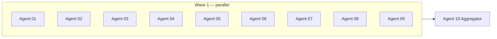

# Full-Graph Verification — 10-Agent **Element-Level Proof** Campaign

**Status:** PLAN (ready to execute)
**Date:** 2026-06-06
**Database:** `mit-bestand`
**Graph snapshot (live, read-only):** **2 284 nodes / 15 312 relationships / 51 relationship types / 54 node labels**
**Prior campaign:** [`VERIFICATION_PLAN_15_AGENTS.md`](VERIFICATION_PLAN_15_AGENTS.md) + [`COVERAGE_PROOF.md`](COVERAGE_PROOF.md) — 41.2 % rel / 54.9 % node **element** coverage; Agents 12/13 used **aggregate** rows for 9 092 rels + 1 040 nodes.
**Post-remediation baseline:** [`WAVE2_SUMMARY.md`](WAVE2_SUMMARY.md) · [`REMEDIATION_PLAN.md`](REMEDIATION_PLAN.md)

---

## 0. Why this campaign exists

The 15-agent campaign proved **structural** conformance for Tier-C (vocab/process) classes but emitted only **41 aggregate ledger rows** (`coverage_level=type`) for ~9 092 relationships and ~1 040 nodes. That satisfies type-level schema proof but **not** per-element attestation.

This 10-agent follow-on closes the gap: **one ledger row per live node and per live relationship**, `coverage_level=element`, with no aggregate rows in the final merged ledger.

---

## 1. Definition of Done

A claim is **done** when all of the following hold:

| # | Criterion |
|---|---|
| D1 | **Every live node** (`elementId(n)` or `n.id`) has **exactly one** row in the merged `VERIFICATION_LEDGER_ELEMENT.csv` with `coverage_level=element`. |
| D2 | **Every live relationship** (`elementId(r)` or `(a.id, type(r), b.id)` triple) has **exactly one** such row. |
| D3 | **Zero** rows with `coverage_level=type`, `agg:*` element_ids, or `A12-rel-agg-*` / `A13-rel-type-*` claim patterns in the **final** ledger. |
| D4 | Each row's `graph_element_id` resolves to a live graph element (Agent 10 coverage diff = **0 uncovered**, **0 stale-only**). |
| D5 | Tier-A external claims (`evidence_url`, `source_url`, node `source_urls`/`primary_source_url`) have `fetched=true` or justified `DEAD_LINK`/`UNVERIFIABLE`; `PROVEN`/`PARTIAL` require verbatim `proof_quote` (Evidence Gate §3). |
| D6 | Actor edges: no category-inference `PROVEN`; both endpoints named or one endpoint's curated listing of the other. |
| D7 | Agent 10 emits `ELEMENT_COVERAGE_PROOF.md` showing **17596 / 17596** elements covered and `CAMPAIGN_REPORT_ELEMENT.md`. |
| D8 | **No graph mutation** during verification (read-only agents; patches only after human gate, as before). |

**Σ elements to prove:** 2 284 + 15 312 = **17 596** (each exactly once in final ledger).

---

## 2. Coverage gap inventory

Computed 2026-06-06 by cross-walking live Neo4j (`read-cypher`) against `VERIFICATION_LEDGER.csv` rows where `coverage_level=element`, matching on `graph_element_id` → `elementId`, else `(from_id, rel_type, to_id)` / node `id`.

### 2.1 Headline

| Surface | Live | Element-covered (live-matched) | **Gap (needs new element row)** | Stale ledger keys¹ |
|---|---:|---:|---:|---:|
| **Relationships** | 15 312 | 6 234 | **9 078** | 131 |
| **Nodes** | 2 284 | 1 244 | **1 040** | 20 |
| **Total elements** | **17 596** | **7 478** | **10 118** | 151 |

¹ Stale = element row points to `elementId` or `id` no longer in live graph (Wave-2 merges/deletes). Agent 10 drops these; replacement live elements are in the gap columns above.

### 2.2 Relationship gap by `rel_type` (Σ = 9 078)

| rel_type | live | gap | prior owner | new agent |
|---|---:|---:|---|---|
| `HAT_AKTEURROLLE` | 1 461 | 1 459 | A12 aggregate | **01** |
| `HAT_BAUTEILTYP` | 871 | 871 | A12 aggregate | **03** |
| `HAT_AKTEURTYP` | 682 | 681 | A12 aggregate | **02** |
| `HAT_PROZESSPHASE` | 679 | 679 | A13 aggregate | **05** |
| `NUTZT_MATERIAL` | 633 | 633 | A12 aggregate | **03** |
| `HAT_BESCHAFFUNGSWEG` | 591 | 591 | A13 aggregate | **05** |
| `HAT_LOGISTIK` | 434 | 434 | A13 aggregate | **06** |
| `HAT_MATERIALGRUPPE` | 403 | 403 | A12 aggregate | **04** |
| `HAT_BAUTEILGRUPPE` | 364 | 364 | A12 aggregate | **04** |
| `HAT_RUECKBAUVERFAHREN` | 308 | 308 | A13 aggregate | **06** |
| `HAT_ERGEBNIS` | 294 | 294 | A13 aggregate | **06** |
| `HAT_AUFBEREITUNG` | 267 | 267 | A13 aggregate | **06** |
| `HAT_RESSOURCENQUELLE` | 264 | 264 | A13 aggregate | **07** |
| `HAT_KENNWERT` | 255 | 255 | A12 aggregate | **04** |
| `HAT_METHODE` | 241 | 241 | A13 aggregate | **07** |
| `HAT_NUTZUNG` | 235 | 235 | A12 aggregate | **02** |
| `HAT_BAUOBJEKTROLLE` | 225 | 225 | A12 aggregate | **02** |
| `HAT_INTERVENTION` | 144 | 144 | A13 aggregate | **07** |
| `HAT_BAUWEISE` | 124 | 124 | A12 aggregate | **07** |
| `HAT_VERBINDUNGSTECHNIK` | 110 | 110 | A12 aggregate | **07** |
| `HAT_GESCHAEFTSMODELL` | 97 | 97 | A12 aggregate | **02** |
| `HAT_ENTWURFSMETHODIK` | 79 | 79 | A12 aggregate | **07** |
| `HAT_ARCHITEKTURERGEBNIS` | 79 | 79 | A12 aggregate | **07** |
| `HAT_BAUSYSTEM` | 61 | 61 | A12 aggregate | **07** |
| `HAT_DEFEKT` | 57 | 57 | A12 aggregate | **07** |
| `TYPISCH_BEI_MATERIAL` | 74 | 56 | A12 partial | **04** |
| `HAT_ZUSTANDSKLASSE` | 18 | 18 | A12 aggregate | **04** |
| `GEBAUT_IN_ERA` | 8 | 8 | A12 aggregate | **04** |
| `BETEILIGT_AN` | 598 | 15 | A09 + R07 delta | **09** |
| `ERFUELLT_NACHWEIS` | 128 | 10 | R02 + A13 | **09** |
| `VERBUNDEN_MIT_AKTEUR` | 248 | 10 | A06b stale | **09** |
| `LIEGT_IN_LAND` | 650 | 5 | R05 delta | **09** |
| `NUTZT_SOFTWARE` | 49 | 1 | A10 stale | **09** |
| *all other rel types* | *8 763* | *0* | A01–A11, A07 | — |

**Already element-covered (no re-proof unless verdict upgrade):** `ERFORDERT_NACHWEIS` (1 578), `TRIGGERS_REGULIERUNGSFRAGE` (1 130), `LIEGT_IN_LAND` (645), `BETEILIGT_AN` (583), `GILT_IN_LAND` (281), `IN_EMPFANGSOBJEKT` (278), `AUS_SPENDER` (245), `HAT_BAUWERK` (194), `GESTUETZT_AUF_REGELWERK` (167), `HAT_HUERDE` (237), `HAT_SCHADSTOFFRISIKO` (100), `ERFORDERT_SCHADSTOFFPRUEFUNG` (37), `VERBUNDEN_MIT_AKTEUR` (238), geo/participation bulk, regulation `source_url` class, etc.

### 2.3 Node gap by label (Σ = 1 040 unique nodes)

| label | gap nodes | new agent |
|---|---:|---|
| `Bauteilgruppe` | 364 | **08** |
| `Kennwert` | 255 | **08** |
| `PruefungNachweis` | 118 | **08** |
| `Material` | 24 | **08** |
| `Akteurrolle` | 22 | **08** |
| `Entwurfsmethodik` | 16 | **08** |
| `DEPRECATED` | 16 | **08** |
| `Architekturergebnis` | 16 | **08** |
| `Bauteiltyp` | 16 | **08** |
| `Schadstoff` | 13 | **08** |
| `Verbindungstechnik` | 11 | **08** |
| `Materialgruppe` | 11 | **08** |
| `Regulierungsfrage` | 11 | **08** |
| `Huerde` | 11 | **08** |
| `Defekt` | 10 | **08** |
| `Akteurtyp` | 10 | **08** |
| `BauaufgabeIntervention` | 10 | **08** |
| `Beschaffungsweg` | 10 | **08** |
| `Logistik` | 10 | **08** |
| `Prozessphase` | 10 | **08** |
| `Nachweisforderung` | 9 | **08** |
| `Nutzung` | 9 | **08** |
| `Leistungsanforderung` | 8 | **08** |
| `Bausystem` | 8 | **08** |
| + 11 smaller process/vocab labels (6–6 each) | 66 | **08** |

**Entity nodes already element-covered:** `Akteur` (678), `Bauwerk` (184), `Projekt` (83), `Stadt` (74), `Land` (15), typed law nodes (~190), `Software`/`Programm`/`Tool`, most `Materialdepot` (5 sourced).

### 2.4 Wave-2 deferred items (cross-cut Agent 09)

| Batch | Residual | Element-proof action |
|---|---:|---|
| **R07** | 171 `RESOURCE` (PARTIAL) + 6 `MISSING_EVIDENCE` | Re-adjudicate with per-edge rows; 145 `HAT_BAUTEILTYP`/`NUTZT_MATERIAL` absorbed by Agents **03/04** using [`ledger/remediation_r07.csv`](ledger/remediation_r07.csv); 25 `BETEILIGT_AN` → **09** |
| **R01** | 17 unsourced `Materialdepot` | **09** — `ADD_SOURCE` or `ESCALATE_HUMAN` per node |
| **R02** | 11 dangling `Nachweisforderung` | **08** (node) + **09** (`ERFUELLT_NACHWEIS` gap edges) |
| **R03** | 17 deferred merge pairs | **09** — `ESCALATE_HUMAN` rows only (no auto-merge) |

---

## 3. Evidence Gate (unchanged from 15-agent plan)

Identical protocol to [`VERIFICATION_PLAN_15_AGENTS.md`](VERIFICATION_PLAN_15_AGENTS.md) §3 and [`AGENT_PROMPT_TEMPLATE.md`](AGENT_PROMPT_TEMPLATE.md):

- **PROVEN** / **PARTIAL** ⇒ non-empty verbatim `proof_quote` + `fetched=true` (external) or exact contract clause + dossier line (internal).
- **Actor / participation edges** ⇒ both endpoints on page, or curated supplier/directory listing; **no** sector/country/co-list inference.
- **Tier-C vocab/process edges** ⇒ `basis_type=contract|logic|dossier`; prove **this specific edge** (domain label, range label, endpoint ids, no orphan target). Aggregate Cypher conclusions from Agents 12/13 may be cited in `notes` but **each row must state the edge-level claim**.
- **Regulation `source_url` rels** already proven — do not re-fetch unless Agent 09/10 flags regression.
- Ledger columns: [`VERIFICATION_LEDGER.schema.csv`](VERIFICATION_LEDGER.schema.csv) + mandatory `coverage_level=element` on every row.

---

## 4. The 10-agent fleet

> **MECE rule:** Agents 01–09 each own disjoint element sets. Agent 10 merges and proves 100 % coverage.
> Every agent writes **one row per enumerated work item** — row count must equal scope `count` target.

### Summary table

| agent_id | scope name | rels | nodes | **Σ items** | ledger | report |
|---|---|---:|---:|---:|---|---|
| **01** | Actor-role classification | 1 459 | 0 | **1 459** | `ledger/element_proof_agent_01.csv` | `reports/element_proof_agent_01.md` |
| **02** | Actor-type & role-adjacent vocab | 1 238 | 0 | **1 238** | `ledger/element_proof_agent_02.csv` | `reports/element_proof_agent_02.md` |
| **03** | Bauteiltyp & material use | 1 504 | 0 | **1 504** | `ledger/element_proof_agent_03.csv` | `reports/element_proof_agent_03.md` |
| **04** | Material groups, Kennwert, era | 1 104 | 0 | **1 104** | `ledger/element_proof_agent_04.csv` | `reports/element_proof_agent_04.md` |
| **05** | Process phase & procurement | 1 270 | 0 | **1 270** | `ledger/element_proof_agent_05.csv` | `reports/element_proof_agent_05.md` |
| **06** | Logistics & dismantling chain | 1 303 | 0 | **1 303** | `ledger/element_proof_agent_06.csv` | `reports/element_proof_agent_06.md` |
| **07** | Methods, design & outcome vocab | 1 159 | 0 | **1 159** | `ledger/element_proof_agent_07.csv` | `reports/element_proof_agent_07.md` |
| **08** | Vocab & process nodes | 0 | 1 040 | **1 040** | `ledger/element_proof_agent_08.csv` | `reports/element_proof_agent_08.md` |
| **09** | Residuals & wave-2 backlog | 41 | 17 | **58** | `ledger/element_proof_agent_09.csv` | `reports/element_proof_agent_09.md` |
| **10** | Aggregator & coverage proof | — | — | **17 596** check | `VERIFICATION_LEDGER_ELEMENT.csv` | `ELEMENT_COVERAGE_PROOF.md` |
| | **Σ (01–09 work)** | **9 078** | **1 057** | **10 135** | | |

Note: Agent 09's 17 nodes are unsourced `Materialdepot` (R01); Agent 08's 1 040 are disjoint vocab/process labels. Combined node work = 1 057; 1 040 + 17 + 1 227 already-covered entity nodes = 2 284.

---

### Agent 01 — Actor-role classification (`HAT_AKTEURROLLE`)

- **Count target:** **1 459** relationships, **0** nodes.
- **SCOPE_CYPHER:**

```cypher
MATCH (a)-[r:HAT_AKTEURROLLE]->(b)
RETURN elementId(r) AS element_id, a.id AS from_id, b.id AS to_id,
       'HAT_AKTEURROLLE' AS rel_type, labels(a) AS from_labels, labels(b) AS to_labels
ORDER BY from_id, to_id
```

- **Special checks:**
  - Domain: source must be `Akteur` or flagged exception (2 legacy `Stadt`→`Akteurrolle` edges — cite Agent 12 notes `A12-EXC-001/002`).
  - Range: target must be `Akteurrolle`.
  - `basis_type=contract`; cite `_neo4j/contracts/` vocabulary + donor dossier when `literature_ref` present.
  - **No aggregate row** — one row per `element_id`.

---

### Agent 02 — Actor-type & business-model vocab

- **Count target:** **1 238** relationships (`681+225+235+97`).
- **SCOPE_CYPHER:**

```cypher
MATCH (a)-[r]->(b)
WHERE type(r) IN ['HAT_AKTEURTYP','HAT_BAUOBJEKTROLLE','HAT_NUTZUNG','HAT_GESCHAEFTSMODELL']
RETURN elementId(r) AS element_id, a.id AS from_id, b.id AS to_id, type(r) AS rel_type,
       labels(a) AS from_labels, labels(b) AS to_labels
ORDER BY type(r), from_id, to_id
```

- **Special checks:**
  - `HAT_AKTEURTYP`: domain `Akteur`, range `Akteurtyp`.
  - `HAT_BAUOBJEKTROLLE`: domain `Bauwerk|Projekt`, range `Bauobjektrolle`.
  - `HAT_NUTZUNG`: domain `Bauwerk`, range `Nutzung`.
  - `HAT_GESCHAEFTSMODELL`: domain `Akteur`, range `Geschaeftsmodell`.
  - Flag `name==id` orphan vocab stubs (Agent 12 DEPRECATE candidates).

---

### Agent 03 — Bauteiltyp & material-use classification

- **Count target:** **1 504** relationships (`871+633`).
- **SCOPE_CYPHER:**

```cypher
MATCH (a)-[r]->(b)
WHERE type(r) IN ['HAT_BAUTEILTYP','NUTZT_MATERIAL']
RETURN elementId(r) AS element_id, a.id AS from_id, b.id AS to_id, type(r) AS rel_type,
       labels(a) AS from_labels, labels(b) AS to_labels, r.evidence_url AS evidence_url
ORDER BY type(r), from_id, to_id
```

- **Special checks:**
  - Cross-read [`ledger/remediation_r07.csv`](ledger/remediation_r07.csv) for prior fetch URLs on the 145 R07 rows in this scope (83 `HAT_BAUTEILTYP` + 62 `NUTZT_MATERIAL`); re-use fetch cache, re-adjudicate PARTIAL/MISSING.
  - `HAT_BAUTEILTYP`: domain `Bauteilgruppe`, range `Bauteiltyp`.
  - `NUTZT_MATERIAL`: domain `Bauteilgruppe`, range `Material`.
  - If `evidence_url` present post-R07, apply web Evidence Gate; else contract+dossier.

---

### Agent 04 — Material groups, Kennwert, era links

- **Count target:** **1 104** relationships (`403+364+255+56+18+8`).
- **SCOPE_CYPHER:**

```cypher
MATCH (a)-[r]->(b)
WHERE type(r) IN ['HAT_MATERIALGRUPPE','HAT_BAUTEILGRUPPE','HAT_KENNWERT',
                  'TYPISCH_BEI_MATERIAL','HAT_ZUSTANDSKLASSE','GEBAUT_IN_ERA']
RETURN elementId(r) AS element_id, a.id AS from_id, b.id AS to_id, type(r) AS rel_type,
       labels(a) AS from_labels, labels(b) AS to_labels
ORDER BY type(r), from_id, to_id
```

- **Special checks:**
  - `HAT_KENNWERT`: target `Kennwert` nodes may have `name=null` by design — prove via `kennwert`/`wert`/`einheit` properties.
  - `HAT_BAUTEILGRUPPE`: instance-level donor component grouping (not closed vocab) — prove edge endpoints, not duplicate `Bauteilgruppe` nodes.
  - `TYPISCH_BEI_MATERIAL`: only **56** of 74 edges are gap (18 already covered — do not duplicate).

---

### Agent 05 — Process phase & procurement

- **Count target:** **1 270** relationships (`679+591`).
- **SCOPE_CYPHER:**

```cypher
MATCH (a)-[r]->(b)
WHERE type(r) IN ['HAT_PROZESSPHASE','HAT_BESCHAFFUNGSWEG']
RETURN elementId(r) AS element_id, a.id AS from_id, b.id AS to_id, type(r) AS rel_type,
       labels(a) AS from_labels, labels(b) AS to_labels
ORDER BY type(r), from_id, to_id
```

- **Special checks:**
  - Domain: reuse-process subjects (`Akteur`, `Bauteilgruppe`, `Projekt` per contract).
  - Range: `Prozessphase` / `Beschaffungsweg` vocab nodes.
  - Cross-check phase ordering constraints from Agent 13 logic rules in `notes` (no aggregate-only verdict).

---

### Agent 06 — Logistics & dismantling chain

- **Count target:** **1 303** relationships (`434+308+294+267`).
- **SCOPE_CYPHER:**

```cypher
MATCH (a)-[r]->(b)
WHERE type(r) IN ['HAT_LOGISTIK','HAT_RUECKBAUVERFAHREN','HAT_ERGEBNIS','HAT_AUFBEREITUNG']
RETURN elementId(r) AS element_id, a.id AS from_id, b.id AS to_id, type(r) AS rel_type,
       labels(a) AS from_labels, labels(b) AS to_labels
ORDER BY type(r), from_id, to_id
```

- **Special checks:**
  - `IST_UNTERVERFAHREN_VON` is **not** in this shard (already element-covered).
  - `HAT_ERGEBNIS` / `HAT_AUFBEREITUNG`: prove process DAG consistency per edge.

---

### Agent 07 — Methods, design & outcome vocabulary

- **Count target:** **1 159** relationships.
- **SCOPE_CYPHER:**

```cypher
MATCH (a)-[r]->(b)
WHERE type(r) IN ['HAT_RESSOURCENQUELLE','HAT_METHODE','HAT_INTERVENTION','HAT_BAUWEISE',
                  'HAT_VERBINDUNGSTECHNIK','HAT_ENTWURFSMETHODIK','HAT_ARCHITEKTURERGEBNIS',
                  'HAT_BAUSYSTEM','HAT_DEFEKT']
RETURN elementId(r) AS element_id, a.id AS from_id, b.id AS to_id, type(r) AS rel_type,
       labels(a) AS from_labels, labels(b) AS to_labels
ORDER BY type(r), from_id, to_id
```

- **Special checks:**
  - `HAT_ENTWURFSMETHODIK` / `HAT_ARCHITEKTURERGEBNIS`: 9+8 `DEPRECATED` German nodes must remain isolated (0 in-scope edges) — if any edge hits `DEPRECATED`, `SCHEMA_VIOLATION`.
  - `HAT_DEFEKT` / `HAT_BAUSYSTEM`: domain `Bauteilgruppe`.

---

### Agent 08 — Vocab & process nodes (label clusters)

- **Count target:** **0** rels, **1 040** nodes.
- **SCOPE_CYPHER:**

```cypher
MATCH (n)
WHERE NOT (
  n:Akteur OR n:Bauwerk OR n:Projekt OR n:Stadt OR n:Land OR
  n:Software OR n:Materialdepot OR n:Programm OR n:Tool OR n:ReuseRule OR
  ANY(l IN labels(n) WHERE l ENDS WITH 'recht')
)
RETURN elementId(n) AS element_id, n.id AS id, labels(n) AS labels
ORDER BY id
```

- **Special checks:**
  - Prove node identity + label legality + not orphaned when contract requires wiring.
  - `PruefungNachweis` (118): each node referenced by ≥1 `ERFUELLT_NACHWEIS` or cite dangling allowance.
  - `Nachweisforderung` (9 gap nodes): cross-check `ERFORDERT_NACHWEIS` / `ERFUELLT_NACHWEIS` pairing (R02 dangling set).
  - `DEPRECATED` (16): prove **isolation** (no active edges) per edge row in other agents.
  - 8 vocab stubs `name==id` (`bt_fassadenelement`, …) → `FIX_PROPERTY` or `DEPRECATE_NODE`.

---

### Agent 09 — Residuals, wave-2 backlog & stale deltas

- **Count target:** **41** rels + **17** nodes = **58** items.
- **SCOPE_CYPHER (relationships — 41 edges, live 2026-06-06):**

```cypher
// Residual rels lacking a live-matched element row in VERIFICATION_LEDGER.csv
// Counts: BETEILIGT_AN 15 | ERFUELLT_NACHWEIS 10 | VERBUNDEN_MIT_AKTEUR 10
//         LIEGT_IN_LAND 5 | NUTZT_SOFTWARE 1
MATCH (a)-[r]->(b)
WHERE type(r) IN ['BETEILIGT_AN','ERFUELLT_NACHWEIS','VERBUNDEN_MIT_AKTEUR','LIEGT_IN_LAND','NUTZT_SOFTWARE']
RETURN elementId(r) AS element_id, a.id AS from_id, b.id AS to_id, type(r) AS rel_type,
       r.evidence_url AS evidence_url, r.source_url AS source_url, r.review_run AS review_run,
       labels(a) AS from_labels, labels(b) AS to_labels
ORDER BY type(r), from_id, to_id
```

**Pre-flight filter:** Agent 09 (or Agent 10 pre-flight) subtracts any `element_id` already present in
`ledger/element_proof_agent_01.csv` … `08.csv` or in `VERIFICATION_LEDGER.csv` with `coverage_level=element`
and a live-matched `graph_element_id`. **Expected remainder: 41 rels.** If count ≠ 41, halt and reconcile
against §2.2 before writing rows.

- **SCOPE_CYPHER (nodes — R01 Materialdepot):**

```cypher
MATCH (n:Materialdepot)
WHERE n.source_urls IS NULL OR size(n.source_urls) = 0
RETURN elementId(n) AS element_id, n.id AS id, labels(n) AS labels
ORDER BY id
```

- **Special checks:**
  - **R07:** 25 residual `BETEILIGT_AN` (22 PARTIAL + 3 MISSING from [`remediation_r07.md`](reports/remediation_r07.md)) — strict web gate.
  - **R02:** 10 new `ERFUELLT_NACHWEIS` edges without element rows; 11 dangling `Nachweisforderung` → `ESCALATE_HUMAN` if still unsatisfied.
  - **R03/R04 deferred merges:** emit `ESCALATE_HUMAN` ledger rows for 17 node pairs + `madaster↔rau` (document, do not merge).
  - **R05:** 5 `LIEGT_IN_LAND` post-orphan-connect edges lacking element match.
  - Re-prove **stale** pre-Wave-2 `VERBUNDEN_MIT_AKTEUR`/`BETEILIGT_AN` elementIds (10 + 15) on live graph.

---

### Agent 10 — Aggregator & element coverage proof

- **Mission:** Merge `ledger/element_proof_agent_01.csv` … `09.csv` + retained prior **element** rows from `VERIFICATION_LEDGER.csv` (Agents 01–11, 06b) for already-covered 7 478 elements; drop aggregate/type rows; dedupe by `graph_element_id`.
- **Outputs:**
  - `VERIFICATION_LEDGER_ELEMENT.csv`
  - `ELEMENT_COVERAGE_PROOF.md` — live `MATCH (n)` / `MATCH ()-[r]->()` minus merged element set = **∅**
  - `CAMPAIGN_REPORT_ELEMENT.md` — verdict heatmap, R07 residual status, zero aggregate rows attestation
  - `patches/` — only if new remediation proposed (human-gated)
- **Coverage diff Cypher:**

```cypher
// Nodes uncovered (must return 0 rows)
MATCH (n)
WHERE NOT n.id IN $covered_node_ids
RETURN n.id LIMIT 25;

// Rels uncovered (must return 0 rows)
MATCH (a)-[r]->(b)
WHERE NOT elementId(r) IN $covered_rel_eids
RETURN elementId(r), type(r), a.id, b.id LIMIT 25;
```

---

## 5. Wave execution order



| Wave | Agents | Dependency | Notes |
|---|---|---|---|
| **1** | **01–09** | none (disjoint scopes) | All read-only on Neo4j; safe parallel. URL-heavy: 03, 09. Mechanical: 01, 02, 04–08. |
| **2** | **10** | 01–09 ledgers on disk | Coverage diff + merge; no graph writes. |

**Throughput:** Agents 01–07 are Cypher-mechanical (contract/logic); cap ~batch 200 rows/checkpoint. Agent 03 + 09 dedupe URL fetches. Agent 08 largest node shard (~1 040); allow incremental CSV append.

---

## 6. Output artifacts

```
_neo4j/review/2026-06-06_full_graph_verification/
  VERIFICATION_PLAN_10_AGENTS_ELEMENT_PROOF.md   (this file)
  ledger/element_proof_agent_01.csv … element_proof_agent_09.csv
  reports/element_proof_agent_01.md … element_proof_agent_09.md
  VERIFICATION_LEDGER_ELEMENT.csv                 (Agent 10)
  ELEMENT_COVERAGE_PROOF.md                       (Agent 10)
  CAMPAIGN_REPORT_ELEMENT.md                      (Agent 10)
```

Each shard row: `coverage_level=element` + populated `graph_element_id` (= `elementId` for rel/node).

---

## 7. Agent prompt snippets (paste into Task tool)

> Template base: [`AGENT_PROMPT_TEMPLATE.md`](AGENT_PROMPT_TEMPLATE.md). Replace `15-agent` with this plan. **`run_in_background: true`**, NOT `readonly`.

---

### Agent 01 prompt

```
You are Verifier Agent EP-01 in the 10-agent ELEMENT-PROOF campaign for Neo4j `mit-bestand`.
Read `_neo4j/review/2026-06-06_full_graph_verification/VERIFICATION_PLAN_10_AGENTS_ELEMENT_PROOF.md` (§3 Evidence Gate, Agent 01 scope).

RULES: READ-ONLY Neo4j (`read-cypher` only). One ledger row per relationship — NO aggregate rows. `coverage_level=element` on every row. PROVEN/PARTIAL requires verbatim `proof_quote`.

SCOPE — enumerate and process ALL 1,459 items:
```cypher
MATCH (a)-[r:HAT_AKTEURROLLE]->(b)
RETURN elementId(r) AS element_id, a.id AS from_id, b.id AS to_id,
       'HAT_AKTEURROLLE' AS rel_type, labels(a) AS from_labels, labels(b) AS to_labels
ORDER BY from_id, to_id
```

SPECIAL: Domain Akteur (2 Stadt exceptions per A12-EXC-001/002); range Akteurrolle; basis_type=contract.

OUTPUT:
- `_neo4j/review/2026-06-06_full_graph_verification/ledger/element_proof_agent_01.csv`
- `_neo4j/review/2026-06-06_full_graph_verification/reports/element_proof_agent_01.md`
Header from VERIFICATION_LEDGER.schema.csv. Row count MUST equal 1,459.
```

---

### Agent 02 prompt

```
You are Verifier Agent EP-02 (ELEMENT-PROOF). Read VERIFICATION_PLAN_10_AGENTS_ELEMENT_PROOF.md Agent 02.

READ-ONLY Neo4j. One row per edge (1,238 total). coverage_level=element. No aggregate rows.

```cypher
MATCH (a)-[r]->(b)
WHERE type(r) IN ['HAT_AKTEURTYP','HAT_BAUOBJEKTROLLE','HAT_NUTZUNG','HAT_GESCHAEFTSMODELL']
RETURN elementId(r) AS element_id, a.id AS from_id, b.id AS to_id, type(r) AS rel_type,
       labels(a) AS from_labels, labels(b) AS to_labels
ORDER BY type(r), from_id, to_id
```

SPECIAL: Enforce domain/range per contract; flag name==id vocab stubs.

OUTPUT: ledger/element_proof_agent_02.csv, reports/element_proof_agent_02.md (exactly 1,238 rows).
```

---

### Agent 03 prompt

```
You are Verifier Agent EP-03 (ELEMENT-PROOF). Read VERIFICATION_PLAN_10_AGENTS_ELEMENT_PROOF.md Agent 03.

READ-ONLY Neo4j. 1,504 edges (HAT_BAUTEILTYP 871 + NUTZT_MATERIAL 633). One row each.

```cypher
MATCH (a)-[r]->(b)
WHERE type(r) IN ['HAT_BAUTEILTYP','NUTZT_MATERIAL']
RETURN elementId(r) AS element_id, a.id AS from_id, b.id AS to_id, type(r) AS rel_type,
       labels(a) AS from_labels, labels(b) AS to_labels, r.evidence_url AS evidence_url
ORDER BY type(r), from_id, to_id
```

SPECIAL: Cross-read ledger/remediation_r07.csv for prior URLs; re-adjudicate R07 PARTIAL/MISSING in this scope. Web gate when evidence_url present.

OUTPUT: ledger/element_proof_agent_03.csv, reports/element_proof_agent_03.md (1,504 rows).
```

---

### Agent 04 prompt

```
You are Verifier Agent EP-04 (ELEMENT-PROOF). Read VERIFICATION_PLAN_10_AGENTS_ELEMENT_PROOF.md Agent 04.

READ-ONLY Neo4j. 1,104 edges. One row each. coverage_level=element.

```cypher
MATCH (a)-[r]->(b)
WHERE type(r) IN ['HAT_MATERIALGRUPPE','HAT_BAUTEILGRUPPE','HAT_KENNWERT',
                  'TYPISCH_BEI_MATERIAL','HAT_ZUSTANDSKLASSE','GEBAUT_IN_ERA']
RETURN elementId(r) AS element_id, a.id AS from_id, b.id AS to_id, type(r) AS rel_type,
       labels(a) AS from_labels, labels(b) AS to_labels
ORDER BY type(r), from_id, to_id
```

SPECIAL: Kennwert name=null OK; TYPISCH_BEI_MATERIAL only 56 gap edges (skip 18 already in prior element ledger).

OUTPUT: ledger/element_proof_agent_04.csv, reports/element_proof_agent_04.md (1,104 rows).
```

---

### Agent 05 prompt

```
You are Verifier Agent EP-05 (ELEMENT-PROOF). Read VERIFICATION_PLAN_10_AGENTS_ELEMENT_PROOF.md Agent 05.

READ-ONLY Neo4j. 1,270 edges (HAT_PROZESSPHASE + HAT_BESCHAFFUNGSWEG).

```cypher
MATCH (a)-[r]->(b)
WHERE type(r) IN ['HAT_PROZESSPHASE','HAT_BESCHAFFUNGSWEG']
RETURN elementId(r) AS element_id, a.id AS from_id, b.id AS to_id, type(r) AS rel_type,
       labels(a) AS from_labels, labels(b) AS to_labels
ORDER BY type(r), from_id, to_id
```

OUTPUT: ledger/element_proof_agent_05.csv, reports/element_proof_agent_05.md (1,270 rows).
```

---

### Agent 06 prompt

```
You are Verifier Agent EP-06 (ELEMENT-PROOF). Read VERIFICATION_PLAN_10_AGENTS_ELEMENT_PROOF.md Agent 06.

READ-ONLY Neo4j. 1,303 edges.

```cypher
MATCH (a)-[r]->(b)
WHERE type(r) IN ['HAT_LOGISTIK','HAT_RUECKBAUVERFAHREN','HAT_ERGEBNIS','HAT_AUFBEREITUNG']
RETURN elementId(r) AS element_id, a.id AS from_id, b.id AS to_id, type(r) AS rel_type,
       labels(a) AS from_labels, labels(b) AS to_labels
ORDER BY type(r), from_id, to_id
```

OUTPUT: ledger/element_proof_agent_06.csv, reports/element_proof_agent_06.md (1,303 rows).
```

---

### Agent 07 prompt

```
You are Verifier Agent EP-07 (ELEMENT-PROOF). Read VERIFICATION_PLAN_10_AGENTS_ELEMENT_PROOF.md Agent 07.

READ-ONLY Neo4j. 1,159 edges.

```cypher
MATCH (a)-[r]->(b)
WHERE type(r) IN ['HAT_RESSOURCENQUELLE','HAT_METHODE','HAT_INTERVENTION','HAT_BAUWEISE',
                  'HAT_VERBINDUNGSTECHNIK','HAT_ENTWURFSMETHODIK','HAT_ARCHITEKTURERGEBNIS',
                  'HAT_BAUSYSTEM','HAT_DEFEKT']
RETURN elementId(r) AS element_id, a.id AS from_id, b.id AS to_id, type(r) AS rel_type,
       labels(a) AS from_labels, labels(b) AS to_labels
ORDER BY type(r), from_id, to_id
```

SPECIAL: DEPRECATED Entwurfsmethodik/Architekturergebnis nodes must have 0 in-scope edges.

OUTPUT: ledger/element_proof_agent_07.csv, reports/element_proof_agent_07.md (1,159 rows).
```

---

### Agent 08 prompt

```
You are Verifier Agent EP-08 (ELEMENT-PROOF). Read VERIFICATION_PLAN_10_AGENTS_ELEMENT_PROOF.md Agent 08.

READ-ONLY Neo4j. 1,040 vocab/process nodes. One row per node.

```cypher
MATCH (n)
WHERE NOT (
  n:Akteur OR n:Bauwerk OR n:Projekt OR n:Stadt OR n:Land OR
  n:Software OR n:Materialdepot OR n:Programm OR n:Tool OR n:ReuseRule OR
  ANY(l IN labels(n) WHERE l ENDS WITH 'recht')
)
RETURN elementId(n) AS element_id, n.id AS id, labels(n) AS labels
ORDER BY id
```

SPECIAL: PruefungNachweis wiring; Nachweisforderung dangling (R02); DEPRECATED isolation; vocab stubs name==id.

OUTPUT: ledger/element_proof_agent_08.csv, reports/element_proof_agent_08.md (1,040 rows).
```

---

### Agent 09 prompt

```
You are Verifier Agent EP-09 (ELEMENT-PROOF). Read VERIFICATION_PLAN_10_AGENTS_ELEMENT_PROOF.md Agent 09 + WAVE2_SUMMARY.md.

READ-ONLY Neo4j. 58 items: 41 residual rels (§2.2 bottom) + 17 unsourced Materialdepot nodes.

RELS — types BETEILIGT_AN (gap only), ERFUELLT_NACHWEIS (10 R02), VERBUNDEN_MIT_AKTEUR (10), LIEGT_IN_LAND (5), NUTZT_SOFTWARE (1). Use live graph diff vs prior element ledger; do NOT re-prove the 583 already-covered BETEILIGT_AN.

NODES:
```cypher
MATCH (n:Materialdepot)
WHERE n.source_urls IS NULL OR size(n.source_urls) = 0
RETURN elementId(n) AS element_id, n.id AS id, labels(n) AS labels ORDER BY id
```

SPECIAL: R07 25 BETEILIGT_AN residual; R03/R04 deferred merges → ESCALATE_HUMAN rows; strict web gate on actor edges.

OUTPUT: ledger/element_proof_agent_09.csv, reports/element_proof_agent_09.md (58 rows).
```

---

### Agent 10 prompt

```
You are Aggregator Agent EP-10 (ELEMENT-PROOF). Read VERIFICATION_PLAN_10_AGENTS_ELEMENT_PROOF.md Agent 10.

READ-ONLY Neo4j. Merge element_proof_agent_01..09.csv + prior element rows from VERIFICATION_LEDGER.csv (coverage_level=element only). DROP all type/aggregate rows.

TASKS:
1. Dedupe by graph_element_id / elementId / (from,type,to) / node id.
2. Coverage diff: live 2,284 nodes + 15,312 rels minus merged set MUST be empty.
3. Write VERIFICATION_LEDGER_ELEMENT.csv (17,596 rows, all coverage_level=element).
4. Write ELEMENT_COVERAGE_PROOF.md + CAMPAIGN_REPORT_ELEMENT.md.
5. Propose patches only for new UNSUPPORTED/SCHEMA_VIOLATION (human-gated).

Do not mutate the graph.
```

---

## 8. Acceptance checklist

- [ ] `VERIFICATION_LEDGER_ELEMENT.csv` has **17 596** rows, all `coverage_level=element`
- [ ] Zero `agg:` / `A12-rel-agg` / `A13-rel-type` rows in final ledger
- [ ] `ELEMENT_COVERAGE_PROOF.md`: uncovered nodes = 0, uncovered rels = 0
- [ ] Every Agent 01–09 shard row count matches §4 count target
- [ ] R07 residuals adjudicated (no orphaned `RESOURCE` without element row)
- [ ] R01: 17 `Materialdepot` rows with `ADD_SOURCE` or `ESCALATE_HUMAN`
- [ ] No graph mutation during campaign

---

## 9. Risks

| Risk | Mitigation |
|---|---|
| 10k+ row volume | Incremental CSV writes; agents 01–07 mostly contract/logic (fast) |
| Agent 03 URL load (R07 carryover) | URL cache from `remediation_r07.csv` |
| Stale elementIds post-Wave-2 | Agent 10 drops 151 stale keys; replacements in gap shards |
| Double-count vs prior ledger | Agent 10 dedupes; prior element rows retained for covered 7 478 |
| Verifier hallucination | Evidence Gate §3 — no quote ⇒ not PROVEN |
