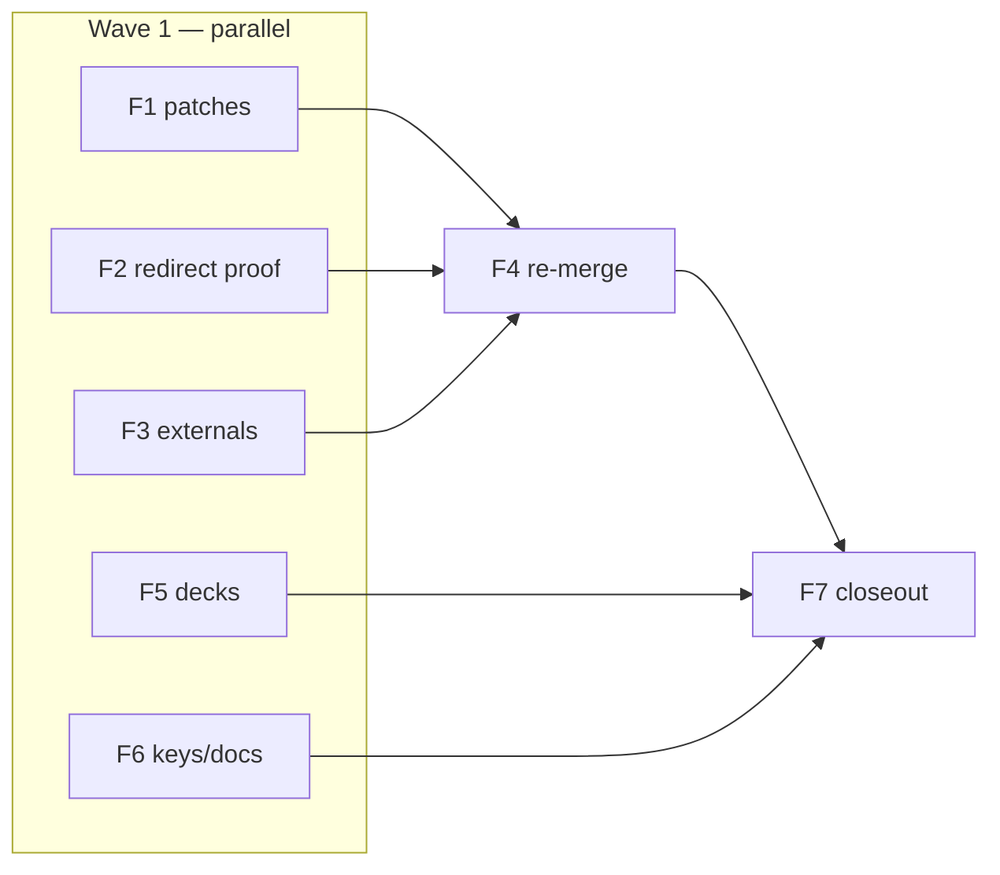

# Full-Graph Verification — 7-Agent **Final Cleanup** Wave (F1–F7)

**Status:** PLAN (ready to execute)  
**Date:** 2026-06-06  
**Database:** `mit-bestand`  
**Prior campaigns:** Q1–Q5 quality pass · P6-01…P6-06 post-quality pass  
**Canonical ledger (pre-final):** `VERIFICATION_LEDGER_ELEMENT.csv` — **17,327 rows** · **89.27% PROVEN**  
**Live graph (read-cypher 2026-06-06):** **2,264 nodes / 15,063 rels** → **17,327 elements**

---

## 0. Why this wave exists

P6-06 closed **structural** element coverage (one row per live `elementId`) but left four attestation gaps:

1. **P6-03 `rau` ↔ `rau_architects` merge** — patch dry-run only; survivor node still live.
2. **19 Q01/Q02 merge-redirect relationships** — P6-05 flagged as uncovered in `v2`; P6-06 **synthesized** them as `P6-new-rel-*` rows with `basis_type=logic`, **empty `proof_quote`**, `fetched=false` (Evidence Gate violation dressed as PROVEN).
3. **P6-04 Scope B residuals** — **26** items remain `UNVERIFIABLE` after fixable pass (18 `Akteur` nodes + 8 Tracimat `ERFORDERT_NACHWEIS` rels) plus **1** open `PARTIAL` `VERBUNDEN_MIT_AKTEUR` (harvestmap → `peter_kneidinger`, excluded from P6-02).
4. **Docs drift** — `AGENTS.md` still cites pre-F1 counts; property-key baseline (approved **57/22**) vs live (**81/50**); presentation decks cite **2,304 / 15,457** graph and **78** bubble links.

F4 must re-merge **after** F1–F3; F7 emits the campaign closeout with **0 uncovered** and recomputed PROVEN%.

---

## 1. Definition of Done

A claim is **done** when all of the following hold on the **live** graph after all approved patches:

| # | Criterion |
|---|---|
| **D1** | Every live node has **exactly one** row in `VERIFICATION_LEDGER_ELEMENT.csv` with `coverage_level=element`. |
| **D2** | Every live relationship has **exactly one** such row. |
| **D3** | Coverage diff = **0 uncovered**, **0 stale-only** keys (Agent F7 proof). |
| **D4** | **No** `P6-new-rel-*` / `P6-new-node-*` synthetic rows remain without Evidence Gate compliance (`proof_quote` + correct `basis_type` + `fetched` where external). |
| **D5** | **PROVEN%** recomputed on final ledger; **maximize** upgrades on F2 (19 redirect rels) and F3 (27 residuals) without category-inference. |
| **D6** | Pending graph patches from F1 applied or explicitly rejected with human note; no `dry_run: true` leftovers in `apply_reports/` for this wave. |
| **D7** | `AGENTS.md`, `POST_QUALITY_CAMPAIGN_REPORT.md` superseded by `CAMPAIGN_CLOSEOUT_REPORT.md`; presentation decks match live VMA counts and graph size. |
| **D8** | Approved property-key manifest re-baselined (live **81** node keys / **50** rel keys documented vs approved **57/22**). |
| **D9** | Verifier agents **read-only** on Neo4j during proof; graph mutations only via `_scripts/apply_neo4j_review_patch.py` (dry-run → human `--confirm`). |

**Target Σ elements (post-F1 rau merge):** 2,263 + 15,063 = **17,326** (Δ −1 node vs current live).

---

## 2. Gap inventory (live counts)

Computed 2026-06-06 via `read-cypher` on `mit-bestand` cross-walked against `VERIFICATION_LEDGER_ELEMENT.csv` and P6 reports.

### 2.1 Headline

| Surface | Live (now) | Post-F1 (expected) | Ledger rows (canonical) | Gap |
|---|---:|---:|---:|---|
| **Nodes** | **2,264** | **2,263** | 2,264 covered | **1** pending delete (`rau_architects`) |
| **Relationships** | **15,063** | **15,063** | 15,063 covered | **0** count gap |
| **Σ elements** | **17,327** | **17,326** | 17,327 | **0** uncovered¹ · **~14** stale keys² |

¹ P6-06 synthesized rows for all live elements; P6-05 `v2` uncovered count (19 rels) is **closed synthetically**, not attested.  
² **14** ledger rows reference `rau_architects` (node + incident rels) — prune after F1 merge.

### 2.2 Verdict residuals (canonical ledger, 17,327 rows)

| Verdict | Count | Share | Final-wave owner |
|---|---:|---:|---|
| **PROVEN** | 15,468 | 89.3% | F2/F3 upgrade targets |
| **MISSING_EVIDENCE** | 867 | 5.0% | out of scope (tier-C / escalated) |
| **PARTIAL** | 812 | 4.7% | F3 (−1 harvestmap VMA) |
| **UNVERIFIABLE** | 124 | 0.7% | F3 (26 fixable subset) |
| **SCHEMA_VIOLATION** | 51 | 0.3% | F1 (post-merge hygiene) |
| **CONTRADICTION** | 5 | 0.0% | ESCALATE_HUMAN |

### 2.3 P6-new synthetic rows (Evidence Gate debt)

| Class | Count | Issue | Owner |
|---|---:|---|---|
| `P6-new-rel-*` redirect survivors | **19** | `logic` basis, empty `proof_quote`, `fetched=false`, verdict `PROVEN` | **F2** |
| `P6-new-*` Q03 additions | **17** | 5 nodes + 12 `ERFUELLT_NACHWEIS` (may inherit prior EP-09 proof) | F4 spot-check |
| **Σ P6-new** | **36** | per `ELEMENT_COVERAGE_PROOF.md` §4 | F2 + F4 |

### 2.4 Pending graph patches

| Patch | Ops | Status | Impact |
|---|---:|---|---|
| `patches/post_quality_p06_03.patch.jsonl` | **1** `merge_node` (`rau_architects` → `rau`) | **dry-run only** | −1 node; 4 rel redirects |
| All other P6 / Q patches | — | applied | — |

Optional F1 follow-up (no new patch unless F1 audit finds regression): `re_store_harvestmap_vienna` → `peter_kneidinger` `VERBUNDEN_MIT_AKTEUR` still **unsourced** on graph (`evidence_url` null) — ledger `EP09-r-0040` = `PARTIAL`.

### 2.5 Property-key drift (live vs approved)

| Surface | Approved (2026-06-05 cleanup) | Live (`mit-bestand`) | Δ |
|---|---:|---:|---|
| Node property keys | **57** | **81** | **+24** |
| Rel property keys | **22** | **50** | **+28** |

Notable live-only rel keys (sample): `dedup_run`, `dedupe_key`, `connection_kind`, `evidence_excerpt`, `integration_layer`, `basis_project_edge_id`, …  
Notable live-only node keys (sample): `metadata_sidecar_key`, `review_status`, `source_scope`, `geo_import_run`, …

### 2.6 Presentation / cross-bubble doc drift

| Doc | Stale claim | Live truth (2026-06-06) |
|---|---|---|
| `PRESENTATION_REUSE_SYNTHESIS.md` | “78 evidence-backed links”, graph from 15-agent era | **132** VMA with `review_run`; **114** with `evidence_confidence='belegt'` |
| `PRESENTATION_REUSE_NETWORKS.md` | Pre-remediation counts | 2,264 / 15,063 |
| `AGENTS.md` §Aktueller Stand | 2,264 / 15,063 / 89.27% | update post-F7 |

---

## 3. Evidence Gate (unchanged)

Identical protocol to [`VERIFICATION_PLAN_15_AGENTS.md`](VERIFICATION_PLAN_15_AGENTS.md) §3 and [`AGENT_PROMPT_TEMPLATE.md`](AGENT_PROMPT_TEMPLATE.md):

- **PROVEN** / **PARTIAL** ⇒ non-empty verbatim `proof_quote`; external ⇒ `fetched=true`.
- **Regulation class** (`ERFORDERT_NACHWEIS`, `TRIGGERS_REGULIERUNGSFRAGE`): cite live `source_url` + `source_quote` on edge; re-fetch only if F2 flags regression.
- **Actor / VMA edges**: both endpoints on page or curated listing; no sector/country inference.
- **Synthetic inherit PROVEN** (`basis_type=logic` + empty quote) ⇒ **must be re-adjudicated** (F2).

---

## 4. The 7-agent fleet

> **MECE rule:** F1–F3 own disjoint work items. F4 merges. F5–F6 are doc/schema sync. F7 proves 100% coverage.  
> Row count in each agent ledger **must equal** scope `count` target.

### Summary table

| agent_id | scope name | nodes | rels | **Σ items** | ledger | report |
|---|---|---:|---:|---:|---|---|
| **F1** | Pending graph patches | 1 merge | 0 patch ops | **1** patch + audit | `ledger/final_cleanup_f01.csv` | `reports/final_cleanup_f01.md` |
| **F2** | Merge-redirect rel re-proof | 0 | **19** | **19** | `ledger/final_cleanup_f02.csv` | `reports/final_cleanup_f02.md` |
| **F3** | UNVERIFIABLE + PARTIAL externals | **18** | **9** | **27** | `ledger/final_cleanup_f03.csv` | `reports/final_cleanup_f03.md` |
| **F4** | Ledger re-merge | — | — | **17,326** check | `VERIFICATION_LEDGER_ELEMENT.csv` | `reports/final_cleanup_f04.md` |
| **F5** | Presentation + cross-bubble sync | — | — | **2 decks** | `ledger/final_cleanup_f05.csv` | `reports/final_cleanup_f05.md` |
| **F6** | AGENTS.md + property re-baseline | — | — | **131** keys | `ledger/final_cleanup_f06.csv` | `reports/final_cleanup_f06.md` |
| **F7** | Final aggregator + closeout | — | — | **17,326** proof | `VERIFICATION_LEDGER_ELEMENT.csv` | `FINAL_COVERAGE_PROOF.md`, `CAMPAIGN_CLOSEOUT_REPORT.md` |

---

### Agent F1 — Pending graph patches (rau merge + dry-run audit)

- **Count target:** **1** `merge_node` op (+ audit of all `dry_run: true` apply reports in this review folder).
- **SCOPE_CYPHER (pre-apply verification):**

```cypher
MATCH (n:Akteur {id: 'rau_architects'})
OPTIONAL MATCH (n)-[r]-()
RETURN n.id AS doomed_id, labels(n) AS labels,
       count(r) AS incident_rels,
       n.primary_source_url AS url
```

```cypher
MATCH (survivor:Akteur {id: 'rau'}), (dup:Akteur {id: 'rau_architects'})
RETURN survivor.id, dup.id,
       survivor.primary_source_url AS survivor_url,
       dup.primary_source_url AS dup_url
```

- **Patch (human gate):**

```bash
python _scripts/apply_neo4j_review_patch.py --patch _neo4j/review/2026-06-06_full_graph_verification/patches/post_quality_p06_03.patch.jsonl
python _scripts/apply_neo4j_review_patch.py --patch _neo4j/review/2026-06-06_full_graph_verification/patches/post_quality_p06_03.patch.jsonl --confirm "APPLY post_quality_p06_03.patch.jsonl TO mit-bestand"
```

- **Ledger paths:** `ledger/final_cleanup_f01.csv`, `reports/final_cleanup_f01.md`
- **Special checks:**
  - Confirm **only** `post_quality_p06_03.patch.apply_report.json` has `"dry_run": true` among P6 patches.
  - Post-apply live counts: **2,263** nodes / **15,063** rels.
  - Export `elementId` list for `rau_architects` incident rels → F4 prune list (**~14** ledger rows).
  - `rau` vs `thomas_rau` remain **distinct** (firm vs person).
  - Do **not** auto-merge `madaster↔rau` pairs (REMEDIATION_PLAN escalated).

---

### Agent F2 — Merge-redirect relationships (element re-proof)

- **Count target:** **19** relationships (Q01 vocab-stub redirects + Q02 depot redirect survivors).
- **SCOPE_CYPHER:**

```cypher
UNWIND [
  ['bw_cleveland_steel_and_tubes_stock','HAT_BAUOBJEKTROLLE','bor_donorobjekt'],
  ['bw_cleveland_steel_and_tubes_stock','LIEGT_IN_STADT','stadt_london'],
  ['bw_cleveland_steel_and_tubes_stock','LIEGT_IN_LAND','land_vereinigtes_koenigreich'],
  ['bg_stahlbeton_mehrere_groeditz_wbs70_precast_panels','AUS_SPENDER','bw_school_type_dresden_donor'],
  ['bg_stahl_traeger_timber_square','AUS_SPENDER','bw_cleveland_steel_and_tubes_stock'],
  ['bt_decke','ERFORDERT_NACHWEIS','nf_standsicherheitsnachweis'],
  ['bt_decke','ERFORDERT_NACHWEIS','nf_materialpruefung'],
  ['bt_decke','ERFORDERT_NACHWEIS','nf_produktstatus_und_leistungserklaerung'],
  ['bt_decke','TRIGGERS_REGULIERUNGSFRAGE','rf_bauproduktstatus_frage'],
  ['bt_decke','TRIGGERS_REGULIERUNGSFRAGE','rf_tragwerkssicherheit_frage'],
  ['bt_fassade','ERFORDERT_NACHWEIS','nf_materialpruefung'],
  ['bt_fassade','TRIGGERS_REGULIERUNGSFRAGE','rf_tragwerkssicherheit_frage'],
  ['bt_fenster','ERFORDERT_NACHWEIS','nf_materialpruefung'],
  ['bt_fenster','ERFORDERT_NACHWEIS','nf_sicherheitsglas_info'],
  ['bt_fenster','ERFORDERT_NACHWEIS','nf_absturzsicherung'],
  ['bt_fenster','TRIGGERS_REGULIERUNGSFRAGE','rf_tragwerkssicherheit_frage'],
  ['mat_glas','ERFORDERT_NACHWEIS','nf_absturzsicherung'],
  ['mat_glas','TRIGGERS_REGULIERUNGSFRAGE','rf_tragwerkssicherheit_frage'],
  ['p_timber_square_london','HAT_BAUWERK','bw_cleveland_steel_and_tubes_stock']
] AS triple
MATCH (a {id: triple[0]})-[r]->(b {id: triple[2]})
WHERE type(r) = triple[1]
RETURN elementId(r) AS element_id, a.id AS from_id, type(r) AS rel_type, b.id AS to_id,
       labels(a) AS from_labels, labels(b) AS to_labels,
       r.source_url AS source_url, r.source_quote AS source_quote,
       r.evidence_url AS evidence_url, properties(r) AS props
ORDER BY from_id, rel_type, to_id
```

- **Ledger paths:** `ledger/final_cleanup_f02.csv`, `reports/final_cleanup_f02.md`
- **Special checks:**
  - Replace inherited `P6-new-rel-*` synthetic PROVEN — each row must cite **live** `source_url`/`source_quote` (regulation) or dossier+contract (geo/`AUS_SPENDER`/`HAT_BAUWERK`).
  - `prior_claim_id` = matching `P6-new-rel-*` or pre-merge EP row when traceable.
  - **No** `basis_type=logic` with empty `proof_quote` in output.
  - Target: **≥17/19** PROVEN (regulation class); remainder `PARTIAL`/`RESOURCE` only with quote.

---

### Agent F3 — UNVERIFIABLE + PARTIAL external residuals

- **Count target:** **27** items = **18** `Akteur` nodes + **8** Tracimat rels + **1** PARTIAL VMA.
- **SCOPE_CYPHER (nodes — P6-04 Scope B UNVERIFIABLE actors):**

```cypher
UNWIND [
  'andreas_sonderegger','anja_rosen','annabelle_von_reutern','annette_hillebrandt',
  'barrault_pressacco','catherine_de_wolf','christian_schoeningh','eva_stricker',
  'fabian_sauser','fabio_gramazio','frederic_denise','georg_hubmann','guido_brandi',
  'gxn','hans_hammink','hugo_topalov','jan_haerens','julia_turpin'
] AS aid
MATCH (n:Akteur {id: aid})
RETURN elementId(n) AS element_id, n.id AS id, labels(n) AS labels,
       n.primary_source_url AS primary_source_url, n.source_urls AS source_urls
ORDER BY id
```

- **SCOPE_CYPHER (rels — Tracimat UNVERIFIABLE + harvestmap PARTIAL VMA):**

```cypher
UNWIND [
  ['p_europa_building_brussels','nf_bauteilidentifikation'],
  ['p_institut_de_botanique_ulg_liege','nf_bauteilidentifikation'],
  ['p_lo_reninge_town_hall_facade','nf_bauteilidentifikation'],
  ['p_multi_brussels_reuse_in_multi','nf_bauteilidentifikation'],
  ['p_musee_de_folklore_mouscron','nf_bauteilidentifikation'],
  ['p_recypark_demets_anderlecht','nf_bauteilidentifikation'],
  ['p_verbiest_karreveld_brussels','nf_bauteilidentifikation'],
  ['p_zinneke_feder_masui4ever_brussels','nf_bauteilidentifikation']
] AS pair
MATCH (a:Projekt {id: pair[0]})-[r:ERFORDERT_NACHWEIS]->(b {id: pair[1]})
RETURN elementId(r) AS element_id, a.id AS from_id, type(r) AS rel_type, b.id AS to_id,
       r.source_url AS source_url, r.source_quote AS source_quote
UNION ALL
MATCH (a:Akteur {id: 're_store_harvestmap_vienna'})-[r:VERBUNDEN_MIT_AKTEUR]->(b:Akteur {id: 'peter_kneidinger'})
RETURN elementId(r) AS element_id, a.id AS from_id, type(r) AS rel_type, b.id AS to_id,
       r.evidence_url AS source_url, r.evidence_quote AS source_quote
```

- **Ledger paths:** `ledger/final_cleanup_f03.csv`, `reports/final_cleanup_f03.md`
- **Special checks:**
  - `prior_claim_id` from `ledger/post_quality_p06_04.csv` (`P604-*` rows).
  - VMA `EP09-r-0040`: try `restore.or.at/impressum` + `morgenbau.at/34-bauteile-ernten-statt-entsorgen`; if strict two-endpoint gate passes → PROVEN + optional F1-style `set_rel_properties` patch proposal (not applied by agent).
  - Tracimat cluster: re-fetch VITO article or alternate Tracimat source; if blocked → `UNVERIFIABLE` + `ESCALATE_HUMAN` (no fake PROVEN).
  - Actor nodes: first-party `source_urls` on graph; paywalled/login → `UNVERIFIABLE` acceptable with `KEEP`.
  - Do **not** re-process the 24 actors already upgraded PROVEN in P6-04.

---

### Agent F4 — Ledger re-merge (canonical)

- **Count target:** **17,326** element rows (= live post-F1 nodes + rels).
- **Inputs (override priority high → low):**
  1. `ledger/final_cleanup_f03.csv`
  2. `ledger/final_cleanup_f02.csv`
  3. `ledger/final_cleanup_f01.csv`
  4. `ledger/post_quality_p06_05.csv` (prune/add methodology)
  5. `ledger/post_quality_p06_04.csv` … `post_quality_p06_01.csv`
  6. Baseline `VERIFICATION_LEDGER_ELEMENT.csv`

- **SCOPE_CYPHER (coverage diff):**

```cypher
MATCH (n) WITH collect(elementId(n)) AS live_nodes
MATCH ()-[r]->() WITH live_nodes, collect(elementId(r)) AS live_rels
RETURN size(live_nodes) AS nodes, size(live_rels) AS rels,
       size(live_nodes) + size(live_rels) AS elements
```

- **Ledger paths:** promote merged output → `VERIFICATION_LEDGER_ELEMENT.csv`; log → `ledger/final_cleanup_f04.csv`, `reports/final_cleanup_f04.md`
- **Special checks:**
  - Prune all `rau_architects` keys + merged-away `elementId`s from F1.
  - Drop duplicate `P6-new-rel-*` after F2 override on same `graph_element_id`.
  - Reconcile P6-05 `v2` prune stats (`305` removed / `17` added) with F1 post-merge export.
  - No `coverage_level=type` rows.
  - Emit prune/synthesize JSON tallies for F7.

---

### Agent F5 — Presentation deck + cross-bubble doc sync

- **Count target:** **2** markdown decks + **1** evidence audit cross-ref.
- **SCOPE_CYPHER (live VMA stats for deck numbers):**

```cypher
MATCH ()-[r:VERBUNDEN_MIT_AKTEUR]-()
RETURN count(r) AS vma_undirected,
       count(CASE WHEN r.review_run IS NOT NULL THEN 1 END) AS vma_tagged,
       count(CASE WHEN r.evidence_confidence = 'belegt' THEN 1 END) AS vma_belegt
```

```cypher
MATCH (n) WITH count(n) AS nodes
MATCH ()-[r]->() WITH nodes, count(r) AS rels
RETURN nodes, rels, nodes + rels AS elements
```

- **Files to sync:**
  - `_neo4j/review/2026-06-06_cross_bubble_extension/PRESENTATION_REUSE_SYNTHESIS.md`
  - `_neo4j/review/2026-06-06_cross_bubble_extension/PRESENTATION_REUSE_NETWORKS.md`
  - Cross-check against `EVIDENCE_AUDIT.md`, `PRESENTATION_REUSE_SYNTHESIS.md` (existing)

- **Ledger paths:** `ledger/final_cleanup_f05.csv` (one row per doc section updated), `reports/final_cleanup_f05.md`
- **Special checks:**
  - Replace “78 links” with live tagged VMA count (**132** tagged / **114** belegt as of planning).
  - Update graph headline to post-F1 **2,263 / 15,063** (or final F7 counts).
  - Cypher examples: prefer `evidence_confidence = 'belegt'` over `review_run IS NOT NULL` where showing proven backbone.
  - No graph mutation.

---

### Agent F6 — AGENTS.md + approved property-key re-baseline

- **Count target:** **131** property keys (**81** node + **50** rel) audited against approved manifest.
- **SCOPE_CYPHER:**

```cypher
MATCH (n) UNWIND keys(n) AS k RETURN DISTINCT k AS key, 'node' AS scope ORDER BY key
```

```cypher
MATCH ()-[r]->() UNWIND keys(r) AS k RETURN DISTINCT k AS key, 'rel' AS scope ORDER BY key
```

- **Reference manifest:** `_neo4j/review/2026-06-05_post_migration_property_cleanup/CLEANUP_APPLY_SUMMARY.md` (approved **57/22**).
- **Ledger paths:** `ledger/final_cleanup_f06.csv` (one row per key: `KEEP` | `DEPRECATE` | `DOCUMENT_DRIFT`), `reports/final_cleanup_f06.md`
- **Special checks:**
  - Update `AGENTS.md` §Aktueller Stand with F7-final numbers (not F6 guess).
  - Classify drift: **intentional post-P6** (`connection_kind`, `dedup_run`, …) vs **legacy** (`review_status`, `source_scope`, …).
  - Do **not** run property cleanup patches — documentation only.
  - Note Agent-14 historical drift (83/51) resolved to 81/50 live.

---

### Agent F7 — Final aggregator + campaign closeout

- **Count target:** **17,326** elements · **0** uncovered · **0** stale-only.
- **Inputs:** F4-merged `VERIFICATION_LEDGER_ELEMENT.csv` + live `elementId` export (`_f7_work/graph_nodes.json`, `graph_rels.json`).
- **SCOPE_CYPHER:** same as F4 coverage diff +:

```cypher
MATCH ()-[r]->()
WHERE type(r) = 'VERBUNDEN_MIT_AKTEUR' AND r.evidence_url IS NOT NULL
RETURN count(r) AS vma_with_url
```

- **Outputs:**
  - `FINAL_COVERAGE_PROOF.md` (replaces `ELEMENT_COVERAGE_PROOF.md` for attestation)
  - `CAMPAIGN_CLOSEOUT_REPORT.md` (replaces `POST_QUALITY_CAMPAIGN_REPORT.md`)
  - `reports/final_cleanup_f07.md`
- **Special checks:**
  - Recompute PROVEN% on final ledger; delta vs 89.27% baseline.
  - Verdict histogram must match row count.
  - Confirm no rows with empty `proof_quote` AND verdict ∈ {PROVEN, PARTIAL}.
  - **Read-only** on Neo4j (no patch apply).

---

## 5. Wave order



| Phase | Agents | Mode | Gate |
|---|---|---|---|
| **Wave 1** | **F1**, **F2**, **F3**, **F5**, **F6** | parallel | F1 requires human `--confirm` before F4 |
| **Wave 2** | **F4** | sequential | after F1–F3 complete |
| **Wave 3** | **F7** | sequential | after F4; F5/F6 must be merged into closeout narrative |

**Critical path:** F1 → F4 → F7. F2/F3 can run during F1 dry-run review. F5/F6 should use **post-F1** counts (re-run headline cypher if F1 applied mid-wave).

---

## 6. Task-tool prompt snippets

> Launch with `Task` tool (`subagent_type: generalPurpose`, `run_in_background: true`).  
> Agents are **read-only** on Neo4j except F1 (patch apply via shell + gated script only).

### F1 prompt

```
You are Final Cleanup Agent F1. Read _neo4j/review/2026-06-06_full_graph_verification/VERIFICATION_PLAN_7_AGENTS_FINAL_CLEANUP.md Agent F1.

TASK: Apply pending post_quality_p06_03 rau merge patch (dry-run first, then --confirm). Audit all apply_reports/*.json for any other dry_run:true P6 leftovers.

READ-ONLY Neo4j except patch script. Verify pre: rau_architects exists (1 node, 4 incident rels). Post: 2263 nodes / 15063 rels.

Export elementId prune list for rau_architects (~14 ledger rows). Write ledger/final_cleanup_f01.csv (1+ audit rows) and reports/final_cleanup_f01.md.

Do NOT merge madaster↔rau. Do NOT touch harvestmap VMA.
```

### F2 prompt

```
You are Final Cleanup Agent F2. Read VERIFICATION_PLAN_7_AGENTS_FINAL_CLEANUP.md Agent F2 + AGENT_PROMPT_TEMPLATE.md Evidence Gate.

READ-ONLY Neo4j (read-cypher + WebFetch). Re-prove exactly 19 merge-redirect relationships from SCOPE_CYPHER. Replace P6-new-rel-* synthetic PROVEN rows.

Each row needs real proof_quote + correct basis_type. Regulation edges: use live source_url/source_quote. Geo/AUS_SPENDER: dossier+contract.

OUTPUT: ledger/final_cleanup_f02.csv (19 rows), reports/final_cleanup_f02.md. Row count MUST equal 19.
```

### F3 prompt

```
You are Final Cleanup Agent F3. Read VERIFICATION_PLAN_7_AGENTS_FINAL_CLEANUP.md Agent F3 + post_quality_p06_04.md Scope B.

READ-ONLY Neo4j. Process exactly 27 items: 18 UNVERIFIABLE Akteur nodes + 8 Tracimat ERFORDERT_NACHWEIS rels + 1 PARTIAL VMA (re_store_harvestmap_vienna → peter_kneidinger). Use both SCOPE_CYPHER blocks.

prior_claim_id from P604-* in post_quality_p06_04.csv. Strict actor two-endpoint gate. Tracimat: re-fetch or UNVERIFIABLE+ESCALATE_HUMAN.

OUTPUT: ledger/final_cleanup_f03.csv (27 rows), reports/final_cleanup_f03.md.
```

### F4 prompt

```
You are Final Cleanup Agent F4 (ledger merge). Read VERIFICATION_PLAN_7_AGENTS_FINAL_CLEANUP.md Agent F4.

READ-ONLY Neo4j. Merge final_cleanup_f01..f03 ledgers into VERIFICATION_LEDGER_ELEMENT.csv using override priority in plan §4 F4. Prune rau_architects stale keys from F1 export.

Target: 17326 element rows = live post-F1 graph. Write ledger/final_cleanup_f04.csv (merge log), reports/final_cleanup_f04.md with prune/synthesize tallies. No graph mutation.
```

### F5 prompt

```
You are Final Cleanup Agent F5. Read VERIFICATION_PLAN_7_AGENTS_FINAL_CLEANUP.md Agent F5.

READ-ONLY Neo4j. Update PRESENTATION_REUSE_SYNTHESIS.md and PRESENTATION_REUSE_NETWORKS.md with live VMA counts (132 tagged / 114 belegt) and graph size (2263/15063 post-F1 or latest read-cypher).

Fix stale "78 links" and pre-remediation node/rel counts. Update Cypher examples per plan. Write ledger/final_cleanup_f05.csv + reports/final_cleanup_f05.md. No graph mutation.
```

### F6 prompt

```
You are Final Cleanup Agent F6. Read VERIFICATION_PLAN_7_AGENTS_FINAL_CLEANUP.md Agent F6 + CLEANUP_APPLY_SUMMARY.md.

READ-ONLY Neo4j. Export live property keys (81 node / 50 rel). Compare to approved 57/22. Classify each key KEEP/DOCUMENT_DRIFT/DEPRECATE in ledger/final_cleanup_f06.csv (131 rows).

Draft AGENTS.md §Aktueller Stand updates (placeholder counts until F7). Write reports/final_cleanup_f06.md. No property cleanup patches.
```

### F7 prompt

```
You are Final Cleanup Agent F7 (aggregator). Read VERIFICATION_PLAN_7_AGENTS_FINAL_CLEANUP.md Agent F7 + ELEMENT_COVERAGE_PROOF.md methodology.

READ-ONLY Neo4j. Export live elementIds. Cross-walk F4-merged VERIFICATION_LEDGER_ELEMENT.csv. Prove 0 uncovered / 0 stale-only.

Emit FINAL_COVERAGE_PROOF.md + CAMPAIGN_CLOSEOUT_REPORT.md + reports/final_cleanup_f07.md. Recompute PROVEN%. Flag any PROVEN/PARTIAL with empty proof_quote.

No graph mutation. Supersede POST_QUALITY_CAMPAIGN_REPORT.md for attestation.
```

---

## 7. Expected outcomes (success metrics)

| Metric | Baseline (P6-06) | Target (post-F7) |
|---|---:|---:|
| Live nodes | 2,264 | **2,263** |
| Live rels | 15,063 | **15,063** |
| Element rows | 17,327 | **17,326** |
| Uncovered elements | 0 (synthetic) | **0** (attested) |
| Stale ledger keys | ~14 (`rau_architects`) | **0** |
| PROVEN | 15,468 (89.27%) | **≥15,500 (≥89.5%)**¹ |
| P6-new empty-quote PROVEN | 19 | **0** |
| F3 residuals open | 27 | **≤10** (rest PROVEN or justified UNVERIFIABLE) |

¹ Conservative target: +19 F2 upgrades + up to 8 F3 actor upgrades − merges/prunes.

---

*Planning phase complete — no graph mutations in this document. Execute Wave 1 after human review.*
