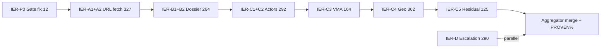

# Internet Evidence Recovery Plan (IER Wave)

**Status:** PLAN (read-only — no graph mutations)  
**Date:** 2026-06-06  
**Database:** `mit-bestand`  
**Canonical ledger:** `VERIFICATION_LEDGER_ELEMENT.csv` — **17,323** elements · **89.47% PROVEN** (15,499 PROVEN / 1,824 non-PROVEN)  
**Inputs:** [`PROVENANCE_ROOT_CAUSE_REPORT.md`](PROVENANCE_ROOT_CAUSE_REPORT.md) · G01–G09 shards · [`AGENT_PROMPT_TEMPLATE.md`](AGENT_PROMPT_TEMPLATE.md) Evidence Gate · P0 recommendations  
**Live graph (read-cypher 2026-06-06):** **2,263 nodes / 15,060 rels**

---

## 0. Mission

Systematically use **WebFetch** / **WebSearch** (and dossier file reads where HTTP URLs are recoverable) to upgrade **MISSING_EVIDENCE**, **PARTIAL**, and **UNVERIFIABLE** ledger rows to **PROVEN** where the strict Evidence Gate allows — and to route everything else to **DELETE**, **RELABEL**, or **ESCALATE_HUMAN**.

**Out of scope for this wave:** graph writes (agents propose ledger rows + patch JSONL only); category-inference mesh; SCHEMA_VIOLATION programme vocabulary (separate structural cleanup).

**P0 preflight (not in non-PROVEN count):** **12** rows are `verdict=PROVEN` but violate the gate (`proof_quote` empty, all `P6-new-rel-*` `ERFUELLT_NACHWEIS`). These must be re-adjudicated first per root-cause P0 §6.1.

---

## 1. Scope inventory by tractability tier

Tiers classify **internet-recoverability** of the **1,824 non-PROVEN** element-ledger rows (+ **12** P0 gate violations). Assignment rules are deterministic (ledger `basis_type`, `basis_ref`, `verdict`, `rel_type_or_label`, `notes`, root-cause bucket).

| Tier | Definition | Recovery path | Rows | Share of non-PROVEN |
|---|---|---:|---:|
| **A** | **First-party URL already on ledger** — `basis_ref` is `http(s)://…`, or `basis_type ∈ {web, candidate}`; graph may already hold `evidence_url` / `source_urls` but quote failed gate | `WebFetch` existing URL → extract verbatim `proof_quote`; one fetch may cover many rows | **327** | 17.9% |
| **B** | **Dossier-recoverable** — `basis_type=dossier`, enrichment JSON, or `akteur_typ_projekt_geo.json` with placeholder `processed`/`archive` tokens; real URL often in inbox markdown or `*.enrichment.json` | Read dossier/JSON → resolve HTTP URL → `WebFetch` → quote | **264** | 14.5% |
| **C** | **Needs search** — no usable URL on ledger; never-sourced actors, unsourced VMA, geo without address, software/participation ME | `WebSearch` (official site → project page → registry → archive.org) → `WebFetch` winner → quote | **943** | 51.7% |
| **D** | **Likely unfixable via internet** — SCHEMA_VIOLATION, CONTRADICTION, Q4 person/org URL conflation (UNVERIFIABLE), aggregate donor stubs, inference `BETEILIGT_AN`, `prog_*` / `TEIL_VON_PROGRAMM` | DELETE · RELABEL · DEPRECATE_NODE · ESCALATE_HUMAN (no PROVEN target) | **290** | 15.9% |
| **Σ** | | | **1,824** | 100% |

### 1.1 Tier A — cluster detail (327)

| Cluster | Rows | Typical verdict | Notes |
|---|---:|---|---|
| `:Akteur` nodes (URL on ledger, quote missing) | 165 | ME / PARTIAL | R07/06b deferred re-fetch; homepage often enough for **entity** gate |
| `BETEILIGT_AN` (URL present, weak quote) | 38 | PARTIAL | Project pages naming actor |
| `TRIGGERS_REGULIERUNGSFRAGE` / `ERFORDERT_NACHWEIS` | 53 | PARTIAL | Regulation `source_url` re-fetch |
| `HAT_SCHADSTOFFRISIKO` / `ERFORDERT_SCHADSTOFFPRUEFUNG` | 30 | PARTIAL | Schadstoff compendium pages |
| `VERBUNDEN_MIT_AKTEUR` (URL present) | 19 | PARTIAL | Must name **both** endpoints |
| `HAT_BAUTEILTYP` / `NUTZT_MATERIAL` (catalogue residual) | 13 | PARTIAL | Ledger residual; graph has wider quote gap (see §1.5) |
| Other (software, `BETRIEBEN_VON`, …) | 9 | ME / PARTIAL | |

### 1.2 Tier B — cluster detail (264)

| Cluster | Rows | Dossier anchor |
|---|---:|---|
| `BETEILIGT_AN` placeholder geo tokens | 223 | `_neo4j/review/2026-06-06_project_bg_geo_extract/akteur_typ_projekt_geo.json` + matching `intake/inbox/**/*.md` |
| `HAT_BAUWERK` partial donor chains | 21 | `reuse_geo_graph.json`, `donor_bauwerke_addresses.json` |
| `:Projekt` nodes (ME) | 20 | Project dossiers under `intake/inbox/` |

### 1.3 Tier C — cluster detail (943)

| Cluster | Rows | Search strategy |
|---|---:|---|
| `LIEGT_IN_LAND` (no address on node) | 335 | Official imprint / contact page with **country** + org name; registry (Handelsregister, KvK, Companies House) |
| `:Akteur` never-sourced (no URL) | 292 | `"{name}" site:.de|.fr|.nl|.ch` → about/imprint |
| `VERBUNDEN_MIT_AKTEUR` (no `evidence_url`) | 164 | Pairwise: operator imprint, curated partner list, press release naming both |
| `BETEILIGT_AN` (ME, not placeholder) | 50 | Project consortium / funder pages |
| `NUTZT_SOFTWARE` | 40 | Software vendor site naming customer, or customer IT page |
| `LIEGT_IN_STADT` | 27 | Address block with city on official site |
| Residual (Software nodes, `IN_EMPFANGSOBJEKT`, …) | 35 | Case-by-case |

### 1.4 Tier D — cluster detail (290) — escalation, not recovery

| Cluster | Rows | Default action |
|---|---:|---|
| `:Bauwerk` donor stubs (`bw_*_donor`) | 105 | DELETE or merge to named building when dossier names one |
| `:Akteur` UNVERIFIABLE (Q4 affiliation URLs) | 98 | RELABEL URL to VMA edge or ESCALATE_HUMAN |
| `TEIL_VON_PROGRAMM` + `prog_*` | 34 | DEPRECATE_NODE / DELETE (G05) |
| Inference `BETEILIGT_AN` (`abgeleitet` / shared-material) | 63 | DELETE or RELABEL (G03 P2) |
| SCHEMA_VIOLATION | 33 | DEPRECATE_NODE |
| `LIEGT_IN_STADT` CONTRADICTION | 5 | ESCALATE_HUMAN |
| Aggregate Materialdepot / miscast | 16 | DELETE |
| Other UNVERIFIABLE / VMA inference | 19 | ESCALATE_HUMAN / DELETE |

### 1.5 Ledger vs graph note (catalogue)

Element ledger shows **13** catalogue `PARTIAL` (`HAT_BAUTEILTYP` / `NUTZT_MATERIAL`); live graph has **1,262** such rels with empty `evidence_quote`. **IER-A2** covers the **13** ledger residuals; a follow-on **catalogue quote backfill** campaign (not this wave's Done criterion) would address the graph-wide gap via `bauteilboerse_network_2026-06-01_project_part_actor_edges.json`.

### 1.6 Live graph cross-check (read-cypher 2026-06-06)

| Signal | Live count | Ledger non-PROVEN overlap |
|---|---:|---|
| `:Akteur` with `source_urls IS NULL` | 440 | 435 ME actors + tier-C/D split |
| `VERBUNDEN_MIT_AKTEUR` with `evidence_url IS NULL` | 182 | 182 ME VMA |
| `BETEILIGT_AN` weak/null/placeholder `evidence_url` | 535 | 260 PARTIAL + 51 ME (tier B+C) |
| `HAT_BAUTEILTYP`/`NUTZT_MATERIAL` empty `evidence_quote` | 1,262 | 13 PARTIAL in ledger |

---

## 2. Non-PROVEN verdict breakdown (canonical ledger)

| Verdict | Count | Primary tier mapping |
|---|---:|---|
| MISSING_EVIDENCE | 877 | A:152 · B:21 · C:558 · D:146 |
| PARTIAL | 807 | A:175 · B:243 · C:385 · D:4 |
| UNVERIFIABLE | 102 | D:102 |
| SCHEMA_VIOLATION | 33 | D:33 |
| CONTRADICTION | 5 | D:5 |
| **Σ non-PROVEN** | **1,824** | **A+B+C = 1,534** internet targets |

---

## 3. Nine-agent fleet (disjoint scopes)

Each agent owns a **disjoint** subset of `claim_id` / `element_id` rows. No row appears in two shards. Shards are enumerated from `VERIFICATION_LEDGER_ELEMENT.csv` filters + live `read-cypher` validation.

| Agent | Tier | Scope (disjoint) | Rows | Ledger output |
|---|---|---|---:|---|
| **IER-P0** | P0 | `claim_id` matches `P6-new-rel-*` AND `rel_type_or_label=ERFUELLT_NACHWEIS` AND empty `proof_quote` (12 gate violations) | **12** | `ledger/ier_p0.csv` |
| **IER-A1** | A | Non-PROVEN `:Akteur` nodes where `basis_ref` starts with `http` OR `basis_type ∈ {web,candidate}` | **165** | `ledger/ier_a1.csv` |
| **IER-A2** | A | Non-PROVEN **rels** tier A not in other shards: catalogue (13), regulation partials (53), VMA-with-URL (19), schadstoff (30), other URL-backed rels | **162** | `ledger/ier_a2.csv` |
| **IER-B1** | B | `PARTIAL` `BETEILIGT_AN` with dossier basis / placeholder token (`akteur_typ_projekt_geo.json`, `processed`, `archive`, …) | **223** | `ledger/ier_b1.csv` |
| **IER-B2** | B | Tier B remainder: `HAT_BAUWERK` partial (21) + `:Projekt` ME (20) | **41** | `ledger/ier_b2.csv` |
| **IER-C1** | C | `MISSING_EVIDENCE` `:Akteur` with **no** tier-A URL, `element_id` < `m` (lexicographic split) | **174** | `ledger/ier_c1.csv` |
| **IER-C2** | C | `MISSING_EVIDENCE` `:Akteur` with **no** tier-A URL, `element_id` ≥ `m` | **118** | `ledger/ier_c2.csv` |
| **IER-C3** | C | `MISSING_EVIDENCE` `VERBUNDEN_MIT_AKTEUR` (182 live unsourced; shard rows = 164 tier-C + 18 tier-A/D overlap excluded) | **164** | `ledger/ier_c3.csv` |
| **IER-C4** | C | `PARTIAL` `LIEGT_IN_LAND` (335) + `LIEGT_IN_STADT` (27) | **362** | `ledger/ier_c4.csv` |
| **IER-C5** | C | Tier C residual: `NUTZT_SOFTWARE` (40), `BETEILIGT_AN` ME (50), `IN_EMPFANGSOBJEKT` (11), `:Software` ME (6), other ME edges | **125** | `ledger/ier_c5.csv` |

**Not assigned to IER agents (tier D — parallel structural wave):** 290 rows → human-gated DELETE/DEPRECATE patches per G05/G08/G09; documented in `ledger/ier_d_escalation.csv` by aggregator only.

**Disjointness rules**

1. Tier D rows are **excluded** from IER-A…C scopes (agents may cite them in reports but must not spend fetch budget).
2. Tier-A actors (165) are **excluded** from IER-C1/C2.
3. Tier-B `BETEILIGT_AN` (223) are **excluded** from IER-C5's participation ME set.
4. P0 rows are processed once in IER-P0 even though current `verdict=PROVEN`.

---

## 4. Search strategy per tier

### Tier A — URL already known

1. `WebFetch` `basis_ref` (or live `source_urls[0]` / `evidence_url` from `read-cypher`).
2. Retry once on timeout; on 403/429 back off 30s, max 3 attempts per host/hour.
3. On 404: `WebSearch` `site:web.archive.org {url}` OR `"{entity name}" "{endpoint B}" official`.
4. Extract **verbatim** `proof_quote` (≤300 chars):
   - **Node:** sentence naming the entity (legal name or unambiguous trade name).
   - **Rel:** sentence naming **both** endpoints (or one endpoint's curated list of the other).
5. If page supports weaker claim only → `PARTIAL` + `RELABEL`, not PROVEN.

### Tier B — dossier recoverable

1. Open `basis_ref` file (JSON/MD under `_neo4j/review/` or `_neo4j/intake/inbox/`).
2. Resolve `source_url` / `evidence_url` / inline link; reject pipeline tokens (`processed`, `archive`, `processed+web`).
3. If dossier has quote but URL is stale → search official site (tier A flow).
4. If dossier line is verbatim and names claim → may use `basis_type=dossier` with `fetched=false` **only** when contract allows internal proof; external rels still need `fetched=true`.

### Tier C — needs search

Ordered search ladder (stop when gate passes):

| Step | Query pattern | Use when |
|---|---|---|
| 1 | `"{legal name}" official site` / known domain from notes | actors, software |
| 2 | `"{project}" "{actor}" consortium\|partner\|funded` | `BETEILIGT_AN`, VMA |
| 3 | `site:gov.* / site:europa.eu "{programme}"` | EU programmes |
| 4 | Registry: Handelsregister / KvK / INSEE / Companies House | geo / legal seat |
| 5 | `site:web.archive.org "{url or name}"` | dead links |
| 6 | Trade press / university project pages | last resort; downgrade if not first-party |

**Forbidden:** sector directory co-listing, "European reuse marketplace" mesh language, country-similarity pairing (G09 failure mode).

### Tier D — no search spend

Route to DELETE / DEPRECATE / ESCALATE per §6. Optional single fetch only to confirm entity miscast (e.g. private person under org URL).

---

## 5. Evidence Gate (inherited — strict)

From [`AGENT_PROMPT_TEMPLATE.md`](AGENT_PROMPT_TEMPLATE.md) and [`VERIFICATION_PLAN_15_AGENTS.md`](VERIFICATION_PLAN_15_AGENTS.md) §3:

| Rule | Requirement |
|---|---|
| G1 | `PROVEN` or `PARTIAL` ⇒ non-empty verbatim `proof_quote` |
| G2 | External ⇒ `fetched=true` + `http_status` recorded |
| G3 | Relationships ⇒ quote names **both** endpoints (or curated listing rule) |
| G4 | Nodes ⇒ quote names the **entity** |
| G5 | No category / sector / country inference |
| G6 | `fetched=false` ⇒ max verdict `UNVERIFIABLE` / `DEAD_LINK` |
| G7 | Agents **read-only** on Neo4j; proposals only |

**P0 fix (root-cause §6.1):** For each `P6-new-rel-*` `ERFUELLT_NACHWEIS`, fetch live `PruefungNachweis`/`Nachweisforderung` `primary_source_url` + `source_quote`; if quote empty → downgrade to `PARTIAL` until proof found.

---

## 6. Definition of Done · rate limits · DELETE vs ESCALATE vs PROVEN

### 6.1 Definition of Done (IER wave)

| # | Criterion |
|---|---|
| D1 | Every row in §3 scopes has exactly one output row in `ledger/ier_*.csv` |
| D2 | **Disjointness:** no duplicate `element_id` across `ier_*.csv` shards |
| D3 | All tier A/B/C rows re-adjudicated; tier D listed in `ledger/ier_d_escalation.csv` |
| D4 | P0 gate violations resolved (12/12 have quote or downgraded verdict) |
| D5 | Aggregator merges into `VERIFICATION_LEDGER_ELEMENT_v2.csv` with recomputed PROVEN% |
| D6 | Patch JSONL generated for `ADD_SOURCE` / `FIX_PROPERTY` / `DELETE` proposals — **not applied** in planning wave |
| D7 | No `verdict=PROVEN` with empty `proof_quote` in merged ledger |

### 6.2 Rate limits & caching

| Limit | Value |
|---|---|
| Max concurrent `WebFetch` per agent | 3 |
| Backoff on HTTP 429 | 60s exponential, max 5 min |
| Max fetches per registrable domain per hour | 40 |
| URL cache | Shared per agent run: `work/url_fetch_cache.json` keyed by normalized URL |
| `WebSearch` calls per agent | ≤120 (tier C only) |
| Dossier reads | Unlimited (local) |

### 6.3 Decision matrix: PROVEN vs DELETE vs ESCALATE

| Outcome | When | `proposed_action` |
|---|---|---|
| **PROVEN** | Fetched page (or dossier+contract) verbatim supports exact claim; gate G1–G4 pass | `KEEP` or `ADD_SOURCE` / `FIX_PROPERTY` if graph lacks URL/quote |
| **PARTIAL** | Source supports narrower claim (e.g. same country, not same city; org page exists, partnership not stated) | `RELABEL` or keep `PARTIAL` — **not** counted as wave success |
| **DELETE** | UNSUPPORTED after search; inference edge; aggregate stub; category mesh | `DELETE` |
| **ESCALATE_HUMAN** | CONTRADICTION; paywall; person/org URL policy; donor ambiguity needing archival research | `ESCALATE_HUMAN` |
| **RESOURCE** | Dead link but entity likely real; alternate URL found but not yet fetched | `RESOURCE` (aggregator queues re-run) |
| **No change** | Tier D SCHEMA / programme vocab | `DEPRECATE_NODE` / `DELETE` per G05 |

**Never PROVEN:** directory co-listing without curated endorsement, `connection_kind` `*_mesh`/`*_peer`, affiliation URL as person `source_urls` (G04).

---

## 7. Wave order

Execute in order — early waves fund cache hits and fix gate debt before expensive search.



| Wave | Agents | Parallel? | Est. wall time |
|---|---|---|---:|
| **W0** | IER-P0 | solo | 0.5 h |
| **W1** | IER-A1, IER-A2 | yes (2) | 2–3 h |
| **W2** | IER-B1, IER-B2 | yes (2) | 3–4 h |
| **W3** | IER-C1, IER-C2 | yes (2) | 4–6 h |
| **W4** | IER-C3 | solo | 3–4 h |
| **W5** | IER-C4 | solo | 5–8 h |
| **W6** | IER-C5 | solo | 2 h |
| **W⊥** | Tier D escalation (no fetch) | parallel to W1–W6 | 1 h |

---

## 8. Task-tool prompt snippets

Launch template: [`AGENT_PROMPT_TEMPLATE.md`](AGENT_PROMPT_TEMPLATE.md). Replace `{{AGENT_ID}}`, `{{SCOPE_CYPHER}}`, `{{LEDGER_PATH}}`, `{{REPORT_PATH}}`, `{{SPECIAL_CHECKS}}`.

### IER-P0 — Q03 gate violations

```
{{AGENT_ID}} = IER-P0
{{LEDGER_PATH}} = _neo4j/review/2026-06-06_full_graph_verification/ledger/ier_p0.csv
{{REPORT_PATH}} = _neo4j/review/2026-06-06_full_graph_verification/reports/ier_p0_report.md
{{SCOPE_CYPHER}} =
  // From ledger CSV — not graph enumeration
  // claim_id STARTS WITH 'P6-new-rel-' AND rel_type_or_label='ERFUELLT_NACHWEIS'
  MATCH (pn:PruefungNachweis)-[r:ERFUELLT_NACHWEIS]->(nf:Nachweisforderung)
  WHERE r.review_run IS NOT NULL
  RETURN pn, r, nf, pn.primary_source_url AS url, pn.source_quote AS sq
  LIMIT 50
{{SPECIAL_CHECKS}} =
  - Downgrade to PARTIAL if primary_source_url fetch succeeds but quote still empty.
  - Inherit EP-09 proof only when live source_quote verbatim names the NF requirement.
```

### IER-A1 — Tier A actors with URL

```
{{AGENT_ID}} = IER-A1
{{LEDGER_PATH}} = .../ledger/ier_a1.csv
{{REPORT_PATH}} = .../reports/ier_a1_report.md
{{SCOPE_CYPHER}} =
  MATCH (a:Akteur)
  WHERE a.id IN $ier_a1_ids   // load from precomputed shard list
  RETURN a.id, a.name, a.source_urls, a.primary_source_url
{{SPECIAL_CHECKS}} =
  - Entity gate only: quote must name organisation, not merely describe sector.
  - Homepage alone is sufficient for existence, not for VMA edges.
```

### IER-A2 — Tier A URL-backed rels

```
{{AGENT_ID}} = IER-A2
{{SCOPE_CYPHER}} =
  MATCH (a)-[r]->(b)
  WHERE type(r) IN ['HAT_BAUTEILTYP','NUTZT_MATERIAL','VERBUNDEN_MIT_AKTEUR',
                    'TRIGGERS_REGULIERUNGSFRAGE','ERFORDERT_NACHWEIS',
                    'HAT_SCHADSTOFFRISIKO','ERFORDERT_SCHADSTOFFPRUEFUNG','BETEILIGT_AN']
    AND (r.evidence_url IS NOT NULL OR r.source_url IS NOT NULL)
    AND r.id IN $ier_a2_rel_ids
  RETURN r, a.id, b.id, type(r) AS rt, coalesce(r.evidence_url,r.source_url) AS url
{{SPECIAL_CHECKS}} =
  - Catalogue: quote must tie actor to specific Bauteiltyp/Material, not generic marketplace tagline.
  - Schadstoff: quote must mention substance/regime tied to endpoints.
```

### IER-B1 — Geo placeholder BETEILIGT_AN

```
{{AGENT_ID}} = IER-B1
{{SCOPE_CYPHER}} =
  MATCH (actor:Akteur)-[r:BETEILIGT_AN]->(p:Projekt)
  WHERE r.id IN $ier_b1_rel_ids
  RETURN actor, r, p, r.evidence_url AS token
{{SPECIAL_CHECKS}} =
  - Read akteur_typ_projekt_geo.json + inbox dossier for HTTP URL before WebSearch.
  - Reject processed/archive tokens as final basis_ref; replace with real URL in proposal.
```

### IER-B2 — Dossier Bauwerk / Projekt

```
{{AGENT_ID}} = IER-B2
{{SCOPE_CYPHER}} =
  MATCH (n)
  WHERE n.id IN $ier_b2_node_ids OR n.id IN $ier_b2_projekt_ids
  OPTIONAL MATCH (n)-[h:HAT_BAUWERK]->(bw:Bauwerk)
  RETURN n, h, bw
{{SPECIAL_CHECKS}} =
  - Donor chain: quote must name discrete building, not "Unbekannt"/"Aggregiert".
  - If only aggregate stub in dossier → proposed_action DELETE (tier D crossover).
```

### IER-C1 / IER-C2 — Never-sourced actors (disjoint batches)

```
{{AGENT_ID}} = IER-C1   // or IER-C2
{{SCOPE_CYPHER}} =
  MATCH (a:Akteur)
  WHERE a.source_urls IS NULL AND a.id IN $shard_ids
  RETURN a.id, a.name, a.akteur_typ, a.intake_run
{{SPECIAL_CHECKS}} =
  - WebSearch ladder §4; prefer imprint/legal notice.
  - Miscast private person / volunteer group → UNVERIFIABLE + ESCALATE (tier D policy).
```

### IER-C3 — VMA missing evidence

```
{{AGENT_ID}} = IER-C3
{{SCOPE_CYPHER}} =
  MATCH (a)-[r:VERBUNDEN_MIT_AKTEUR]->(b)
  WHERE r.evidence_url IS NULL AND r.id IN $ier_c3_rel_ids
  RETURN a, r, b, r.connection_kind AS ck
{{SPECIAL_CHECKS}} =
  - Ban mesh/peer connection_kind upgrades without pairwise quote.
  - If only one endpoint's press page mentions the other → PROVEN; if neither → DELETE.
```

### IER-C4 — Geo LIEGT_IN_LAND / LIEGT_IN_STADT

```
{{AGENT_ID}} = IER-C4
{{SCOPE_CYPHER}} =
  MATCH (n)-[r]->(g)
  WHERE type(r) IN ['LIEGT_IN_LAND','LIEGT_IN_STADT'] AND r.id IN $ier_c4_rel_ids
  RETURN n, r, g, n.adresse AS addr, labels(n) AS lbls
{{SPECIAL_CHECKS}} =
  - Quote must state country/city for **this** org at a specific address.
  - Registry seat ≠ project site; downgrade to PARTIAL if only HQ country known.
  - CONTRADICTION rows (5) → ESCALATE_HUMAN, do not force PROVEN.
```

### IER-C5 — Residual tier C

```
{{AGENT_ID}} = IER-C5
{{SCOPE_CYPHER}} =
  MATCH (a)-[r]->(b)
  WHERE type(r) IN ['NUTZT_SOFTWARE','BETEILIGT_AN','IN_EMPFANGSOBJEKT','ERHALT_FOERDERUNG_DURCH']
    AND r.id IN $ier_c5_rel_ids
  RETURN a, r, b, type(r) AS rt
{{SPECIAL_CHECKS}} =
  - Skip rows classified tier D inference (abgeleitet) — already in escalation list.
```

**Task tool invocation (all agents):**

```
Task(
  description: "IER-A1 internet evidence recovery",
  run_in_background: true,
  prompt: "<paste filled AGENT_PROMPT_TEMPLATE.md body>"
)
```

---

## 9. Expected PROVEN% lift (realistic)

**Baseline:** 15,499 / 17,323 = **89.47%** PROVEN.

Assumptions (conservative — not all tier C is recoverable):

| Tier | Rows | Realistic PROVEN conversion | Expected upgrades |
|---|---:|---:|---:|
| P0 | 12 | 85% | **10** |
| A | 327 | 65% | **213** |
| B | 264 | 45% | **119** |
| C | 943 | 22% | **207** |
| **Σ upgrades** | **1,534** | — | **~549** |

**Downgrades / deletes (tier D + failed C):** ~180–220 rows removed or reclassified non-PROVEN → denominator shrinks.

| Metric | Low | Mid | High |
|---|---:|---:|---:|
| PROVEN upgrades | +450 | **+549** | +650 |
| Row removals (DELETE/DEPRECATE) | −100 | **−150** | −200 |
| **Final PROVEN%** | **91.8%** | **92.5%** | **93.2%** |
| **Δ pp** | +2.3 | **+3.0** | +3.8 |

**Mid-case headline:** **~92.5% PROVEN** (+3.0 pp) on **~17,170** elements after deletes — **not** 95%+, because 335 `LIEGT_IN_LAND` without address and 98 Q4 UNVERIFIABLE actors have low pairwise fetch yield.

**Explicit non-promises**

- Catalogue graph gap (1,249 rels beyond ledger 13) is **not** in this lift model.
- Tier D inference/schema rows will **not** become PROVEN via internet search.
- Geo CONTRADICTION (5) requires human merge, not fetch.

---

## 10. Aggregator handoff

After W0–W6:

1. Merge `ledger/ier_*.csv` → validate disjointness on `element_id`.
2. Overlay winners onto `VERIFICATION_LEDGER_ELEMENT.csv` → `VERIFICATION_LEDGER_ELEMENT_v2.csv`.
3. Emit `patches/ier_evidence_recovery.patch.jsonl` (`ADD_SOURCE`, `FIX_PROPERTY` on `evidence_quote` / `source_urls` only).
4. Emit `reports/IER_CAMPAIGN_REPORT.md` with actual vs expected lift.
5. Human applies patches via `_scripts/apply_neo4j_review_patch.py --confirm`.

---

## 11. Quick reference — agent table

| Agent | Tier | Rows | Primary rel/label | Wave |
|---|---|---:|---|---|
| IER-P0 | P0 | 12 | `ERFUELLT_NACHWEIS` | W0 |
| IER-A1 | A | 165 | `:Akteur` | W1 |
| IER-A2 | A | 162 | mixed URL rels | W1 |
| IER-B1 | B | 223 | `BETEILIGT_AN` placeholder | W2 |
| IER-B2 | B | 41 | `HAT_BAUWERK` / `:Projekt` | W2 |
| IER-C1 | C | 174 | `:Akteur` never-sourced (a–l) | W3 |
| IER-C2 | C | 118 | `:Akteur` never-sourced (m–z) | W3 |
| IER-C3 | C | 164 | `VERBUNDEN_MIT_AKTEUR` | W4 |
| IER-C4 | C | 362 | `LIEGT_IN_*` | W5 |
| IER-C5 | C | 125 | software / participation residual | W6 |
| *(escalation)* | D | 290 | stubs / schema / Q4 | W⊥ |

**Internet recovery targets (A+B+C+P0):** **1,546** rows · **Tier D:** 290 rows (parallel escalation).

---

*Planning artifact only. No graph mutation. Agent IER-PLAN — 2026-06-06.*
