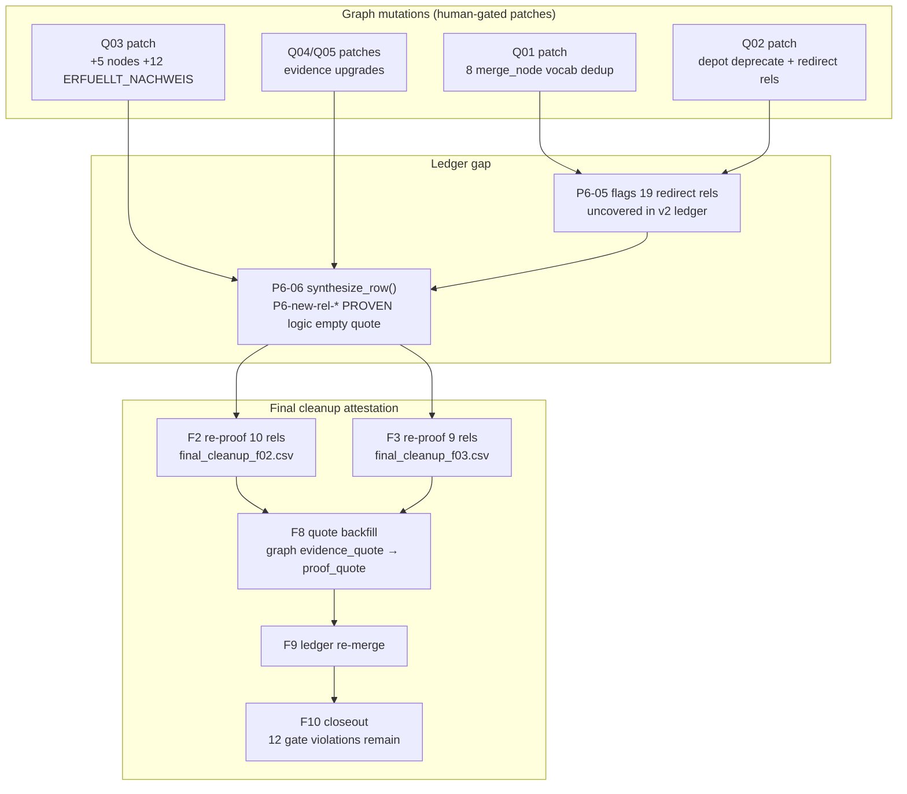

# Git Provenance Report — Agent G7

**Date:** 2026-06-06 · **Database:** `mit-bestand`  
**Ledger:** [`ledger/provenance_g07.csv`](../ledger/provenance_g07.csv) (36 rows)  
**Scope:** `P6-new-*` synthetic rows · Q01/Q02 merge-redirect survivors · 12 residual empty `proof_quote` cluster

---

## 1. Git repository status

The entire `2026-06-06_full_graph_verification/` campaign folder is **workspace-local and untracked** in `e:\recherche` as of this run (`git status` → `??` on all key artifacts). `git log --follow` returns **no commits** for:

- `_post_quality_p6_06_aggregate.py`
- `VERIFICATION_LEDGER_ELEMENT.csv`
- `patches/quality_pass_q*.patch.jsonl`
- `ledger/final_cleanup_f02.csv` / `f03.csv`

**Implication:** temporal provenance for this wave is anchored on **apply-report timestamps** (`apply_reports/*.apply_report.json` → `generated_at_utc`) and artifact cross-references, not on git SHAs. Parent repo HEAD at audit time: `ed1d81d9` (unrelated to this review folder).

| Artifact | Git status | Canonical time anchor |
|---|---|---|
| `quality_pass_q03.patch.jsonl` | untracked | apply_report `2026-06-06T17:45:38Z` |
| `quality_pass_q01.patch.jsonl` | untracked | apply_report `2026-06-06T17:45:53Z` |
| `quality_pass_q02_deprecate.patch.jsonl` | untracked | apply_report `2026-06-06T17:46:22Z` |
| `quality_pass_q05.patch.jsonl` | untracked | apply_report `2026-06-06T17:49:09Z` |
| `_post_quality_p6_06_aggregate.py` | untracked | script authorship (no commit) |
| `VERIFICATION_LEDGER_ELEMENT.csv` | untracked | F9/F10 merge output |

---

## 2. Provenance chain (summary)

---

## 3. When synthetics were invented (P6-06)

**Inventor:** Agent **P6-06** via [`_post_quality_p6_06_aggregate.py`](../_post_quality_p6_06_aggregate.py) function `synthesize_row()` (lines 259–326).

**Trigger:** After Q01–Q05 graph patches, live `elementId` export found graph elements **without** a matching row in the EP-10 baseline ledger. P6-06 closed structural coverage (D1/D2) by minting one row per uncovered element.

**Synthetic row template (relationships):**

| Field | Value at invention |
|---|---|
| `claim_id` | `P6-new-rel-{elementId[-12:]}` |
| `verdict` | `PROVEN` |
| `basis_type` | `logic` |
| `basis_ref` | `live graph export post Q01–Q05` |
| `fetched` | `false` |
| `proof_quote` | **empty** |
| `notes` | `Synthesized by P6-06 for Q03 graph additions` (misleading — also covers Q01/Q02 redirect survivors) |

**Counts minted:** 36 total (`5` `P6-new-node-*` + `31` `P6-new-rel-*`), per `ELEMENT_COVERAGE_PROOF.md` §4 and `_p6_06_work/coverage.json` EP10_BASELINE `synthesized: {nodes: 5, rels: 31}`.

**Not real evidence:** These rows attest *existence in the live graph*, not Evidence Gate compliance. The plan (`VERIFICATION_PLAN_7_AGENTS_FINAL_CLEANUP.md` §0.2) explicitly flags this as “Evidence Gate violation dressed as PROVEN.”

---

## 4. Q01/Q02 merge-redirect survivors (19 rels)

Graph mutations from quality-pass patches created **19 relationships** whose `from_id`/`to_id` triples changed (node merge redirects or depot deprecation rewires) while retaining stable Neo4j `elementId`s. EP-10 ledger rows still pointed at **deprecated** endpoint IDs, so P6-05 v2 flagged them uncovered; P6-06 synthesized `P6-new-rel-*` placeholders.

### 4.1 Q01 — vocabulary merge redirects (14 rels)

Applied `2026-06-06T17:45:53Z` via [`quality_pass_q01.patch.jsonl`](../patches/quality_pass_q01.patch.jsonl).

| Merge | Redirect rels | P6-new-rel examples |
|---|---|---|
| `bt_hohlkoerperdecke` → `bt_decke` | 5 | `…232327762353`, `…032141447601`, `…131653075377`, `…331839390129`, `…831955132849` |
| `bt_mauerstein` → `bt_fassade` | 2 | `…831955132850`, `…731280445874` |
| `bt_verglasung` / `bt_glasscheibe` → `bt_fenster` | 4 | `…831955132851`, `…631768818099`, `…431582503347`, `…931466760627` |
| `mat_drahtglas` → `mat_glas` | 2 | `…631768818199`, `…931466760727` |
| `bt_fassadenelement` / `bt_fassadenmodul_mauerwerk` → `bt_fassade` | (included above) | — |

Regulation-class survivors inherited `source_url`/`source_quote` on-graph from Agent 07 pre-merge proofs.

### 4.2 Q02 — Materialdepot deprecation redirects (5 rels)

Applied `2026-06-06T17:46:22Z` via [`quality_pass_q02_deprecate.patch.jsonl`](../patches/quality_pass_q02_deprecate.patch.jsonl).

| Mutation | Redirect rels | P6-new-rel examples |
|---|---|---|
| `bw_externe_stahl_donor_stockholder` → `bw_cleveland_steel_and_tubes_stock` merge | 4 (geo, role, AUS_SPENDER, HAT_BAUWERK) | `…958211485706`, `…057723113482`, `…529699582431`, `…673164709898`, `…930303702695` |
| WBS70 `AUS_SPENDER` redirect to `bw_school_type_dresden_donor` | 1 | `…529699582285` |

---

## 5. Q03 additions (17 elements — separate from redirect debt)

Applied `2026-06-06T17:45:38Z` via [`quality_pass_q03.patch.jsonl`](../patches/quality_pass_q03.patch.jsonl).

- **5** new `:PruefungNachweis` nodes (`pn_epd_oder_lca_nachweis`, …)
- **12** new `ERFUELLT_NACHWEIS` edges (5 high-confidence PN→NF + 7 medium-confidence method mappings)

P6-06 synthesized rows for all 17. These were **out of F2 scope** (not Q01/Q02 redirect rels); F8 attempted quote backfill from graph `evidence_basis` but **could not** produce verbatim `proof_quote` for the 12 `ERFUELLT_NACHWEIS` rels (graph stores `evidence_basis` prose, not fetchable quotes).

---

## 6. Real F2 proof vs synthetic inheritance

| Stage | Agent | What changed | 19 redirect rels | 12 Q03 ERFUELLT rels |
|---|---|---|---|---|
| Invention | P6-06 | Mint `P6-new-rel-*`, empty quote, `logic` | 19 synthesized | 12 synthesized |
| Re-proof | F2 (`f02.csv`, 10 rows) | Web/dossier fetch, non-empty `proof_quote` | 10/19 | — |
| Re-proof | F3 (`f03.csv`, 9 rows) | Web fetch on Q01 regulation survivors | 9/19 | — |
| Backfill | F8 | Copy `evidence_quote`/`source_quote` from graph | 19/19 have quotes in final ledger | 0/12 — **UNFIXED** |
| Merge | F9 | Override into `VERIFICATION_LEDGER_ELEMENT.csv` | claim_id retained as `P6-new-rel-*` | claim_id retained |

**F2 real proof:** Read-only re-adjudication with fetched URLs and verbatim quotes — see [`reports/final_cleanup_f02.md`](final_cleanup_f02.md) (8 PROVEN, 2 PARTIAL in batch 1) and [`reports/final_cleanup_f03.md`](final_cleanup_f03.md) (9/9 PROVEN in batch 2).

**Key distinction:** For redirect rels, F2/F3 supplied **external** proof; F8 then merged those overrides while keeping the synthetic `claim_id` prefix. For Q03 `ERFUELLT_NACHWEIS` rels, no F2/F3 ledger row exists — only P6-06 synthesis + F8 `UNFIXED` flag.

---

## 7. Empty `proof_quote` cluster (12 residual)

Identical set flagged by F10 (`_f10_work/coverage.json` → `gate_violations: 12`) and `CAMPAIGN_CLOSEOUT_REPORT.md` D4.

All 12 are **`ERFUELLT_NACHWEIS`** rels from **Q03**, still `basis_type=logic`, `fetched=false`, `verdict=PROVEN`:

| claim_id | from → to |
|---|---|
| `P6-new-rel-431351014157` | `pn_epd_oder_lca_nachweis` → `nf_oekobilanz_epd` |
| `P6-new-rel-431351014159` | `pn_materialpass_oder_dpp` → `nf_materialpass_ressourcenpass` |
| `P6-new-rel-431351014160` | `pn_barrierefreiheitsaudit` → `nf_barrierefreiheit_nachweis` |
| `P6-new-rel-431351014161` | `pn_elektrosicherheitspruefung` → `nf_elektrosicherheitsnachweis` |
| `P6-new-rel-431351014162` | `pn_trinkwasser_hygiene_nachweis` → `nf_hygiene_und_reinigungsnachweis` |
| `P6-new-rel-231164698737` | `pr_dokumentenpruefung_bestand` → `nf_schadstoffkataster_erkundung` |
| `P6-new-rel-231164700106` | `pn_approval_process` → `nf_genehmigungs_oder_zustimmungsbedarf` |
| `P6-new-rel-231164700147` | `pn_ankerpruefung` → `nf_befestigungsnachweis` |
| `P6-new-rel-231164700150` | `pn_petrografie` → `nf_rc_gesteinskoernung_eignung` |
| `P6-new-rel-231164703318` | `pr_eignungspruefung_baulehm` → `nf_rc_gesteinskoernung_eignung` |
| `P6-new-rel-231164703326` | `pr_zustandsbewertung` → `nf_dauerhaftigkeit_restlebensdauer` |
| `P6-new-rel-030978388566` | `pr_eignungspruefung_baulehm` → `nf_mineralische_ersatzbaustoff_guete` |

**Root cause:** Q03 patch wrote `evidence_basis` (semantic mapping prose) and `evidence_confidence: medium` on-graph, but no `evidence_quote`. P6-06 elevated to PROVEN without quote; F8 had no graph quote to backfill; no dedicated re-proof agent ran on this subset.

**Recommended fix:** Downgrade to `PARTIAL` with `evidence_basis` as quote, or fetch primary sources from PN node `primary_source_url` and re-adjudicate per Evidence Gate.

---

## 8. Attestation class histogram (36 P6-new rows)

| Class | Count | Description |
|---|---:|---|
| `F2_WEB_REPROOF` | 17 | F2/F3 web fetch; non-empty quote in final ledger |
| `F2_MIXED_REPROOF` | 2 | F2 proof with web+contract or dossier basis |
| `F2_OR_F8_QUOTE` | 5 | Q03 nodes — F8 URL placeholder quote |
| `RESIDUAL_EMPTY_QUOTE` | 12 | Q03 ERFUELLT rels — gate violation |
| Q01/Q02 redirect total | 19 | All received F2 and/or F3 ledger rows (13 Q01 + 6 Q02) |

---

## 9. Quality-pass patch apply order (2026-06-06 UTC)

| Order | Patch | `generated_at_utc` | Graph Δ (nodes / rels) |
|---:|---|---|---:|
| 1 | Q03 compliance | 17:45:38 | +5 / +12 |
| 2 | Q01 schema merges | 17:45:53 | −8 / −35 |
| 3 | Q02 depot deprecate | 17:46:22 | −17 / −118 |
| 4 | Q04 catalogue | (apply_reports) | — |
| 5 | Q05 actor gate | 17:49:09 | 0 / −1 |

P6-06 aggregator ran **after** all Q patches (read-only export of post-patch graph).

---

## 10. Files produced

| Output | Path |
|---|---|
| Provenance ledger | `ledger/provenance_g07.csv` |
| This report | `reports/provenance_g07.md` |
| Regenerator | `_build_provenance_g07.py` |

---

*Agent G7 — read-only git + artifact audit. No graph or ledger mutations.*
