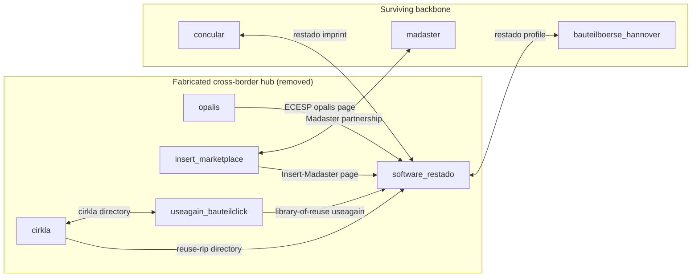

# Git Provenance Report — Agent G9

**Scope:** Cross-bubble `VERBUNDEN_MIT_AKTEUR` fabrication lineage  
**Date:** 2026-06-06  
**Database:** `mit-bestand`  
**Ledger:** [`ledger/provenance_g09.csv`](../ledger/provenance_g09.csv) (129 unique rel ids)  
**Generator:** [`_agent_g09_build_provenance.py`](../_agent_g09_build_provenance.py)

---

## 1. Executive summary

Manual source-checking on Restado hub edges (Cirkla, Opalis, Insert, useagain) exposed a **systemic category-inference defect**: edges were authored from sector/country similarity (“European reuse marketplace”, “Dutch urban-mining mesh”, “Opalis directory peers”) and URLs describing **only one** endpoint were attached as pairwise proof.

| Metric | Count |
|---|---:|
| VMA edges traced in ledger | **129** |
| Removed after `EVIDENCE_AUDIT.md` (T1+T2) | **29** rel ids in patches¹ |
| Surviving evidence-backed backbone | **100** |
| Actor-mesh / category-inference origin | **71** ops across runs (66 removed or flagged) |

¹ Tier-1 apply deleted **16** directed edges (15 486 → 15 470 rels). Tier-2 patch lists **13** more. Some bidirectional pairs were only half-deleted — see §5.

**Root cause (confirmed in [`EVIDENCE_AUDIT.md`](../../2026-06-06_cross_bubble_extension/EVIDENCE_AUDIT.md)):** violates AGENTS.md rule 3 (name/category similarity ≠ link) and the evidence rule (`evidence_url` must name **both** endpoints).

---

## 2. Git lineage timeline

| When | Commit | What landed |
|---|---|---|
| 2026-06-02 | `f9cf1a8c` *updates* | Bauteilbörsen legacy integration — `software_restado` node, `BETRIEBEN_VON → concular`, no VMA cross-bubble mesh |
| 2026-06-05 20:49 | `323cd19b` *4* | Regulation vocabulary phases 4–8 + Phase B (no reuse bubbles) |
| 2026-06-06 09:35 | `ed1d81d9` *5* | **All five country reuse bubbles** (FR/DE/NL/CH/Rotor-DC) + dossiers in `intake/inbox/` + `cross_bubble_extension` patches (phase 1+2) committed |
| 2026-06-06 (working tree) | *(uncommitted)* | `EVIDENCE_AUDIT.md`, `unsupported_edges_*.patch.jsonl`, remediation apply reports |

**Apply entry points (all first appear in `ed1d81d9`):**

- `_neo4j/intake/runs/2026-06-05_*/apply_*_reuse_bubble.py`
- `_neo4j/review/2026-06-06_cross_bubble_extension/apply_cross_bubble_both.py`

There is **no standalone “category inference” script**. Inference is embedded in patch JSONL authoring during bubble intake (`connection_kind` = `*_mesh`, `evidence_basis` = `interpretive_conclusion_not_sourced_merge`, or `teilweise_belegt` + borrowed single-actor URLs).

---

## 3. Run → fabrication class map

| Origin scope | Patch phases | VMA ops | Actor mesh | Explicit inference | Removed | Surviving |
|---|---|---:|---:|---:|---:|---:|
| `legacy_bauteilboersen` | 2026-05-28 graph-only | 1 | 0 | 0 | 0 | 1 |
| `swiss_reuse_bubble` | phase1 directory + phase3 supply | 30 | 0 | **5** | 4 | 26 |
| `germany_reuse_bubble` | phase1 ecosystem + phase2 Hannover | 16 | 8 | 0 | 3 | 13 |
| `netherlands_reuse_bubble` | phase1 spine + phase2 repurpose | 24 | **22** | 0 | 10 | 14 |
| `france_reuse_bubble` | phase1 spine + phase1c hardening + phase2 IDF | 38 | **26** | 0 | 12 | 26 |
| `rotor_dc_reuse_bubble` | phase1 ecosystem | 4 | 0 | 0 | 0 | 4 |
| `cross_bubble_extension` | phase1 + phase2 bridges | 32 | 10 | 0 | 5 | 27 |

### 3.1 Evidence-backed runs (legitimate patterns)

| Run | Pattern | Example surviving edges |
|---|---|---|
| **Swiss** `phase1_enrichment_connectivity` | Cirkla directory / committee pages name both actors | `cirkla ↔ useagain`, `cirkla ↔ baubuero_in_situ` |
| **Germany** `phase2_bauteilboerse_hannover` | Restado profile + imprint chain | `software_restado ↔ bauteilboerse_hannover`, `concular ↔ software_restado` (also cross-bubble phase1) |
| **Germany** `phase1_ecosystem_spine` | Named pilot pages | `concular ↔ circular_structural_design` (Green AI Hub) |
| **Netherlands** `phase1_dutch_urban_mining_spine` | Oogstkaart transfer article names both | `superuse ↔ new_horizon_urban_mining` |
| **France** `phase1_france_marketplace_spine` | Programme pages name partners | `bellastock ↔ cstb`, `mobius ↔ cstb` |
| **Cross-bubble** phase1 | Formal partnership / brand operator | `insert ↔ madaster`, `madaster ↔ madaster_epea`, `concular ↔ software_restado` |
| **Cross-bubble** phase2 | First-party co-mention | `sumami ↔ eth_zuerich`, `rotordc ↔ whitewood`, `brussels_environment ↔ opalis` |

### 3.2 Actor-mesh runs (category inference — mostly removed)

| Run | Mesh family | Mechanism | Remediation |
|---|---|---|---|
| **Netherlands** phase1+2 | `dutch_reuse_*_mesh` | Homepage of actor A attached to actor B in same country bubble | **10× T1** removed |
| **France** phase1+1c+2 | `french_marketplace_mesh`, `opalis_directory_*` | Co-listing in Opalis ≠ dealer↔dealer partnership | **12× T2** removed |
| **Germany** phase1 | `resource_passport_ecosystem`, `digital_physical_exchange_layer` | “Both do passports / both on restado ECESP” | **3× T1/T2** removed |
| **Cross-bubble** phase1+2 | `european_*_peer` | ReUse-RLP directory / ECESP pages list platforms without pairwise claim | **5× T1** removed |

### 3.3 Explicit category-inference markers (Swiss)

Swiss phase1/3 patches carry `evidence_basis: interpretive_conclusion_not_sourced_merge` and `fact_label: Interpretive_conclusion`:

- `cirkla ↔ zirkular` — K.118 page names baubüro, not Cirkla (**T2 removed**; real link only via Benjamin Poignon committee — needs re-source if kept)
- `cirkla ↔ c33 / circular_hub_zurich / circular_economy_switzerland` — each homepage describes itself only (**T2 removed**)

---

## 4. Restado / Cirkla hub pattern (trigger case)

The defect surfaced when Restado appeared linked to Cirkla, Opalis, Insert, and useagain with URLs that never name both endpoints.

| rel_id | Origin | evidence_url problem | Status |
|---|---|---|---|
| `r_cirkla__…__software_restado` | cross_bubble phase1 | reuse-rlp.de lists cirkla+opalis links; **restado not on page** | T1 removed |
| `r_opalis__…__software_restado` | cross_bubble phase1 | ECESP Opalis page; **restado not mentioned** | T1 removed |
| `r_insert_marketplace__…__software_restado` | cross_bubble phase1 | Insert–Madaster article; **restado not mentioned** | T1 removed |
| `r_software_restado__…__useagain_bauteilclick` | cross_bubble phase2 | useagain pioneer page; **restado not mentioned** | T1 removed |
| `r_concular__…__software_restado` | cross_bubble phase1 | restado Impressum names Concular | **surviving ✓** |
| `r_cirkla__…__useagain_bauteilclick` | swiss phase1 | Cirkla directory profile names useagain | **surviving ✓** |

**Presentation knock-on:** `PRESENTATION_REUSE_SYNTHESIS.md` path `useagain → restado → opalis → bellastock` relied on deleted restado↔opalis and restado↔useagain edges — slides need re-check (per EVIDENCE_AUDIT §Knock-on).

---

## 5. Remediation patches (git / apply provenance)

| Patch | Ops | Graph impact | Git status |
|---|---:|---|---|
| [`unsupported_edges_removal.patch.jsonl`](../../2026-06-06_cross_bubble_extension/patches/unsupported_edges_removal.patch.jsonl) | 16 `delete_rel` | 15 486 → **15 470** rels | **uncommitted** (apply report timestamp 2026-06-06T14:45Z) |
| [`unsupported_edges_tier2_removal.patch.jsonl`](../../2026-06-06_cross_bubble_extension/patches/unsupported_edges_tier2_removal.patch.jsonl) | 13 `delete_rel` | further cleanup | **uncommitted** |

Tier-1 reasons uniformly cite **category inference** (see patch `reason` fields). Tier-2 adds **Opalis co-listing ≠ pairwise** and **ecosystem category inference** for Swiss coordination nodes.

**Asymmetry note:** Tier-1 deletes are not always bidirectional (e.g. deletes `r_cirkla__…__software_restado` but not `r_software_restado__…__cirkla`). Ledger marks per rel id; live graph may retain orphan reverse edges until dedup pass.

---

## 6. Category-inference authoring signatures

Use these fields to audit future intakes:

| Signal | Where seen | Interpretation |
|---|---|---|
| `connection_kind` contains `mesh`, `ecosystem`, `peer`, `infrastructure_peer` | NL/FR/DE/cross-bubble patches | Country or sector glue — high false-positive rate |
| `evidence_confidence: teilweise_belegt` + single-actor homepage | NL phase1, DE phase1, cross-bubble peers | Often **actor mesh**, not pairwise proof |
| `evidence_basis: interpretive_conclusion_not_sourced_merge` | Swiss phase1/3 | **Explicit** inference — flagged in dossier |
| `evidence_hardening_2026_06_06` on FR phase1c | Opalis directory mesh upgrades | Hardening re-labelled co-listings as `belegt` — **still failed** T2 fetch audit |
| `review_run: cross_bubble_extension_2026_06_06` | Review folder patches | Bridges authored after country bubbles; repeated peer-listing mistake |

---

## 7. Recommendations

1. **Do not re-introduce** removed edges without URLs naming both endpoints (or curated listing pages that explicitly link A↔B).
2. **Opalis dealer↔dealer:** keep `supplier_listing → opalis` per dealer; do not infer dealer↔dealer from shared directory membership.
3. **Cross-bubble bridges:** prefer operator/brand chains (`concular → software_restado → bauteilboerse_hannover`) over ECESP/directory co-listing.
4. **Git hygiene:** commit `EVIDENCE_AUDIT.md` + removal patches + updated presentation decks in one remediation commit so provenance closes the loop.
5. **Bidirectional cleanup:** run duplicate/orphan audit on surviving reverse halves of T1-deleted pairs.

---

## 8. Ledger schema

| Column | Meaning |
|---|---|
| `ledger_id` | `G09-####` stable row id |
| `rel_id` | Graph relationship id |
| `fabrication_class` | `evidence_backed` \| `actor_mesh` \| `category_inference` \| `mixed` |
| `origin_scope` | Intake run or cross-bubble review folder |
| `origin_patch` | First patch file introducing the edge |
| `git_commit` / `git_commit_date` | First commit touching that patch path |
| `remediation_status` | `surviving` \| `removed_t1` \| `removed_t2` |
| `fabrication_pattern` | e.g. `restado_cirkla_hub_pattern`, `dutch_country_mesh`, `opalis_co_listing_mesh` |

Full row-level provenance: **`ledger/provenance_g09.csv`**.
