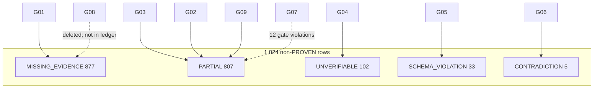

# Agent G10 — Provenance Aggregator Report

**Date:** 2026-06-06  
**Database:** `mit-bestand`  
**Mode:** read-only (poll G01–G09 → merge; no graph mutation)  
**Parent deliverable:** [`PROVENANCE_ROOT_CAUSE_REPORT.md`](../PROVENANCE_ROOT_CAUSE_REPORT.md)  

---

## 1. Scope & method

Waited for all nine upstream provenance shards (polled every 2 min; **9/9 complete** at poll 8, ~14 min). Merged cluster summaries, timelines, and recommendations from:

| Shard | Ledger | Report | Status |
|---|---|---|---|
| G01 | `ledger/provenance_g01.csv` (12 clusters) | `reports/provenance_g01.md` | ✓ |
| G02 | `ledger/provenance_g02.csv` (143 rows) | `reports/provenance_g02.md` | ✓ |
| G03 | `ledger/provenance_g03.csv` (13 clusters) | `reports/provenance_g03.md` | ✓ |
| G04 | `ledger/provenance_g04.csv` (102 rows) | `reports/provenance_g04.md` | ✓ |
| G05 | `ledger/provenance_g05.csv` (33 rows) | `reports/provenance_g05.md` | ✓ |
| G06 | `ledger/provenance_g06.csv` (27 rows) | `reports/provenance_g06.md` | ✓ |
| G07 | `ledger/provenance_g07.csv` (36 rows) | `reports/provenance_g07.md` | ✓ |
| G08 | `ledger/provenance_g08.csv` (17 rows) | `reports/provenance_g08.md` | ✓ |
| G09 | `ledger/provenance_g09.csv` (129 edges) | `reports/provenance_g09.md` | ✓ |

Cross-tab `verdict × origin_run` computed on `VERIFICATION_LEDGER_ELEMENT.csv` via [`_build_provenance_g10.py`](../_build_provenance_g10.py).

---

## 2. Headline counts (canonical ledger)

| Verdict | Count | Share |
|---|---:|---:|
| PROVEN | 15,499 | 89.47% |
| MISSING_EVIDENCE | 877 | 5.06% |
| PARTIAL | 807 | 4.66% |
| UNVERIFIABLE | 102 | 0.59% |
| SCHEMA_VIOLATION | 33 | 0.19% |
| CONTRADICTION | 5 | 0.03% |
| **Σ** | **17,323** | 100% |

---

## 3. Top 10 systemic failure modes (G10 synthesis)

| Rank | Mode | ~Rows | Responsible runs |
|---:|---|---:|---|
| 1 | Never-sourced bulk import | 714 ME | May 13 migration, May 20 reset, May 23 trace |
| 2 | Organisational geo without address | 335 PARTIAL | May 20 inbox_batch2, actor registry |
| 3 | Placeholder geo source tokens | 197 PARTIAL | Jun 6 geo extract (`ed1d81d9`) |
| 4 | Catalogue URL without quote | 143 PARTIAL | Jun 2 bauteilboerse enrichment (`f9cf1a8c`) |
| 5 | Category-inference actor mesh | 29 removed + 10 PARTIAL | Jun 5–6 reuse bubbles |
| 6 | Aggregate donor/depot stubs | 127 total | May 13–15 project batches; Q02 delete |
| 7 | Q4 URL denormalization | 102 UNVERIFIABLE | May 15 registry + May 21 Q4 |
| 8 | Generic programme vocabulary | 33 SCHEMA | May 13 controlled vocabulary seed |
| 9 | P6 synthetic PROVEN (empty quote) | 12 residual | Jun 6 P6-06 + Q03 |
| 10 | Ledger CSV column-shift | 17 parse artifacts | F04 final cleanup shard |

Full narrative, script hot list, and remediation priorities: **§2–6** of [`PROVENANCE_ROOT_CAUSE_REPORT.md`](../PROVENANCE_ROOT_CAUSE_REPORT.md).

---

## 4. Cross-tab: verdict × origin_run

| Verdict | Early import | Batch vocab | Registry+Q4 | Geo/participation | Bauteilbörsen | Reuse bubbles | Geo extract | P6/Q cleanup | Other | **Σ** |
|---|---:|---:|---:|---:|---:|---:|---:|---:|---:|---:|
| PROVEN | 0 | 0 | 0 | 0 | 99 | 0 | 0 | 36 | 15,364 | 15,499 |
| MISSING_EVIDENCE | 877 | 0 | 0 | 0 | 0 | 0 | 0 | 0 | 0 | 877 |
| PARTIAL | 0 | 0 | 0 | 622 | 13 | 10 | 0 | 0 | 162 | 807 |
| UNVERIFIABLE | 0 | 0 | 102 | 0 | 0 | 0 | 0 | 0 | 0 | 102 |
| SCHEMA_VIOLATION | 0 | 33 | 0 | 0 | 0 | 0 | 0 | 0 | 0 | 33 |
| CONTRADICTION | 0 | 0 | 0 | 0 | 0 | 0 | 5 | 0 | 0 | 5 |

**Key isolations:**

- Each non-PROVEN verdict maps to **one dominant origin_run** (≥77% concentration), except PARTIAL “other” (162 rows — mixed EP shards, DEAD_LINK recoveries, F2/F3 upgrades).
- Regulation vocabulary Phase B (`323cd19b`) contributes **0** SCHEMA_VIOLATION rows (G05 exclusion proof).
- Reuse-bubble VMA debt is **small in ledger** (10 PARTIAL) because T1/T2 removal happened on-graph before final ledger merge; G09 traces **129** historical edges.

---

## 5. Shard contributions to root-cause map

---

## 6. Recommendations (G10 rollup)

| Priority | Action | Owner shard |
|---|---|---|
| **P0** | Fix 12 Q03 `ERFUELLT_NACHWEIS` empty-quote violations | G07 |
| **P0** | Enforce CSV width validation on ledger merges | G06 |
| **P1** | Batch ADD_SOURCE for 425 never-sourced actors | G01 |
| **P1** | Re-import catalogue quotes from enrichment JSON | G02 |
| **P1** | Replace geo placeholder tokens with dossier URLs | G03 |
| **P2** | Deprecate generic `prog_*` + `TEIL_VON_PROGRAMM` | G05 |
| **P2** | Delete/RELABEL 63 shared-material inference edges | G03 |
| **P2** | Commit T1/T2 removal patches + presentation sync | G09 |
| **P3** | Split person vs org `source_urls` policy | G04 |
| **P3** | Ban aggregate Materialdepot reintroduction | G08 |
| **P3** | `synthesize_row()` → `UNATTESTED` not `PROVEN` | G07 |

---

## 7. Outputs

| File | Role |
|---|---|
| [`PROVENANCE_ROOT_CAUSE_REPORT.md`](../PROVENANCE_ROOT_CAUSE_REPORT.md) | Canonical merged root-cause document |
| [`reports/provenance_g10.md`](provenance_g10.md) | This aggregator report |
| [`_build_provenance_g10.py`](../_build_provenance_g10.py) | Regenerator for verdict × origin_run cross-tab |

---

## 8. Poll log

| Poll | Time | G shards ready |
|---:|---|---|
| 1–2 | 20:28–20:30 | 0/9 |
| 3 | 20:32 | 3/9 (G03, G07, G09) |
| 4 | 20:34 | 4/9 (+G01) |
| 5 | 20:36 | 7/9 (+G02, G04, G06) |
| 6–7 | 20:38–20:40 | 7–8/9 (+G08) |
| 8 | 20:42 | **9/9** — proceed |

---

*Agent G10 — provenance aggregator. Read-only on Neo4j and git history.*
