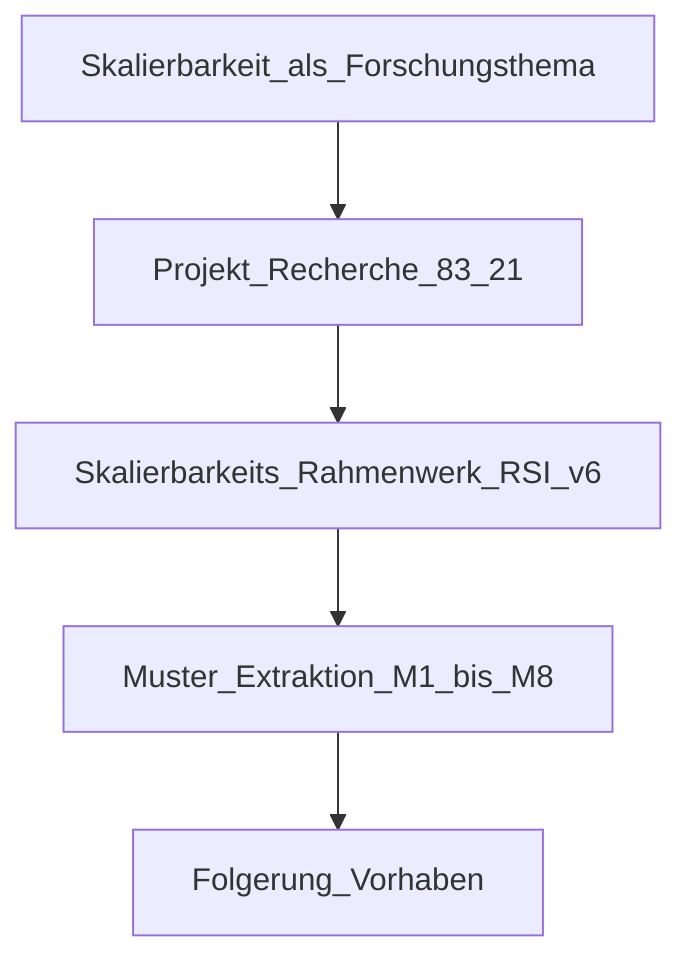

# Anlage: Skalierbarkeitsforschung — Rahmenwerk, Projektanalyse und Muster

**Projekt:** Entwerfen mit Bestand (LUH/NGS · UdK/KET)  
**Aktenzeichen:** 10.08.18.7-25.06  
**Stand:** 2026-07-01  
**Zweck:** Eigenständige Forschungsanlage zur **Skalierbarkeit** von Bauteil-Wiederverwendung — systematische Projekt-Recherche, Skalierbarkeits-Rahmenwerk (RSI v6), extrahierte Muster; kompakte Folgerung für das bewilligte Vorhaben.

**Methodische Detailreferenz:** Skalierbarkeitskriterien RSI v6 (Gates, K1–K14, Konfidenz, Archetypen, Bewertungsprofile).

---

## Kurzfassung

**Die Hauptstory in einem Satz:** *We compared 83 reuse projects with our scalability framework (RSI v6) and extracted patterns that show what makes reuse repeatable beyond single cases — and what does not.*

Auf Deutsch: Wir haben **83 Reuse-Projekte** mit dem **Skalierbarkeits-Rahmenwerk RSI v6** verglichen und daraus **Muster extrahiert**, die zeigen, was Wiederverwendung über den Einzelfall hinaus **wiederholbar** macht — und was **nicht**.

**Forschungsgegenstand:** Skalierbarkeit von Bauteil-Wiederverwendung — nicht architektonische Exzellenz oder CO₂ allein, sondern die **wiederholbare Prozesskette** unter realen Bau-, Markt-, Rechts- und Vergabebedingungen.

**Methode:** 83 internationale Projekte systematisch erfasst; **21** extern verifiziert. Bewertung mit RSI v6: sechs K.-o.-Gates (G1–G6), vierzehn Kriterien (K1–K14), Konfidenzklassen A/B/C, zehn Archetypen, sieben Bewertungsprofile.

**Hauptergebnis:** Der Engpass ist selten Entwurf allein — er liegt in **Gates und Prozesskriterien** (Inventar G2/K3, Nachweis G3/K4, Haftung G4/K5, Logistik G5/K6, Beschaffung G6/K7). **62 von 83** Projekte haben mindestens ein Gate = 0; Median RSI final **36,2** (Einzelfall/Fallstudie). **Acht korpusbelegte Muster** benennen wiederkehrende Skalierungsmechanismen und -grenzen.

| Kennzahl | Wert |
|---|---:|
| Projekte im Korpus | 83 |
| Extern verifiziert | 21 |
| Median RSI final | 36,2 |
| RSI final Maximum (55 GSS, London) | 74,2 |
| Versorgung K2 ≥ 3 | 14/83 |
| Mindestens ein Gate = 0 | 62/83 |
| Konfidenzklasse C (vorläufig) | 62/83 |
| Einstufung Einzelfall / Pilot / bedingt skalierbar | 62 / 12 / 9 |



---

## 1. Skalierbarkeit als Forschungsgegenstand

Das Forschungsvorhaben „Entwerfen mit Bestand“ behandelt Skalierbarkeit als zentrales Konzept. **Skalierbar** bedeutet: ein Ansatz lässt sich als **wiederholbare Prozesskette** anwenden — Bestand erkennen, inventarisieren, Quelle sichern, Qualität nachweisen, Haftung klären, ausschreiben, demontieren, lagern, wiedereinbauen, dokumentieren — über Projekte, Regionen oder Bauteilfamilien hinweg.

**Abgrenzung** — Skalierbarkeit ist hier nicht:

- architektonische Qualität oder hoher K9 (DfD) allein,
- CO₂-Wirkung (K14) oder Fläche als Ersatz für Prozessreife,
- Reuse-Quote ohne `reuse_scope` (K10),
- Recycling oder biosourced Material als Element-ReUse.

Der RSI v6 misst **Skalierungsfähigkeit des Ansatzes**. Die Vorstudie begründet, warum das bewilligte Vorhaben eine **Übersetzungs- und Integrationsschicht** braucht — weil Gates G1–G6 in der Mehrheit ungelöst bleiben, obwohl K9 im Feld oft hoch ist.

---

## 2. Das Skalierbarkeits-Rahmenwerk — RSI v6

Der RSI v6 ist das **Vergleichsinstrument** der Hauptstory: Er macht 83 Projekte vergleichbar und macht Skalierungshebel benennbar. Vier getrennte Ergebnisse je Projekt:

| Ergebnis | Funktion |
|---|---|
| **Gate-Status** (G1–G6) | Mindestbedingungen und K.-o.-Risiken **vor** dem Score |
| **RSI-Score** (brutto / final) | Gewichteter Skalierungsreifegrad 0–100 |
| **Konfidenz** (A / B / C) | Belastbarkeit der Quellen je Kriterium |
| **Archetyp** | Dominante Skalierungslogik |

### 2.1 Gates — Mindestbedingungen (Skala 0 / 1 / 2)

| Wert | Bedeutung |
|---:|---|
| 0 | fehlt, nicht belegt oder klar ungelöst |
| 1 | adressiert, aber lückenhaft oder nicht wiederholbar |
| 2 | belastbar gelöst, dokumentiert oder wiederholbar organisiert |

| Gate | Mindestbedingung |
|---|---|
| **G1** | Frühe Planungsintegration (vor Entwurfsfixierung, Ausschreibung, Kostentermin) |
| **G2** | Materialinventar und Quellobjektdaten (Menge, Maße, Zustand, Herkunft, Verfügbarkeit) |
| **G3** | Qualitäts- und Sicherheitsnachweis (Statik, Brandschutz, Schadstoffe, …) |
| **G4** | Haftung, Garantie und Versicherung |
| **G5** | Reverse-Logistik und Zwischenlagerung |
| **G6** | Beschaffung, Kosten und Terminmodell |

**Kappungsregeln (RSI final):**

| Befund | Konsequenz |
|---|---|
| Alle Gates ≥ 1 | Score normal |
| **Ein** Gate = 0 | RSI final max. **59** (Pilot / Reallabor) |
| **Zwei oder mehr** Gates = 0 | RSI final max. **39** (Einzelfall / Fallstudie) |
| G3 oder G4 = 0 bei **tragenden** Bauteilen | RSI final max. **39** |
| G5 = 0 bei **projektübergreifendem** ReUse | RSI final max. **59** |
| Konfidenz < 0,60 | Einstufung **vorläufig** |

### 2.2 Score-Formel und Rohskala

Jedes Kriterium: Rohscore **0–4**, normiert × **25**.

```text
RSI brutto = Σ (Gewichtᵢ × Rohscoreᵢ × 25) / Σ (anwendbare Gewichteᵢ)
RSI final  = RSI brutto nach Gate-Kappung
```

| Rohscore | Normiert | Bedeutung |
|---:|---:|---|
| 0 | 0 | fehlt / nicht gelöst |
| 1 | 25 | punktuell, personengebunden |
| 2 | 50 | teilweise, projektspezifisch |
| 3 | 75 | robust, in ähnlichen Fällen wiederholbar |
| 4 | 100 | standardisiert, marktfähig, dokumentiert |

### 2.3 Kriterien K1–K14

| Nr. | Kriterium | Gewicht | Kernfrage |
|---:|---|---:|---|
| K1 | Frühe Planung & Projektmandat | 9 % | ReUse verbindlich im Auftrag, Entwurf, Terminplan? |
| K2 | Versorgung & Reservierbarkeit | 10 % | Materialpipeline statt Bauteiljagd? |
| K3 | Inventar & Datenqualität | 10 % | Bauteile auffindbar, prüfbar, rückverfolgbar? |
| K4 | Qualität & Regulatorik | 12 % | Statik, Normen, Sicherheit nachweisbar? |
| K5 | Haftung & Risiko | 9 % | Verantwortlichkeiten vertraglich geklärt? |
| K6 | Reverse-Logistik & Timing | 9 % | Ausbau–Lager–Einbau koordiniert? |
| K7 | Ausschreibung & Verträge | 7 % | ReUse in LV, Vergabe, Vertrag abbildbar? |
| K8 | Kosten- & Terminrealismus | 7 % | Zusatzaufwände budgetiert? |
| K9 | Zirkuläres Design / DfD | 8 % | Entwurf mit Verfügbarkeit, Demontage? |
| K10 | Tiefe, Scope, Umfang | 6 % | Element-ReUse substanziell, scope-sauber? |
| K11 | Akteurskompetenz | 5 % | Prozess ohne Einzel-Champions? |
| K12 | Markt & Politik | 4 % | Hubs, Förderung, Nachfrage? |
| K13 | Replizierbarkeit | 3 % | Ohne dieselbe Sonderkonstellation? |
| K14 | Umweltwirkung | 1 % | LCA/CO₂ belegt (Legitimation, **nicht** Ersatz für K1–K13) |

**`reuse_scope` (Pflicht bei K10):** `whole_building` · `structural` · `facade` · `single_trade` · `interior_fitout` · `temporary_borrowed` · `platform_volume` · `unknown`

### 2.4 Einstufung, Konfidenz, Profile

**RSI final → Einstufung:**

| RSI final | Einstufung |
|---:|---|
| 0–39 | Einzelfall / Fallstudie |
| 40–59 | Pilot / Reallabor |
| 60–74 | bedingt skalierbar |
| 75–89 | skalierbar |
| 90–100 | systemisch skalierbar |

**Konfidenz:** `Σ (Gewichtᵢ × Evidenzᵢ / 3) / Σ Gewichte` — Evidenz 0 (Annahme) bis 3 (verifiziert). **A** ≥ 0,80 · **B** 0,60–0,79 · **C** < 0,60.

**Bewertungsprofile:** `whole_building_project` · `interior_fitout_reuse` · `structural_reuse` · `material_hub_platform` · `network_ecosystem` · `digital_inventory_tool` · `temporary_or_exhibition`

**N/A-Regeln:** Fehlende Information = Score 0 oder 1, **nicht** N/A. Bei tragendem ReUse: K4 und K5 nie N/A; projektübergreifend: K6 nie N/A; Gebäude: K10 Scope nie N/A.

### 2.5 Schnelltest (12 Leitfragen)

Skalierung ist nur realistisch, wenn die meisten Antworten **ja** sind: frühe Planung (G1/K1) · gesicherte Quellen (K2) · Inventar (G2/K3) · Prüfpfad (G3/K4) · Haftung (G4/K5) · Logistik (G5/K6) · Ausschreibbarkeit (G6/K7) · Kosten/Zeit (K8) · Entwurf mit Verfügbarkeit (K9) · Scope klar (K10) · mehrere Akteure (K11) · Markt/Nachfrage (K12). Faustregel: ≥ 6 Nein → Einzelfall/Reallabor.

### 2.6 Archetypen (Prioritätsreihenfolge)

| Priorität | Archetyp | Regel / Bedeutung |
|---:|---|---|
| 1 | Systemischer Aggregator | K2, K3, K6, K12, K13 ≥ 3 — ReUse als Infrastruktur |
| 2 | Professioneller ReUse-Hub | Katalog, Lager, Reservierung, Vermittlung |
| 3 | Regulatorisch reifer Struktur-ReUse | tragend + K4, K5, K6 ≥ 3 |
| 4 | DfD-Systemreferenz | K9 = 4 — Entwurfsmodell; Skalierung nur mit K2–K7 |
| 5 | Großmaßstab-Demonstrator | ≥ 5.000 m², substanzieller ReUse oder LCA |
| 6 | Tiefen-Pilot | hohe K10, schmale K2 |
| 7 | Innenausbau-/Finish-ReUse | geringere G3/G4-Hürde |
| 8 | Netzwerk-/Ökosystem-Enabler | Standards, Tools, Akteurskoordination |
| 9 | Klein-Pilot / Reallabor | klein oder viele Gates offen |
| 10 | Fallstudie | zentrale Kriterien offen oder dünn dokumentiert |

### 2.7 Kritische Selbstprüfung

| Prüfpunkt | Befund | Konsequenz |
|---|---|---|
| Historisch v3 | Median 46,9 → v6 final 36,2 | Nicht direkt vergleichbar |
| Design ≠ Skalierung | People's Pavilion K9=4, RSI 56,8 (#13) | Archetyp DfD-Referenz, Einstufung Pilot |
| Gate-Blocker | 62/83 Gate = 0 | G4, G6, G2 häufig |
| Proxy-Korpus | 62/83 Konfidenz C | K5, K7, K8 konservativ geschätzt |
| K14 ≠ Skalierung | 1 % Gewicht | Thoravej: hohe K14, K2=1 |

---

## 3. Projekt-Recherche und Befunde

### 3.1 Korpus und Bewertungslogik

**83** internationale Reuse-Projekte; **21** extern verifiziert (Projektberichte, Fachpresse, Nachweise). Verifizierte: manuelle Gates + K1–K14 mit Evidenz ≥ 2 wo belegt. Übrige **62**: Proxy aus v3-Dimensionen in K-Rohscores, Gates abgeleitet — Konfidenzklasse C.

### 3.2 Kernbefunde (Gate- und K-Perspektive)

**Versorgung (K2, G2):** Nur **14/83** mit K2 ≥ 3. Ohne Portfolio bleibt Einzelfall — auch bei hohem K9.

**Inventar (K3, G2):** Median niedrig im Proxy-Korpus; heterogene Datenlage blockiert frühen Entwurf (M8).

**Nachweis & Haftung (K4, K5, G3, G4):** **26/83** tragend mit K4 ≤ 1 (Proxy). G3/G4 = 0 kappen RSI final auf 39 — Recyclinghaus (Stahl) vs. 55 GSS (SCI P427).

**Logistik & Beschaffung (K5, K6, G5, G6):** Dominierende Gate-Blocker im Korpus; organisatorische Innovation (Lot 01, Leasing) adressiert K7/K8/K5.

**DfD (K9):** **8/83** mit K9 = 4. Feld kann entwerfen — ohne K2–K7 bleibt Einstufung Pilot.

**Wirkung (K14):** Belegt Legitimation; ersetzt keine Gates (Thoravej: K14 hoch, K2 = 1).

### 3.3 Gesamtbild

| Befund | Zahl | Lehre |
|---|---|---|
| Median RSI final | 36,2 | Mehrheit Einzelfall |
| Spitze | 55 GSS 74,2; KA13 74,0 | K4 + K2 schlagen reine DfD-Story |
| People's Pavilion | #13, RSI 56,8; K9=4, K13=1, G4/G6 schwach | Design ≠ Skalierung |
| Systemische Aggregatoren | 2 (KA13, Circl) | Volle K-Kette selten |
| Einstufung | 62 / 12 / 9 | Kein Projekt ≥ 75 im Korpus |
| Archetypen | 47 Fallstudie; 7 DfD-Referenz; 2 Struktur-ReUse | Dokumentation vs. Systemreife |

### 3.4 Lernfälle

| Frage | Projekte | RSI final · Profil | Entscheidende Gates/K |
|---|---|---|---|
| Systemisch skalierbar? | KA13, Circl | 74,0 / 69,0 · Aggregator | K2≥3, K3≥3, K6≥3, K12≥3, K13≥3 |
| Design ohne Skalierung? | People's Pavilion | 56,8 · temporary_or_exhibition | K9=4; K13=1; G4=1; G6=1 |
| Nachweis öffnet Markt? | 55 GSS, ReCreate | 74,2 / 67,2 · structural_reuse | G3=2–3; K4=4 |
| Methoden statt Monument? | Villa Welpeloo, Grande Halle | 47,8 / 58,8 | K7=4 (Lot 01); K13 (Harvest Map) |
| Impact ohne Pipeline? | Thoravej | 61,2 · whole_building | K2=1; K10/K14 hoch |
| Scope-Falle? | Ferme du Rail, Upcycle | K10 korrigiert | Recycling ≠ Element-ReUse |
| Organisatorisch? | Green House, Grande Halle | 66,5 / 58,8 | K5=3, K7=4, K8=3 |
| Datenheterogen? | Feldweit | 62/83 Gate=0 | K3 niedrig; G2=0 häufig |

### 3.5 Kontrastpaare

- **55 GSS (#1)** ↔ **People's Pavilion (#13):** G3/K4 + G4/K5 vs. K9=4 ohne Beschaffungs-/Haftungsmodell.
- **KA13 (#2)** ↔ **Thoravej (#8):** Systemischer Aggregator vs. K2=1 bei hohem K10.
- **Circl (#3)** ↔ **Europa (#12):** Hub-Logik (K2=4, K3=3) vs. dekorative Fassade (K9=1).

---

## 4. Aus dem Rahmenwerk extrahierte Muster

Die Muster folgen **aus der Gate- und K-Logik** der 83 Projektvergleiche — nicht aus Einzelfallbeobachtung.

### 4.1 Übersicht M1–M8

| # | Muster | Mechanismus | Gates / K | Korpus | Projekte (≥3) | Grenze |
|---|---|---|---|---|---|---|
| M1 | Aggregator-Versorgung | Portfolio, Reservierung | K2, G5, K6, K12 | 14/83 K2≥3 | KA13, Circl, Kamikatsu, Europa | Eine Bauteilart trotz vieler Quellen |
| M2 | Design ≠ Skalierung | K9 hoch, K13/K2 niedrig | K9; G4, G6 | 8/83 K9=4 | People's Pavilion, Green House, Recyclinghaus | DfD-Referenz ≠ Marktmodell |
| M3 | Methoden statt Monument | Workflow exportierbar | K1, K7, K13 | Welle 2 | Villa Welpeloo, Grande Halle, 55 GSS | Gebäude bleibt Einzelfall |
| M4 | Nachweis als Grenze | G3/G4 blockieren tragend | G3, G4; K4, K5 | 26/83 K4≤1 tragend | Recyclinghaus, 55 GSS, ReCreate | Keine Scheinfreigabe |
| M5 | Scope-Verzerrung | K10 ohne scope | K10; G2 | mehrere Korrekturen | Ferme du Rail, 55 GSS, Upcycle | Recycling ≠ ReUse |
| M6 | Einzelquelle vs. Impact | K2 niedrig, K14/K10 hoch | K2 vs. K14 | Tiefen-Piloten | Thoravej, Härmälänranta | Wirkung ≠ Pipeline |
| M7 | Organisatorische Skalierung | Vergabe, Leasing kodifiziert | K7, K8, K5 | verifiziert | Grande Halle, Green House, ReCreate | Ohne Restwert Absicht |
| M8 | Heterogene Datenlage | K3 niedrig, G2=0 | K3; G2; Konf. C | 62/83 | K.118, Circl, Feld | Binär „brauchbar" blockiert |

### 4.2 Muster im Detail

**M1.** KA13 (K2=4, K13=4, alle Gates ≥ 2) und Circl (K2=4, K3=3) — einzige **Systemische Aggregatoren**. Kamikatsu: dezentrale K2=4, K11=3.

**M2.** People's Pavilion: K9=4, RSI final 56,8, Einstufung Pilot — v3 historisch #2 (79,1) zeigt Verschiebung durch Gate-Logik.

**M4.** 55 GSS (#1): K4=4, G3=2 — regulatorisch reifer Struktur-ReUse. Recyclinghaus: gleiche K4-Herausforderung, anderer Materialpfad.

**M7.** Grande Halle K7=4 (Lot 01); Green House K5=3, K8=3 (Leasing) — Skalierung über **K7/K5**, nicht K9 allein.

### 4.3 Entwurfsprozess (kompakt)

Harvest Map, Dynamic Final Design, Lot 01 erklären **M3 und M8**: Plattform braucht K3-Stufenlogik und Toleranz — keine Scheinsicherheit bei G3/G4.

---

## 5. Folgerung für das Vorhaben „Entwerfen mit Bestand“

Die Muster stützen die **Übersetzungs- und Integrationsschicht** — nicht eine weitere Börse. Median 36,2 und 62 Gate-Blocker: Marktplatz ohne G2–G7 scheitert am Schnelltest.

### 5.1 Muster → Plattform und semio

| Muster | Relevanz (Gates / K) |
|---|---|
| M1 | Portfolio, Chargen, Reservierung (K2, G5) |
| M2 | K9 als Info in semio, nicht Freigabe; Gates sichtbar |
| M3 | Workflow-Export (K7, K13) |
| M4 | Prüfbedarf; G3/G4 — keine Auto-Statik (K4, K5) |
| M5 | `reuse_scope` auf Bauteilkarte (K10) |
| M6 | Quellenanzahl ≠ CO₂ (K2 vs. K14) |
| M7 | Transaktionstypen, Vergabe-Vorlagen (K7, K5) |
| M8 | Datenreife 1–5 = K3-Evidenzstufen + G2 |

### 5.2 Datenreife und Bauteilkarte

| Stufe | Bedeutung | v6-Bezug |
|---|---|---|
| 1 — sichtbar | Grundsichtbarkeit | K3 Roh 0–1; G2 = 0 |
| 2 — beschaffbar | Kategorie, Ort, Kontakt | K2 teilweise; G2 = 1 |
| 3 — entwurfsfähig | Maß, Menge, Zustand, Verfügbarkeit | K3 Roh 2–3; G2 ≥ 1 |
| 4 — bewertbar | + Herkunft, Prüfpfad teilweise | K4 angebrochen; G3 ≥ 1 |
| 5 — verifiziert | Prüfstatus, Rückverfolgbarkeit | K3 = 4; G2 = 2; Evidenz ≥ 2 |

**Bauteilkarte-Kernfelder** (aus K3, K4, K10, G3): Identifikation · Beschreibung + `reuse_scope` · Verfügbarkeit · Herkunft/Spender · Datenreife-Stufe · Prüfbedarf (Statik, Schadstoffe) · Gate-Hinweise Haftung/Logistik (G4, G5) · Bewertungsprofil.

### 5.3 Meilenstein Softwaredesign

1. Bauteilkarte: Datenreife + Prüfbedarf + `reuse_scope` (K10, K3, M8)  
2. Harvest-Catalogue: Reservierungslogik (K2, M1)  
3. Keine Scheinsicherheit tragend (G3, G4, K4, M4)  
4. semio-Export: Gate- und Konfidenz-Kennzeichnung (M2, M8)  
5. Interne K-Teilscores zur Angebots-Priorisierung (K1–K14)

---

## 6. Grenzen und Quellen

### 6.1 Grenzen

1. **62/83** Proxy-Bewertung, Konfidenz C — vorläufig interpretieren.  
2. RSI v6 ≠ historisches RSI v3 — nicht mischen.  
3. K5, K7, K8 für Nicht-Verifizierte aus Proxy — Feldvalidierung nötig.  
4. Bewertung primär aus strukturierter Recherche; Graph-Abgleich für verifizierte Fälle empfohlen.  
5. RSI misst Systemreife, nicht architektonische Qualität oder Rentabilität.

### 6.2 Quellen

**Akademisch:** Durmisevic; DGBC/Alba-Concepts; Brand; ISO 20887; EU Level(s); Brütting/Fivet/Senatore; Geels MLP; Küpfer/Fivet MCDA; Reuse Market Dynamics (2024); Chalmers (2024).

**Projektbelege (Auswahl):** KA13; 55 GSS; Circl; K.118; People's Pavilion; Thoravej; Recyclinghaus; Grande Halle; Green House; ReCreate/Härmälänranta; Kamikatsu; CRCLR; Europa; Villa Welpeloo.

---

*Ende der Anlage. Wir haben 83 Reuse-Projekte mit dem Skalierbarkeits-Rahmenwerk RSI v6 verglichen und Muster extrahiert, die zeigen, was Wiederverwendung über den Einzelfall hinaus wiederholbar macht — und was nicht. Grundlage für das Vorhaben „Entwerfen mit Bestand“.*
