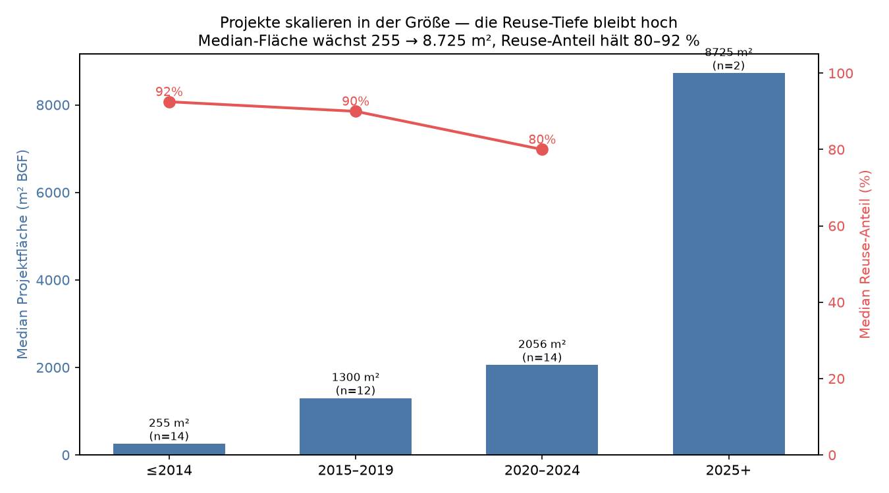
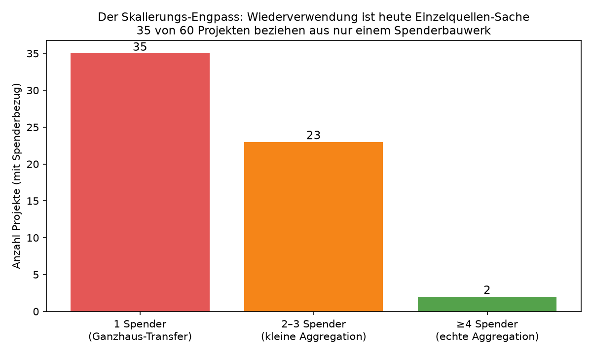

# Vorstudie: Was die Daten über das Entwerfen mit Bestand verraten

**Projekt:** Entwerfen mit Bestand — Eine offene Plattform für einen KI‑unterstützten,
performance‑optimierten und integrativen Entwurfsprozess mit wiederverwendeten
Baukomponenten (Zukunft Bau, F20‑24‑1‑338)

**Verbund:** Leibniz Universität Hannover (NGS) · UdK Berlin (KET)

---

## 1 Worum es geht

Vor der Entwicklung wurde das gesamte erreichbare Wissen über die Praxis der
Bauteil‑Wiederverwendung — reale Projekte, Akteure, Bauteile, Nachweise, Regelwerke,
Wirkungszahlen — in einem semantischen Modell zusammengeführt und **interpretiert**. Dieser
Bericht stellt nicht Zahlen aus, sondern **schließt aus den Daten auf das Wesen der
Wiederverwendung** und leitet daraus ab, *was die Plattform leisten muss*. Jede Erkenntnis
folgt dem Muster:

> **Interpretation (was die Daten bedeuten) → Datenbasis (Beleg) → Konsequenz für die Plattform**

**Datengrundlage.** Ausgewertet wurden 83 reale Wiederverwendungs‑Projekte, 677 Akteure,
364 dokumentierte Bauteilgruppen, 255 Performance‑Kennwerte sowie die zugehörigen
Nachweis‑ und Regelwerksbezüge in 9 Ländern. Alle genannten Zahlen sind **belegte
Einzelfälle** aus diesen Projekten.

---

## 2 Acht Erkenntnisse aus den Daten

### Erkenntnis 1 — Wiederverwendung kehrt die Entwurfslogik um

**Interpretation.** Im Neubau gilt: erst der Entwurf, dann werden Bauteile spezifiziert und
beschafft. Die Daten zeigen die **umgekehrte Logik**. Ein wiederverwendetes Bauteil ist
zuerst über das definiert, *was es ist* (Typ, Material, Herkunft) — eine Zielspezifikation
existiert nicht. Es wird mehrheitlich in einer **neuen** Funktion verbaut, und es stammt
fast immer aus der **unmittelbaren Nähe**. Das Bauteil sucht sich also seine Verwendung; man
entwirft **vom vorhandenen Objekt zur Funktion**, nicht von der gewünschten Funktion zum
beschafften Objekt.

**Datenbasis.** Von den Bauteilen mit dokumentiertem Funktionsbezug werden **53 % in einer
neuen Funktion** verbaut, nur 30 % in der gleichen; Typ, Material und Herkunft sind
durchgängig erfasst, eine Soll‑Spezifikation nie. Die Beispiel‑Bauteile von K.118 (unten)
sind alle über *Herkunftsobjekt + Material + Tragrolle* beschrieben — nicht über einen Bedarf.


**Konsequenz für die Plattform.** Das Tool muss die übliche CAD‑Logik **invertieren**:
Ausgangspunkt ist der erfasste Bestand, der Entwurf passt sich an. Gematcht wird nicht über
„gesuchte Funktion", sondern über **geometrisch‑strukturelle Eignung**. Genau das ist der
konzeptionelle Kern von „Entwerfen mit Bestand" — und der Auftrag an die KI‑Assistenz,
*andersartige* Verwendungen vorzuschlagen (§6.2.1, §8.1).

---

### Erkenntnis 2 — Die eigentliche Hürde ist die rechtliche Legitimität, nicht der Bauzustand

**Interpretation.** Über alle Materialien und Bauteiltypen hinweg ist die mit Abstand
häufigste Forderung der Nachweis des **Produktstatus / der Leistungserklärung** — und er
tritt fast immer gemeinsam mit der Materialprüfung auf. Physische Zustandsprüfungen
(Holzschutz, Sicherheitsglas) sind dagegen Randthemen. Daraus folgt eine nicht‑offensichtliche
Einsicht: Das Kernproblem ist nicht, *ob* ein Bauteil technisch noch taugt, sondern dass es
beim Ausbau seinen rechtlichen Status als „Bauprodukt" verliert — CE‑Kennzeichnung,
Leistungserklärung, Herkunftsnachweis. Ein einwandfreier Stahlträger muss rechtlich
**neu „erfunden"** werden.

**Datenbasis.** Produktstatus/Leistungserklärung betrifft **269 von 286** ausgearbeiteten
Bauteilgruppen und tritt **219‑mal gemeinsam** mit der Materialprüfung auf; die häufigste
ausgelöste Frage ist der *Bauproduktstatus* (214). Zustandsspezifische Prüfungen wie
Holzschutz (24) bleiben Spezialfälle. Die Nachweis‑Kaskade eines einzelnen Trägers zeigt,
wie aus zwei Fragen 16 Nachweise gegen zehn Rechtsbereiche werden:


**Konsequenz für die Plattform.** Die wirkungsvollste Funktion ist **kein Marktplatz,
sondern eine „Re‑Deklarations‑Maschine"**: ein Workflow, der aus Herkunft + Prüfung +
Erklärung die rechtliche Legitimität eines Bauteils rekonstruiert (digitaler Bauteilpass).
Das verschiebt den Produktkern von *finden* zu *nachweisbar machen* — und erklärt, warum die
Schnittstellendefinition den Produktstatus als Pflicht‑Metadatum führen muss (§6.1).

---

### Erkenntnis 3 — Stahl ist der Hebel, Holz die Forschungsfront

**Interpretation.** Drei unabhängige Beobachtungen fallen bei Stahl zusammen: Es ist (1) das
in der Praxis **meistbewegte** Material, (2) hat den **klarsten, standardisierten
Nachweisweg** (Standsicherheit, gestützt auf CEN/TS 1090‑201), und (3) sein Nachweis‑Profil
ist **rein strukturell** — kein Schadstoff‑ oder Feuchteproblem. Holz wird fast ebenso oft
wiederverwendet, trägt aber zusätzlich Holzschutz‑, Feuchte‑ und U‑Wert‑Fragen — also
**Zustandsunsicherheit**, die Stahl nicht kennt. Stahl‑Reuse ist damit bereits weitgehend
abgesichert; bei Holz liegen die ungelösten Probleme.

**Datenbasis.** In realen Flüssen dominiert Stahl (69 Bauteilgruppen) vor Holz (45). Die
Nachweis‑Fingerprints sind material‑charakteristisch: Stahl zieht *Standsicherheit (48 %)
und Befestigung (48 %)* nach sich, Holz zusätzlich *Holzschutz (28 %) und U‑Wert (47 %)*.


**Konsequenz für die Plattform.** Datengetriebene Roadmap: **erster Durchstich = Stahltragwerk**
(schnell nachweisbar, KET‑Tragwerk, Anschluss an bestehende Stahl‑Matching‑Werkzeuge), danach
gezielter Forschungsaufwand in die **Zustandsbewertung von Holz**. Das priorisiert AP‑Tool und
AP‑Validierung anhand der Evidenz statt nach Bauchgefühl.

---

### Erkenntnis 4 — Wiederverwendung ist ein Timing‑Problem, kein Suchproblem

**Interpretation.** Die Bauteil‑Flüsse sind nicht nur lokal, sondern **1:1 projektgekoppelt**
(ein Spenderbauwerk versorgt ein Empfängerprojekt). Verfügbarkeit hängt damit davon ab,
*wann* in der Nähe ein Gebäude zurückgebaut wird — nicht davon, wie groß ein Katalog ist. Die
knappe Ressource ist die **zeitliche Überschneidung** von Rückbau (Angebot) und Entwurfsphase
(Nachfrage). Das erklärt, warum große Online‑Marktplätze leerlaufen: Das Bauteil ist weg,
bevor der passende Entwurf existiert — oder der Entwurf steht, bevor das Bauteil anfällt. Die
am häufigsten dokumentierten Hürden — Verfügbarkeit, Mengen‑ und Terminunsicherheit — sind
**genau die Symptome dieses Timing‑Problems**.

**Datenbasis.** Reale Flüsse verlaufen praktisch ausnahmslos innerhalb desselben Landes und
über **sehr kurze Distanzen (Median 6,5 km)**; die Spender‑Empfänger‑Paare sind direkt und
einzeln. Die Hürden‑Auswertung führt Verfügbarkeit (34), Mengenunsicherheit (29) und
Terminunsicherheit (16) als Top‑Hindernisse.


**Konsequenz für die Plattform.** Der eigentliche Wert liegt in **Prognose und Reservierung
lokaler Rückbau‑Pipelines** — ein „Rückbau‑Radar", das mit Vorlauf meldet, *was wann in der
Region frei wird* — nicht in einem größeren Suchindex. Das begründet die Konsens‑/
Reservierungsfunktion (Auflage f) und ein **geo‑/zeitbewusstes Matching** als Kernfeature.

---

### Erkenntnis 5 — Der ökologische Nutzen ist belegt und groß, der Kostenvorteil nicht verlässlich

**Interpretation.** Die CO₂‑Wirkung der Wiederverwendung ist **konsistent hoch und immer
positiv**; die Kostenwirkung ist dagegen **richtungslos**. Das ist kein Messfehler, sondern
die Realität: Wiederverwendung spart zuverlässig Emissionen (erhaltene graue Energie), aber
die Kosten hängen vom arbeitsintensiven Einzelfall ab (Ausbau, Aufbereitung, Nachweis).
Reuse ist also **ökologisch zwingend, ökonomisch nur situativ** vorteilhaft.

**Datenbasis.** Belegte CO₂‑Reduktion: **Median 68 %** (Spanne 15–90 %); Reuse‑Anteil
Median 60 %; absolute Einsparungen bis 3.500 t. Die Kostenwerte streuen dagegen über fünf
Größenordnungen (von wenigen Euro bis dreistellige Millionen, je nach betrachtetem Umfang).


**Konsequenz für die Plattform.** Das Tool muss die Entscheidung über die **Klimawirkung**
führen (CO₂/Impact zuerst), Kosten projektspezifisch behandeln. Das Förder‑ und
Policy‑Argument ruht auf Carbon, nicht auf „billiger". Methodisch folgt daraus die
**projektspezifische Substitutions‑Ökobilanz** als Kern der Performance‑Bewertung (Auflage h).

---

### Erkenntnis 6 — Reuse‑Kompetenz steckt in wenigen, vertikal integrierten Regionalpionieren

**Interpretation.** Die Akteure, die das Feld tragen, sind jene, die die **gesamte Kette**
beherrschen — Ernte, Aufbereitung, Nachweis, Verkauf, Beratung — und sie sitzen in regionalen
Zentren (besonders der Schweiz). Wiederverwendung ist heute also ein **Handwerk, das einige
Pioniere end‑to‑end ausüben**, kein arbeitsteiliger Markt. Das entscheidende Wissen —
welche Nachweise ein Bauteil braucht, wie man Angebot und Bedarf zusammenbringt — ist
**personen‑ und firmengebunden, nicht geteilt**. Genau diese Routinen werden in den
Material‑Fingerprints (Erkenntnis 3) sichtbar.

**Datenbasis.** Mehrere Akteure decken alle Reuse‑Rollen ab (BauKarussell, Cycle Up, Mobius
Réemploi, Cleveland Steel & Tubes). Die Akteure, die unterschiedliche Partner überhaupt
verbinden, sind wenige Pioniere (Cirkla, Zirkular, baubüro in situ, Opalis, Bellastock):


**Konsequenz für die Plattform.** (a) Das tragfähige **Spin‑off‑Modell ist „integrierte
Beratung + Software"**, wie es diese Pioniere vorleben (§8.1/§8.6). (b) Der eigentliche
Auftrag der Plattform ist, dieses **artisanale Expertenwissen zu kodifizieren und zu
demokratisieren** — die Nachweis‑Routinen und Matching‑Heuristiken in Software zu gießen.
(c) Diese Pioniere sind die natürlichen **Pilot‑ und Anbindungspartner** (Auflage b).

---

### Erkenntnis 7 — Ein Bauteil trägt seine Tragrolle und seine Pflichten mit sich

**Interpretation.** Wiederverwendet werden vor allem **Hülle** (Fassade, Wand) und
**Primärstruktur** (Träger, Stütze, Decke) — die Bauteile mit hoher grauer Energie und klarer
Geometrie. Und mit dem Bauteil wandert sein **Pflichtenbündel**: tragende Teile ziehen stets
Standsicherheit und Befestigung nach sich, Hüllbauteile den U‑Wert. Ein wiederverwendetes
Bauteil ist deshalb nie „nur ein Objekt", sondern ein Objekt **mit angehängter statischer
Rolle und Nachweispflicht**.

**Datenbasis.** Häufigste Typen: Fassade (71), Wand (63), Träger (47), Boden/Decke (39/36).
Nachweise treten in stabilen **Bündeln** auf: Produktstatus + Materialprüfung fast immer,
plus *Standsicherheit + Befestigung* bei Tragteilen bzw. *U‑Wert* bei Hüllbauteilen.


**Konsequenz für die Plattform.** Das Datenmodell muss Bauteile als **tragende/raumbildende
Baugruppen mit gekoppelten Pflichten** führen, nicht als lose Artikel. Daraus folgen die
automatischen **Nachweis‑Bundles** (Basis / Tragwerk / Bauphysik) und die Anschlussfähigkeit
an die „Kit‑of‑Parts"‑Tragwerkslogik (KET).

---

### Erkenntnis 8 — Über Ländergrenzen hinweg ist die Reuse‑Regulierung dasselbe Muster

**Interpretation.** Unabhängig vom Land lösen wiederverwendete Bauteile **immer dieselben
Grundfragen** aus — Bauproduktstatus, Tragwerkssicherheit, Bauphysik, Brandschutz — und
verlangen dieselben **Nachweistypen**; nur die konkrete Norm dahinter wechselt (CEN/TS 1090
in DE/EU, SIA 269/2 in CH, Diagnostic PEMD in FR). Die regulatorische Logik der
Wiederverwendung ist also **europaweit strukturell gleich, nur lokal anders instanziiert**.

**Datenbasis.** Dieselben rund elf Regulierungsfragen und Nachweisforderungen treten in allen
betrachteten Ländern auf; die konkret hinterlegten Regelwerke unterscheiden sich (u. a.
CEN/TS 1090‑201, SIA 269/2, France PEMD/loi AGEC, DIN SPEC 91484, Norway TEK17).


**Konsequenz für die Plattform.** Eine **einzige Tool‑Logik** (Frage → Nachweis → Bundle)
generalisiert über Märkte; die konkrete Norm ist ein austauschbarer **„Länder‑Layer"**. Das
macht die Plattform mit überschaubarem Lokalisierungsaufwand international skalierbar — und
begründet die internationale Ausrichtung (§8) datenbasiert statt als Hoffnung.

---

## 3 Die Projekte im Skalierbarkeits‑Blick

Das Kernthema jeder Plattform‑Begründung lautet: **Lässt sich Wiederverwendung skalieren —
und was skaliert genau?** Die 83 dokumentierten Projekte erlauben, das entlang von vier
Dimensionen zu prüfen: *Tiefe* (welcher Anteil eines Baus ist wiederverwendet), *Größe*
(absolute Bauwerksgröße), *Bezug* (aus wie vielen Quellen wird beschafft) und *Replikation*
(Entwicklung über die Zeit).

> **Einzelbewertung je Projekt (RSI v6):** Gates G1–G6, 14 Kriterien K1–K14, Konfidenz A/B/C und
> 10 Archetypen bewerten **jedes einzelne Projekt** auf Skalierungsreife (Planung, Inventar,
> Qualität, Haftung, Logistik, Beschaffung, DfD, …). Kanonische Methodik:
> [`SKALIERBARKEITSKRITERIEN_RSI_v6.md`](SKALIERBARKEITSKRITERIEN_RSI_v6.md);
> Kurzüberblick [`REUSE_SCALABILITY_FRAMEWORK.md`](REUSE_SCALABILITY_FRAMEWORK.md);
> Rangliste [`PROJEKT_SKALIERBARKEIT_ANALYSE.md`](PROJEKT_SKALIERBARKEIT_ANALYSE.md) /
> [`_scal_table_v6.md`](_scal_table_v6.md);
> Leitlinien [`REUSE_GUIDELINES_UND_WORKFLOWS.md`](REUSE_GUIDELINES_UND_WORKFLOWS.md).
> Akteurs- und Kettenanalyse: [`AKTEURE_KETTEN_UND_LERNMUSTER.md`](AKTEURE_KETTEN_UND_LERNMUSTER.md).
> Verifizierter Korpus: **21 Projekte**; Median RSI final **36,2**; 62/83 mit Gate-Blocker.
> Entwurfsvertiefung: [`DESIGN_MIT_REUSE_PROJEKTE.md`](DESIGN_MIT_REUSE_PROJEKTE.md).
> **Forschungsanlage (eigenständig):** RSI v6, Projekt-Recherche (83/21)
> und extrahierte Muster — mit kompakter Folgerung für das Vorhaben — in
> [`ANLAGE_Forschungssynthese_Plattform.md`](ANLAGE_Forschungssynthese_Plattform.md).
> Die folgenden Abschnitte fassen die daraus abgeleiteten Muster zusammen.

### 3.1 Wiederverwendung hat die Pilotphase verlassen

**Interpretation.** Das gängige Bild — Reuse funktioniere nur im Pavillon oder in der
Ausstellung — hält den Daten nicht stand. Die dokumentierten Projekte sind **überwiegend
echte Bauten**, kein Modellbau. Damit ist die erste Skalierungsfrage — *„geht das überhaupt
jenseits von Demonstratoren?"* — empirisch bejaht.

**Datenbasis.** Median‑Fläche **2.000 m²** (bis 81.777 m²); von den größenbekannten Projekten
liegen **18 bei ≥ 2.000 m²**, davon 4 über 10.000 m². Nur 11 sind kleine Pilot‑/Pavillon‑Bauten
(< 500 m²).

**Konsequenz für die Plattform.** Das Tool muss **gebäudemaßstäbliche Inventare** verarbeiten
(hunderte Bauteile, mehrere Geschosse), nicht Demo‑Objekte — Anforderung an Datenmodell und
Performance.

### 3.2 Die Reuse‑Tiefe bricht mit der Größe kaum ein

**Interpretation.** Entscheidend für Skalierbarkeit ist nicht, *ob* ein großes Gebäude ein
paar Bauteile wiederverwendet, sondern *ob es einen hohen Anteil* schafft. Die Daten zeigen:
Der Reuse‑Anteil **bleibt auch bei großen Bauten hoch** — Wiederverwendung „verdünnt" sich
nicht mit der Größe. Die Befürchtung „im Großbau geht nur wenig Reuse" ist widerlegt.

**Datenbasis.** Median‑Reuse‑Anteil je Größenklasse: < 500 m² ≈ 90 %, 500–2.000 m² ≈ 90 %,
2.000–10.000 m² ≈ **80 %**. Belege für „groß **und** tief": **KA13** (NO, 4.297 m², 80 % Reuse,
**89 % CO₂‑Reduktion**), **Impact Hub Berlin** (3.500 m², 80 %), **Ferme du Rail Paris**
(2.300 m², 90 %).



**Konsequenz.** Das Wertversprechen (hoher Reuse‑Anteil → hohe CO₂‑Einsparung) **hält im
Maßstab**. Es lohnt sich, die Plattform von Anfang an für große Projekte zu bauen — dort
entsteht die größte absolute Wirkung.

### 3.3 Der eigentliche Skalierungs‑Engpass ist die Einzelquelle, nicht die Größe

**Interpretation.** Hier liegt die zentrale Einsicht. Die hohen Reuse‑Anteile werden heute
fast immer durch **Ganzhaus‑Transfer aus einer einzigen Spenderquelle** erreicht — ein
glücklicher 1:1‑Fund, bei dem ein passendes Abbruchgebäude ein neues speist. Sobald aus
**mehreren** Quellen aggregiert wird, sinkt der Anteil deutlich. Das heißt: Wiederverwendung
skaliert heute über den **Zufall der passenden Einzelquelle** — genau das lässt sich *nicht*
verallgemeinern. Die Abhängigkeit von der Einzelquelle ist der Grund, warum Reuse
handwerklich‑bespoke bleibt.

**Datenbasis.** Von 60 Projekten mit Spenderbezug beziehen **35 aus nur einem** Spenderbauwerk
(Median 1), 23 aus 2–3, und **nur 2 aus ≥ 4**. Die Ganzhaus‑Transfers erzielen hohe Anteile
(z. B. Recyclinghaus Hannover, 3 Spender, 90 %), während echte Aggregation heute niedrige
Anteile hat (Résilience, 4 Spender, ~13 %).



**Konsequenz für die Plattform.** Der **wichtigste Skalierungshebel** ist, die
**1:1‑Abhängigkeit aufzubrechen** — verteiltes Angebot vieler kleiner Quellen zu einem
Projekt zu **aggregieren** (many‑to‑many‑Matching). Das ist die eigentliche Existenz‑
begründung der Plattform: Reuse soll nicht mehr vom Fund des einen passenden Gebäudes
abhängen. Verbindet sich direkt mit dem „Rückbau‑Radar" (Erkenntnis 4) und dem
geo‑bewussten Matching.

### 3.4 Reuse skaliert durch Wiederholung, nicht durch Vielfalt

**Interpretation.** Große Projekte dokumentieren **nicht mehr Bauteil‑Vielfalt** als kleine —
sie verwenden **mehr vom Gleichen** wieder. Skalierung geschieht also über **Standardisierung
und Menge** (viele gleichartige Bauteile), nicht über eine wachsende Typenzahl.

**Datenbasis.** Median‑Bauteilgruppen je Projekt bleibt über alle Größenklassen ähnlich
(≈ 5–7), unabhängig von der Fläche.

**Konsequenz.** Katalog und Matching sollten auf **Mengen gleichartiger Bauteile** und
standardisierte Typen (Stahlrahmen, Fassadenmodule) optimieren — deckt sich mit der
„Kit‑of‑Parts"‑Logik (Erkenntnis 7) und macht Wiederverwendung reproduzierbar.

### 3.5 Die Zeitreihe zeigt eine klare Skalierungs‑Trajektorie

**Interpretation.** Über das letzte Jahrzehnt sind Reuse‑Projekte **systematisch größer**
geworden, haben begonnen, aus **mehr Quellen** zu schöpfen, und halten dabei einen hohen
Reuse‑Anteil. Wiederverwendung bewegt sich also **vom kleinen High‑Share‑Pilot zum großen,
zunehmend aggregierten Regelbau** — die Branche ist an einem Skalierungs‑Wendepunkt, an dem
genau die fehlende Infrastruktur (Aggregation, Matching) zum Flaschenhals wird.

**Datenbasis.** Median‑Fläche nach Fertigstellung: ≤ 2014 **255 m²** → 2015–2019 **1.300 m²**
→ 2020–2024 **2.056 m²** → 2025+ **8.725 m²**; Median‑Spenderzahl steigt von 1 auf 2; der
Reuse‑Anteil hält 80–92 %.

**Konsequenz.** Die Plattform trifft den Zeitpunkt: Sie liefert die Aggregations‑ und
Nachweis‑Infrastruktur genau dann, wenn Projekte den Maßstab erreichen, an dem die
handwerkliche Einzelquellen‑Methode nicht mehr trägt.

### 3.6 Skalierbarkeits‑Fazit

Wiederverwendung ist **in Tiefe und Größe nachweislich skalierbar** (hohe Anteile bis in den
mehrtausend‑m²‑Bereich, wachsende Projektgrößen über die Zeit). Was sie heute *begrenzt*, ist
nicht die Technik oder die Gebäudegröße, sondern das **bespoke Einzelquellen‑Sourcing**. Der
Übergang von *„das eine passende Abbruchhaus finden"* zu *„verteiltes regionales Angebot
aggregieren"* ist die Aufgabe, die eine Plattform lösen muss — und der präzise Punkt, an dem
das Vorhaben ansetzt.

---

## 4 Was daraus zu bauen ist

Die acht Erkenntnisse übersetzen sich direkt in Bauentscheidungen:

| Aus Erkenntnis | Bauentscheidung | Antrag / AP |
|---|---|---|
| 1 Umgekehrte Entwurfslogik | Inventar‑first‑Workflow; Matching über Eignung statt Bedarf; KI schlägt Umnutzungen vor | §6.2.1, AP‑Tool |
| 2 Legitimität ist die Hürde | Re‑Deklaration / digitaler Bauteilpass als Kernfunktion; Produktstatus als Pflichtfeld | §6.1, AP‑Plattform |
| 3 Stahl zuerst, Holz Forschungsfront | Erster Durchstich Stahltragwerk; Holz‑Zustandsbewertung als Forschungsfokus | AP‑Validierung |
| 4 Timing statt Suche | Rückbau‑Radar (Prognose) + Reservierung; geo‑/zeitbewusstes Matching | Auflage f, AP‑Tool |
| 5 Carbon zwingt, Kosten nicht | Klimawirkung als Entscheidungsführung; Substitutions‑LCA als Kern | Auflage h |
| 6 Wissen ist artisanal | Expertenroutinen kodifizieren; „Beratung + Software"‑Spin‑off; Pioniere als Piloten | §8.1, Auflage b |
| 7 Bauteil = Rolle + Pflicht | Datenmodell als Baugruppen mit Pflichten; automatische Nachweis‑Bundles | AP‑Tool |
| 8 Gemeinsames EU‑Muster | Generische Logik + austauschbarer Länder‑Norm‑Layer | §8 |

**Pflichtfelder des MVP‑Schemas** (aus 1, 2, 7): Typ, Material, Funktion, **Herkunft** und
**Produktstatus** als Kern; Tragwerksattribute (tragend, Querschnitt, Tragwerksprinzip) per
gezielter **Nutzereingabe**, weil sie aus dem Bestand selten mitkommen — exakt die offene
Frage aus §6.1.

---

## 5 Test‑Case‑Empfehlung für die Validierung

Der Antrag verlangt einen Test‑Case auf Basis realen Bestands. Aus der Dichte und Qualität
der dokumentierten Projekte lässt sich der Kandidat **begründet ableiten**:

| Projekt | Land | Bauteilgr. | Kennw. | Spender | Profil |
|---|---|---:|---:|---:|---|
| **K.118 Winterthur** | CH | 16 | 8 | 2 | beste Balance aus Bauteilvielfalt **und** Wirkungsdaten |
| **Recyclinghaus Hannover** | DE | 9 | 5 | 4 | sehr ausgewogen, am **NGS‑Standort** |
| **Plattenvereinigung Berlin** | DE | 4 | 1 | 11 | reichste Herkunfts‑/Nachweis‑Kette, Nähe zu KET |
| MedUni Campus Wien | AT | 20 | 0 | 4 | größte Bauteilvielfalt |
| Résilience (Stains) | FR | 7 | 10 | 6 | reichste Performance‑Daten |

**Empfehlung.** **K.118** als primärer Demonstrator (vereint die meisten Anforderungen und
ist zugleich ein Stahl‑Reuse‑Fall — Erkenntnis 3), **Recyclinghaus Hannover** als logistisch
bevorzugter realer Test am NGS‑Standort, **Plattenvereinigung Berlin** als Referenz für die
Herkunfts‑/Nachweis‑Kette (KET). Der erste End‑to‑End‑Durchstich sollte ein **Stahltragwerk**
sein.

---

## 6 Fazit

Die Vorstudie liefert mehr als eine Bestandsaufnahme: Sie **deutet** die Praxis der
Wiederverwendung und macht daraus konkrete Bauvorgaben. Die zentralen Einsichten —
*Wiederverwendung kehrt den Entwurf um*, *die Hürde ist rechtliche Legitimität*, *Stahl ist
der Hebel*, *Timing schlägt Suche*, *Carbon zwingt, Kosten nicht*, *Wissen ist artisanal*,
*Bauteile tragen ihre Pflichten*, *Europa teilt ein Regulierungsmuster* — definieren
gemeinsam, **welche Plattform gebaut werden muss** und in welcher Reihenfolge.

Die Projekt‑Analyse (§3) fügt die **Skalierbarkeits‑These** hinzu: Wiederverwendung ist in
Tiefe und Größe bereits nachweislich skalierbar (hohe Reuse‑Anteile bis in den
mehrtausend‑m²‑Bereich, über die Zeit wachsende Projekte) — begrenzt wird sie allein durch
das **bespoke Einzelquellen‑Sourcing**. Genau dort setzt die Plattform an: Sie ersetzt den
Zufall der passenden Einzelquelle durch **aggregiertes, regionales Angebot**. Damit startet
das Vorhaben mit belegtem Problem‑, Markt‑, Methodik‑ und Skalierungsverständnis und reduziert
unmittelbar die Risiken Requirement‑Mismatch und Scope‑Creep (§7.3).

---

## Anhang A — Abbildungen

| Datei | Inhalt | belegt Erkenntnis |
|---|---|---|
| `B1_bauteilgruppen_k118.png` | Bauteilgruppen K.118 (objektdefiniert) | 1 |
| `C2_regelkette.png` | Nachweis‑Kaskade eines Trägers | 2 |
| `DEEP_fingerprint.png` | Material → Nachweis‑Fingerprint | 3, 7 |
| `B2_spender_empfaenger.png` | Spender→Empfänger‑Flüsse (lokal) | 4 |
| `D1_huerden.png` | Hürden (Symptome v. a. von 1/3/4) | 4 |
| `DEEP_ranges.png` | belegte Wirkungsspannen | 5 |
| `DEEP_brokers.png` | Brücken/Pioniere des Feldes | 6 |
| `A1_..` / `A2_..` / `A3_..` | Ökosystem, Hubs, Länderverteilung | 6 |
| `B3_bauteiltyp_material.png` | Bauteiltyp ↔ Material | 7 |
| `C1_normen_nach_land.png` | Rechtsdomänen nach Land | 8 |
| `DEEP_scal_trajectory.png` | Projektgröße/‑tiefe über die Zeit | §3.2/§3.5 |
| `DEEP_scal_sourcing.png` | Bezugsmodell (Einzelquelle vs. Aggregation) | §3.3 |

Roh‑Knoten/‑Kanten je Abbildung: `report_snapshots/<id>.json`.

## Anhang B — Reproduzierbarkeit

Generatoren: `_report_snapshots.py` (Abbildungen A–D), `_analyze.py`, `_analyze_deep.py` und
`_analyze_scalability.py` (Auswertungen → `analysis_results.json`, `deep_analysis_results.json`,
`scalability_results.json`), `_report_deep_figs.py` und `_report_scal_figs.py` (`DEEP_*.png`).
Datenbank: `mit-bestand` (Neo4j, `bolt://localhost:7687`).

## Anhang C — Belegende Cypher‑Abfragen

### Funktionswechsel (Erkenntnis 1)
```cypher
MATCH (bg:Bauteilgruppe) WHERE bg.funktionswechsel IS NOT NULL
RETURN bg.funktionswechsel AS funktionswechsel, count(*) AS n ORDER BY n DESC;
```

### Nachweis‑Häufigkeit und Bündel (Erkenntnis 2, 7)
```cypher
MATCH (bg:Bauteilgruppe)-[:ERFORDERT_NACHWEIS]->(nf:Nachweisforderung)
RETURN nf.name AS nachweis, count(DISTINCT bg) AS bauteilgruppen ORDER BY bauteilgruppen DESC;

MATCH (bg:Bauteilgruppe)-[:ERFORDERT_NACHWEIS]->(n1:Nachweisforderung)
MATCH (bg)-[:ERFORDERT_NACHWEIS]->(n2:Nachweisforderung) WHERE n1.name < n2.name
RETURN n1.name AS a, n2.name AS b, count(DISTINCT bg) AS gemeinsam ORDER BY gemeinsam DESC LIMIT 20;
```

### Material‑Fingerprint und reale Flüsse (Erkenntnis 3, 4)
```cypher
MATCH (m:Material)<-[:NUTZT_MATERIAL]-(bg:Bauteilgruppe)-[:ERFORDERT_NACHWEIS]->(nf:Nachweisforderung)
RETURN m.name AS material, nf.name AS nachweis, count(DISTINCT bg) AS bg ORDER BY material, bg DESC;

MATCH (sp:Bauwerk)<-[:AUS_SPENDER]-(bg:Bauteilgruppe)-[:IN_EMPFANGSOBJEKT]->(emp:Bauwerk)
OPTIONAL MATCH (sp)-[:LIEGT_IN_LAND]->(spl:Land)
OPTIONAL MATCH (emp)-[:LIEGT_IN_LAND]->(empl:Land)
RETURN spl.name AS sp_land, empl.name AS emp_land, count(DISTINCT bg) AS bg ORDER BY bg DESC;
```

### Wirkungszahlen (Erkenntnis 5)
```cypher
MATCH (k:Kennwert) WHERE k.wert IS NOT NULL
RETURN k.category AS kategorie, k.kennwert AS kennwert, k.wert AS wert, k.einheit AS einheit ORDER BY kategorie;
```

### Voll‑integrierte Operatoren und Brücken (Erkenntnis 6)
```cypher
MATCH (a:Akteur) WITH a, count { (a)-[:HAT_AKTEURROLLE]->() } AS rollen WHERE rollen >= 4
RETURN a.name AS name, rollen ORDER BY rollen DESC LIMIT 15;
```

### Gemeinsames Regulierungsmuster (Erkenntnis 8)
```cypher
MATCH (bg:Bauteilgruppe)-[:TRIGGERS_REGULIERUNGSFRAGE]->(rf:Regulierungsfrage)
RETURN rf.name AS frage, count(DISTINCT bg) AS bauteilgruppen ORDER BY bauteilgruppen DESC;

MATCH (law) WHERE any(l IN labels(law) WHERE l ENDS WITH 'recht')
WITH law, count { (law)<-[:GESTUETZT_AUF_REGELWERK]-() } AS incidence WHERE incidence > 0
RETURN coalesce(law.name, law.id) AS regelwerk, incidence ORDER BY incidence DESC LIMIT 25;
```

### Projekt‑Skalierbarkeit (§3): Größe, Tiefe, Bezug, Zeit
```cypher
// Größe, Fläche, Bauteilbreite und Spenderzahl je Projekt
MATCH (p:Projekt)
OPTIONAL MATCH (p)-[:LIEGT_IN_LAND]->(land:Land)
RETURN p.name AS projekt, land.name AS land, p.year_completed AS jahr,
       p.area_m2_gross AS flaeche_m2,
       count { (p)-[:HAT_BAUTEILGRUPPE]->(:Bauteilgruppe) } AS bauteilgruppen,
       count { (p)-[:HAT_BAUTEILGRUPPE]->(:Bauteilgruppe)-[:AUS_SPENDER]->(b:Bauwerk) } AS spender_kanten
ORDER BY flaeche_m2 DESC;

// Reuse-Anteil je Projekt (Tiefe)
MATCH (p:Projekt)-[:HAT_KENNWERT]->(k:Kennwert)
WHERE k.category='reuse_share' AND k.wert IS NOT NULL AND k.einheit STARTS WITH '%'
RETURN p.name AS projekt, max(k.wert) AS reuse_anteil_prozent ORDER BY reuse_anteil_prozent DESC;

// Bezugsmodell: distinkte Spenderbauwerke je Projekt (Einzelquelle vs. Aggregation)
MATCH (p:Projekt)-[:HAT_BAUTEILGRUPPE]->(:Bauteilgruppe)-[:AUS_SPENDER]->(b:Bauwerk)
RETURN p.name AS projekt, count(DISTINCT b) AS spenderbauwerke ORDER BY spenderbauwerke DESC;
```
