# Vorstudie als Wissensgraph — Datenanalyse, Erkenntnisse und Implikationen für die Plattform

> **Hinweis:** Dies ist die ältere, stärker statistisch/befund‑orientierte Fassung
> (Struktur *Leitfrage → Befund → Erkenntnis → Implikation* mit Teil II Tiefenanalyse).
> Die aktuelle, interpretationsgeführte Fassung steht in `VORSTUDIE_GRAPH_REPORT.md`.

**Projekt:** Entwerfen mit Bestand — Eine offene Plattform für einen KI‑unterstützten,
performance‑optimierten und integrativen Entwurfsprozess mit wiederverwendeten
Baukomponenten (Zukunft Bau, F20‑24‑1‑338)

**Verbund:** Leibniz Universität Hannover (IEK / Nachhaltige Gebäudesysteme, NGS) ·
UdK Berlin (Konstruktives Entwerfen und Tragwerksplanung, KET)

---

## 1 Zweck: Forschung vor der Umsetzung

Vor Beginn der Plattformentwicklung wurde das Feld der Bauteil‑Wiederverwendung
systematisch in einem **semantischen Wissensgraphen** (Neo4j, Datenbank `mit-bestand`,
**2.263 Knoten / 15.060 Relationen**) erfasst und ausgewertet. Dieser Bericht ist **keine
reine Beschreibung** der Daten, sondern leitet aus ihnen **konkrete Entwurfs‑
entscheidungen für die Plattform** ab. Jede Sektion folgt dem Muster:

> **Leitfrage → Datenbefund (mit Zahlen) → Erkenntnis → Implikation für die Plattform**

Die Vorstudie wirkt damit doppelt: Sie **belegt** Problemlage und Marktumfeld (Antrag
§4.1/§4.2, Auflage b) und ist zugleich ein **lauffähiger Proof‑of‑Concept des
Datenmodells** (Antrag §3.1/§6.1).

**Datenbasis (Auszug):** 677 Akteure · 83 Projekte · 364 Bauteilgruppen (davon **286
inhaltlich ausgearbeitet**) · 184 Bauwerke · 255 Performance‑Kennwerte · 16 Bauteiltypen
· 24 Materialien · 11 Regulierungsfragen · 27 Nachweisforderungen · 11 typisierte
Rechtsdomänen · 11 Hürden.

> **Methodischer Hinweis (Belastbarkeit):** Der Graph ist ein kuratiertes,
> quellenbelegtes Forschungsdatenset, **keine vollständige Marktzählung**. Zahlen sind
> als *kartierte/belegte* Häufigkeiten zu lesen. Bekannte Abdeckungslücken werden
> ausdrücklich benannt (siehe §6 und §7).

---

## 2 Kernergebnisse auf einen Blick

| # | Erkenntnis aus den Daten | Implikation für den Bau der Plattform | Antrag |
|---|---|---|---|
| 1 | Reuse‑Feld ist real, aber lose gekoppelt; Multiplikatoren namentlich identifizierbar | **Integrationsreihenfolge:** zuerst Concular (reife API + Nachweis‑Software) & Madaster (Material‑Pass/Ontologie), dann Cirkla/bauteilnetz für Reichweite | §4.1, Auflage b, §8.1 |
| 2 | Typ + Material + Funktion + Herkunft sind gut dokumentiert; **Tragwerksattribute fast leer** (tragend 29 %, Tragwerksprinzip 9 %) | MVP‑Schema: diese vier Felder als Pflicht; Tragwerksdaten **per Nutzereingabe** im Tool erheben (nicht aus Börsen erwartbar) | §6.1, AP‑Tool |
| 3 | **53 % der Bauteile werden umgenutzt** (neue Funktion), nur 30 % gleiche Funktion | KI‑Assistenz muss **funktionsübergreifend** vorschlagen („andersartige Bauteile"), nicht nur like‑for‑like matchen | §8.1, §6.2.1 |
| 4 | Dominante Nachweise: Produktstatus (269), Materialprüfung (222), **Standsicherheit (116) + U‑Wert/Energie (112)** | Feature‑Priorität des Performance‑Tools genau = die beiden Projekt‑Features (Tragwerk/KET + LCA/NGS); Produktstatus als Pflicht‑Metadatum | §6.1, AP‑Tool |
| 5 | Performance‑Daten sind **uneinheitlich**: nur 60 % numerisch, Methode/Bilanzgrenze meist „unbekannt", gemischte Einheiten | Plattform muss **normiertes Kennwert‑Schema** erzwingen (Einheit, Bilanzgrenze A–D, Methode, URI) statt Werte zu „ernten" | §6.1, Auflage h, Auflage g |
| 6 | Stahl ist das meist‑wiederverwendete Material in realen Flüssen (69 BG) | **Erster End‑to‑End‑Test‑Case: Stahltragwerk** (klarer Standsicherheitsnachweis, Vorarbeit HTS Stockmatcher) | AP‑Validierung |
| 7 | Bestbelegte Projekte als Test‑Case‑Kandidaten identifizierbar | **Datengestützte Test‑Case‑Empfehlung** (K.118 / Recyclinghaus Hannover / Plattenvereinigung Berlin) statt Annahme | AP‑Validierung |
| 8 | Norm‑Layer für DE/NL/FR/BE/AT/Nordics dicht, für **CH/UK dünn** (je 6 Knoten) | Bekannte Lücke; vor Schweizer Test‑Case **CH‑Normabdeckung nachziehen** | §6.1 |

**Tiefenanalyse — zusätzliche Erkenntnisse (Teil II, §10):**

| # | Erkenntnis aus den Daten | Implikation für den Bau der Plattform | Antrag |
|---|---|---|---|
| 9 | Netzwerk ist **stark fragmentiert**: 167 Akteure, **36 Komponenten**, größte nur 21 %; Brücken sind messbar (Betweenness) | **Cirkla ist Keystone** (höchste Betweenness + Articulation Point); Onboarding der echten Brücken härtet das Netz – nicht nach Grad, sondern nach Brückenfunktion priorisieren | §4.1, Auflage b |
| 10 | Reale Bauteil‑Flüsse sind **lokal**: 129 lokal vs. 1 grenzüberschreitend; Transport‑Median **6,5 km** | **Geo‑/Radius‑bewusstes Matching** als Kernfunktion; LCA‑Transportannahmen kurz → Reuse‑Vorteil bleibt erhalten | AP‑Tool, Auflage h |
| 11 | Nachweise treten in **festen Bündeln** auf (Materialprüfung+Produktstatus 219; +Standsicherheit 116) | Tool liefert **Nachweis‑Bundles** (Basis / Tragwerk / Bauphysik) statt Einzel‑Items | AP‑Tool |
| 12 | **Material‑Fingerprints** quantifiziert (Stahl→Standsicherheit/Befestigung 48 %; Holz→Holzschutz 28 %, U‑Wert 47 %) | Nachweis‑Checkliste **nach Material automatisch vorbelegen** (empirische Wahrscheinlichkeiten) | AP‑Tool |
| 13 | Belegte Wirkung: CO₂‑Reduktion **Median 68 %** (15–90), Reuse‑Anteil **Median 60 %**; Kosten unbrauchbar (99 €–312 M€) | Evidenzbasis für Förder‑/Wirkungsargument; Kosten **nur normiert** zeigen | §4.1, Auflage h |
| 14 | Konkrete **Regelwerke** identifiziert (CEN/TS 1090‑201, SIA 269/2, France PEMD, DIN SPEC 91484 …) | **Seed‑Liste für die Compliance‑Wissensbasis** des Tools | §6.1, AP‑Tool |
| 15 | **Voll‑integrierte Reuse‑Operatoren** (8 Rollen: BauKarussell, Cycle Up, Mobius …) | Vorlage für das **Spin‑off‑Geschäftsmodell** und ideale Pilotpartner | §8.1, §8.6 |

---

## 3 Das Ökosystem — Marktlücke und Multiplikator‑Roadmap

### 3.1 Das Feld ist vernetzt, aber unkoordiniert (A1)

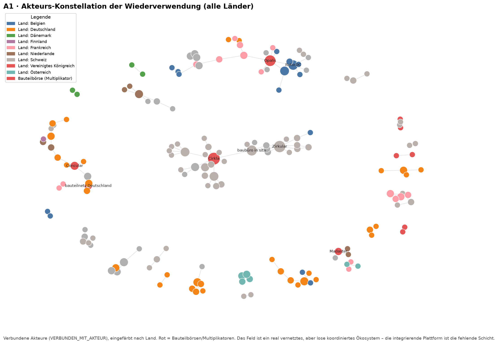

**Befund.** 167 über `VERBUNDEN_MIT_AKTEUR` verbundene Akteure in 9 Ländern; das Netz
zerfällt sichtbar in viele Teilcluster statt einer durchgängigen Struktur.

**Erkenntnis.** Das Feld existiert, ist aber fragmentiert — es fehlt die **integrierende,
maschinenlesbare Schicht**. Genau diese Lücke adressiert die Plattform (§4.1).

### 3.2 Die zentralen Multiplikatoren und ihr Reifegrad (A2 + Profile)

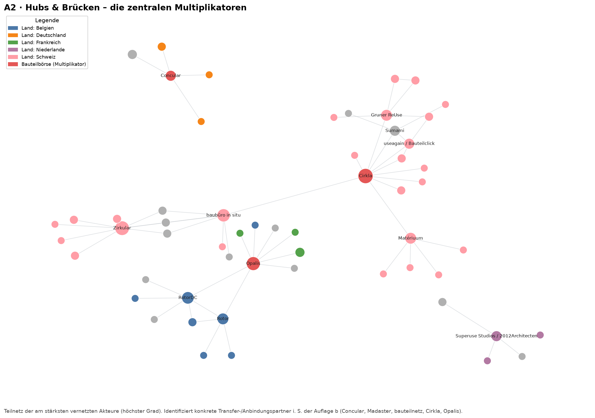

**Befund (Grad‑Ranking & Profil der Bauteilbörsen):**

| Börse | Land | Grad | Software | Geschäftsmodelle | Schlüsselrollen |
|---|---|---:|---:|---:|---|
| **Cirkla** | CH | 12 | 0 | 0 | Beratung, Bildung, Dokumentation |
| **Opalis** | BE | 8 | 1 | 1 | Marketplace, Doku, Software |
| **Concular** | DE | 5 | 2 | 3 | **Fachplanung/Nachweis**, Marketplace, **Software** |
| **Madaster** | CH | 3 | 0 | 1 | Material‑Pass, Marketplace |
| **bauteilnetz** | DE | 3 | 0 | 1 | Marketplace, Redistribution, Bildung |

**Erkenntnis.** Reichweite (Cirkla, hoher Grad) und technischer Reifegrad (Concular: 2
Software, Rolle *Fachplanung/Nachweis*) liegen bei **unterschiedlichen** Akteuren.
Madaster bringt die Material‑Pass‑Ontologie mit (relevant für Auflage g).

**Implikation für die Plattform (AP‑Plattform „beispielhafte Anbindung"):**
1. **Concular zuerst** — reifste API + bereits vorhandene Nachweis‑/LCA‑Software macht die
   Schnittstellen‑Referenzimplementierung am schnellsten demonstrierbar (Erfolgsindikator 1).
2. **Madaster** für die **Material‑Pass‑/Ontologie‑Ausrichtung** (Auflage g: Re:WOOD/ROBETON‑Anschluss über URIs).
3. **Cirkla & bauteilnetz** als Reichweiten‑/Community‑Kanäle (§8.1, Erfolgsindikator 3).

### 3.3 Internationale Skalierbarkeit & Marktstruktur (A3 + Geschäftsmodelle)

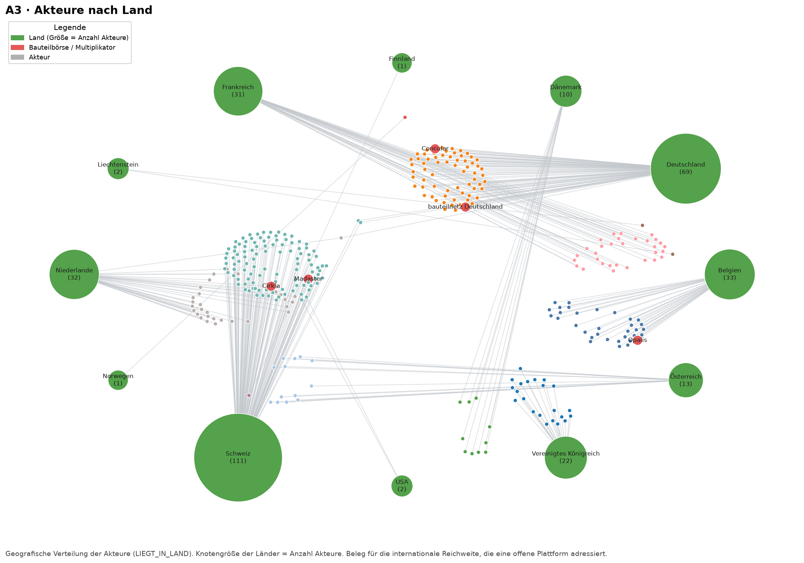

**Befund.** 322 verortete Akteure in 12 Ländern (Schweiz 111, Deutschland 69, Belgien 33,
Niederlande 32, Frankreich 31, UK 22, …). Geschäftsmodelle verteilen sich auf:
Urban‑Mining‑Dienstleister mit Verkaufskanal (28), Multi‑Vendor‑Marktplatz (28), Shop mit
Eigenstock (27), SaaS‑Inventarplattform (7), Netzwerk/Aggregator (7).

**Erkenntnis.** Der Markt ist (a) mehrländrig mit starker Schweizer Blase und (b) in drei
konkurrierende Geschäftsmodelle zersplittert. Eine **neutrale, offene Plattform, an die
alle Modelle andocken**, besetzt eine Lücke, ohne als weiterer Marktplatz zu konkurrieren.

**Implikation.** Positionierung als **interoperable Infrastruktur** (nicht als
Marktplatz) ist strategisch korrekt — stützt das Open‑Source‑/Spin‑off‑Modell „Beratung +
Software" (§8.1, §8.6).

---

## 4 Semantische Bauteil‑Repräsentation — Schema‑Realität

### 4.1 Was ist tatsächlich dokumentierbar? (Feldabdeckung)

**Befund (von 364 Bauteilgruppen):**

| Feld / Beziehung | Abdeckung | Anteil |
|---|---:|---:|
| Bauteiltyp (`HAT_BAUTEILTYP`) | 286 | 79 % |
| Material (`NUTZT_MATERIAL`) | 283 | 78 % |
| Alte/Neue Funktion | 248 | 68 % |
| Herkunft/Spender (`AUS_SPENDER`) | 187 | 51 % |
| **Tragend‑Status** | **106** | **29 %** |
| **Tragwerksprinzip** | **33** | **9 %** |
| **Bauproduktstatus** | **32** | **9 %** |

**Erkenntnis.** Typ, Material, Funktion und Herkunft sind natürlich gut belegt —
**tragwerks‑ und bauproduktrechtlich relevante Attribute jedoch kaum**. Das ist genau die
Datenlücke, die in der Praxis Nachweise blockiert.

**Implikation für das MVP‑Schema (Schnittstellendefinition):**
- **Pflichtfelder** (hohe natürliche Abdeckung): Typ, Material, Funktion, Herkunft/Spender.
- **Tragwerksattribute** (tragend, Querschnitt, Tragwerksprinzip) sind **nicht aus
  Börsendaten erwartbar** → müssen im Tool **per gezielter Nutzereingabe** erhoben werden.
  Das bestätigt die Forschungsfrage §6.1 (welche Nutzereingaben sind nötig) empirisch und
  weist die Aufgabe klar dem KET‑Tragwerks‑Feature zu.

### 4.2 Beispiel K.118: das Schema funktioniert (B1)

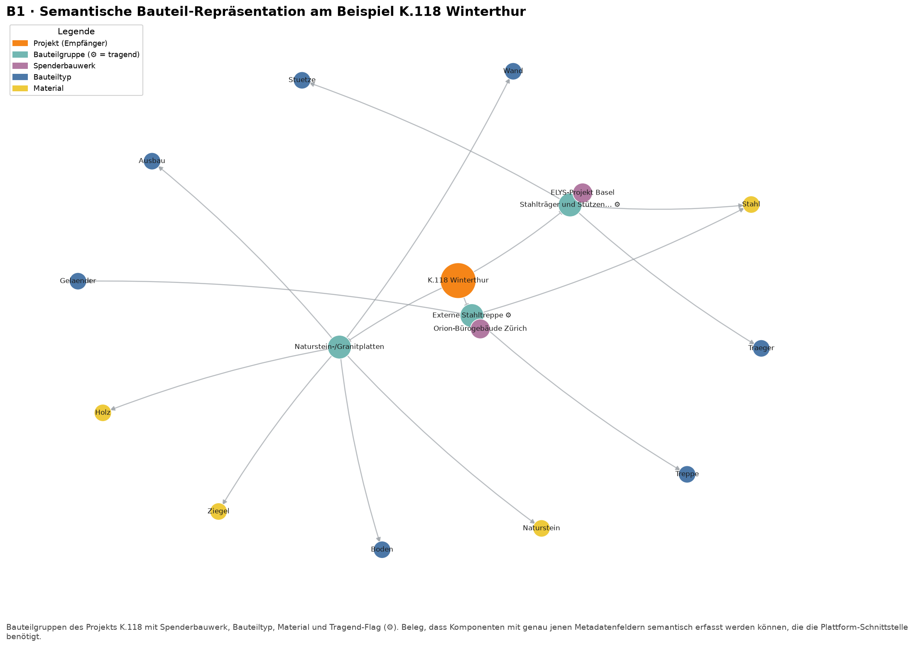

**Befund.** K.118 (in der Antrags‑Literatur geführt) trägt dokumentierte Bauteilgruppen
mit Spender, Typ, Material und Tragend‑Flag — z. B. *Stahlträger/Stützen* (Spender:
ELYS‑Projekt Basel, tragend) und *Externe Stahltreppe* (Spender: Orion‑Bürogebäude Zürich,
tragend).

**Implikation.** Belegt, dass die geplante Schnittstelle reale Bestände abbilden kann; sie
baut nicht auf der grünen Wiese auf.

### 4.3 Wiederverwendung = Umnutzung (Funktionswechsel)

**Befund (von 246 Bauteilgruppen mit Angabe):** Neue Funktion **131 (53 %)**, gleiche
Funktion 74 (30 %), konstruktive Funktion 24 (10 %), technische Funktion 10 (4 %).

**Erkenntnis.** Die **Mehrheit der wiederverwendeten Bauteile wird umgenutzt**, nicht
1:1 weiterverwendet.

**Implikation für die KI‑Assistenz (§6.2.1, §8.1).** Ein reines „gleichartige Komponente
finden"‑Matching greift zu kurz. Die LLM‑Assistenz muss **funktionsübergreifende
Vorschläge** liefern („andersartige Baukomponenten anregen") — die Daten liefern dafür den
empirischen Auftrag und reale Trainings-/Few‑Shot‑Beispiele (alte→neue Funktion).

### 4.4 Komponenten‑Vokabular & reale Flüsse (B3 + B2)

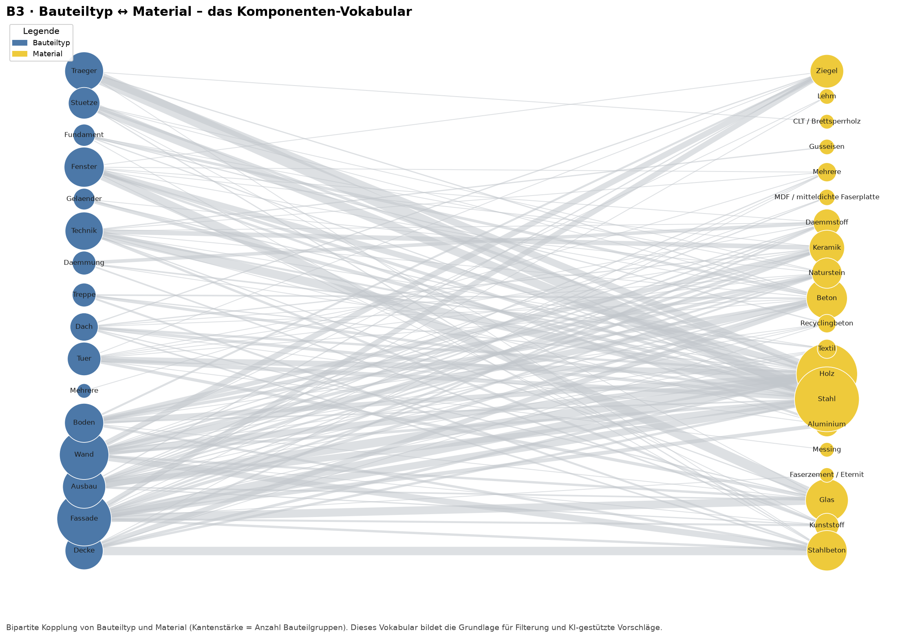

**Befund.** Häufigste Bauteiltypen: Fassade (71), Wand (63), Träger (47), Ausbau (44),
Boden (39), Decke (36). Häufigste Materialien: Stahl (91), Holz (80), Glas (35),
Stahlbeton (32), Beton (31). **In realen Spender→Empfänger‑Flüssen** dominiert Stahl
(69 BG) vor Holz (45), Stahlbeton (28), Glas (28).

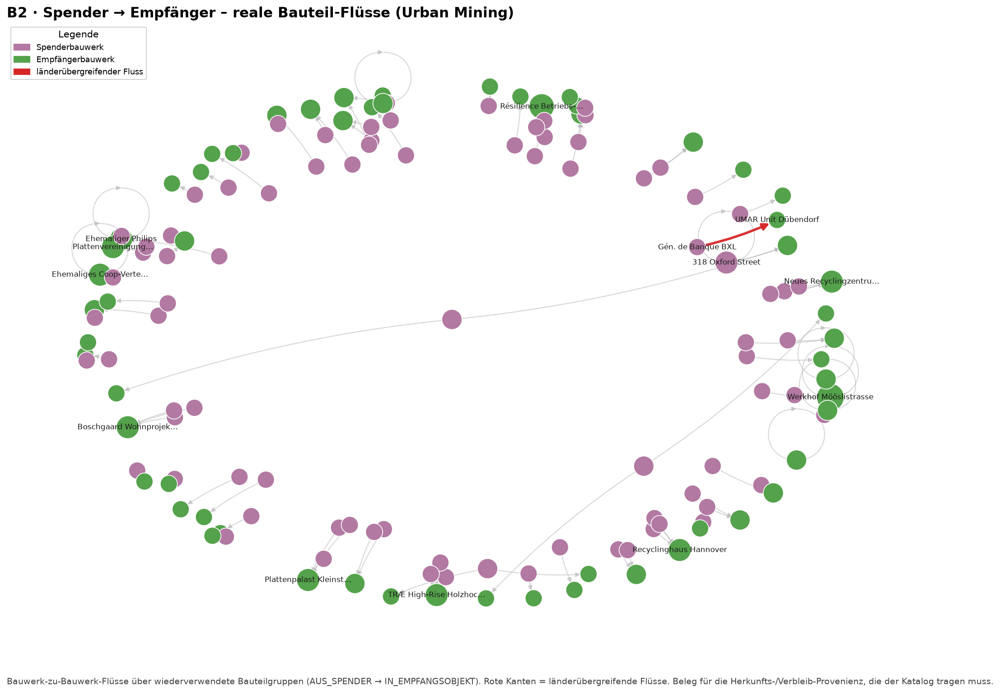

**Erkenntnis.** Stahl ist das in der Praxis am häufigsten zwischen Bauwerken bewegte
Material — mit dem klarsten, normierbaren Nachweis (Standsicherheit) und vorhandener
Vorarbeit (HTS Reused Steel Stockmatcher).

**Implikation (AP‑Validierung).** Der **erste End‑to‑End‑Durchstich sollte ein
Stahltragwerk** sein: maximale Praxisrelevanz, klar quantifizierbarer Tragwerksnachweis,
direkte Anschlussfähigkeit an die Stahl‑Reuse‑Literatur (Brütting et al.) im Antrag.

---

## 5 Performance‑ und Nachweisdaten — Tool‑Priorität & Methodik

### 5.1 Welche Nachweise muss das Tool zuerst können?

**Befund (Nachweisforderungen über Bauteilgruppen):**

| Nachweis | Bauteilgruppen |
|---|---:|
| Produktstatus / Leistungserklärung | 269 |
| Materialprüfung | 222 |
| **Standsicherheitsnachweis** | 116 |
| **U‑Wert / Energie‑Info** | 112 |
| Herkunfts‑/Rückbaudokumentation | 63 |
| Befestigungsnachweis | 44 |

Auslösende Regulierungsfragen: Bauproduktstatus (214), **Tragwerkssicherheit (167)**,
Bauphysik (112), Reuse‑Dokumentation (73), Brandschutz (71).

**Erkenntnis.** Der **Produktstatus** ist der nahezu universelle Engpass (269/286 BG).
Die zwei dominanten *quantitativen* Nachweise — **Standsicherheit** und **U‑Wert/Energie**
— entsprechen exakt den zwei Performance‑Features des Projekts (Tragwerk/KET + LCA/NGS).

**Implikation (AP‑Tool, Feature‑Roadmap, datenbasiert priorisiert):**
1. **Produktstatus/Leistungserklärung** als Pflicht‑Metadatum + Dokumenten‑Workflow.
2. **Standsicherheit** (KET) und **U‑Wert/Energie/LCA** (NGS) als die zwei automatisierten
   Assessments — genau die im Antrag gesetzten Meilensteine (c, d).
3. Herkunfts‑/Rückbaudoku als Provenienz‑Feld (Urban‑Mining‑Kette).

### 5.2 Performance‑Daten sind uneinheitlich — Methodik‑Konsequenz (Auflage h)

**Befund (255 Kennwerte).** Kategorien: Kosten (171), CO₂‑Einsparung (46), Reuse‑Anteil
(38). Nur **154/255 (60 %) numerisch**; Methode überwiegend „unbekannt" (86),
Bilanzgrenze überwiegend „unbekannt" (36); Einheiten gemischt (kg CO₂e, t CO₂e, t CO₂,
kg/t CO₂e, %, EUR/€/USD).

**Erkenntnis.** Bestehende Reuse‑Performance‑Daten sind **sparsam, oft nicht‑numerisch und
methodisch inkonsistent** (keine einheitliche Bilanzgrenze/Methode). Das ist exakt die
Lücke aus §4.1 und die Sorge aus **Auflage h**.

**Implikation.** Die Plattform darf GWP‑Werte **nicht „ernten"**, sondern muss ein
**normiertes Kennwert‑Schema erzwingen**: explizite *Einheit*, *Bilanzgrenze (Module A–D)*,
*Methode* und *Quelle/URI* je Kennwert. Die ökobilanzielle Bewertung folgt der
**projektspezifischen Substitution** — methodisch genau wie in Auflage h gefordert. Die
URI‑Pflicht bedient zugleich Auflage g (Anschluss an Re:WOOD/ROBETON‑Ontologien).

---

## 6 Rechts‑ und Nachweislandschaft — länderbewusst

### 6.1 Rechtsdomänen je Land (C1)

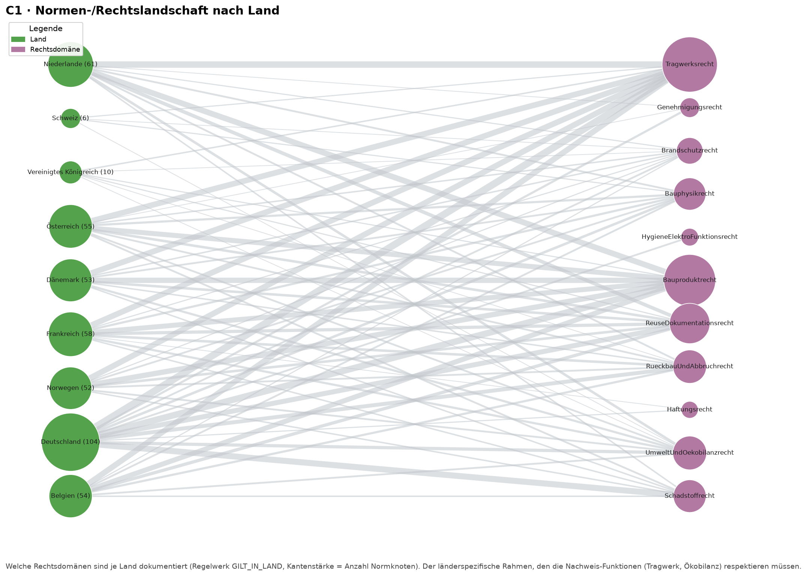

**Befund (Normknoten je Land):** Deutschland 67, Niederlande 37, Frankreich 35, Belgien
33, Österreich 33, Norwegen 32, Dänemark 32 — **Vereinigtes Königreich 6, Schweiz 6**.

**Erkenntnis & ehrliche Lücke.** Der Norm‑Layer ist für DE/NL/FR/BE/AT/Nordics dicht, für
**CH und UK dünn** (je 6 Knoten) — eine **Datenabdeckungslücke**, keine regulatorische
Realität. Schlüsselnormen sind bereits vorhanden (z. B. **SIA 269/2** für die Erhaltung von
Betonbauten, siehe §10.6), die Breite fehlt aber. Brisant, weil die aktivsten Reuse‑Akteure
und mehrere Test‑Case‑Kandidaten in der Schweiz liegen.

**Implikation.** Vor einem Schweizer Test‑Case ist die **CH‑Normabdeckung nachzuziehen**
(SIA‑Tragwerk, CH‑Bauprodukte, Schadstoff). Konkreter Vorbereitungsschritt für AP‑Erfahrung/AP‑Validierung.

### 6.2 Die Nachweis‑Kaskade eines Bauteils (C2)

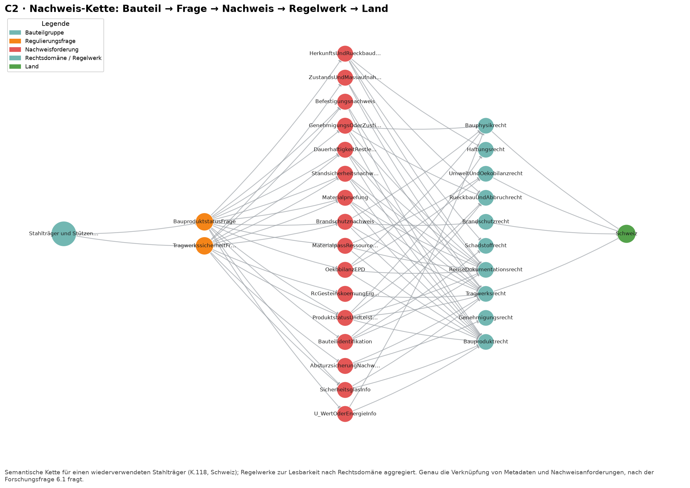

**Befund.** Ein einzelner Stahlträger (K.118) löst 2 Regulierungsfragen → 16
Nachweisforderungen → 10 Rechtsdomänen (Schweiz) aus.

**Erkenntnis & Implikation.** Diese Kaskade ist die **konkrete Antwort auf Forschungsfrage
§6.1**: Sie zeigt, *welche* Metadaten/Nutzereingaben ein Bauteil mitbringen muss, damit
Nachweise automatisch ableitbar werden — und belegt zugleich die Komplexität, die das Tool
den Entwerfenden abnehmen soll.

---

## 7 Hürden → Feature‑Mapping

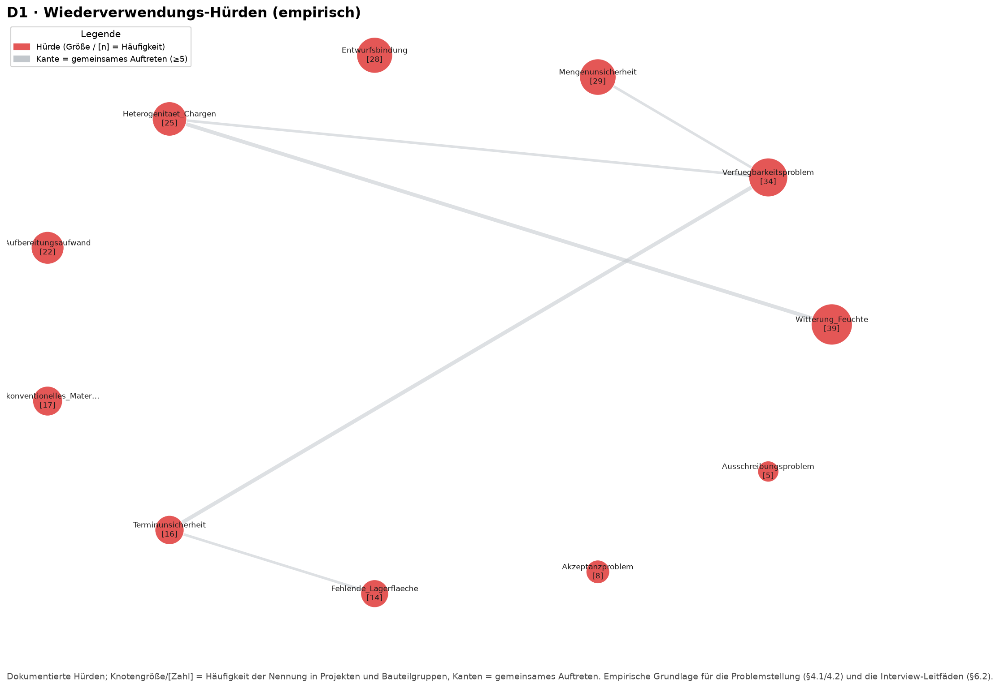

**Befund (Häufigkeit):** Witterung/Feuchte 39, Verfügbarkeit 34, Mengenunsicherheit 29,
Entwurfsbindung 28, Heterogenität/Chargen 25, Aufbereitungsaufwand 22, Unkonventionelles
Material 17, Terminunsicherheit 16. **Nach Material** treten Hürden am häufigsten bei Holz
(51) und Stahl (38) auf.

**Erkenntnis.** Die Hürden zerfallen in drei Klassen: *Logistik/Verfügbarkeit*,
*Entwurf/Heterogenität* und *Zustand/Schadstoff* (materialabhängig — Holz: Feuchte,
Holzschutz).

**Implikation — jede Top‑Hürde auf ein Plattform‑Feature abgebildet:**

| Hürde (Häufigkeit) | Plattform‑Feature | AP / Antrag |
|---|---|---|
| Verfügbarkeit (34), Mengen‑ (29), Terminunsicherheit (16) | Live‑Katalog + API‑Sync der Börsen + **Reservierungs-/Konsensfunktion** | AP‑Plattform, Auflage f |
| Entwurfsbindung (28) | Entwurfstool (semio): Variantenexploration aus verfügbarem Bestand | AP‑Tool |
| Heterogenität/Chargen (25) | Flexibles Bauteilgruppen‑Modell + Matching | AP‑Tool |
| Witterung/Feuchte (39), Holzschutz | Zustands-/Schadstoff‑Felder + Materialprüfungs‑Workflow | AP‑Tool, AP‑Plattform |
| Aufbereitungsaufwand (22) | **Photogrammetrie / Bild‑zu‑3D** (vermeidet redundante Modellierung) | AP‑Plattform |
| Unkonventionelles Material (17) | KI‑Assistenz: funktionsübergreifende Vorschläge | AP‑Tool |

---

## 8 Test‑Case‑Empfehlung für AP‑Validierung (datengestützt)

Der Antrag verlangt einen Test‑Case auf Basis **realen Bestands** (AP‑Validierung). Die
Vorstudie kann den Kandidaten **aus den Daten empfehlen**, statt ihn anzunehmen.

**Befund (Bestbelegte Projekte, Score = 2·Bauteilgruppen + Kennwerte + 2·Spender‑Links + Nachweise):**

| Projekt | Land | Bauteilgr. | Kennw. | Spender | Nachw. | Score |
|---|---|---:|---:|---:|---:|---:|
| MedUni Campus Wien | AT | 20 | 0 | 4 | 6 | 54 |
| **K.118 Winterthur** | CH | 16 | 8 | 2 | 2 | 46 |
| Résilience (Stains) | FR | 7 | 10 | 6 | 7 | 43 |
| **Plattenvereinigung Berlin** | DE | 4 | 1 | 11 | 12 | 43 |
| Recyclinghaus Hannover | DE | 9 | 5 | 4 | 11 | 42 |
| AWM Münster (circular office) | DE | 5 | 8 | 5 | 12 | 40 |

**Erkenntnis & Empfehlung.**
- **K.118 Winterthur** — beste Balance aus Bauteilvielfalt **und Performance‑Kennwerten**,
  zudem in der Antrags‑Literatur verankert → idealer **primärer Demonstrator**
  (Voraussetzung: CH‑Normabdeckung nachziehen, §6.1).
- **Recyclinghaus Hannover** — sehr ausgewogen und **am NGS‑Standort (LUH)** → logistisch
  bevorzugter realer Test‑Case mit direktem Zugang.
- **Plattenvereinigung Berlin** — reichste Herkunfts-/Nachweis‑Dokumentation und
  inhaltlich an Gengnagel/Asam (KET) anschlussfähig → Referenz für die Provenienz‑/
  Nachweis‑Kette.

---

# Teil II — Tiefenanalyse

## 10 Tiefenanalyse — strukturelle und quantitative Befunde

Dieser Teil geht über die Beschreibung der Netzwerke hinaus und untersucht **Topologie,
Geografie, Nachweis‑Statistik und reale Wirkungszahlen** mit Methoden der Netzwerkanalyse.

### 10.1 Wie fragmentiert ist das Feld wirklich? (Topologie)

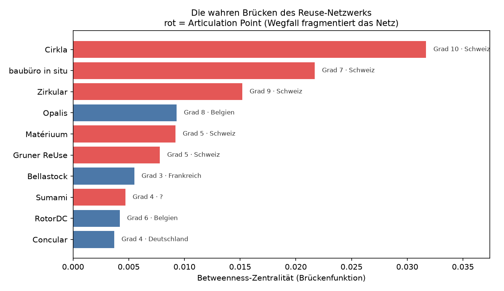

**Befund.** Das Akteursnetz hat **167 Knoten / 154 Kanten**, zerfällt aber in **36
unverbundene Komponenten**; die größte umfasst nur **21 %** aller Akteure (Dichte 0,07,
Ø‑Grad 1,8). Die wahren Brücken (höchste **Betweenness‑Zentralität**) sind fast alle
schweizerisch: **Cirkla** (0,032), baubüro in situ, **Zirkular**, Matériuum, Gruner ReUse,
dazu Opalis (BE) und Bellastock (FR). Es gibt **8 Articulation Points** (Schnittknoten,
deren Wegfall die Hauptkomponente zerteilt) — angeführt von Cirkla, Zirkular, baubüro in situ.

**Erkenntnis.** Das Feld ist **nicht** ein Netzwerk, sondern viele lose Inseln, die an
wenigen, fragilen Brücken hängen. **Cirkla ist der Keystone**: zugleich höchster Grad,
höchste Betweenness und Schnittknoten.

**Implikation.** Die Multiplikator‑Strategie (Auflage b) sollte **nach Brückenfunktion**
priorisieren, nicht nur nach Größe: Wer die Articulation Points (Cirkla, Zirkular, baubüro
in situ) und die regionalen Brücken (Opalis, Bellastock) anbindet, **verbindet ganze
Inseln** und härtet das fragile Netz — genau die integrierende Schicht, die die Plattform
sein will.

### 10.2 Wiederverwendung ist lokal (Geografie der Flüsse)

**Befund.** Reale Bauteil‑Flüsse (Spender→Empfänger) sind fast ausschließlich
**innerhalb eines Landes**: **129 lokal vs. 1 grenzüberschreitend** (40 ohne Länderangabe).
Belegte **Transportdistanzen: Median 6,5 km** (Spanne 2,5–33 km). Auch die *Akteurs*‑
Kooperation ist national geprägt (108 national vs. 16 grenzüberschreitend; häufigste
Auslandspaare BE–FR, DE–NL, CH–USA).

**Erkenntnis.** Bauteil‑Wiederverwendung ist ein **kurzstreckiges, regionales Geschäft** —
sowohl physisch (kurze Transporte) als auch organisatorisch (nationale Cluster).

**Implikation.**
1. **Geo‑/Radius‑bewusstes Matching** gehört in den Kern des Tools: verfügbarer Bestand
   wird nach Distanz priorisiert (regionaler Marktplatz statt globalem Katalog).
2. Die **kurzen Transportwege bestätigen die LCA‑Logik**: der Reuse‑CO₂‑Vorteil wird nicht
   durch Transport aufgezehrt (relevant für Auflage h).
3. Grenzüberschreitende Wiederverwendung ist heute praktisch inexistent → eine
   **interoperable, mehrsprachige Plattform ist echte Neuleistung**, kein Me‑too.

### 10.3 Nachweise kommen in Bündeln (Co‑Occurrence)

**Befund (gemeinsam an derselben Bauteilgruppe geforderte Nachweise):**

| Nachweis‑Paar | gemeinsame Bauteilgruppen |
|---|---:|
| Materialprüfung + Produktstatus | 219 |
| Materialprüfung + Standsicherheit | 116 |
| Produktstatus + Standsicherheit | 116 |
| Produktstatus + U‑Wert/Energie | 110 |
| Materialprüfung + U‑Wert/Energie | 65 |

**Erkenntnis.** Nachweise treten **nicht einzeln, sondern in stabilen Paketen** auf: ein
**Basis‑Bündel** (Produktstatus + Materialprüfung, fast immer) plus ein **Tragwerks‑Bündel**
(+ Standsicherheit/Befestigung) bzw. **Bauphysik‑Bündel** (+ U‑Wert/Energie).

**Implikation.** Das Tool generiert **Nachweis‑Bundles statt Einzel‑Häkchen**: jedem Bauteil
wird automatisch das Basis‑Bündel angehängt; je nach Tragwerks-/Hüllfunktion kommen die
weiteren Bündel hinzu. Reduziert Nutzeraufwand und Fehlerquote (AP‑Tool).

### 10.4 Material‑Fingerprints — Nachweise automatisch vorbelegen

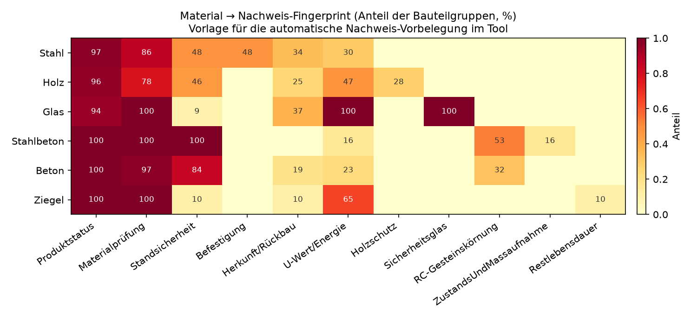

**Befund (Anteil der Bauteilgruppen eines Materials, die den Nachweis brauchen):**

| Material | Produktstatus | Materialprüfung | Standsicherheit | U‑Wert | Befestigung | Holzschutz |
|---|---:|---:|---:|---:|---:|---:|
| **Stahl** (n=91) | 97 % | 86 % | 48 % | 30 % | 48 % | – |
| **Holz** (n=80) | 96 % | 78 % | 46 % | 47 % | – | 28 % |

**Erkenntnis.** Jedes Material hat ein **charakteristisches Nachweis‑Profil**: Stahl ist
*tragwerks- und befestigungslastig*, Holz zusätzlich *bauphysik- und schadstofflastig*
(Holzschutz, U‑Wert).

**Implikation.** Sobald Material + Bauteiltyp im Tool gesetzt sind, kann die
**Nachweis‑Checkliste empirisch vorbelegt** werden (mit Wahrscheinlichkeiten aus dem
Graphen). Das ist eine direkt implementierbare Regelbasis für die KI‑Assistenz und macht
die Vorstudie zum **Trainings-/Konfigurationsdatensatz** des Tools.

### 10.5 Reale Wirkungszahlen — Evidenz statt Behauptung

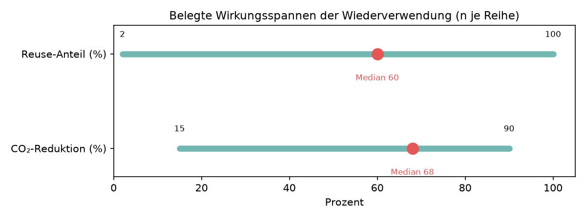

**Befund (belegte, numerische Kennwerte):**

| Kennzahl | n | Min | Median | Max |
|---|---:|---:|---:|---:|
| CO₂‑Reduktion (%) | 21 | 15 | **68** | 90 |
| Reuse‑Anteil (%) | 31 | 2 | **60** | 100 |
| CO₂‑Einsparung (t) | 13 | 12,5 | **458** | 3.500 |
| Kosten (EUR) | 14 | 99 | 203.500 | 312.000.000 |

**Erkenntnis.** Wo Reuse umgesetzt wird, sind die **CO₂‑Effekte erheblich** (Median 68 %
Reduktion). Die **Kostenwerte sind dagegen unbrauchbar** (5 Größenordnungen Streuung) —
unterschiedliche Bilanzgrenzen/Scopes, wie in §5.2 gezeigt.

**Implikation.** (a) Belastbare **Evidenzbasis** für das Wirkungs-/Förderargument (§4.1).
(b) Kosten dürfen nur **normiert** ausgewiesen werden; bestätigt die Notwendigkeit des
strengen Kennwert‑Schemas (Auflage h).

### 10.6 Compliance‑Wissensbasis — konkrete Regelwerke als Seed

**Befund (am häufigsten herangezogene Regelwerke):** CEN/TS 1090‑201:2024 (Stahlbau‑
Ausführung), EU C&D Waste Management Protocol, **France Diagnostic PEMD (loi AGEC)**,
**SIA 269/2** (Erhaltung Betonbau, CH), Flat‑glass/IGU‑Reuse‑Guidance (Glass for Europe),
**DIN SPEC 91484**, Norway TEK17, LfU‑Arbeitshilfe Rückbau schadstoffbelasteter Bausubstanz.

**Erkenntnis.** Der Graph enthält bereits eine **kuratierte, länderübergreifende Liste der
real relevanten Reuse‑Normen** — inklusive Schweizer SIA‑Norm.

**Implikation.** Diese Liste ist die **Seed‑Wissensbasis** für die regelbasierte/KI‑gestützte
Nachweis‑Komponente des Tools und der Startpunkt, um die CH/UK‑Lücke (§6.1) gezielt zu
schließen.

### 10.7 Wertschöpfungskette: voll‑integrierte Operatoren als Vorbild

**Befund.** Mehrere Akteure decken **alle 8 Reuse‑Rollen** ab — u. a. **BauKarussell** (AT),
**Cycle Up** (FR), **Mobius Réemploi**, **Cleveland Steel & Tubes** (UK), re:store/HarvestMAP
Vienna, REFAIR Bordeaux. Akteurstypen: Unternehmen 323, Person 155,
**Materialhub/Bauteilbörse 49**, Forschung/Lehre 37, Software/Tool‑Anbieter 19.

**Erkenntnis.** Es existieren bereits **vertikal integrierte Reuse‑Operatoren** (Ernte →
Aufbereitung → Nachweis → Verkauf → Beratung) — Belege, dass das Geschäftsmodell tragfähig
ist.

**Implikation.** Diese Operatoren sind (a) **Vorlage für das Spin‑off‑Modell „Beratung +
Software"** (§8.1/§8.6) und (b) **ideale Pilotpartner**, weil sie die gesamte Kette abbilden.

### 10.8 Zeitliche Entwicklung & Spenderquellen (Kontext)

**Befund.** Dokumentierte Projekte nach Fertigstellung: vor 2010: 12 · 2010–14: 2 · 2015–19:
12 · 2020–24: **14** · 2025+: 2 (von 42 mit Jahresangabe). Spenderbauwerke sind überwiegend
**Gebäude (71)**, gefolgt von **Infrastruktur (12)** und Depot/Lager (4).

**Erkenntnis & Implikation.** Reuse‑Aktivität **beschleunigt sich seit 2015** (timely topic);
Infrastruktur ist eine relevante **Stahl‑Sekundärquelle** neben dem Gebäudebestand — stützt
den Stahl‑First‑Test‑Case (§4.4).

---

## 11 Synthese — wie die Vorstudie das Vorhaben absichert

- **Marktlücke & Partner belegt:** integrierende Schicht fehlt — quantitativ als **36
  Komponenten / Giant 21 %** nachgewiesen; Multiplikatoren nach **Brückenfunktion**
  priorisiert (Cirkla/Zirkular/baubüro in situ als Keystones; Concular/Madaster für Reife/Ontologie).
- **Datenmodell validiert und präzisiert:** Pflichtfelder bestimmt; Tragwerks‑/Performance‑
  Attribute als **Nutzereingabe‑Aufgabe** erkannt — schärft Forschungsfrage §6.1.
- **Feature‑Priorität datenbasiert:** Produktstatus → Standsicherheit → U‑Wert/LCA; **Nachweis‑
  Bundles + Material‑Fingerprints** als implementierbare Regelbasis; **geo‑bewusstes Matching**
  als Kern (Flüsse median 6,5 km).
- **Methodik geschärft (Auflage h/g):** normiertes Kennwert‑Schema; belegte Wirkung (CO₂
  Median 68 %) als Evidenz, Kosten nur normiert.
- **Compliance‑Seed vorhanden:** reale Regelwerksliste (CEN/TS 1090‑201, SIA 269/2, PEMD …)
  als Startpunkt der Nachweis‑Wissensbasis.
- **Problem & Hürden auf Features abgebildet:** Interview‑/User‑Story‑Arbeit (AP‑Erfahrung)
  startet evidenzbasiert; voll‑integrierte Operatoren als Pilotpartner/Geschäftsmodellvorlage.
- **Test‑Case empfohlen:** K.118 / Recyclinghaus Hannover / Plattenvereinigung Berlin; erster
  Durchstich = **Stahltragwerk**.

Damit reduziert die Vorstudie unmittelbar die Antragsrisiken **Requirement‑Mismatch** und
**Scope‑Creep** (§7.3): Das Vorhaben startet mit belegtem Problem‑, Markt‑, Daten‑ und
Methodikverständnis statt mit Annahmen.

---

## Anhang A — Reproduzierbarkeit

Generatoren im Ordner: `_report_snapshots.py` (Abbildungen/JSON der Gruppen A–D),
`_analyze.py` (Analyse‑Batterie → `analysis_results.json`), `_analyze_deep.py`
(Tiefenanalyse inkl. NetworkX‑Topologie → `deep_analysis_results.json`),
`_report_deep_figs.py` (Tiefen‑Abbildungen `DEEP_*.png`). Pro Gruppen‑Abbildung liegen
Roh‑Knoten/‑Kanten als `report_snapshots/<id>.json` vor. Datenbank: `mit-bestand` (Neo4j,
`bolt://localhost:7687`). Topologie‑Kennzahlen (Betweenness, Articulation Points,
Komponenten) berechnet mit NetworkX.

## Anhang B — Cypher (Abbildungen)

### A1 — Akteurs‑Konstellation
```cypher
MATCH (a:Akteur)-[:VERBUNDEN_MIT_AKTEUR]->(b:Akteur)
OPTIONAL MATCH (a)-[:LIEGT_IN_LAND]->(la:Land)
OPTIONAL MATCH (b)-[:LIEGT_IN_LAND]->(lb:Land)
RETURN a, la.name AS a_land, b, lb.name AS b_land;
```

### A2 — Hubs & Brücken
```cypher
MATCH (a:Akteur)-[:VERBUNDEN_MIT_AKTEUR]-(b:Akteur)
WITH a, count(DISTINCT b) AS grad ORDER BY grad DESC LIMIT 12
MATCH (a)-[r:VERBUNDEN_MIT_AKTEUR]-(n:Akteur)
RETURN a, grad, r, n;
```

### A3 — Akteure nach Land
```cypher
MATCH (a:Akteur)-[:LIEGT_IN_LAND]->(land:Land)
RETURN land.name AS land, count(a) AS akteure, collect(a) AS akteur_knoten
ORDER BY akteure DESC;
```

### B1 — Bauteilgruppen K.118
```cypher
MATCH (p:Projekt {id:'p_k118_kopfbau_halle_118_winterthur'})-[:HAT_BAUTEILGRUPPE]->(bg:Bauteilgruppe)
WHERE bg.alte_funktion IS NOT NULL
OPTIONAL MATCH (bg)-[:AUS_SPENDER]->(sp:Bauwerk)
OPTIONAL MATCH (bg)-[:HAT_BAUTEILTYP]->(bt:Bauteiltyp)
OPTIONAL MATCH (bg)-[:NUTZT_MATERIAL]->(mat:Material)
RETURN p, bg, sp, bt, mat;
```

### B2 — Spender → Empfänger Flüsse
```cypher
MATCH (sp:Bauwerk)<-[:AUS_SPENDER]-(bg:Bauteilgruppe)-[:IN_EMPFANGSOBJEKT]->(emp:Bauwerk)
OPTIONAL MATCH (sp)-[:LIEGT_IN_LAND]->(spl:Land)
OPTIONAL MATCH (emp)-[:LIEGT_IN_LAND]->(empl:Land)
RETURN sp, spl.name AS spender_land, bg, emp, empl.name AS empfaenger_land;
```

### B3 — Bauteiltyp ↔ Material
```cypher
MATCH (bg:Bauteilgruppe)-[:HAT_BAUTEILTYP]->(bt:Bauteiltyp)
MATCH (bg)-[:NUTZT_MATERIAL]->(mat:Material)
RETURN bt.name AS bauteiltyp, mat.name AS material, count(DISTINCT bg) AS bauteilgruppen
ORDER BY bauteilgruppen DESC;
```

### C1 — Normen nach Land
```cypher
MATCH (law)-[:GILT_IN_LAND]->(land:Land)
UNWIND [l IN labels(law) WHERE l ENDS WITH 'recht'] AS rechtsdomaene
RETURN land.name AS land, rechtsdomaene, count(*) AS normknoten ORDER BY land;
```

### C2 — Nachweis‑Kette (ein Stahlträger, Schweiz)
```cypher
MATCH (bg:Bauteilgruppe {id:'bg_stahl_mehrere_k118_structure'})-[:TRIGGERS_REGULIERUNGSFRAGE]->(rf:Regulierungsfrage)
OPTIONAL MATCH (rf)-[:ERFORDERT_NACHWEIS]->(nf:Nachweisforderung)
OPTIONAL MATCH (nf)-[:GESTUETZT_AUF_REGELWERK]->(law) WHERE any(l IN labels(law) WHERE l ENDS WITH 'recht')
OPTIONAL MATCH (law)-[:GILT_IN_LAND]->(land:Land) WHERE land.name = 'Schweiz'
RETURN bg, rf, nf, law, land;
```

### D1 — Hürden
```cypher
MATCH (h:Huerde)<-[:HAT_HUERDE]-(x)
RETURN h.name AS huerde, count(*) AS haeufigkeit ORDER BY haeufigkeit DESC;
```

## Anhang C — Cypher (Analyse)

### Feldabdeckung der Bauteilgruppen
```cypher
MATCH (bg:Bauteilgruppe)
RETURN count(bg) AS total, count(bg.tragend) AS tragend,
       count(bg.tragwerksprinzip) AS tragwerksprinzip,
       count { (bg)-[:HAT_BAUTEILTYP]->() } AS mit_typ,
       count { (bg)-[:NUTZT_MATERIAL]->() } AS mit_material,
       count { (bg)-[:AUS_SPENDER]->() } AS mit_spender;
```

### Funktionswechsel
```cypher
MATCH (bg:Bauteilgruppe) WHERE bg.funktionswechsel IS NOT NULL
RETURN bg.funktionswechsel AS funktionswechsel, count(*) AS n ORDER BY n DESC;
```

### Nachweis‑Priorität
```cypher
MATCH (bg:Bauteilgruppe)-[:ERFORDERT_NACHWEIS]->(nf:Nachweisforderung)
RETURN nf.name AS nachweis, count(DISTINCT bg) AS bauteilgruppen ORDER BY bauteilgruppen DESC;
```

### Performance‑Kennwerte (Konsistenz)
```cypher
MATCH (k:Kennwert)
RETURN k.category AS kategorie, count(*) AS n, count(k.wert) AS mit_zahlwert,
       count(k.method) AS mit_methode, count(k.bilanzgrenze) AS mit_bilanzgrenze
ORDER BY n DESC;
```

### Bauteilbörsen‑Profile
```cypher
MATCH (a:Akteur)
WHERE a.id IN ['concular','madaster','bauteilnetz_deutschland','opalis','cirkla','restado']
OPTIONAL MATCH (a)-[:LIEGT_IN_LAND]->(land:Land)
RETURN a.name AS name, land.name AS land,
       count { (a)-[:VERBUNDEN_MIT_AKTEUR]-() } AS grad,
       count { (a)-[:NUTZT_SOFTWARE]->() } AS software,
       count { (a)-[:HAT_GESCHAEFTSMODELL]->() } AS geschaeftsmodelle,
       [(a)-[:HAT_AKTEURROLLE]->(r) | r.name] AS rollen
ORDER BY grad DESC;
```

### Test‑Case‑Kandidaten (Score)
```cypher
MATCH (p:Projekt)
OPTIONAL MATCH (p)-[:LIEGT_IN_LAND]->(land:Land)
WITH p, land,
     count { (p)-[:HAT_BAUTEILGRUPPE]->(:Bauteilgruppe) } AS bauteilgruppen,
     count { (p)-[:HAT_KENNWERT]->(:Kennwert) } AS kennwerte,
     count { (p)-[:HAT_BAUTEILGRUPPE]->(:Bauteilgruppe)-[:AUS_SPENDER]->(:Bauwerk) } AS spender_links,
     count { (p)-[:ERFORDERT_NACHWEIS]->() } AS nachweise
RETURN p.name AS name, land.name AS land, bauteilgruppen, kennwerte, spender_links, nachweise,
       (bauteilgruppen*2 + kennwerte + spender_links*2 + nachweise) AS score
ORDER BY score DESC LIMIT 12;
```

## Anhang D — Cypher (Tiefenanalyse, §10)

### Akteurs‑Kanten für Topologie (NetworkX: Komponenten, Betweenness, Articulation Points)
```cypher
MATCH (a:Akteur)-[:VERBUNDEN_MIT_AKTEUR]-(b:Akteur)
WITH a, b WHERE a.id < b.id
OPTIONAL MATCH (a)-[:LIEGT_IN_LAND]->(la:Land)
OPTIONAL MATCH (b)-[:LIEGT_IN_LAND]->(lb:Land)
RETURN a.id AS a, a.name AS an, la.name AS al, b.id AS b, b.name AS bn, lb.name AS bl;
```

### Geografie der Bauteil‑Flüsse (lokal vs. grenzüberschreitend)
```cypher
MATCH (sp:Bauwerk)<-[:AUS_SPENDER]-(bg:Bauteilgruppe)-[:IN_EMPFANGSOBJEKT]->(emp:Bauwerk)
OPTIONAL MATCH (sp)-[:LIEGT_IN_LAND]->(spl:Land)
OPTIONAL MATCH (emp)-[:LIEGT_IN_LAND]->(empl:Land)
RETURN spl.name AS sp_land, empl.name AS emp_land, count(DISTINCT bg) AS bg
ORDER BY bg DESC;
```

### Nachweis‑Co‑Occurrence (Bundles)
```cypher
MATCH (bg:Bauteilgruppe)-[:ERFORDERT_NACHWEIS]->(n1:Nachweisforderung)
MATCH (bg)-[:ERFORDERT_NACHWEIS]->(n2:Nachweisforderung)
WHERE n1.name < n2.name
RETURN n1.name AS a, n2.name AS b, count(DISTINCT bg) AS gemeinsam
ORDER BY gemeinsam DESC LIMIT 20;
```

### Material → Nachweis‑Fingerprint
```cypher
MATCH (m:Material)<-[:NUTZT_MATERIAL]-(bg:Bauteilgruppe)-[:ERFORDERT_NACHWEIS]->(nf:Nachweisforderung)
RETURN m.name AS material, nf.name AS nachweis, count(DISTINCT bg) AS bg
ORDER BY material, bg DESC;
```

### Reale Wirkungszahlen (numerische Kennwerte)
```cypher
MATCH (k:Kennwert) WHERE k.wert IS NOT NULL
RETURN k.category AS kategorie, k.kennwert AS kennwert, k.wert AS wert, k.einheit AS einheit
ORDER BY kategorie;
```

### Named Regelwerke (Compliance‑Seed)
```cypher
MATCH (law) WHERE any(l IN labels(law) WHERE l ENDS WITH 'recht')
WITH law, [l IN labels(law) WHERE l ENDS WITH 'recht'][0] AS domaene,
     count { (law)<-[:GESTUETZT_AUF_REGELWERK]-() } AS incidence
WHERE incidence > 0
RETURN coalesce(law.name, law.id) AS regelwerk, domaene, incidence
ORDER BY incidence DESC LIMIT 25;
```

### Voll‑integrierte Operatoren (alle Rollen)
```cypher
MATCH (a:Akteur)
WITH a, count { (a)-[:HAT_AKTEURROLLE]->() } AS rollen WHERE rollen >= 4
RETURN a.name AS name, rollen ORDER BY rollen DESC LIMIT 15;
```
